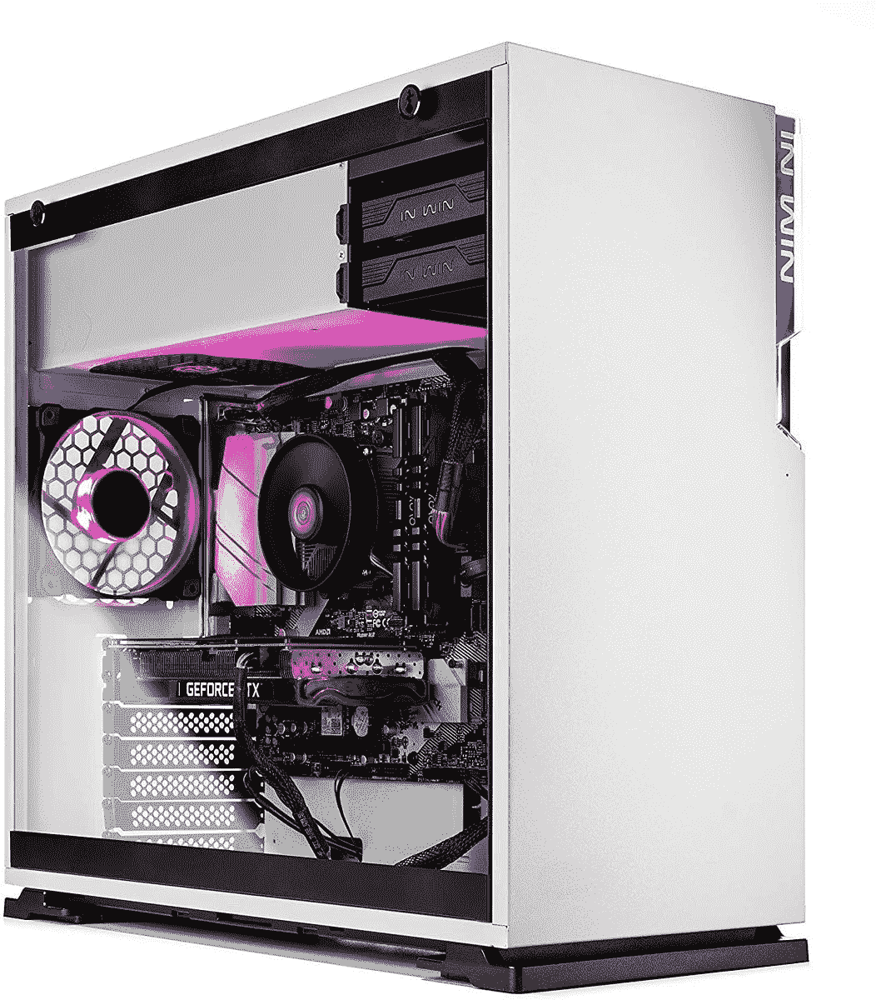
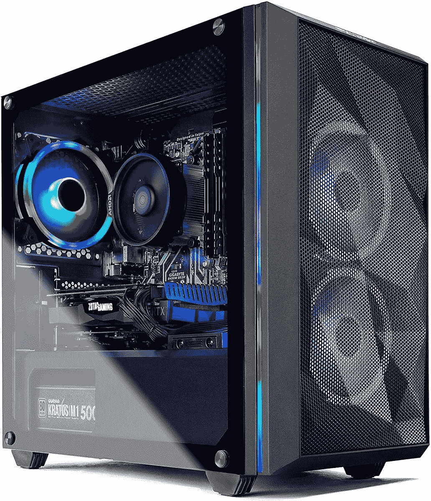

# 以不到 1，400 美元的价格购买这款配备锐龙 5 5600X 和 RTX 3060 Ti 的预建游戏电脑

> 原文：<https://www.xda-developers.com/prebuilt-gaming-pc-skytech-shiva-ryzen-5-rtx-3060-ti-black-friday/>

由于一些 GPU 的价格高得离谱，如今构建自己的 PC 并不容易。但这并不意味着你找不到价格合适的游戏装备。由于新的黑色星期五交易，Skytech Shiva 预建的桌面 PC 降至仅 1380 美元，采用 AMD 锐龙 5 5600X 和 NVIDIA GeForce RTX 3060 Ti 显卡。这是一笔相当不错的交易，虽然亚马逊显示它只有 120 美元的折扣，但这台电脑的价格实际上是 1700 美元，所以它便宜了 320 美元。

 <picture></picture> 

Skytech Shiva Gaming Desktop ($320 off)

##### Skytech Shiva

这款预建的游戏台式机包括最新的 AMD 锐龙 5 5600X 和一个强大的 NVIDIA GeForce 3060 Ti 显卡，可以毫无问题地运行任何现代游戏。

AMD 锐龙 5 5600X 是 AMD 的最新型号，尽管它在技术上属于中档，但对于高端游戏来说已经绰绰有余了。它有 6 个内核和 12 个线程，可以提升到 4.6GHz。此外，NVIDIA GeForce 3060 Ti 也是一款非常强大的 GPU，可以毫无问题地处理各种现代游戏，因此您将获得流畅的游戏体验。当然，如果您需要更多，稍后升级预建的 PC 是很容易的。RAM 也是如此，开箱即可获得 16GB，1TB 固态硬盘也是如此。这款机型甚至配有内置 Wi-Fi，你还可以使用一些 RGB 照明，让你的设置更有格调。

CPU 采用了空气冷却器，对于这种处理器来说是有意义的，机箱本身有三个 RGB 风扇(两个进气，一个排气)，保持空气流通，系统运行顺畅。您还可以获得一系列 USB 端口、HDMI 和 DisplayPort 输出，外加一个键盘和鼠标来完成您的设置。

如果你有更多的钱可以花，并且你更想买一台基于英特尔的机器，百思买正在出售一款很棒的华硕 ROG 游戏台式机，它配备了英特尔酷睿 i7-11700F 和英伟达 Geforce RTX 3070 显卡。这款机型售价 1650 美元，实际上并没有打折，但考虑到 GPU 本身的疯狂价格，对于已经包含 RTX 3070 的游戏设备来说，这是一笔非常划算的交易。

 <picture></picture> 

ASUS ROG Gaming Desktop

##### 华硕 ROG Strix GT15

华硕 ROG 游戏台式机采用英特尔酷睿 i7-11700F 处理器和 NVIDIA GeForce RTX 3070 显卡，价格非常合理。

除了处理器和 GPU，这款华硕 ROG 台式机还包括 16GB 内存、512GB 固态硬盘和 1TB 硬盘，为您提供充足的存储空间。当然，你可以随时扩展。内部和前面板以及附带的鼠标和键盘都配有 RGB 照明，因此您可以让整个系统保持一致。还有内置的 Wi-Fi 和蓝牙支持，以及大量的端口。

如果你想节省更多的钱，并且你可以接受稍微旧一点的规格，Skytech Chronos Mini 也有很大的折扣，从通常的 1050 美元降至 950 美元。它配备了 AMD 锐龙 5 3600 处理器和 NVIDIA GeForce GTX 1660 超级显卡。这些自然是较弱的组件，但对于轻量级游戏，如果你愿意调低一些质量设置，这仍然可以提供出色的游戏体验。

 <picture></picture> 

Skytech Chronos MIni Gaming Desktop ($100 off)

##### Skytech Chronos Mini

对于那些预算紧张的人来说，Skytech Chronos Mini 是一款稳定的游戏台式机，能够运行大多数现代游戏。

你仍然得到 16GB 的内存和 500GB 的固态硬盘；因此，如果你想在预算内玩游戏，这是一个坚实的机器。包括 Wi-Fi 支持，另外你还可以获得四个 USB 端口、HDMI 和 DisplayPort。电脑甚至包括鼠标和键盘，所以你只需要一个显示器就可以开始玩了。

如果你想找到便宜的显示器，请查看我们的[黑色星期五 PC 交易](https://www.xda-developers.com/best-black-friday-pc-gaming-deals/)中心，在那里你还可以找到组件和外围设备来进一步升级你的设置。另外，一定要去看看我们的主要[黑色星期五](https://www.xda-developers.com/black-friday/)中心，那里有一些关于移动技术的优惠交易。