# 通过这些总统日交易，在笔记本电脑上省钱

> 原文：<https://www.xda-developers.com/presidents-day-2022-laptop-deals/>

总统日就要到了，现在我们已经从假期的奢侈消费中恢复过来，这可能是一个购买新笔记本电脑的好时机。和大多数假期一样，零售商在笔记本电脑和科技产品上进行一些不错的交易，所以如果你想尽快购买笔记本电脑，你可以节省一些钱。我们已经收集了一些最好的总统日笔记本电脑交易，以帮助您为自己或他人找到最完美的礼物。

我们根据您的需求将交易分成了几个类别。您可以在下面浏览它们，使之更容易。

## 高端笔记本电脑的总统日优惠

如果你想购买更多设计精良、性能卓越的高端笔记本电脑，这一类别正适合你。这里有一些价格实惠的好选择，它们一定会成为适合任何人的笔记本电脑。

 <picture></picture> 

Dell XPS 13

##### 戴尔 XPS 13

这款戴尔 XPS 13 采用英特尔酷睿 i7-1195G7 处理器，配有 Iris Xe 显卡，16GB 内存和 512GB 固态硬盘。它还拥有支持触摸的 13.4 英寸全高清显示屏。

 <picture></picture> 

Surface Pro 8

##### 微软 Surface Pro 8

Surface Pro 8 最高配有英特尔酷睿 i7-1185G7、32GB 内存和 1TB 固态硬盘。这是目前最好的 Windows 平板电脑之一，拥有 13 英寸的显示屏和 120Hz 的刷新率，轻薄的设计和出色的网络摄像头。

 <picture></picture> 

HP Spectre x360 16

##### 惠普 Spectre x360 16

SPectre x360 16 是市场上最好的笔记本电脑之一，它采用英特尔酷睿 i7-11390H 处理器，拥有 16GB 内存和 512GB 固态硬盘。16 英寸显示屏是非常清晰的 3K+分辨率，并有一个 500 万像素的网络摄像头。

 <picture></picture> 

Surface Laptop Studio

##### 微软 Surface Laptop Studio

Surface Laptop Studio 的 Core i5 型号正在销售，它们也有 16GB 的内存和高达 512GB 的固态硬盘。它拥有独特的敞篷设计和 14.4 英寸的显示屏，刷新率为 120Hz。

 <picture></picture> 

HP Envy x360 15 ($310 off)

##### 惠普 Envy x360 15

HP Envy x360 15 最高配有英特尔酷睿 i7-1165G7、16GB 内存和 1TB 固态硬盘。这是一款高级可转换笔记本电脑，配有 15.6 英寸的大尺寸全高清显示屏，以及 Thunderbolt 4 支持和指纹识别器等高级功能。

 <picture></picture> 

Dell XPS 13 2-in-1 ($250 off)

##### 戴尔 XPS 13 二合一设备

Dell XPS 13 2 合 1 是一款小巧的敞篷车，采用酷炫的双色设计。这款机型配有英特尔酷睿 i5-1135G7 CPU、16GB 内存和 512GB 存储空间。它有一个 13.4 英寸的全高清触摸屏，你也可以像平板电脑一样使用，加上 Windows Hello 支持。

 <picture></picture> 

Lenovo Yoga 9i ($400 off)

##### 联想 Yoga 9i

联想 Yoga 9i 配备了强大的英特尔酷睿 i7-1185G7 CPU，16GB 内存，512GB 固态硬盘。它有一个惊人的 4K HDR 显示器和一个创新的条形音箱铰链，所以这是一个了不起的交易。

 <picture></picture> 

Dell XPS 15 (9520)

##### 戴尔 XPS 15

戴尔 XPS 15 是一款功能强大的笔记本电脑，配备英特尔酷睿 i7-11800H、16GB 内存和 1TB 固态硬盘。该型号还包括一个令人惊叹的 3.5K OLED 面板，非常清晰和高对比度。

 <picture>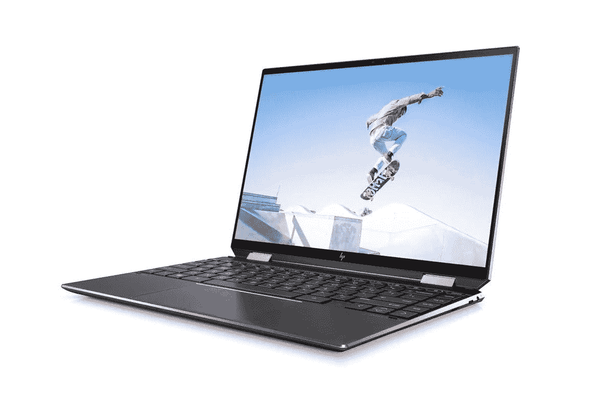</picture> 

HP Spectre x360 14

##### 惠普 Spectre x360 14

Spectre x360 14 是最好的变形本之一，最高可配英特尔酷睿 i7-1195G7，32GB 内存和 2TB 固态硬盘。它有一个 13.5 英寸的显示屏，长宽比为 3:2，还有一个令人惊叹的 3K2K 有机发光二极管升级选项。

## 主流和经济型笔记本电脑交易

如果你不想花很多钱，或者你只是不需要超级时尚的设计，主流笔记本电脑可以在性能方面给你更好的价值。它们在某些方面不太好，但你一定会以更合理的价格获得更好的体验。

 <picture>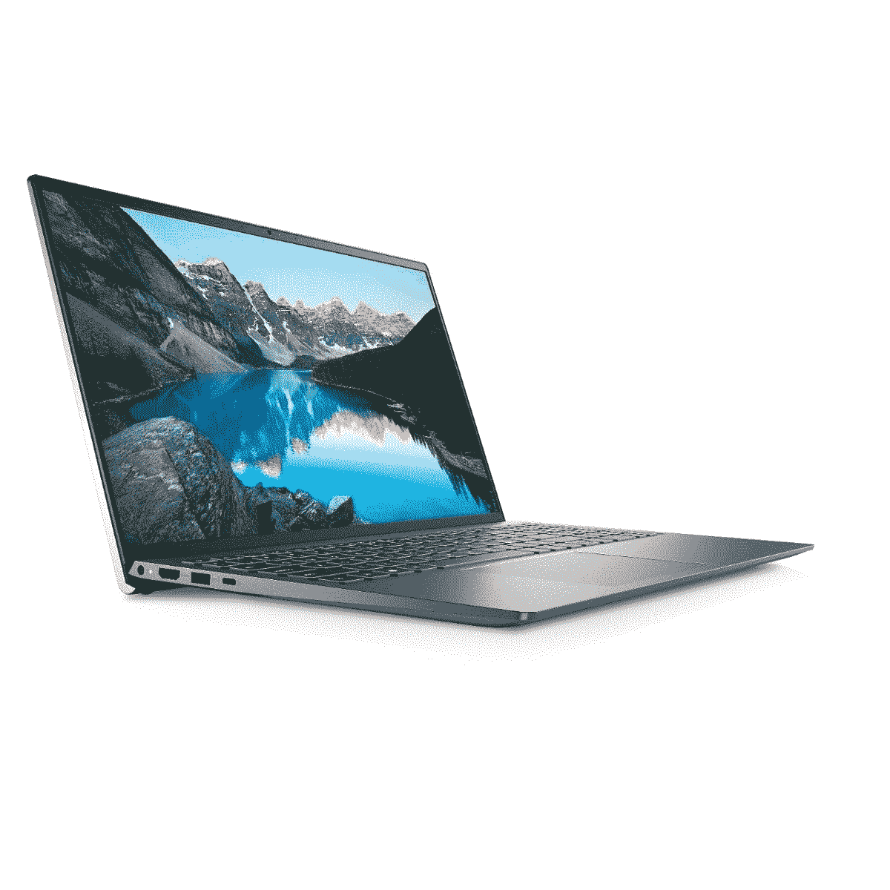</picture> 

Dell Inspiron 15 ($139 off)

##### 戴尔 Inspiron 灵越 15

戴尔 Inspiron 灵越 15 采用英特尔酷睿 i5-11320H 处理器，具有 35 瓦的 TDP，外加 8GB 内存和 256GB 存储空间。它还配有全高清显示屏，可提供出色的整体体验。

 <picture>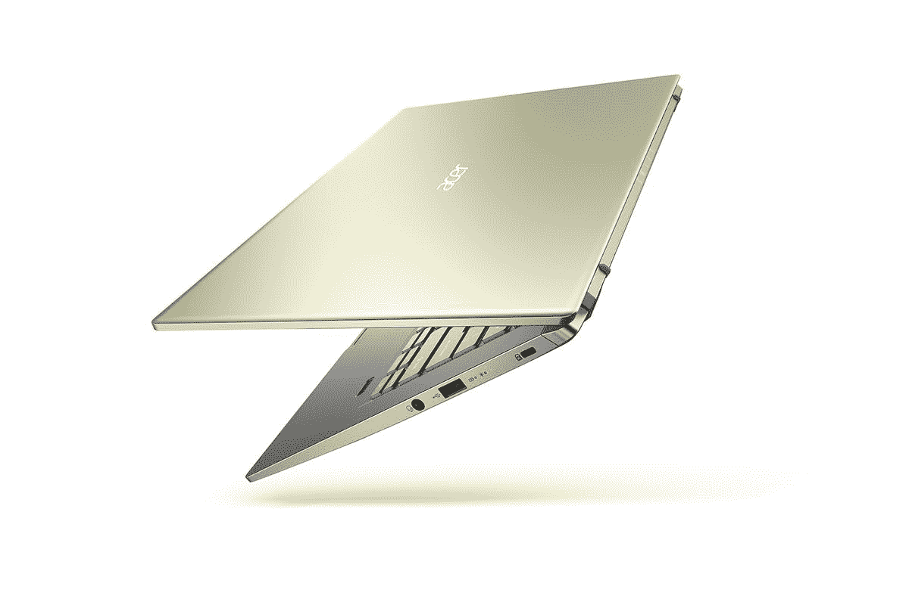</picture> 

Acer Swift X ($130 off)

##### 宏基 Swift X

宏碁 Swift X 采用 AMD Ryze 7 5800U，并配备了专用的英伟达 RTX 3050 Ti 显卡。它还配有 16GB 内存、512GB 固态硬盘和 14 英寸全高清显示屏。

 <picture>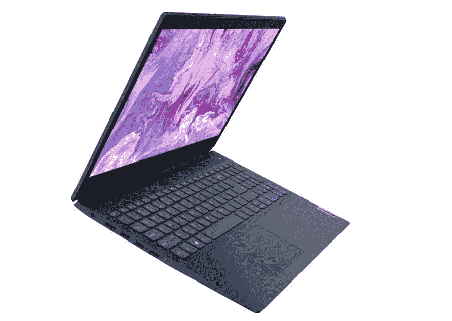</picture> 

Lenovo IdeaPad 3 ($80 off)

##### 联想 IdeaPad 3

这款价格实惠的联想 IdeaPad 3 配有 AMD 锐龙 5 5500U、8GB 内存和 512GB 存储空间。它有一个全高清显示屏，在这个价格上看起来很棒。

 <picture>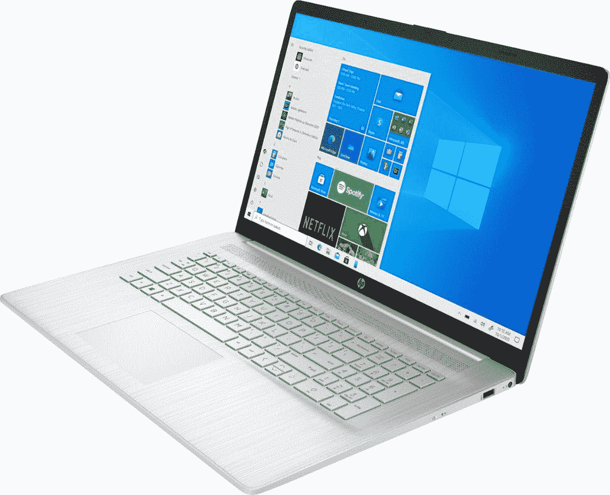</picture> 

HP Laptop 17

##### 惠普笔记本电脑 17

如果你想要一台大的笔记本电脑，惠普的这款相当不错。它拥有 AMD 锐龙 5 处理器、8GB 内存和 256GB 存储空间，因此您可以获得稳定的全面性能。此外，17 英寸大尺寸全高清显示屏非常适合完成工作。

 <picture></picture> 

Dell Inspiron 14 2-in-1 ($200 off)

##### 戴尔 Inspiron 灵越 14 二合一设备

戴尔 Inspiron 灵越 142 合 1 笔记本电脑配备 AMD 锐龙 7 5700U、16GB 内存和 512GB 存储，提供顶级性能。此外，这是一辆配有 14 英寸全高清显示屏的敞篷车。

 <picture></picture> 

Surface Laptop Go (up to $200 off)

##### 微软 Surface Laptop Go

Surface Laptop Go 以实惠的价格为您提供了一款高 3:2 显示屏的高端笔记本电脑。它由英特尔酷睿 i5 处理器、高达 8GB 的内存和 256GB 的固态硬盘驱动。

## 游戏笔记本电脑总统日优惠

如果你是一个游戏玩家，游戏笔记本电脑上也有一些很好的交易。无论你是想要一台超快的游戏电脑还是其他什么东西，现在都有很多很棒的笔记本电脑可以打折购买。以下是我们发现的一些亮点:

 <picture>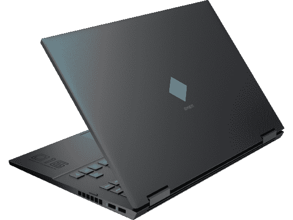</picture> 

Omen 16z-c000

##### 惠普预兆 16

OMEN 16 是一款游戏笔记本电脑，设计简洁时尚，配有 AMD 锐龙 7 5800H 和 GeForce RTX 3050 Ti GPU，性能稳定。它还拥有 16GB 内存和 144Hz 显示屏，因此您的游戏运行流畅。

 <picture></picture> 

ASUS ROG Zephyrus G14 ($300 off)

##### 华硕 ROG 西风 G14

华硕 Zephyrus G14 由 AMD 锐龙 9 和 GeForce RTX 3060 显卡驱动，另外它还有 16GB 的内存和 1TB 的固态硬盘。它还配有一个非常酷的 LED 盖子，您可以根据自己的喜好定制。

 <picture>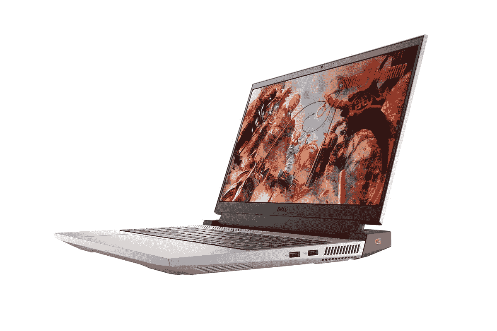</picture> 

Dell G15

##### 戴尔 G15

Dell G15 是一款坚固的入门级游戏笔记本电脑，配有 AMD 锐龙 5 CPU、RTX 3050 显卡、8GB 内存和 512GB 固态硬盘:它不是高端设备，但对于初涉游戏玩家或预算有限的人来说非常棒。

 <picture></picture> 

Lenovo Legion 5 Gen 6 ($430 off)

##### 联想军团 5

联想军团 5 Gen 6 配备了英特尔酷睿 i7-11800H 和 GeForce RTX 3060 显卡，外加 16GB 内存和 1TB 固态硬盘。它有一个 17.2 英寸的大显示屏，刷新率为 144 赫兹。

 <picture>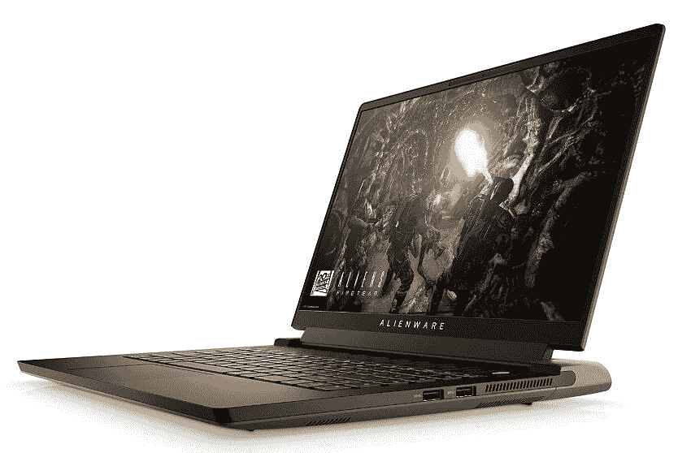</picture> 

Alienware m15 R6 ($850 off)

##### 戴尔外星人 m15 R6

这款功能强大的笔记本电脑配备英特尔酷睿 i7-11800H、NVIDIA GeForce RTX 3080 显卡、32GB 内存和 2TB 固态硬盘。它也有一个 360 赫兹刷新率的全高清显示屏来使用这种能力。

 <picture>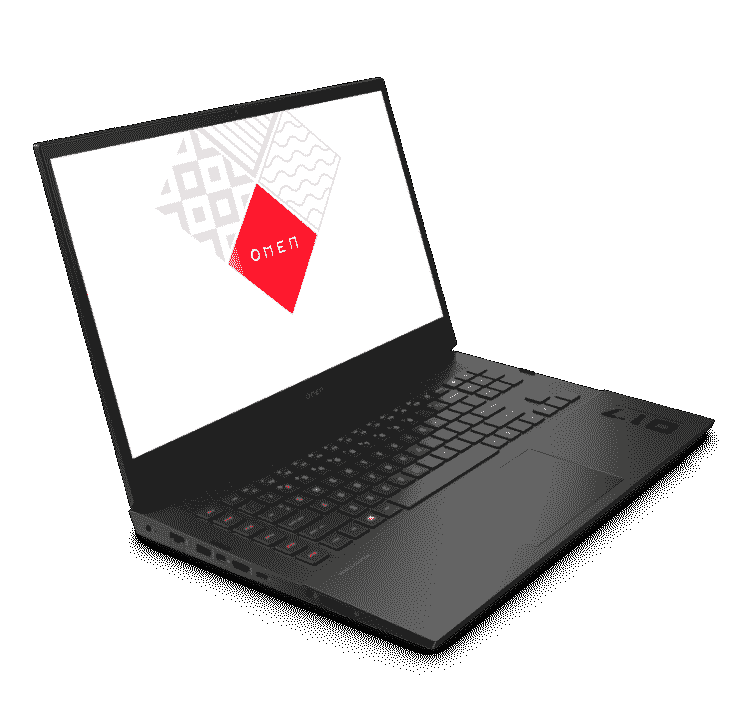</picture> 

OMEN 17

##### 惠普预兆 17

惠普的 17 英寸 OMEN 是另一款强大的型号，配备英特尔酷睿 i7、GeForce RTX 3060 显卡、16GB 内存和 512GB 固态硬盘。它可以处理大多数现代游戏，而且看起来很棒。

 <picture></picture> 

Lenovo Legion Slim 7 ($300 off)

##### 联想军团 Slim 7

这款轻薄的游戏笔记本电脑拥有 AMD 锐龙 9 5900HX CPU、RTX 3050 Ti 显卡、16GB 内存和 1TB 固态硬盘:它拥有超清晰的 4K 显示屏，让一切看起来都很棒。

 <picture></picture> 

Alienware x17 ($1,000 off)

##### 戴尔外星人 x17

外星人 x17 是一款超高速游戏笔记本电脑，配有英特尔酷睿 i7-11800H、GeForce RTX 3070 显卡、32GB 内存和 1TB 固态硬盘，此外，它还配有 360Hz 全高清显示屏。

 <picture></picture> 

Lenovo Legion 5 Pro

##### 联想军团 5 Pro

Legion 5 Pro 采用英特尔酷睿 i7-11800H、RTX 3060 显卡、8GB 内存和 512GB 固态硬盘。它还拥有 165 赫兹刷新率的 QHD 显示屏。

## 商务笔记本电脑交易

如果您正在寻找一款出色的笔记本电脑用于工作，商用笔记本电脑自然是不二之选。它们包括带有附加管理功能的 Pro Windows 许可证。总统日有一些很棒的交易，所以现在可能是买一台新笔记本电脑的好时机。

 <picture></picture> 

Lenovo ThinkPad X1 Yoga ($1,640 off)

##### 联想 ThinkPad X1 Yoga

这款商务敞篷车采用英特尔酷睿 i5-1135G7，8GB 内存，并配有 256GB 固态硬盘。它有一个可转换的设计和一个全高清显示屏，

 <picture>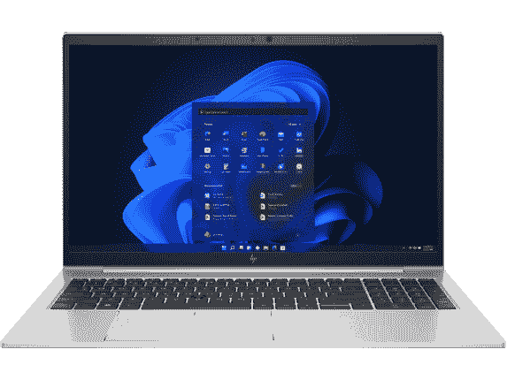</picture> 

HP EliteBook 855 G8 ($1,166 off)

##### 惠普 EliteBook 855 G8

这款高端商务笔记本电脑采用经典设计，配备 AMD 锐龙 7 Pro、16GB 内存和 512GB 固态硬盘。它有一个全高清显示屏和 Windows Hello 支持。

 <picture></picture> 

Lenovo ThinkPad T14 Gen 2 ($1,780 off)

##### 联想 ThinkPad T14 Gen 2

联想的主流笔记本电脑配备了 AMD 锐龙 7 Pro 处理器、16GB 内存和 1TB 固态硬盘。此外，您还可以获得全高清屏幕，这是这个价格的绝佳组合。

 <picture>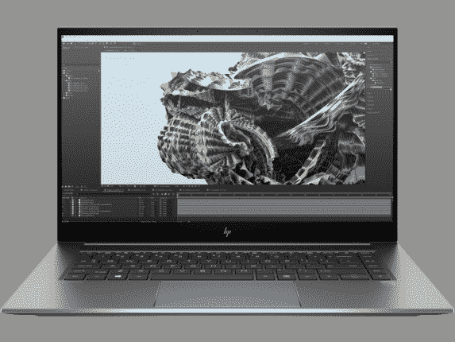</picture> 

HP ZBook Studio ($3,064 off)

##### 惠普 ZBook Studio 15 G7

HP ZBook Studio 是一款功能强大的工作站，配备英特尔酷睿 i7-11800H CPU 和 NVIDIA T1200 GPU，外加 32GB 内存和 1TB 固态硬盘。此外，它有一个惊人的 4K 显示器，使其成为创意专业人士的理想选择。

 <picture>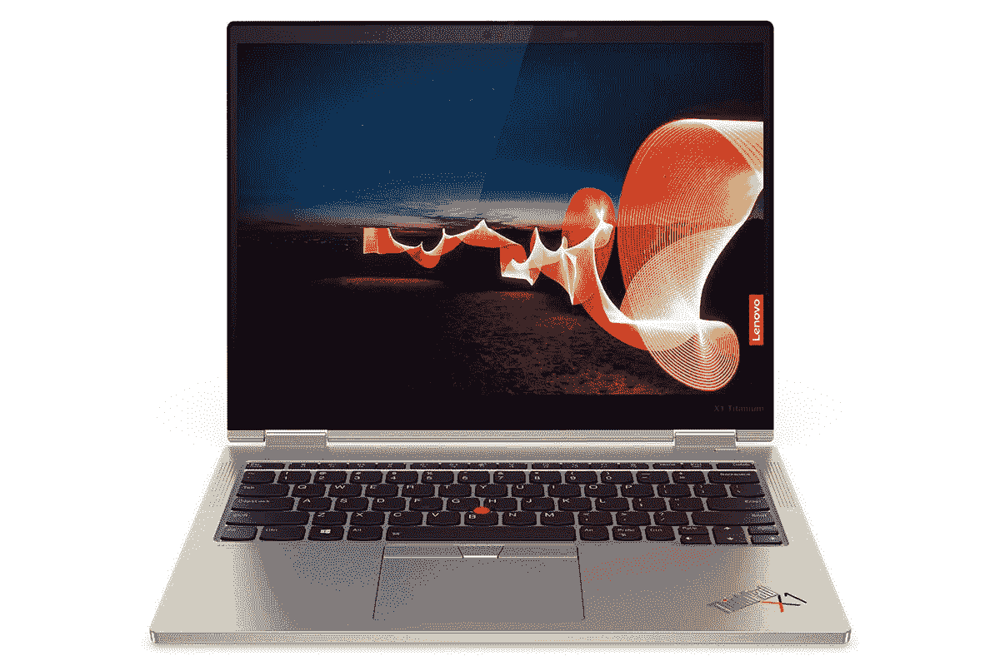</picture> 

Lenovo ThinkPad X1 Titanium Yoga ($2,240 off)

##### 联想 ThinkPad X1 钛金瑜伽

这款笔记本电脑是世界上最好的商用变形笔记本电脑之一，采用英特尔酷睿 i7 处理器、16GB 内存和 1TB 固态硬盘。它还拥有令人惊叹的 13.5 QHD 显示屏。

 <picture>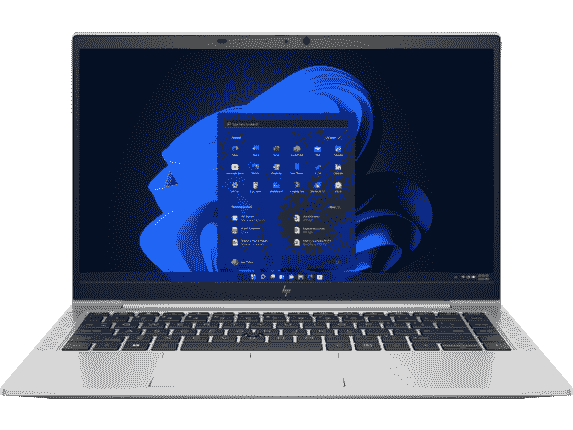</picture> 

HP EliteBook 845 G8 ($1,053 off)

##### 惠普 EliteBook 845 G9

如果你需要更小的东西，这款笔记本电脑采用 AMD 锐龙 7 处理器和 16GB 内存，另外还有 512GB 固态硬盘。您还可以获得全高清显示屏，因此总体而言这是一种很棒的体验。

## Chromebook 交易

最后，对于 Chromebook 粉丝来说，Chrome OS 笔记本电脑上有一些不错的总统日交易。这对于年轻学生和一些商业用户来说非常好，而且价格也比较实惠。查看下面的交易。

 <picture>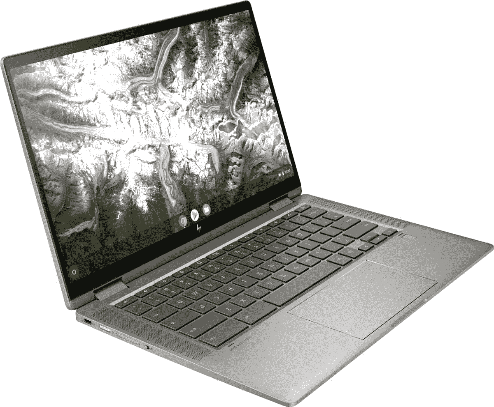</picture> 

HP Chromebook x360 14c ($200 off)

##### 惠普 Chromebook x360 14C

惠普 Chromebook x360 14 由现代英特尔酷睿 i3 CPU、8GB 内存和 128GB 固态硬盘驱动:这是一款非常棒的可变形笔记本电脑，甚至还有全高清显示屏。

 <picture>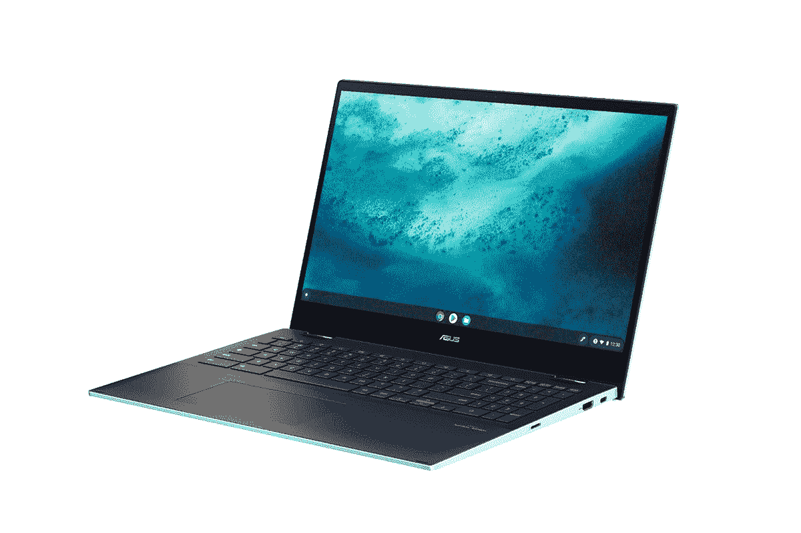</picture> 

ASUS Chromebook Flip C536

##### 华硕 Chromebook Flip C536

华硕 Chromebook C536 是一款出色的 15 英寸可转换产品，配有英特尔酷睿 i3 CPU、8GB 内存和 128GB 固态硬盘。它拥有酷炫的双色外观和出色的全高清显示屏。

 <picture>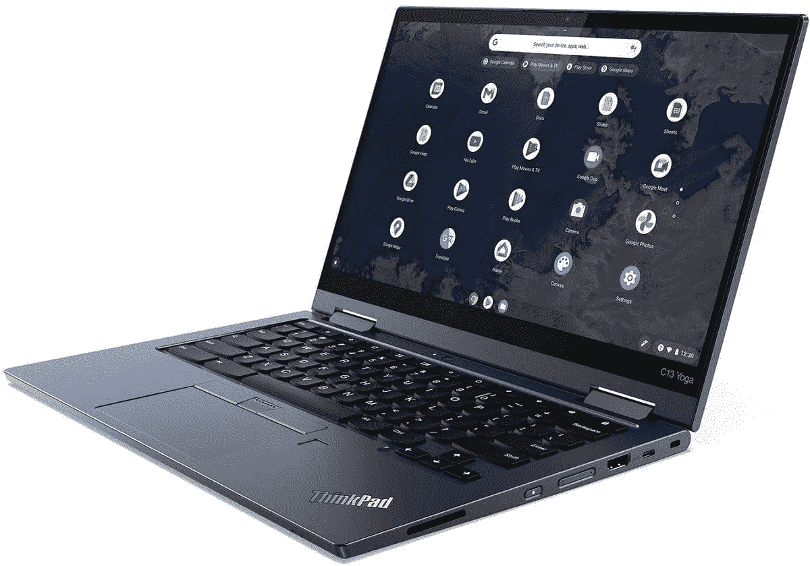</picture> 

Lenovo C13 Yoga Chromebook ($370 off)

##### 联想 ThinkPad C13 Yoga

这款 Chrome OS 可转换版由 AMD 锐龙 3 3205c 处理器、4GB 内存和 128GB 固态硬盘提供支持。它有一个清晰的全高清显示屏和两个摄像头，用于通话和拍照。

 <picture>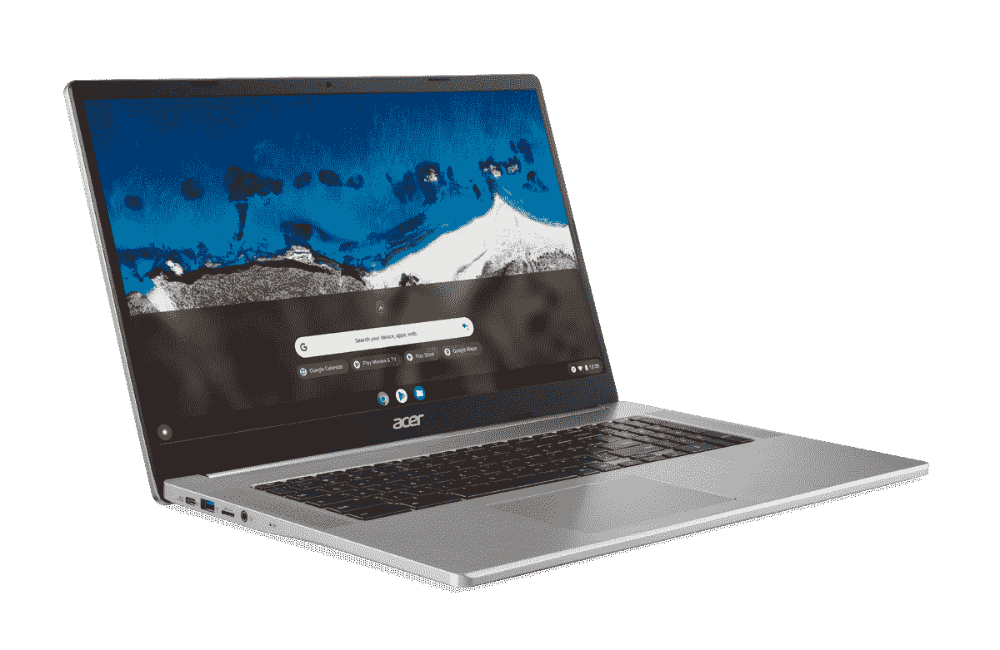</picture> 

Acer Chromebook 317 ($100 off)

##### 宏碁 Chromebook 317

如果你想要一台大型笔记本电脑，Chromebook 317 有 17 英寸的全高清显示屏。它由英特尔奔腾银 CPU 和 8GB 内存驱动，您可以获得 64GB 的 eMMC 存储。

 <picture>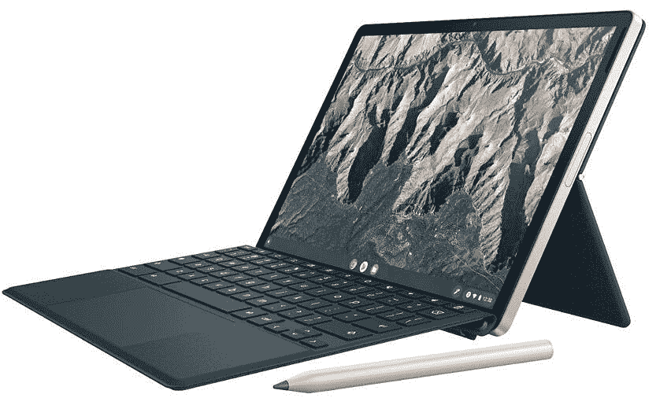</picture> 

HP Chromebook x2 11

##### 惠普 Chromebook x2 11

如果你想要一款轻薄的 Chromebook，这款适合你。它有一个清晰的 11 英寸显示屏，Snapdraon 7c 芯片组，4GB 内存和 64GB eMMC 存储。你也可以把它当作平板电脑使用。

 <picture></picture> 

Lenovo Chromebook Flex 5 ($60 off)

##### 联想 Chromebook Flex 5

这款入门级笔记本电脑配有英特尔奔腾 CPU、4GB 内存和 32GB eMMC 存储。它有一个清晰的全高清显示屏，支持触摸和笔，所以它仍然是一个很好的选择。

* * *

这些是我们在写作时发现的一些最好的总统日笔记本电脑交易，但如果你发现了更好的东西，请让我们知道。如果你不局限于打折的笔记本电脑，为什么不看看今天你能买到的最好的笔记本电脑来找到你喜欢的东西呢？