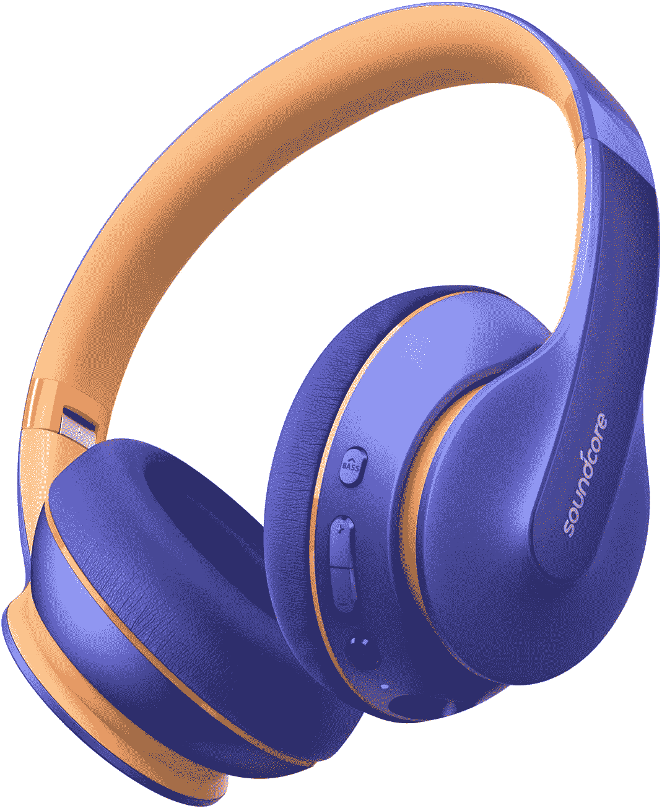

# Anker Soundcore Life Q10 Prime Day 2020 交易不容错过

> 原文：<https://www.xda-developers.com/prime-day-2020-anker-soundcore-lightning/>

众所周知，2020 年的[黄金日正在如火如荼地进行中，这意味着要跟踪和利用大折扣和限时闪电交易。并不是所有的耳机都值得麻烦，但你肯定会想在闪电交易时抢购这些 Anker Soundcore Life Q10s，因为它们是你在黄金时段可以买到的最好的廉价耳机之一。](https://www.amazon.com/primeday?tag=xda-2hifgbf-20&ascsubtag=UUxdaUeUpU30202&asc_refurl=https%3A%2F%2Fwww.xda-developers.com%2Fprime-day-2020-anker-soundcore-lightning%2F&asc_campaign=Short-Term)

我们已经在 2020 年这个黄金日展示了一些耳机，包括[我们在 Bose QuietComfort 35 II 上看到的最大折扣](https://www.xda-developers.com/prime-day-2020-bose-qc35-ii/)，但尽管这些都是很好的交易，但它们仍然*相当昂贵。*据我所知，QC35s 和[索尼 XM4s](https://www.amazon.com/Sony-WH-1000XM4-Canceling-Headphones-Phone-Call/dp/B08G43MX9G?tag=xda-2hifgbf-20&ascsubtag=UUxdaUeUpU30202&asc_refurl=https%3A%2F%2Fwww.xda-developers.com%2Fprime-day-2020-anker-soundcore-lightning%2F&asc_campaign=Short-Term) 都是高品质的无线耳机，如果你不是发烧友或者不打算经常使用它们，花几百美元买它们还是很难的。

对我来说，我只需要一副可以全天工作的耳机，并且不会夹住我的耳朵和眼镜，让他们戴起来不舒服。Soundcore Life Q10s 两者兼而有之，一次充电可播放 60 小时，记忆泡沫、弹性耳罩设计舒适。这只是一个额外的奖励，他们的“蓝色”是一个醒目的紫色，我完全喜欢。

但是仅仅因为这些价格较低并不意味着它们是低质量的耳机。Soundcore Q10s 经过高分辨率认证，因此您仍然可以获得出色的音质。此外，Anker 的 BassUp 技术将...嗯，需要的时候调高低音。这些不是消除噪音的耳机，但老实说，如果你在户外使用它们，无论如何最好了解一下你周围的环境。

深信不疑？那就赶快抢一双吧，在这笔闪电交易完成之前！

 <picture></picture> 

Anker Soundcore Life Q10 Wireless Bluetooth Headphones

##### Anker Soundcore Life Q10

抓住一些高质量的耳机，而不需要花费一只胳膊和一条腿。Soundcore Life Q10s 经过高分辨率认证，可提供长达 60 小时的播放时间，因此您可以全天聆听。

寻找更多交易？查看我们的[亚马逊黄金日](https://www.xda-developers.com/top-10-amazon-prime-day-2020-deals/)和[非亚马逊黄金日](https://www.xda-developers.com/10-non-amazon-prime-day-deals/)交易综述！