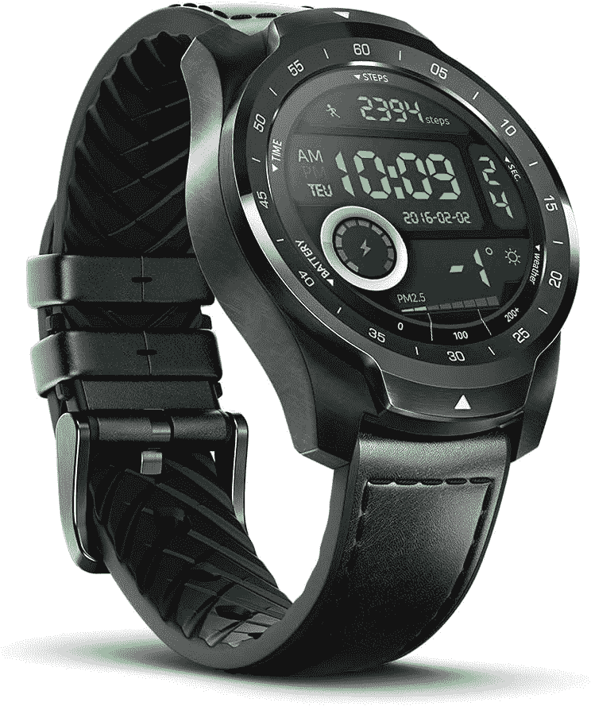
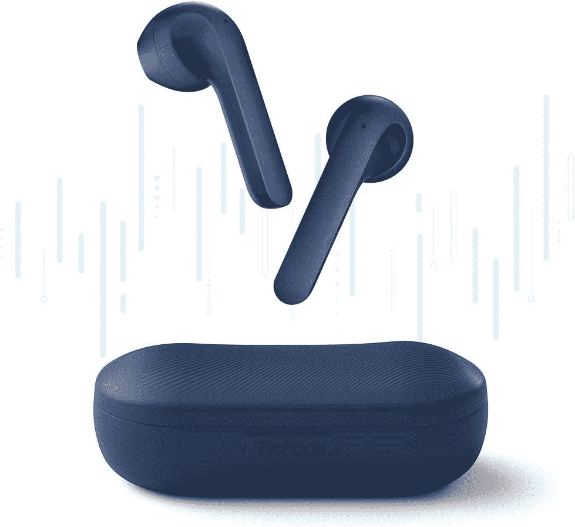

# 仅今天，作为 2020 年 Prime Day 的一部分，在 TicWatches 和 TicPods 上节省高达 92 美元

> 原文：<https://www.xda-developers.com/prime-day-2020-ticwatch-ticpods/>

2020 年的黄金日是 10 月 13 日和 14 日，但是 Mobvoi 已经决定让他们的销售比 48 小时更有限一些。仅在今天，您就可以在各种[ticwatch 和 TicBuds](https://www.amazon.com/stores/Ticwatch/page/9825633A-FB86-4185-B8E4-50779AC0E140?tag=xda-7pghlt2-20&ascsubtag=UUxdaUeUpU30198&asc_refurl=https%3A%2F%2Fwww.xda-developers.com%2Fprime-day-2020-ticwatch-ticpods%2F&asc_campaign=Short-Term) 上享受优惠。这些也不是闪电交易——你可以一整天都拿到这些折扣价。不过，这只限于 10 月 14 日，所以当黄金日结束时，这些交易也就结束了。

我个人推荐的是售价 182 美元的 [TicWatch Pro 2020](https://www.amazon.com/TicWatch-Fitness-Smartwatch-Tracking-Waterproof/dp/B082TY7VKW?tag=xda-7pghlt2-20&ascsubtag=UUxdaUeUpU30198&asc_refurl=https%3A%2F%2Fwww.xda-developers.com%2Fprime-day-2020-ticwatch-ticpods%2F&asc_campaign=Short-Term) 。这款手表内置 GPS、心率监视器和卡路里计数器，是一款非常棒的健身手表。你甚至可以用它来跟踪你的睡眠！

 <picture></picture> 

Save 33% on the TicWatch Pro 2020!

##### TicWatch Pro

使用最新的 TicWatch Pro 跟踪您的所有健身需求。在基本模式下，电池续航时间长达 30 天，可确保您的手表在最需要的时候不会干涸。

或者，你可以拿起 [TicWatch Pro 4G](https://www.amazon.com/Ticwatch-Smartwatch-Swim-Ready-Connectivity-Available/dp/B07RKQBHC9?tag=xda-7pghlt2-20&ascsubtag=UUxdaUeUpU30198&asc_refurl=https%3A%2F%2Fwww.xda-developers.com%2Fprime-day-2020-ticwatch-ticpods%2F&asc_campaign=Short-Term) 。没错，如果你有一个符合条件的威瑞森手机套餐，你可以将你的 TicWatch 加入其中。这款手表无需依赖 Wi-Fi 或蓝牙来跟踪和更新！TicWatch Pro 还具有防水功能，这使它成为了一个可以跟踪你游泳活动的智能手表精英群体。如今，这款手表仅售 200 美元，低于 291 美元！

 <picture></picture> 

TicWatch Pro 4G just $200!

##### TicWatch Pro 4G

只需 200 美元，就能买到顶级的 TicWatch Pro。你可以注册一个合格的威瑞森 4G 计划，使 GPS 跟踪更加可靠-不需要蓝牙或 Wi-Fi！

Mobvoi 还有 [TicWatch C2 Plus](https://www.amazon.com/TicWatch-Payment-Smartwatch-Included-Compatible/dp/B088KHXY6L?tag=xda-7pghlt2-20&ascsubtag=UUxdaUeUpU30198&asc_refurl=https%3A%2F%2Fwww.xda-developers.com%2Fprime-day-2020-ticwatch-ticpods%2F&asc_campaign=Short-Term) 、 [TicWatch E2](https://www.amazon.com/TicWatch-Waterproof-Smartwatch-Monitor-Compatible/dp/B0834NB5JG?tag=xda-7pghlt2-20&ascsubtag=UUxdaUeUpU30198&asc_refurl=https%3A%2F%2Fwww.xda-developers.com%2Fprime-day-2020-ticwatch-ticpods%2F&asc_campaign=Short-Term) 、 [Ticwatch S2](https://www.amazon.com/Ticwatch-Waterproof-Smartwatch-Compatible-iOS-Midnight/dp/B0834NTMTZ?tag=xda-7pghlt2-20&ascsubtag=UUxdaUeUpU30198&asc_refurl=https%3A%2F%2Fwww.xda-developers.com%2Fprime-day-2020-ticwatch-ticpods%2F&asc_campaign=Short-Term) 在售。

这还不是全部，因为 TicPods 2 Pro 和 TicPods ANC 也是 24 小时销售的一部分！TicPods 2 Pro 的音频质量非常好，一次充电可以播放四个小时(尽管充电后总共可以播放 23 个小时)。TicPods ANC 有...你猜对了，主动降噪内置。这两种选择也是 30%的折扣，所以挑选你最喜欢的，并将其添加到您的购物车！

 <picture></picture> 

TicPods 2 Pro, 30% off!

##### TicPods 2 Pro

在不倾家荡产的情况下获得一些高质量的豆荚。TicPods 2 Pro 仅售 98 美元，仅限今日。13 毫米动圈确保您获得出色的音质，而“Tickle”功能可以轻松控制您的音乐。

寻找更多交易？查看我们的 10 大亚马逊黄金日和[非亚马逊](https://www.xda-developers.com/10-non-amazon-prime-day-deals/)交易综述！