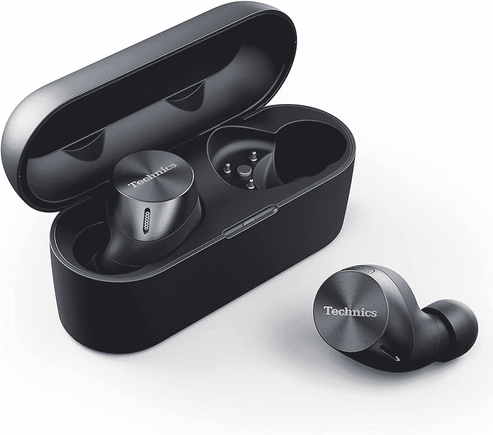

# 不要错过这些令人敬畏的技术耳塞的黄金日交易

> 原文：<https://www.xda-developers.com/prime-day-deal-technics-eah-az60/>

说到耳塞，有很多选择。与此同时，还有一些引人注目的名字跳了出来。一些例子包括三星、谷歌、苹果等。Technics 是松下旗下的品牌，音频是它的基因。我有幸试用了 Technics EAH-AZ60 耳塞，虽然名字的字母汤并不能让它们脱颖而出，但它们的音质确实如此。buds 听起来很棒，更值得注意的是，主动噪声消除相当不错。比噪音消除更好的是环境和注意力模式，让你周围的噪音进来。他们是非凡的。

在我的一生中，我已经使用了几十个耳塞，这是我第一次能够在与人交谈时将耳塞留在耳朵里。大多数时候，直通技术还可以，外部噪音听起来可能很小，很尖。这些就不一样了。打开环境模式听起来*几乎*就像拿出耳塞，只听你周围的世界。

## 出色的控制

外面的触摸板也很准，不会太灵敏。我经常带着耳塞，在把播客推回去的时候不小心暂停了。这些不会发生。首先，它们保持得很好，而且触摸感应表面是平的，所以很容易从角落里轻推它们而不触发动作。此外，触摸表面是可配置的，这是每个耳塞都应该有的，但由于我不知道的原因，有些没有。

这些 Technics 耳塞通常售价 230 美元左右，对于没有内置无线充电的耳塞来说有点贵。说到充电，Technics 宣传的电池寿命约为 25 小时，根据我的经验，这似乎是一个很低的估计。我通常在骑自行车或开车时听播客，通常一次听一两个小时，我不必连续几周给这些音乐充电。

今天你可以在亚马逊上以 27%的价格买到这些花蕾。

 <picture></picture> 

Technics EAH-AZ60

## 该换人了

可悲的是，就在一周前，我在当地的主题公园丢失了我的 EAH-az60，从那以后我每天都在后悔。我没有一天不在手机上听播客，这几周以来，这些音乐一直是我的首选。他们和我一起乘飞机、火车和汽车旅行。我仍然抱着希望，他们可能会出现在失物招领处，但我可能不得不扣动扳机，得到替代品。如果你买了一双，在你去超人之旅之前，确保你的口袋扣好，或者更好的是，把它们留在车里！

如果你不能扣动这笔交易的扳机，一定要看看我们其他的[黄金日](https://www.xda-developers.com/amazon-prime-day/)交易！到目前为止，我们最喜欢的是仅售 499 美元的[谷歌 Pixel 6](https://www.xda-developers.com/google-pixel-6-100-discount-prime-day/)和售价 94.99 美元的[Kindle paper white](https://www.xda-developers.com/kindle-paperwhite-11th-gen-paperwhite-signature-edition-prime-day-deal/)。