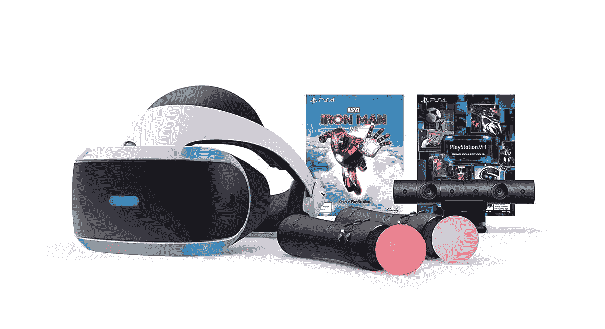

# PS VR 游戏不会与即将发布的索尼 PS VR2 兼容

> 原文：<https://www.xda-developers.com/ps-vr-2-wont-support-ps-vr-games/>

尽管虚拟现实已经存在了一些年，尽管 Meta 和索尼提供了优秀的产品，但它仍然没有真正流行起来。今年年初，索尼证实其正在开发下一代虚拟现实耳机 [PS VR2](https://www.xda-developers.com/sony-next-vr-headset-psvr-2/) 。随着我们越来越接近它的发布，该公司已经提供了一些信息，首先展示了[的设计](https://www.xda-developers.com/sony-playstation-vr2-design-revealed/)，然后让那些好奇的人看看[的 PS VR 2 体验](https://www.xda-developers.com/sony-shows-ps-vr2-user-experience/)。虽然到目前为止事情看起来相当不错，但关于该设备的一些坏消息已经出现，这可能会影响许多当前的 PS VR 用户。

在 PlayStation 官方播客中，索尼全球产品战略和管理高级副总裁 Hideaki Nishino 被问及原创 PlayStation VR 游戏是否能够在即将推出的设备上播放。遗憾的是，答案是否定的，PS VR 片头将无法与 PS VR2 兼容。他接着说，这两款游戏并不兼容，因为 PS VR2 旨在提供下一代体验。PS VR2 具有先进的功能，如其全新的触觉反馈控制器，具有自适应触发器，由内向外跟踪，眼球跟踪，以及 HDR 和 3D 音频。由于这些高级功能，开发 PS VR2 游戏与开发 PS VR 游戏完全不同。

这个消息无疑会让目前的 PS VR 用户感到有点震惊。虽然有一些游戏可以与 PS2 兼容，但听起来，在很大程度上，向后兼容性并不是索尼优先考虑的事情。展望未来，除非有什么变化，否则那些想继续玩 PS VR 游戏的人将需要保留他们现有的硬件。索尼尚未宣布 PS VR2 的价格或确切发布日期，仅表示将于 2023 年初发布。

 <picture></picture> 

PlayStation VR

##### 索尼 PlayStation VR

这款 PlayStation VR 套装配有耳机、控制器和漫威的钢铁侠

* * *

**来源** : [PlayStation 博客](https://blog.playstation.com/2022/09/16/official-playstation-podcast-episode-439-virtual-impressions/)

**Via** : [Engadget](https://www.engadget.com/psvr-games-compatible-with-psvr-2-sony-virtual-reality-183519384.html) ， [Nibel](https://twitter.com/Nibellion/status/1570826276344299523) (Twitter)