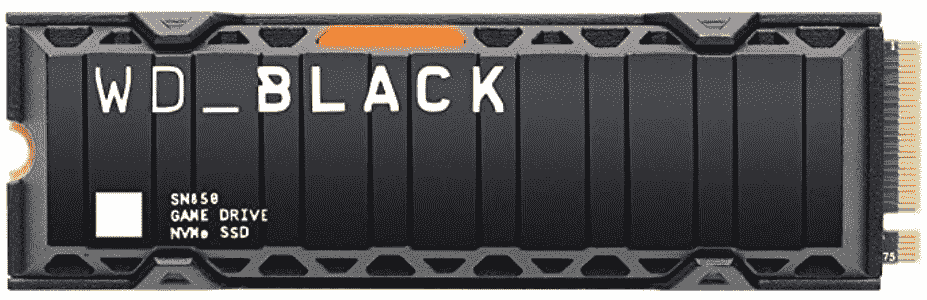

# PS5 beta 更新支持 M.2 SSD 存储扩展，但有一个问题

> 原文：<https://www.xda-developers.com/ps5-update-storage-expansion-m2-ssd/>

索尼透露，它将推出 PlayStation 5 的测试版更新，实现其期待已久的存储扩展功能。现在，已经在 PS5 内置固态硬盘上填满存储空间的游戏玩家，以及已经[注册测试程序](https://www.xda-developers.com/sony-playstation-5-beta-program/)的游戏玩家，将能够在机架上安装 M.2 固态硬盘来扩展存储容量。

自从这款游戏机首次亮相以来，这项功能就一直得到承诺，M.2 SSD bay 的存在在拆解中得到了体现。[今年早些时候有传言说对这一扩张的支持将在夏天推出，这似乎是正确的。USB 固态硬盘有一些限制，这使得它们作为 PS5 内部存储扩展的功能受到限制——最明显的是，你不能从所述存储上玩 PS5 游戏。虽然 PS5 的内置存储还不错，但考虑到这些天的大型游戏，填满它并不困难(例如，*使命召唤:战区*，在 PS5 的 667GB 固态硬盘上占用了 52GB)。](https://www.xda-developers.com/sony-playstation-5-expandable-storage-slot-unlock/)

为了在托架上安装 M.2 固态硬盘，你必须拆开 PS5。索尼建议使用“一个光线充足的房间，里面有一张桌子……一把 1 号十字螺丝刀……[和]一个小手电筒(可选)。”整个安装过程大约需要 12 个步骤，你可以在 PlayStation 5 支持网站上阅读整个过程，那里公布了更新。

不幸的是，这个解决方案并非没有缺陷。索尼发布了一长串参数，M.2 SSD 必须满足这些参数才能与 PS5 兼容。对于只想即插即用的玩家来说，最大的障碍可能是索尼说，“不要使用没有散热机制的 M.2 SSD，如散热器或传热片。”正如说明所述，您的固态硬盘可能不附带这些部件，这意味着您必须单独购买一个散热器。这需要玩家做一点研究，至少在公司开始指定哪些固态硬盘与 PS5 兼容之前。

Xbox 还为 X 系列游戏机提供了一个扩展选项，采用专有 SSD 的形式，价格超过 200 美元，可以插入游戏机的背面。它很贵，而且限制了玩家的选择，但另一方面，X 系列的所有者会毫无疑问地知道，它将与他们的主机一起工作。M2 的更新基本上是相反的。

测试版更新目前对美国、加拿大、日本、英国、德国和法国的一些 PS5 玩家开放。在尝试打开控制台之前，请检查您的系统软件是否已更新为最新软件。

 <picture></picture> 

WD_Black 1TB SN850 SSD with Heatsink

##### WD Black SN850 NVMe M.2 固态硬盘

这是我们能找到的为数不多的既能满足索尼所有苛刻要求又配有必备散热器的固态硬盘之一