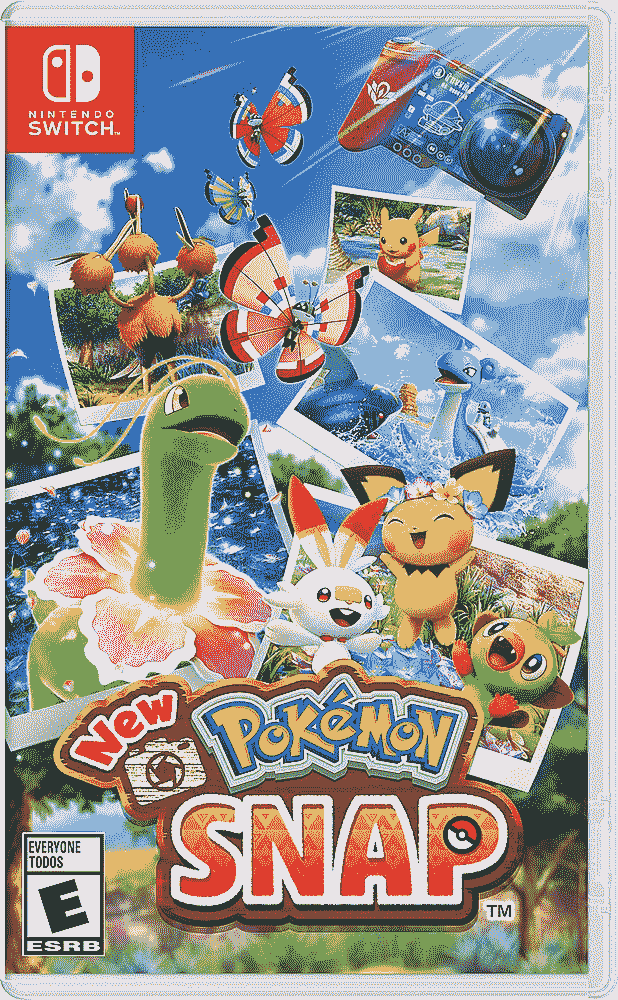

# 在 Pokémon Snap 中好好利用你的 Instagram 技能，现在售价 40 美元(优惠 20 美元)

> 原文：<https://www.xda-developers.com/put-your-instagram-skills-to-good-use-in-pokemon-snap-now-on-sale-for-40-20-off/>

任天堂 64 最令人难忘的游戏之一是*神奇宝贝抓拍*，这是神奇宝贝系列的衍生游戏，你可以在铁轨射击游戏风格的游戏中拍摄野生神奇宝贝的照片。今年早些时候，任天堂 Switch 以通常的 60 美元的价格发布了续集/重新想象，但它已经降价几次，现在在多家商店以 39.99 美元的价格出售。

新游戏遵循了与原版*神奇宝贝* Snap 相同的基本理念。你是一名神奇宝贝摄影师，任务是帮助研究，这需要你在伦塔尔地区拍摄神奇宝贝的照片。每次考察都在轨道气垫船上进行，你的分数取决于照片的质量。这可能涉及引诱神奇宝贝离开隐藏的地方，捕捉罕见的反应，以及其他技术。

 <picture></picture> 

New Pokémon Snap

##### 口袋妖怪 Snap

这是一个有趣的神奇宝贝为主题的冒险，你的工作是拍出好看的照片。目前在多家商店售价为 39.99 美元，比通常价格节省了 20 美元。

新的神奇宝贝 Snap(是的，这是游戏的官方名称)是由万代纳木错工作室开发的，它得到了普遍的好评——[它在 Metacritic](https://www.metacritic.com/game/switch/new-pokemon-snap) 上的评分是 79/100。如果你正在寻找一个有趣的神奇宝贝为主题的冒险，不需要战斗或杂耍超级药水，你不能错过这个游戏。