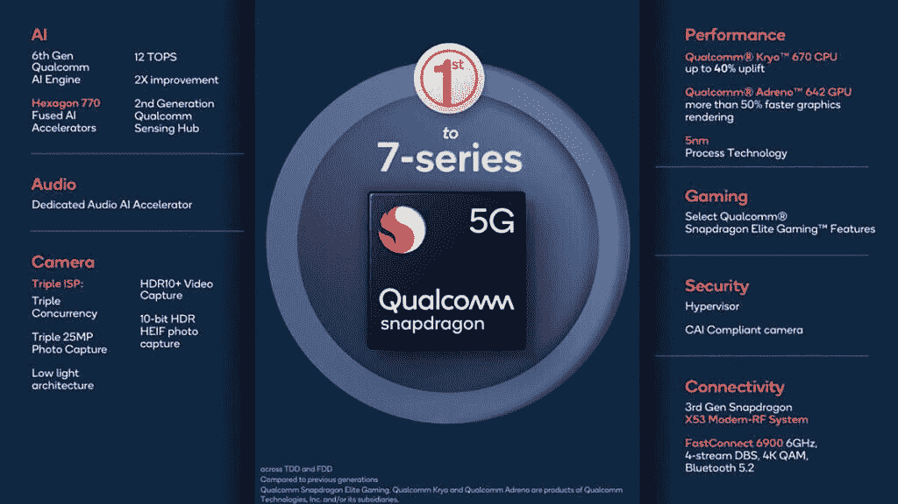

# 骁龙 780G 带来了更快的 CPU，支持 144 赫兹显示器等等

> 原文：<https://www.xda-developers.com/qualcomm-snapdragon-780g/>

高通的骁龙 7 系列是该公司芯片组组合中相对较新的产品。7xx 系列于 2018 年推出，旨在弥合骁龙 6xx 和 8xx 系列之间的差距，在一个经济实惠的封装中结合了该公司顶级芯片的一些高级功能。自发布以来，骁龙 7xx 系列已经成为许多经济型和高端中档智能手机的首选。特别是骁龙 765g T1 取得了巨大的成功，已经在一加诺德、OPPO Reno 5、Mi 10 Lite、Vivo V20 Pro、诺基亚 8.3 等热门手机上使用。看到骁龙 765G 的巨大成功，高通自然会推出合适的继任者。这正是该公司在发布全新的骁龙 780G 时所做的事情。

骁龙 780G 是骁龙 765 / 765G 的直接继承者，带来了对其前身的大量改进，包括三个 ISP、新的 CPU 架构、更快的连接性等等。

| 

规范

 | 

高通骁龙 765 克

 | 

高通骁龙 780G

 |
| --- | --- | --- |
| **CPU** | Kryo 475 CPU 内核(最高 2.4GHz)

*   1x ARM Cortex-A76 @ 2.8GHz
*   1x ARM Cortex-A76 @ 2.4GHz
*   6x ARM Cortex-A55 @ 1.8GHz

 | Kryo 670 CPU 内核(最高 2.4GHz)

*   1x ARM Cortex-A78 @ 2.4GHz
*   3 个 ARM Cortex-A78 @ 2.2GHz
*   4x ARM Cortex-A55 @ 1.9GHz

 |
| **GPU** | 

*   肾上腺素 620
*   *   Vulkan 1.1
    *   H.265 (HEVC)和 VP9 解码器
    *   HDR10+、HDR10 和 HLG

 | 

*   肾上腺素 642
    *   Vulkan 1.1
    *   骁龙精英游戏特色
    *   HDR 游戏(10 位色深，录制。2020 色域)
    *   H.265 和 VP9 解码器
    *   HDR10+，HDR10，HLG

 |
| **显示** | 

*   最大设备显示支持:FHD+@ 120 赫兹
*   最大外部显示器支持:4K @ 60Hz
*   HDR 支持
*   10 位颜色深度
*   USB Type-C 支持上的显示端口

 | 

*   最大设备显示支持:FHD+@ 144 赫兹
*   最大外部显示器支持:4K @ 60Hz
*   10 位色深，Rec 2o20 色域
*   HDR10 和 HDR10+支持
*   10 位颜色深度
*   USB Type-C 支持上的显示端口

 |
| **艾** | 

*   第五代人工智能引擎
*   Hexagon 696 处理器
*   高通传感中心
*   5.5 最高性能

 | 

*   第六代人工智能引擎
*   Hexagon 770 处理器
*   高通传感中心(第二代)
*   12 项顶级性能

 |
| **内存** | 

*   LPDDR4 (2133MHz)
*   高达 12GB 内存

 | 

*   LPDDR4 (2133MHz)
*   高达 16GB 内存

 |
| **ISP** | 

*   双 14 位光谱 355 ISP
*   单摄像头:最高 3600 万像素，带 ZSL
*   双摄像头:最高 2200 万像素，带 ZSL
*   视频捕捉:
    *   4K·HDR @ 30 fps
    *   高达 720p@480 fps 的慢动作
    *   HDR10、HDR10+、HLG

 | 

*   三路 14 位 Spectra 570 ISP
*   单摄像头:高达 8400 万像素，零快门延迟(ZSL)
*   双摄像头:最高 6400 万像素+200 万像素，带 ZSL
*   三摄像头:最高 250 万像素，带 ZSL
*   微光摄影建筑
*   多框架和阶梯式 HDR 传感器支架
*   视频捕捉:
    *   4K·HDR
    *   高达 720p@480 fps 的慢动作
    *   HDR10+，HDR10，HLG

 |
| **调制解调器** | 

*   骁龙 X52 4G LTE 和 5G 多模调制解调器(集成)
*   下行:3.7Gbps (5G)，1.2Gbps (4G LTE)
*   低于 6 GHz: 100MHz 带宽，4×4 MIMO

 | 

*   骁龙 X53 4G LTE 和 5G 多模调制解调器(集成)
*   下行链路:3.3Gbps (5G)
*   低于 6 GHz: 100MHz 带宽，4x4 MIMO

 |
| **充电** |  |  |
| **连通性** | 

*   高通快速连接 6200
*   WiFI 6 就绪
*   2.4GHz / 5GHz 频段
*   行波管、WPA3、8×8 MU-MIMO
*   蓝牙 5.0、aptX TWS 和自适应

 | 

*   高通快速连接 6900
*   WiFI 6E，WiFI 6
*   2.4GHz、5GHz 和 6GHz 频段
*   8×8 MU-MIMO
*   蓝牙 5.2，aptX 套件
*   双蓝牙天线
*   骁龙声音兼容

 |
| **制造工艺** | 三星的 7 纳米工艺 | 三星的 5 纳米工艺 |

### 

### 中央处理器

从最重要的方面开始，CPU，我们看到了一些相当大的变化。虽然骁龙 765G 和 768G 都使用 Kryo 475 内核，但骁龙 780G 使用更强大的 Kryo 670 CPU 内核，主频高达 2.4GHz。高通表示，与上一代相比，新的 CPU 架构提供了高达 40%的性能提升。高通的新闻材料没有深入核心集群的本质和其他细节，但该芯片采用了 4 个 ARM Cortex-A78 核心和 4 个 Cortex-A55 核心的组合。骁龙 780G 基于 5 纳米工艺制造，与之前的 7 纳米 EUV 工艺相比，效率略有提高。

### 国家政治保卫局。参见 OGPU

转到图形和游戏方面，骁龙 780G 配备了 Adreno 642 GPU，比骁龙 765G 的 Adreno 620 有所提升。它还包括高通的骁龙精英游戏功能套件，提供各种游戏增强功能，如游戏更流畅，快速加载器，游戏网络延迟管理器，邱建减速器，等等。随着 GPU 能力的增强，该芯片组现在还可以处理高达 144Hz 刷新率的显示器，使价格实惠的游戏手机能够超越 120Hz 的上限。

### 照相机

骁龙 780G 采用 Spectra 570，这是一种三重图像信号处理器，能够同时从三个不同的相机传感器拍摄照片。ISP 在三摄像头设置中支持多达三个 25MP 传感器，在双摄像头设置中支持多达 64MP + 20MP 传感器，以及多达 84MP 单摄像头。该芯片还配备了一种新的低光摄影架构，我们被告知这种架构为超低光摄影带来了巨大的改进。正如其前身一样，骁龙 780G 也支持 4K HDR，HDR10+和 HLG 视频捕捉。

### 连通性

骁龙 780G 还拥有令人印象深刻的连接能力，采用了高通的顶级 FastConnect 6900 系统，该系统迄今为止只在骁龙 888 和 865+等芯片上使用，以及骁龙 X53 5G 调制解调器。凭借升级的调制解调器和连接系统，该芯片在 5G 上提供高达 3.3Gbps 的最大吞吐量，WiFI 6E 支持高达 3.6Gbps 的峰值下载速度，支持 2.4GHz/5GHz/6GHz 频段，双 SIM 5G，动态频谱共享等。你还可以得到蓝牙 5.2 以及对骁龙声音平台的支持。

### 人工智能

人工智能的性能也得到大幅提升。骁龙 780G 配备了第六代高通人工智能引擎和新的 Hexagon 770 处理器，能够提供高达 12 TOPS(万亿次运算)的性能。

与此同时，新的第二代高通传感集线器大大降低了语音通话的功耗，同时还支持背景噪音消除，以获得更好的通话体验。

## 有效性

采用新骁龙 780G 芯片组的设备预计将于 2021 年在 Q2 上市。在旗舰价格创下新高、高通难以生产足够的骁龙 888 芯片库存的背景下，骁龙 780G 可能会成为高端中端设备的一个好选择。