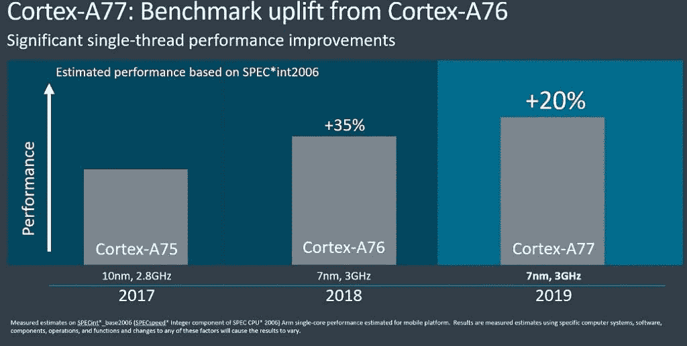

# 高通宣布旗舰智能手机骁龙 865 SoC

> 原文：<https://www.xda-developers.com/qualcomm-snapdragon-865-processor-specifications-features/>

由于高通为经济型、中档和高端移动设备设计芯片，高通的骁龙芯片组被用于数百万部安卓智能手机和平板电脑。每年 12 月，高通都会举办一场他们称之为骁龙科技峰会的活动，在那里他们会宣布他们最新的高端移动平台。今年，该公司有两款新的 SOC 可以展示:高通骁龙 765 和高通骁龙 865。后者是 2019 年发布的大多数旗舰 Android 设备中的高通骁龙 855 的继任者，它在 CPU，DSP，ISP 和调制解调器等关键领域进行了重大升级。

随着 Snapdragon 800 系列的每一个新成员的加入，我们都会看到符合我们预期的逐年改进。今年的不同之处在于，该行业的其他公司终于迎头赶上，充分利用了芯片的全部功能。5G 连接不再仅仅是一个谈论点- [它已经在许多城市可用](https://www.xda-developers.com/t-mobiles-5g-live-oneplus-7t-pro-mclaren-galaxy-note-10-plus/)并且由少数设备支持。高像素、多摄像头设备正在成为常态 108MP 五摄像头[小米 Note 10](https://www.xda-developers.com/xiaomi-mi-note-10-mi-note-10-pro-redmi-note-8t-arrive-europe/) 立即浮现在脑海中。高刷新率技术现在是移动行业的主流，因为许多大公司在其最新设备上添加了 90 甚至 120Hz 的面板。凭借新的高通骁龙 865，我们可以看到 2020 年的设备拥有比我们以前见过的更高的百万像素摄像头、更快的刷新率面板和更快的网络连接。

高通今年强调了许多重大的换代变化，但在深入研究骁龙 865 规格表时，我们也发现了许多较小的改进。这是你需要知道的一切。

*免责声明:高通赞助我去夏威夷毛伊岛参加骁龙科技峰会。公司支付了我的机票和酒店费用。然而，他们没有对该文章的内容提出任何意见。*

首先，我整理了一张表格，对上一代高通骁龙 855 和新一代高通骁龙 865 进行了广泛的比较。如果你不熟悉这些术语中的大部分，这个表格很难理解。在表格下方，我将我对同比改进和新特性的解释分成了多个部分。

|  | 

高通骁龙 855 (sm8150)

 | 

高通骁龙 865 (sm8250)

 |
| --- | --- | --- |
| **CPU** | 1 个 Kryo 485(基于 ARM Cortex A76)主内核@ 2.84GHz，1 个 512KB pL2 高速缓存 3 个 Kryo 485(基于 ARM Cortex A76)性能内核@ 2.42GHz，3 个 256KB pL2 高速缓存 4 个 Kryo 385(基于 ARM Cortex A55)效率内核@ 1.8GHz，4 个 128KB pL2 高速缓存 2MB sL3 高速缓存 | 1 个 Kryo 585(基于 ARM Cortex A77)主内核@ 2.84GHz，1 个 512KB pL2 高速缓存 3 个 Kryo 585(基于 ARM Cortex A77)性能内核@ 2.4GHz，3 个 256KB pL2 高速缓存 4 个 Kryo 385(基于 ARM Cortex A55)效率内核@ 1.8GHz，4 个 128KB pL2 高速缓存 4MB sL3 高速缓存**性能提升 25%** |
| **GPU** | adre no 640 @ 600 MHz vulkan 1.1 snapdragon Elite gaming 视频播放:H.264 (AVC)、H.265 (HEVC)、VP8、VP9、4K HDR10、HLG、HDR10+、杜比视界 | adre no 650 vulkan 1.1 snapdragon Elite 游戏，具有新的桌面正向渲染、游戏色彩增强、可更新的 GPU 驱动程序**图形渲染速度快 20%****能效高 35%**视频播放:H.264 (AVC)、H.265 (HEVC)、VP8、VP9、4K HDR10、HLG、HDR10+、杜比视界 |
| **显示** | 最大设备上显示支持:uhd 最大外部显示支持:UHDHDR 支持 USB Type-C 上的显示端口支持 | 最大设备上显示支持:UHD @ 60Hz，QHD+@ 144hz 最大外部显示支持:UHD @ 60HzHDR 支持 USB Type-C 上的显示端口支持 |
| **艾** | 具有六边形矢量扩展和六边形张量加速器的六边形 690 第四代人工智能引擎 7 顶 | Hexagon 698，带有 Hexagon 矢量扩展和新的 Hexagon 张量加速器第五代人工智能引擎高通传感中心 15 顶 |
| **内存** | 4 个 16 位 LPDDR4 @ 2133MHz、16GB3MB 系统级高速缓存 | 4 个 16 位 LPDDR4 @ 2133MHz，16GBLPDDR5 @ 2750MHz3MB 系统级高速缓存 |
| **ISP** | 双 14 位 Spectra 380 单摄像头:最高 48MP 带 ZSL；最高 22MP 双摄像头:最高 22MP 带 ZSLVideo 捕捉:4K·HDR @ 60 fps；慢动作高达 720p @ 480 fpsHDR10、HDR10+、HLG | 双 14 位 Spectra 480 单摄像头:最高 64MP 带 ZSL；最高 200MPDual 摄像头:最高 25MP 带 ZSLVideo 捕捉:4K HDR @ 60 fps + 64MP 连拍图像；4K @ 120 fps；8K @ 30 fps 慢动作高达 720p@960 fps(不限)；HDR10、HDR10+、HLG、杜比视界 |
| **调制解调器** | 骁龙 X24 4G LTE 模式下行链路:2.0 Gbps 上行链路:316MbpsSnapdragon X50 5G 模式下行链路:5.0 Gbps 模式:NSA、TDDmmWave: 800MHz 带宽、8 个载波、2x2 MIMOsub-6 GHz: 100MHz 带宽、4x4 MIMO | 骁龙 X55 4G LTE 和 5G 多模模式下行链路:7.5Gbps (5G)，2.5Gbps (4G LTE)上行链路:3Gbps，316Mbps (4G LTE)模式:NSA，SA，TDD，fddmm 微波:800MHz 带宽，8 个载波，2x2 MIMOsub-6 GHz: 200MHz 带宽，4x4 MIMO |
| **充电** | 高通快充 4+ | 高通快充 4+高通快充 AI |
| **连通性** | 位置:北斗，伽利略，GLONASS，GPS，QZSS，SBAS，双频支持 Wi-Fi:高通 FastConnect 6200Wi-Fi 6 就绪；2.4/5GHz 频段；20/40/80 MHz 频道；DBS、TWT、WPA3、8x8 MU-mimobluteooth:版本 5.0、aptX TWS 和 aptX 自适应 | 位置:北斗，伽利略，GLONASS，GPS，QZSS，SBAS，双频支持 Wi-Fi:高通 FastConnect 6800Wi-Fi 6 认证；2.4/5GHz 频段；20/40/80 MHz 频道；DBS、TWT、WPA3、8x8 MU-MIMO、OFDMA、1024QAMBluetooth:版本 5.1、aptX TWS、aptX 自适应和 aptX 语音 |
| **制造过程** | 7 纳米(TSMC 的 N7) | 7 纳米(TSMC 的 N7P) |

**CPU**

高通表示，骁龙 865 的原始 CPU 性能比骁龙 855 快了 25%,或者在同样的性能点上，CPU 能效高了 25%。他们是如何实现性能和效率提升的？很可能是因为添加了新的 ARM 内核。高通骁龙 865 具有相同的 CPU 核心配置(甚至相同的时钟速度和 pL2 高速缓存！)作为骁龙 855，但唯一的主内核和 3 个性能内核现在都来自于 **ARM Cortex-A77** 设计，而不是 Cortex-A76。高通称这些新的 CPU 内核为 Kryo 585，据报道，这一次他们没有对标准 ARM Cortex A77 参考设计进行定制。[去年的 Kryo 485 对 ARM Cortex A76](https://www.xda-developers.com/qualcomm-travis-lanier-snapdragon-855-kryo-485-cpu-hexagon-690-dsp/) 设计进行了改进，引入了更大的无序执行窗口和重新排序缓冲区，以及更高效的数据预取器。

 * ARM Cortex-A75 与 Cortex-A76 与 Cortex-A77 单 CPU 内核@ 3GHz，在 SPEC int2006 中进行基准测试。来源:ARM。*

**图形处理器**

对于新的 Adreno 650，高通宣称与去年骁龙 855 中的 Adreno 640 相比，图形渲染速度快了 20 %( T20)或能效提高了 35 %( T22 )(在相同的性能点上)。高通强调，新的 Adreno 650 允许更好的持续性能，这意味着在你的游戏开始丢帧之前需要更长的时间。不幸的是，我们没有太多关于 Adreno 650 本身复杂性的细节(比如它的最大时钟速度)，因为高通非常保护它的定制 GPU 设计。也有很好的理由:Adreno GPU 长期以来一直优于 ARM 的 Mali GPU。当然，我们必须在骁龙 865 设备上测试 GPU 性能，以确认这一代是否仍然如此。

随着手机游戏越来越受欢迎，并随之变得越来越复杂和性能密集，高通以其“骁龙精英游戏”品牌的一系列功能做出回应。骁龙精英游戏于去年与骁龙 855 一起推出，目前它由邱建减速器等功能组成，旨在优化游戏期间的芯片组操作。现在，骁龙精英游戏正在增加对 **5 个新功能**的支持:桌面前向渲染、游戏色彩增强、可更新的 GPU 驱动程序、骁龙游戏性能引擎和 Adreno HDR 快速混合。

*   **桌面前向渲染**:高通致力于将虚幻引擎的这一[功能引入安卓系统。它被游戏开发者用于桌面级的动态阴影、平面反射、运动模糊和其他后期处理效果。](https://trello.com/c/l6pi3bkE/476-desktop-forward-renderer-on-mobile)
*   **Game Color Plus** :越来越多的智能手机拥有符合 HDR 标准的显示屏。然而，HDR 内容仍然稀缺，尤其是在手机游戏领域。这项功能将手机游戏的颜色从 SDR 转换为 HDR，但据称是以一种“智能”的方式进行的，不会牺牲颜色的准确性。高通承诺“增强细节，提高色彩饱和度和局部色调映射。”OPPO [此前宣布](https://www.xda-developers.com/oppo-qualcomm-game-color-plus-dual-wi-fi-technology-mobile-gaming/)他们将率先利用这项技术。<picture></picture>

    游戏颜色加在 PUBG 上移动:左为启用，右为禁用

*   **可更新的 GPU 驱动程序**:通常情况下，GPU 驱动程序的更新会与其他更新一起打包，然后通过 OTA 发送给用户。骁龙 865 BSP 的新功能是能够更新单独的 GPU 驱动程序存根。如果 OEM 支持，用户可以直接从应用商店下载 GPU 驱动程序的更新。谷歌[通过 Project Treble](https://www.xda-developers.com/project-treble-google-pixel-2-graphics-drivers/) 在 Android 端实现了这一点，但我们还没有看到许多原始设备制造商利用这一点。
*   骁龙游戏性能引擎(Game Performance Engine):高通没有提供该功能的更多细节，但骁龙 865 的新闻稿称，该功能“游戏性能现已优化至微秒级”，“提供自适应和预测性的实时系统调优，以实现更长时间的持续性能。”听起来这里可能会使用一些机器学习——也许原始设备制造商或开发人员可以根据游戏来训练模型，当部署时，调整参数以保持最佳性能，类似于[华为的 GPU Turbo 如何工作](https://www.xda-developers.com/huawei-honor-gpu-turbo-3/)。
*   **Adreno HDR 快速混合**:这是一种新的“硬件嵌入式”功能，可用于在重度混合的场景中提高性能高达 2 倍(与骁龙 855 相比)，例如在屏幕上渲染复杂粒子时。

**显示**

高刷新率显示器多年来一直是 PC 游戏的主要产品——只要看看有多少 144Hz 的游戏显示器就知道了——但这项技术最终在移动领域起飞了。谷歌 Pixel 4、一加 7T、Realme X2 Pro 和 OPPO Reno Ace 都是最近发布的 90 赫兹显示屏，而华硕 ROG Phone II 和夏普 Aquos R3 则是 120 赫兹显示屏。虽然 ROG Phone II 和 Aquos R3 的显示屏更平滑，但他们牺牲了显示屏分辨率来实现这一目标。高分辨率和高刷新率的显示器给 GPU 带来了沉重的压力，但骁龙 865 中的 Adreno 650 能够在 144Hz 下推动 **QHD+分辨率**。我们不知道何时会有 QHD+144 赫兹显示屏的智能手机上市，但如果已经有一款智能手机在研发中，它最有可能是由骁龙 865 驱动的。

高通的 3D Sonic 技术，该公司的超声波下显示指纹扫描仪，仍然受到支持，但值得注意的是，该技术正在进行重大升级。这项技术的最新版本被称为 3D Sonic Max，识别面积为 30 毫米×20 毫米，比以前大 17 倍。高通说现在的精确度是 1:1，000，000 比 1:50，000。更大的识别区域使两个手指同时被认证成为可能，尽管从更实际的角度来说，这将使用户更容易找到他们的手指在传感器上的位置。

 <picture></picture> 

3D Sonic Max allowing for dual fingerprint authentication. Source: Qualcomm

只有三星在 Galaxy S10 和 Galaxy Note 10 上使用了 3D 声波指纹扫描仪，所以即将到来的 [Galaxy S11](https://forum.xda-developers.com/galaxy-s11) 可能会采用新的 3D Sonic Max 技术。

**艾**

虽然有很多[是蛇油](https://www.cs.princeton.edu/~arvindn/talks/MIT-STS-AI-snakeoil.pdf)，但也有很多令人印象深刻和有用的功能利用了我们所谓的“人工智能”以[谷歌 Pixel 4 的](https://www.xda-developers.com/google-pixel-4-specs-features-pricing-availability/)自动白平衡调整和天文摄影功能为例。谷歌根据一组有良好照明和没有良好照明的照片训练了一个模型，他们根据一组星空照片训练了另一个模型。结果是，Pixel 4 可以推断出最佳的白平衡设置应该是什么，以校正不良的照明(自动白平衡调整)，它还可以从树木和其他地面物体中分割出天际线(天体摄影)。这两种功能都需要骁龙的 Spectra ISP、Hexagon DSP 和 Adreno GPU 提供的计算能力。

结合对 GPU、DSP 和其他模块的改进，人工智能性能同比提升了超过**2 倍**。骁龙 855 管理 7 个 top(万亿次运算)，而骁龙 865 管理 **15 个 top**。这要归功于骁龙 865 的**第五代人工智能引擎**。第五代 AI 引擎最大的改进是 Hexagon 698 DSP 中的**更新的 Hexagon 张量加速器**。高通升级了 HTA，提供了超过 4 倍的性能，同时能效提高了 35%。

高通设计了一个新的组件，它被称为“**传感中枢**”，旨在有效地检测音频。传感集线器利用< 1mW 的功率，使其保持**始终开启，几乎不消耗任何功率**。它支持多词唤醒，这意味着它可以对“嘿谷歌”或“Alexa”热词做出反应，以触发谷歌助手或亚马逊 Alexa 查询。传感器框架是可扩展的，因此它不仅限于这些用例。例如，高通说传感中枢可以用来监听驾驶、办公室工作、电影院等的声音。开发人员可以使用更新的[高通神经处理 SDK](https://developer.qualcomm.com/software/qualcomm-neural-processing-sdk) 、 [Hexagon NN 卸载框架](https://wiki.codeaurora.org/xwiki/bin/+Qualcomm+Hexagon+NN+Offload+Framework/)和高通 AI 模型增强器工具来创建这些和其他功能。

互联网服务提供商

可以说，骁龙 865 相对于骁龙 855 的最大改进在于 ISP。新的 Spectra 480 ISP 每秒可以处理 20 亿像素。为了利用这种提高的处理性能，高通减慢了时钟周期，并开始每时钟周期处理 4 个像素，而不是每时钟周期 1 个像素。其结果是更好的节能、更高的热效率，以及降噪等任务的像素处理速度提高 40%。此外，Spectra 480 有一个新的视频分析引擎(EVA)来处理所有的计算机视觉(CV)任务。

Spectra 480 ISP 的“千兆像素速度”使得同时捕捉 **4K HDR 视频和 64MP 连拍图像**成为可能。高通说 ISP 可以处理高达 200 兆像素的图像。这也不仅仅是一个理论上的数字，正如高通所说，智能手机图像传感器供应商确实在研究这些高得离谱的百万像素传感器。然而，在更实际的情况下，Spectra 480 现在能够处理零快门延迟(来自单个传感器)的 **64MP 图像。)这比骁龙 855 在 ZSL 的 48MP 还要高。**

骁龙 865 的视频处理能力也明显强于骁龙 855。首先，骁龙 865 现在支持 30fps 的 8K 分辨率。接下来，Spectra 480 能够支持 720p 分辨率的 **960fps 慢动作视频- **，没有任何时间限制**。4K 视频分辨率的 120fps 慢动作也是可能的。最后，Spectra 480 现在支持杜比视界 HDR** 中的**视频捕捉，甚至可以动态处理和转换颜色，尽管原始设备制造商可能需要为此支付许可费。**

**连通性**

***Modem***

在去年的骁龙科技峰会上，高通将第一天的时间都花在了 5G 上。当他们这样做的时候，5G 在我们的脑海中仍然只是一个技术演示。一年后，我们已经看到毫米波和低于 6 GHz 的 5G 网络在现实世界中出现。智能手机制造商急于成为第一个上市者，他们的第一代 5G 智能手机配备了高通多年的骁龙 X50 5G 调制解调器。X50 当然有令人印象深刻的速度，但它是使用旧的，效率较低的过程制造的，支持的模式比新的骁龙 X55 调制解调器更少。

今年早些时候宣布骁龙 X55 为 2G/3G/4G/5G 多模式调制解调器，采用更新的 7 纳米制造工艺制造。它支持分别高达 7.5Gbps 和 3.0Gbps 的理论下载和上传速度、动态频谱共享(DSS)、全球 5G 漫游和 5G 多 SIM 连接。此外，骁龙 X55 支持 SA(独立)5G 网络、毫米波和 FDD 频率下的 6GHz 以下，并在 6GHz 以下频率下将带宽提高了一倍。因此，骁龙 X55 不仅比骁龙 X50 更快、更节能，而且不需要与单独的调制解调器配对来实现 4G 连接。

虽然高通骁龙 865 支持**骁龙 X55 调制解调器**，但它没有将该调制解调器集成到 SoC 中。我们很可能会在下一代 800 系列 SoC 中看到这种情况。此外，骁龙 X55 仍然需要包括高通的 QTM525 或 QTM527 毫米波天线，以支持毫米波 5G 网络。

***WiFi 和蓝牙***

不久前，Wi-Fi 联盟最终确定了 802.11ax 标准，更好地称为 Wi-Fi 6 规范，但迄今为止，只有[三星 Galaxy S10](https://www.xda-developers.com/samsung-galaxy-s10-connectivity-specs/) 系列和三星 Galaxy Note 10 系列通过了 Wi-Fi 6 认证。根据高通的说法，骁龙 855 中的 Wi-Fi 调制解调器包含在高通 FastConnect 6200 移动连接子系统中，是“Wi-Fi 6 就绪”，而骁龙 865 的**新 FastConnect 6800** 是“ [**Wi-Fi 认证 6**](https://wi-fi.org/discover-wi-fi/wi-fi-certified-6) ”这是否意味着所有具有骁龙 865 的设备都将支持 Wi-Fi 6 仍有待观察，但至少， [FastConnect 6800](https://www.qualcomm.com/media/documents/files/qualcomm-fastconnect-6800-product-brief.pdf) 确实带来了新的 Wi-Fi 功能，如 OFDMA(正交频分多址)以减少网络拥塞，以及 1024QAM(正交调幅)以提高吞吐量。

蓝牙连接也在这一代得到了轻微的升级。骁龙 865 的 FastConnect 6800 现在支持**蓝牙 5.1** ，而骁龙 855 的 FastConnect 6200 支持蓝牙 5.0。该规范的 5.1 版特别引入了到达角和离开角，以便对设备进行更精确的局部跟踪。

骁龙 865 还支持高通的新 **aptX 语音**，这是 [aptX 自适应](https://www.xda-developers.com/qualcomm-aptx-adaptive-bluetooth-audio-codec/)蓝牙音频编解码器的一个子集，允许通过蓝牙进行超宽带(32kHz)语音传输，实现“一种新的清晰音频”较新版本的 aptX Adaptive 支持 24 位 96kHz 音频和超过 600kbps 的比特率。原始设备制造商和蓝牙配件制造商必须分别许可 aptX 语音和/或 aptX 自适应修订版 2 用于智能手机和配件。

**记忆**

像三星这样的公司终于[大规模生产用于移动设备的 LPDDR5 RAM](https://www.xda-developers.com/samsung-mass-production-12gb-lpddr5-dram-galaxy-note/) 模块，所以骁龙 865 **支持高达 2750MHz 的 LPDDR5 内存**也就不足为奇了。LPDDR5 是[的最新规格](https://blogs.synopsys.com/vip-central/2018/02/22/lpddr5-enhancements-in-bandwidth-reliability-and-power-for-iot-ai-and-image-processing/)，它实现了多种功能，如双差分时钟系统，用于在不增加引脚数的情况下提高频率；新的深度睡眠模式，用于降低功耗；链接 ECC，用于从失败的读/写操作中恢复数据。

由于应用程序和游戏不断在 RAM 中交换，因此拥有更快的 RAM 将导致更快的应用程序切换。就像从 UFS 2.1 迁移到 UFS 3.0 存储一样，我们不知道理论上内存性能的提升最终会有多大影响。预计将会看到三星或一加的高端旗舰智能手机率先上市，采用 LPDDR5 RAM。

**充电**

不幸的是，高通最新的快速充电技术还没有在骁龙 865 上市。[高通的快速充电 4+](https://www.xda-developers.com/qualcomm-introduces-quick-charge-4-nubia-z17-to-bring-it-first/) 仍然可用——只要原始设备制造商许可——最高可提供 27W 的快速有线充电。虽然充电速度不会提高，但电池寿命可能会提高。高通新的**快速充电人工智能承诺延长电池寿命周期**，这样你就可以继续使用你的设备更长时间，而不必购买新手机或更换电池(这在当今几乎是不可能的。)

我们没有关于快速充电 AI 如何延长电池寿命的细节，但它可能会像 USB Power Delivery 的可编程电源(PPS)一样动态调整电压。与骁龙 730 的类似设备相比，高通表示，骁龙 765 和快速充电人工智能的设备可以持续多达 200 个额外的电池寿命周期。没有提供骁龙 855 与骁龙 865 的可比数据，但我们可以猜测它们会是相似的。

### 高通骁龙 865 完整的功能列表。单击以展开。

**人工智能**

*   Adreno 650 GPU
*   Kryo 585 CPU
*   Hexagon 698 处理器
    *   六边形张量加速器
    *   六边形向量扩展
    *   六边形标量加速器
*   高通传感中心
    *   用于音频、语音和传感器的超低功耗集线器
    *   低功耗支持人工智能算法
    *   支持融合上下文数据流，包括传感器、音频和语音
    *   支持多个语音助手
    *   始终在线的多话筒远场检测和回声消除

**5G 调制解调器-射频系统**

*   骁龙 X55 5G 调制解调器-射频系统
*   5G 毫米波和 6 GHz 以下，独立(SA)和非独立(NSA)模式，FDD、TDD
*   动态频谱共享
*   毫米波:800 MHz 带宽，8 个载波，2x2 MIMO
*   低于 6 GHz: 200 MHz 带宽，4x4 MIMO
*   高通 5G 节能
*   高通智能传输技术
*   高通宽带包络跟踪
*   高通信号增强自适应天线调谐
*   全球 5G 多 SIM 卡
*   下行链路:最高 7.5 Gbps
*   上行链路:最高 3 Gbps (5G)
*   多模支持:5G NR、LTE，包括 CBRS、WCDMA、HSPA、TD-SCDMA、CDMA 1x、EV-DO、GSM/EDGE

**Wi-Fi &蓝牙**

*   高通快速连接 6800 子系统
    *   Wi-Fi 标准:Wi-Fi 6 (802.11ax)、802.11ac Wave 2、802.11a/b/g/n
    *   Wi-Fi 频段:2.4 GHz、5 GHz
    *   峰值速度:1.774 Gbps
    *   信道利用率:20/40/80 MHz
    *   8 流探测(用于 8×8 MU-MIMO)MIMO 配置:2x2 (2 流)
    *   MU-MIMO(上行链路和下行链路)
    *   1024 QAM (2.4 和 5 GHz)
    *   OFDMA (2.4 和 5 GHz)
    *   双频同步(DBS)
    *   Wi-Fi 安全性:WPA3-企业级、WPA3-增强型开放式、wpa 3 轻松连接、wpa 3-个人级
*   集成蓝牙
    *   蓝牙版本:蓝牙 5.1
    *   蓝牙功能:一对多蓝牙广播，高达 18dB 的链路余量改善
    *   蓝牙音频:用于超宽带语音通话的高通 aptX 语音音频，用于强劲、低延迟、高质量音频的高通 aptX 自适应音频，高通 TrueWireless，高通 TrueWireless 立体声
*   高通 60 GHz 无线网络
    *   Wi-Fi 标准:802.11ad、802.11ay
    *   Wi-Fi 频段:60 GHz
    *   峰值速度:10 Gbps
    *   始终开启的环境 Wi-Fi 感应

**摄像头**

*   高通 Spectra 480 图像信号处理器
*   双通道 14 位 ISP
*   高达每秒 20 亿像素
*   计算机视觉硬件加速器(CV-ISP)
*   高达 200 万像素的照片拍摄
*   高达 2500 万像素的双摄像头，零快门延迟
*   高达 6400 万像素的单摄像头，零快门延迟
*   建议。2020 色域视频捕捉
*   高达 10 位色彩深度视频捕捉
*   4K 视频拍摄+6400 万像素照片(5 连拍)
*   8K 视频拍摄
*   720p、960fps 的慢动作视频拍摄
*   HEIF: HEIC 照片捕捉，HEVC 视频捕捉
*   视频采集格式:HDR10+，HDR10，HLG，杜比视觉
*   每秒 120 帧的 4K 视频捕捉
*   4K·HDR 用肖像模式拍摄视频(散景)
*   多帧降噪(MFNR)
*   实时对象分类、分割和替换

**音频**

*   用于硬件加速语音信号处理的六边形语音辅助加速器
*   高通 Aqstic 音频编解码器(最高支持 WCD9385)
    *   总谐波失真+噪声(THD+N)，回放:-108dB
    *   原生 DSD 支持，PCM 最高 384 kHz/32 位
    *   可定制的“金耳朵”过滤器
*   高通 Aqstic 智能扬声器放大器(高达 WSA8815)

**显示**

*   设备上显示支持:
*   最大外部显示器支持:高达 60Hz 4K
*   10 位颜色深度。2020 色域
*   HDR10 和 HDR10+

**CPU**

*   高通 Kryo 585，八核中央处理器
*   高达 2.84 GHz
*   64 位架构

**视觉子系统**

*   Adreno 650 GPU
*   Vulkan 1.1 API 支持
*   HDR 游戏(10 位色深，录制。2020 色域)
*   基于物理的渲染
*   API 支持:OpenGL ES 3.2、OpenCL 2.0 FP、Vulkan 1.1
*   硬件加速的 H.265 和 VP9 解码器
*   支持 HDR10+、HDR10、HLG 和杜比视界的 HDR 回放编解码器

**安全**

*   安全处理单元:移动支付，双卡/双待
*   高通三维声波传感器
*   生物认证:指纹、虹膜、声音、面部
*   设备上:高通移动安全、密钥供应安全、高通处理器安全、高通内容保护、高通可信执行环境、摄像头安全、加密引擎、恶意软件防护、安全引导、安全令牌

**充电**

*   高通快充 4+技术
*   高通快充 AI

**位置**

*   GPS、Glonass、北斗、伽利略、QZSS 和 SBAS
*   双频支持
*   低功耗地理围栏和跟踪、传感器辅助导航
*   近场通信(NFC):支持

**内存**

*   支持高达 2750MHz 的 LP-DDR5 内存
*   支持最高 2133 MHz 的 LPDDR4x 内存
*   内存密度:高达 16 GB

**通用规格**

*   全套骁龙精英游戏功能
*   7 纳米工艺技术
*   USB 版本 3.1；USB 类支持
*   零件号:SM8250

智能手机行业今年发展迅速，新款骁龙 865 反映了这些变化。5G、高刷新率显示器、高百万像素摄像头和人工智能功能只会继续变得更加强大和复杂，高通最新的高级 SoC 似乎已经准备好应对即将到来的 2020 年旗舰智能手机。小米、OPPO、HMD Global(诺基亚品牌智能手机的制造商)和摩托罗拉已经确认了他们推出基于骁龙 865 移动平台的智能手机的计划。

然而，高通并不是唯一一个拥有高端足球的球员。[联发科的 Dimensity 1000](https://www.xda-developers.com/mediatek-dimensity-1000-7nm-soc-integrated-5g/) 、[华为的海思麒麟 990](https://www.xda-developers.com/huawei-hisilicon-kirin-990-5g-integrated-modem/) 和[三星的 Exynos 990](https://www.xda-developers.com/samsung-exynos-990-5g-modem-5123-7nm/) 都与高通的骁龙 865 在同一级别，所以我们必须等待商业产品开始出货，才能宣布其中一款为最佳移动 SoC。