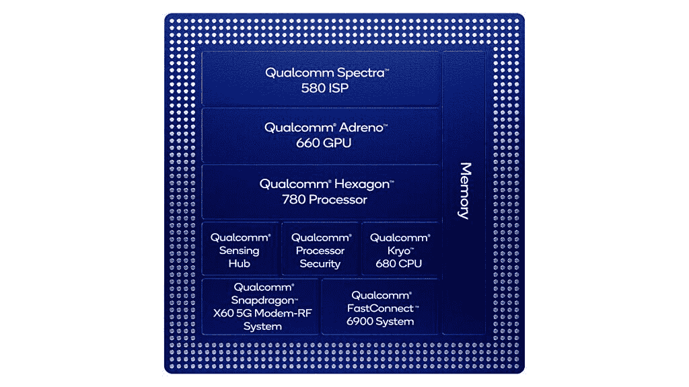
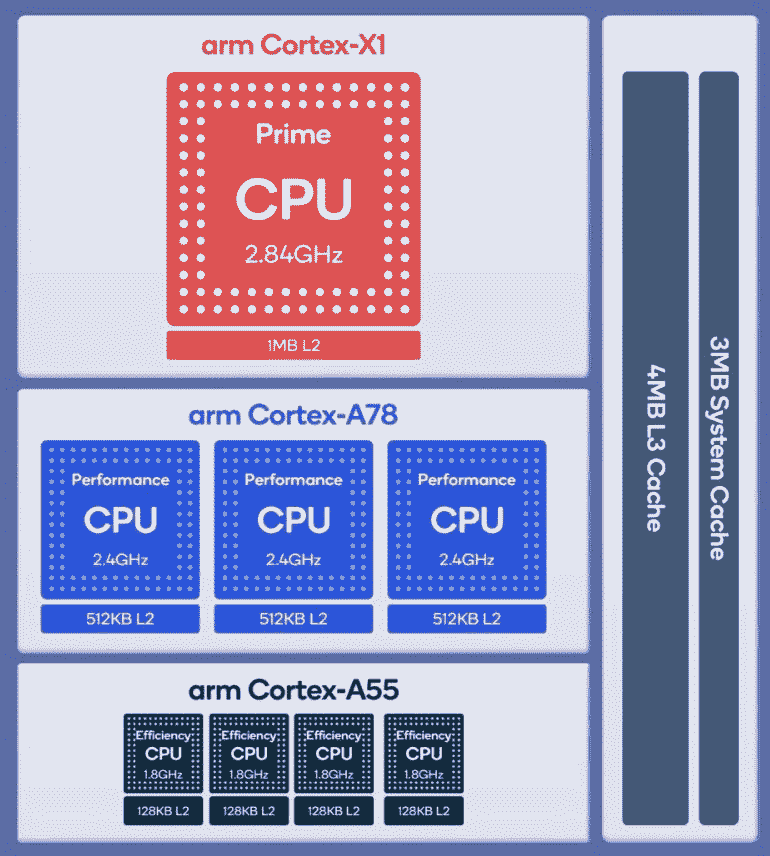
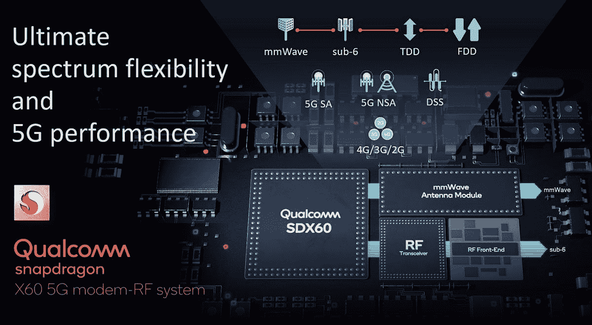
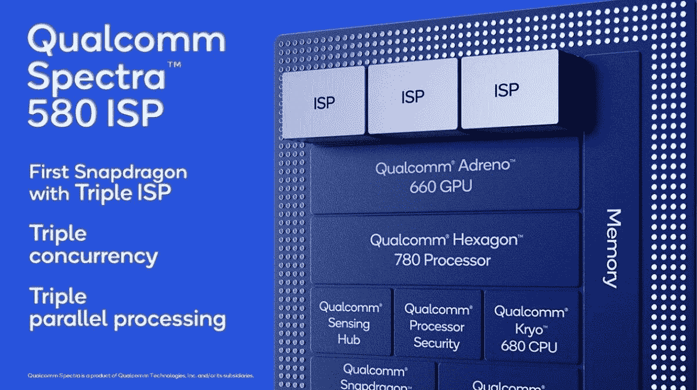
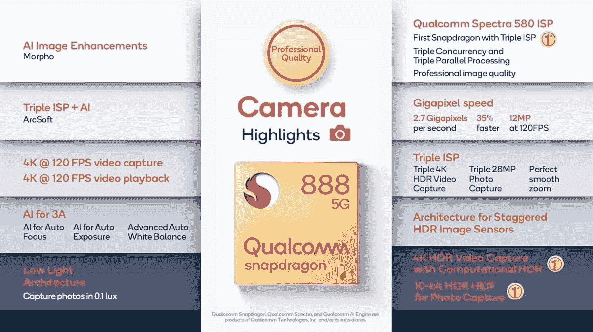
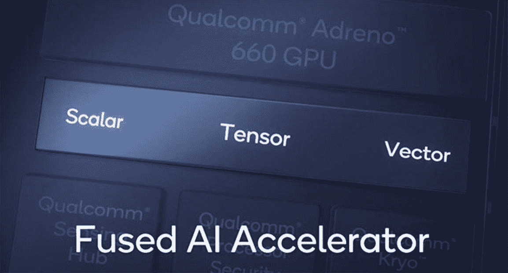
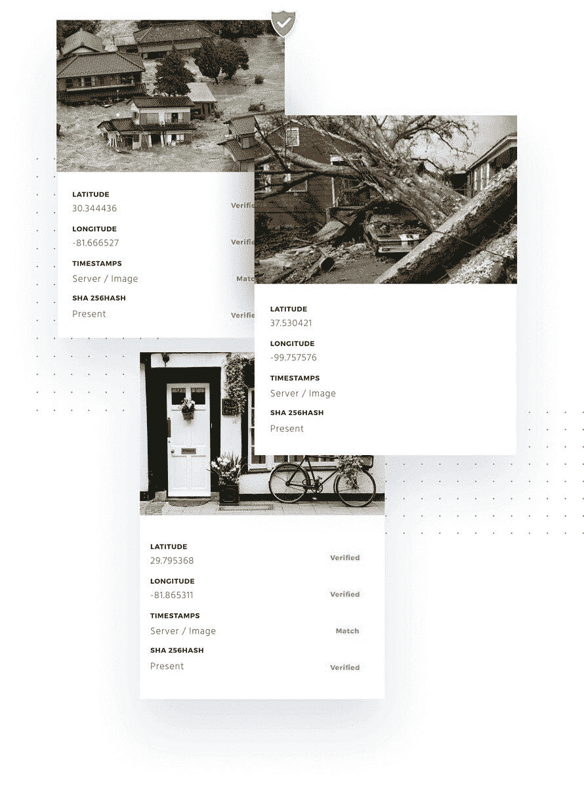

# 关于高通骁龙 888 你需要知道的一切

> 原文：<https://www.xda-developers.com/qualcomm-snapdragon-888-explained-specs-features/>

在年度科技峰会的第二天，高通发布了将为 2021 年大多数安卓旗舰提供动力的芯片。作为骁龙 865 的继任者，骁龙 888 正如预期的那样，在 CPU、GPU、DSP、ISP、调制解调器等方面带来了重大改进。它采用了新的 Kryo 680 CPU，Adreno 660 GPU，带有 Hexagon 780 DSP 的第六代 AI 引擎，Spectra 580 ISP， [Quick Charge 5](https://www.xda-developers.com/qualcomm-quick-charge-5-100w-fast-charging-launch/) ，以及[骁龙 X60](https://www.xda-developers.com/qualcomm-snapdragon-x60-modem-5g-smartphones/) modem-RF 系统。

骁龙 865 在 2020 年取得了成功，因为它出现在今年的大多数旗舰手机中，骁龙 888 将在其成功的基础上继续发展。高通已经确认 [14 家设备制造商将使用它制造智能手机](https://www.xda-developers.com/qualcomm-teases-snapdragon-888-confirms-14-oems-smartphones/)。让我们一个接一个地看看它的新特性，因为这里有很多东西需要解释。

 <picture></picture> 

Source: Qualcomm

* * *

## **目录**

1.  [CPU](#cpu)
2.  [GPU](#gpu)
3.  [调制解调器&连接性](#modem)
4.  [摄像机](#isp)
5.  [AI 引擎& DSP](#dsp)
    1.  [高通传感枢纽](#sensing)
    2.  [人工智能软件](#ais)
6.  [游戏](#gaming)
    1.  [高通游戏快速触摸](#quicktouch)
    2.  [可变比率阴影](#vrs)
7.  [安全](#security)
8.  [与骁龙 865 和 855](#comp) 的比较
9.  [完整规格&特性列表](#specs)
10.  [结论](#conclusion)

* * *

## 骁龙 888 CPU: Kryo 680

在过去的几年里，高通一直在提醒业界，它的 SOC 不仅仅是一个带 GPU 的 CPU。然而，CPU 和 GPU 仍然是 SoC 中最重要的领域。为此，骁龙 888 带来了新的 Kryo 680 CPU，**，据该公司称，这比骁龙 865 的 Kryo 585** 性能提高了 25%。25%的性能提升是由 CPU 核心架构中的 IPC 改进以及在更高效的 5 纳米工艺节点(预计但未证实是三星代工的 5 纳米 LPE 工艺)上制造的好处带来的。

骁龙 888 采用八核 CPU，1 个 Kryo 680 Prime，3 个 Kryo 680 Performance 和 4 个 Kryo 680 Efficiency 内核。DynamIQ 系统单元(DSU)具有 3MB 系统缓存和 4MB 三级缓存。

 <picture></picture> 

Source: Qualcomm

Kryo 680 Prime 核心采用了 [ARM Cortex-X1](https://www.xda-developers.com/arm-announces-cortex-x-custom-cpu-program/) ，这是 ARM 在 2020 年 5 月宣布的 Cortex-X 定制计划(CXC)下的第一个 CPU 核心。Cortex-X1 的具体目标是在 PPA 方面脱离 Cortex-A 系列，因为它旨在成为更大、更高性能、更耗电的内核。它的雄心勃勃的目标是在 A 系列中采用苹果定制的高性能内核。Cortex-X1 拥有 5 倍的解码宽度和更复杂的后端，代表了 ARM 迄今为止最雄心勃勃的大 CPU 内核，高通是第一个在骁龙 888 移动 SoC 中采用它的公司。

Prime core 的主频为 2.84GHz，这有点令人失望，因为这意味着 ARM 对 Cortex-X1 的 3GHz 主频预测不会再一次成为现实*，至少在最初是这样。它有 1MB 的 L2 缓存。尽管采用了 5 纳米工艺，但 Cortex-X1 Prime 内核的时钟速度与上一代 Cortex-A77 Prime 内核相同。高通在中期周期[骁龙 865 加](https://www.xda-developers.com/qualcomm-snapdragon-865-plus-launch/)刷新中将 Prime core 的时钟速度提高到 3.1GHz，所以这可能是新一代的卡上相同的东西。苹果 Firestorm 核心主频 2.89GHz-3GHz(视每核主频而定)，供参考。凭借其 IPC 优势，苹果 A14 仍将拥有单线程性能优势(更高的时钟速度+更高的 IPC)。ARM 已经缩小了差距，因为骁龙 888 应该可以与苹果 A13 竞争，不像 ARM 基本上落后两年的前几代产品，但差距仍然存在。*

 *三个 Kryo 680 性能核心采用了 [ARM 的 Cortex-A78](https://www.xda-developers.com/arm-announces-cortex-a78-cpu-mali-g78-gpu-ethos-n78-npu/) 设计。Cortex-A78 是更传统的 ARM 大内核，具有 4-wide 解码宽度，专注于该公司的传统优势 PPA。与 Cortex-A78 相比，它的 IPC 提高了 7%，由于采用 5 纳米工艺制造，性能提高了 13%。Cortex-A78 内核的主频为 2.4GHz，具有独立的 512KB L2 缓存。A78 的设计目标针对旗舰芯片中的中间内核功能。

最后，三个 Kryo 680 效率核心仍然基于老化的三年前的 ARM Cortex-A55 设计，因为 ARM 尚未宣布其小核心的继任者。这些内核的主频为 1.8GHz，具有独立的 128KB L2 缓存。这是苹果遥遥领先的另一个领域，因为 A14 的 Ice Storm little 内核比所有 Android 旗舰产品中的 Cortex-A55 内核快得多(4 倍)，也更节能(3 倍)。

在内存带宽方面，骁龙 888 支持最高 3200MHz 的 LPDDR5 内存，最高 2133MHz 的 LPDDR4 内存，最大 16GB RAM。

总的来说，骁龙 888 的 CPU 代表了高通稳步前进的一步。自 2016 年最初的 Kryo 核心以来，该公司没有做出任何定制的 CPU 核心，因此它依赖 ARM 向前迈进。1x Cortex-X1 + 3x Cortex-A78 组合似乎非常适合平衡性能和功耗，尽管单线程移动 CPU 性能冠军对于高通来说仍然遥不可及。Prime 内核的时钟速度有点保守，但这应该意味着降低功率水平。这更多地反映了苹果杰出的 CPU 内核，而不是对 ARM CPU 内核的控诉，ARM 的 CPU 内核在真空中仍然很棒。骁龙 888 在单线程 CPU 性能上应该比 A14 慢 25%左右。如果它确实实现了与 A13 单线程性能的对等，这意味着它可能会在 IPC 方面与英特尔的 Tiger Lake CPU 内核以及 AMD 的 Zen 2 内核并驾齐驱，甚至超越它们。

* * *

## 骁龙 888 GPU: Adreno 660

在 Android SoC 市场，高通凭借其定制的 Adreno GPUs 在 GPU 性能方面一直处于领先地位。曾经有一段时间，它也与苹果 A 系列中的 GPU 有竞争力，但自从 2017 年的苹果 A11 和苹果定制 GPU 开始以来，它在峰值或持续性能方面都无法跟上。相对于其在 Android SoC 市场的竞争对手，高通的 Adreno GPUs 仍然是同类最佳的，相比之下，ARM 的 Mali GPUs 的峰值性能、持续性能以及电源效率都较差。

因此，一方面，高通可以从容不迫，在安卓市场建立自己的领先地位。然而，苹果的 GPU 一直在变得越来越快，越来越有效率，而且它们的速度*比 Adreno GPUs 快得多*，以至于苹果 A14 的定制 GPU 基本上比骁龙 865 的 Adreno 650 GPU 领先两代。这就是高通需要对骁龙 888 的 GPU 进行重大改进的地方，但不幸的是，该公司并没有完全交付。

**骁龙 888 采用了新的 Adreno 660 GPU，其图形渲染速度比上一代产品快 35%。据说它的能效提高了 20%。高通的 Adreno GPUs 在很大程度上仍然是一个黑匣子，因为该公司没有透露许多细节。GPU 的命名意味着 Adreno 660 仍然不是高通有史以来最快的 Adreno GPU。相反，这一荣誉仍然属于 Adreno 680 GPU，它出现在 2019 年的[骁龙 8cx](https://www.xda-developers.com/qualcomm-snapdragon-8cx-always-on-always-connected-pc/) SoC 中，用于永远在线、永远连接的电脑。这不是苹果之间的比较，因为骁龙 8cx 不是为智能手机设计的，但它仍然表明，高通本可以将这一代的目标定得更高，以便与苹果竞争。**

事实上，这些数字意味着骁龙 888 中的 Adreno 660 在峰值和持续性能以及能效方面仍将低于苹果 A14 的四核 GPU。它甚至可能无法达到 A13 GPU 的最高性能，这意味着高通仍将落后两代。相对于预计将在即将到来的 Exynos 2100 SoC 以及下一款联发科天玑旗舰 SoC 中使用的 [Mali-G78](https://www.xda-developers.com/arm-announces-cortex-a78-cpu-mali-g78-gpu-ethos-n78-npu/) GPU，骁龙 888 仍将享有相当大的优势。因此，2021 年竞争激烈的 GPU 格局仍将保持不变:苹果将占据首位，并有相当大的空间，高通将在 Android SoC 市场占据首位，而采用 Mali GPUs 的旗舰 SoC 将占据底部。**adre no 660 在真空中表现出可观的 35%性能提升，但这不足以与苹果的 GPU 努力相提并论。**

在显示增强方面，Adreno 660 增强了有机发光二极管显示的均匀性，改善了画面质量，以及去 mura 和子像素着色。

* * *

## 骁龙 888 连接:集成骁龙 X60 调制解调器-RF 系统和 FastConnect 6900

**骁龙 888 带来了集成的 5G 调制解调器，这本身就是一个大新闻。**骁龙 865 去年是一个例外[，因为它没有集成的 4G 或 5G 调制解调器](https://www.xda-developers.com/qualcomm-snapdragon-865-processor-specifications-features/)，因为设备制造商被迫购买骁龙 X55 5G 调制解调器-RF 系统以及 SoC 来提供连接。这意味着旗舰和平价旗舰手机[在 2020 年](https://www.xda-developers.com/5g-push-unintentionally-killed-flagship-killer-this-year/)变得更加昂贵，因为 SoC 和 X55 调制解调器-射频系统[的综合价格高于骁龙 855](https://www.xda-developers.com/ditching-snapdragon-865-best-way-make-flagship-killer-2020/) 。这也导致了一个事实，即 2020 年大多数旗舰骁龙 865 手机都支持 5G，只有一些例外，如 iQOO 3 4G 和索尼 Xperia 1 II 的美国版本。

另一方面，有了骁龙 888，高通又回到了集成调制解调器。骁龙 X60 调制解调器-RF 系统于 2020 年 2 月宣布成为高通的第三代 5G 调制解调器，它接替了 X55。**对于设备制造商来说，集成的 5G 调制解调器应该会带来理论上的节能和更低的成本，但这是否会在实践中发挥作用还有待观察。**

 <picture></picture> 

Source: Qualcomm

早在二月份，我们就对骁龙 X60 进行了一次深度调查，所以读者应该去看看。简而言之，骁龙 X60 modem-RF 系统带来了跨 FDD 和 TDD 的 5G 载波聚合，这是 5G 调制解调器的第一次。毫米波的下行链路峰值速度提高到 7.5Gbps，6GHz 以下的下行链路峰值速度提高到 5Gbps，而上行链路峰值速度为 3Gbps。X60 具有全球 5G 多 SIM 卡，根据高通的说法，这是一个独特的功能。

骁龙 888 还配备了用于 Wi-Fi 和蓝牙的[高通快速连接 6900](https://www.xda-developers.com/qualcomm-fastconnect-6900-fastconnect-6700-wifi-6e-bluetooth-5-2-high-end-android-devices/) 系统。这是第一次在骁龙 865 加特色。它具有 Wi-Fi 6E、蓝牙 5.2、4K QAM、160MHz 频道和 4 流 DBS。这是第一个支持这些功能的移动连接系统。

* * *

## 骁龙 888 的 Spectra 580 ISP 的相机功能

在过去几年中，高通的 Spectra ISPss 已经取得了许多里程碑式的成就，自五年前开始运营以来，Spectra ISP 一直是双 ISP。 [Spectra 280](https://www.xda-developers.com/qualcomm-second-gen-spectra-isp-massive-improvements-smartphone-photography/) ISP 带来了对 10 位颜色深度 HDR 视频捕捉的支持，然后是骁龙 855 中的 [Spectra 380](https://www.xda-developers.com/qualcomm-spectra-380-isp-integrated-ai/) ISP 是世界上第一个 CV-ISP，2019 年，Spectra 480 ISP 拥有令人印象深刻的 2 千兆像素/秒处理速度。现在，Spectra 580 ISP 带来了相当多的重大飞跃，包括新的三 ISP 架构、35%的速度提升、对交错 HDR 传感器的支持等等。**这可能是 SoC 中最令人兴奋的新 IP，甚至超过 CPU。**

 <picture></picture> 

Source: Qualcomm

***推荐阅读:[高通如何通过其 Spectra ISPs 改善 Android 手机的拍照体验](https://www.xda-developers.com/qualcomm-camera-isp-snapdragon/)***

**Spectra 580 是首款配备三 ISP 的 Spectra，高通称其将专业图像质量提升到“下一个水平”。**它提供三重摄像头并发和三重并行处理。高通解释说，如今大多数旗舰手机都配备了至少三个后置摄像头，配有三种不同的镜头:超宽、广角和长焦。**三重并发使用户能够以 4K HDR 的质量同时从三台不同的摄像机录制视频。**它也适用于照片，三个 ISP 可以同时拍摄三张照片，每张 2800 万像素。

三倍并发将在相机之间缩放时提供更平滑的过渡。截至目前，当用户开始在双 ISP 上用广角(标准)相机拍摄时，高通不得不猜测他们是要放大长焦还是缩小超广角。该公司不再需要通过三重并发来实现这一点，因为它现在可以在后台运行所有三个摄像头，并立即切换到用户选择的摄像头。

Spectra 580 比 Spectra 480 快 35%，这意味着它现在可以每秒捕捉 2.7 千兆像素。高通用这个速度进行快速连拍。**现在，ISP 可以在一秒钟内以每张 12MP 的速度捕捉 120 张照片。**

**Spectra 580 的架构是为新型交错 HDR 图像传感器设计的。高通表示，它们将很快出现在智能手机中，并且有潜力“显著提高 HDR 的视频质量”。它解释了交错的 HDR 图像传感器输出单独的长、中和短曝光。当前的图像传感器在交错 HDR 可以捕捉三个图像的同时捕捉一个图像，所有图像都具有场景中不同亮部或暗部的细节。然后，Spectra 580 的三重并发可以将所有这些图像合并在一起，为用户带来一个具有“难以置信”动态范围的最终图像。这种技术在以前的 SOC 中已可用于照片捕捉，但对于骁龙 888，用户将首次使用计算 HDR 捕捉 4K·HDR 视频。**

照片拍摄也有所改进。Spectra 580 现在可以捕捉 HEIF 格式的 10 位色深的照片。用户将能够捕捉 10.8 亿种颜色的照片，高于 8 位色深的 1670 万种颜色。高通在这方面晚了四年，因为自 2016 年 iPhone 7 以来，苹果已经能够拍摄 10 位 HEIF 照片。然而，很高兴看到这个功能[将最终在 2021 年](https://www.xda-developers.com/oppo-find-x3-series-launch-2021-end-to-end-10-bit-color-support/)在旗舰 Android 手机上实现。高通指出，骁龙 865 增加了杜比视觉格式的视频捕捉，但截至目前，没有安卓手机支持杜比视觉捕捉或播放，这些功能仅限于苹果 iPhone 12 系列。不过，一些安卓手机[可以捕捉 HDR10](https://www.xda-developers.com/oneplus-8-pro-vs-samsung-galaxy-s20-plus-review-comparison/) 或 HDR10+格式的 4K·HDR 视频。

骁龙 888 设备将能够像骁龙 865 一样以每秒 120 帧的速度捕捉 4K。现在，他们也能够以 120fps 的速度播放这样的视频，以实现流畅的视频播放。

高通提到了从 3A 开始的专业质量照片的基本要素:自动对焦、自动曝光和自动白平衡。对于锐度，动态范围，色彩准确度，这些方面必须正确。该公司指出，它投入了“大量的时间和资源”来完善其 3A。Spectra 580 采用第 10 代 3A 算法。**这也是 3A 首次由 AI 驱动。**

该公司表示，其新的显著性自动对焦和自动曝光引擎“令人难以置信”，因为它们是使用配备眼球追踪的虚拟现实耳机构建的。它通过在 VR 中向人们展示图像并跟踪他们的眼睛来观察他们关注图像的哪一部分，来训练显著性自动聚焦和自动曝光神经网络。新的 3A 承诺使图像精度更好。

Spectra 580 ISP 还带来了新的弱光架构。**用户现在可以在 0.1 勒克斯(接近黑暗)下拍照。**这可能意味着减少对相机夜间模式形式的多帧图像堆叠的依赖，并重新强调零快门延迟。

骁龙 888 的相机体验也受益于其第六代人工智能引擎(下文将详细介绍)。第三方供应商 Arcsoft 已经展示了人工智能引擎如何改善相机体验。高通指出，在过去，傻瓜相机并不是字面意义上的傻瓜相机，因为用户必须选择他们想要聚焦的东西，然后放大和缩小以框住他们的照片和视频。三 ISP 现在总是捕捉视频，Arcsoft 将使用 ISP 和 AI 引擎来自动跟踪和放大缩小，这将实现傻瓜相机范式的真正承诺。

最终，高通声称，由于 Spectra 580 ISP，骁龙 888 智能手机将成为专业品质的相机。如果这些说法成真，我们可能会在 2021 年看到显著改进的 Android 智能手机摄像头。

 <picture></picture> 

Source: Qualcomm

* * *

## 人工智能和机器学习:第六代人工智能引擎和 Hexagon 780 DSP

与其他供应商不同，高通没有使用术语“神经处理单元”、“人工智能处理单元”或“神经引擎”。相反，自骁龙 855 以来，它一直使用“人工智能引擎”术语，[包括 CPU、GPU 和 DSP](https://www.xda-developers.com/qualcomm-gary-brotman-ziad-asghar-ai-snapdragon-855-hexagon-690-dsp/) 。该公司一直在稳步提高其人工智能和人工智能能力，在骁龙 855 中引入了[张量加速器，并在](https://www.xda-developers.com/qualcomm-snapdragon-855-performance-gaming-ai-improvements-explained/)[骁龙 865 第五代人工智能引擎](https://www.xda-developers.com/qualcomm-snapdragon-865-ai-performance-machine-learning-analysis/)中处理所有人工智能的实时翻译。现在，随着骁龙 888 的推出，第六代人工智能引擎提供了 26 TOPS(每秒万亿次运算)的性能。相比之下，上一代骁龙 865 交付了 15 顶，而苹果 A14 交付了 11 顶，所以这是一个伟大的成就。

骁龙 888 的第六代人工智能引擎更加强大和复杂。它的核心是 Hexagon DSP。今年，高通将推出 Hexagon 780 DSP，这是一款完全重新设计的产品，具有该公司多年来在架构和性能方面的“最大飞跃”。该公司将其称为融合人工智能加速器架构。在前几代中，它使用标量、矢量和张量加速器。对于骁龙 888，该公司已经消除了加速器之间的物理距离，并将它们融合在一起，因此现在一切都在一个大型人工智能加速器上。它还在三个不同的加速器之间添加了专用的大型共享内存，用于高效地共享和移动数据。共享内存是其前身的 16 倍，这意味着加速器之间的硬关闭时间在纳秒范围内-在某些用例中，它的速度高达 1000 倍。

 <picture></picture> 

Source: Qualcomm

高通也对加速器本身进行了改进。标量加速器比骁龙 865 快 50%,而张量加速器比后者快 2 倍。六边形矢量扩展(HVX)现在支持额外的数据类型。

人工智能引擎的其他部分也获得了升级，因为 Adreno 660 GPU 现在提供了 43%的人工智能性能提升，并包括新的指令集，如 4 输入混合精度点积和波矩阵乘法，以实现更快的浮点计算。

高通指出，26 TOPS 是手机上最高的 TOPS 性能。功耗也是超低的，因为 Hexagon 780 DSP 的性能功耗比比上一代快 3 倍。

今年，该公司展示了一个全新的人工智能用例，它充分利用了第六代高通人工智能引擎:俄罗斯方块。AI 的超级电影 app。例如，用户可以删除一个角色，将自己置身于他们录制的电影场景或视频中，并与其中的其他角色进行互动。他们甚至可以在开始表演和录制之前，在预览模式下实时看到这一点。高通人工智能引擎正在运行并加速俄罗斯方块。AI 的视频实例分割和融合算法，30 fps，高达 4K 分辨率。

### 第二代高通传感中心

骁龙 888 引入了该公司的第二代高通传感中枢。高通增加了一个专用的永远在线的低功耗人工智能处理器，它声称由于它，人工智能性能提高了 5 倍。传感集线器上额外的人工智能处理能力使其能够卸载通常由 Hexagon DSP 处理的高达 80%的工作负载，从而节省电能。传感集线器上的所有处理的功耗都不到 1mA。该公司还与谷歌及其 TensorFlow 微框架合作，让开发人员更容易访问传感中心，以便可以在传感中心的 Hexagon DSP 和 AI 处理器上进行优化和加速。

Sensing Hub 还有一个新特性，它能够收集和解读来自所有不同内核的数据，并创建上下文感知用例。高通第一次能够收集 5G、Wi-Fi、蓝牙和位置流等连接数据。由于传感中枢的存在，新的始终在线和上下文感知的用例将得以实现。高通给出了一个音频分析工作的例子，这将使用户的手机能够识别他们周围的声音，从而实现诸如使铃声音量与他们的环境相匹配的功能。

### 人工智能软件

高通已经完全加强了它的人工智能软件，在这方面它一直处于优势地位。它是第一个以[高通神经处理 SDK](https://www.xda-developers.com/snapdragon-neural-processing-engine-sdk-now-available-on-qualcomm-developer-network/) 的形式商业化设备上人工智能 SDK 的公司，该 SDK 现在为全球超过 5 亿部 Android 手机提供人工智能体验。今年，SDK 的改进包括支持更多型号，以及在由骁龙 888 驱动的笔记本电脑上扩展对 Windows 10 AI 用例的支持。

该公司指出，它在骁龙 865 上推出了 Hexagon NN Direct，让开发人员可以从他们的应用程序中直接访问 Hexagon。第六代人工智能引擎在这里进行了重大升级，因为它在整个移动平台上带来了直接的 API。高通推出了新的人工智能引擎 AI Engine Direct，扩展并增强了其人工智能软件解决方案的功能，不仅为 Hexagon DSP，还为 GPU 和 CPU 提供了直接访问硬件的能力。

AI Engine Direct 已经从头开始构建，旨在为整个骁龙平台带来一个统一的 AI API。向下兼容第五代 AI 引擎。高通还专注于模块化和可扩展性，因为它扩展了用户定义的运营商概念，为开发人员带来了创建人工智能解决方案的新功能。

骁龙 888 见证了高通与拥抱脸合作的开始，拥抱脸被称为“创新”国家语言处理 NLP 解决方案的领导者。高通正在使用人工智能引擎来启用和加速强大的 NLP 库，拥抱面部变形器，以提高精确度和响应能力，用例包括电子邮件应用程序中的自动完成建议，人工智能语音助手的改进，以及更快更准确的语言翻译应用程序。

高通解释说，2019 年，作为第五代高通人工智能引擎的一部分，它引入了用户定义的运算符的概念。这使得开发人员能够在 OpenCL 中编写自定义操作符，或者使用高通 Hexagon SDK，然后将它们插入高通神经处理 SDK。然而，即使对于已经熟悉 Hexagon 的开发人员来说，开发人员也经常需要用低级语言编写复杂而冗长的例程来创建操作符。为了纠正这一点，高通扩展了 TVM，这是一个支持 Hexagon 的人工智能加速器开源编译器。自定义操作符现在可以用几行简短的 Python 语言编写，然后针对 Hexagon 编译，并直接插入高通 AI Engine direct 框架。

最后，该公司还增加了对人工智能模型效率工具包(AIMET)的额外支持，以更好地量化网络，而精度损失很少或没有损失，使用 Adaround 等后训练技术，以及带有范围学习的量化感知训练。它还包括对 RNN 和 LSTM 网络的支持。随着对混合精度网络的支持，开发人员将能够在保持精度的同时最大限度地权衡功耗和性能。正如它对 TVM 所做的那样，它在 Github 上开源了 AIMET，并邀请其研究人员进行合作。

高通正在继续与 Snapchat 合作，在其流行的镜头上启用 AIMET。Snapchat 正在使用 AIMET 量化其人工智能镜头模型的阵列，以提高人脸检测的准确性和性能。

* * *

## 骁龙 888 上的骁龙精英游戏功能

高通指出，全球估计有 26 亿手机游戏玩家，据估计，与一年前相比，游戏玩家玩的游戏数量增加了 25%。它提到了自己的移动游戏成就，包括将顶级 AAA 游戏带到移动设备，以高达 144fps 的高帧速率提供流畅的游戏，移动游戏中的真正 10 位 HDR，以及率先将桌面级功能(如每游戏可更新的 GPU 驱动程序)带到移动平台。该公司首先推出了骁龙 855 的[骁龙精英游戏](https://www.xda-developers.com/qualcomm-snapdragon-855-snapdragon-elite-gaming-3d-sonic-sensor/)软件功能。

该公司指出，Adreno 660 GPU 是其游戏体验的核心。它专注于长时间的持续性能，同时实现了图形渲染速度的最大飞跃(35%)。宣布的两个新功能是高通游戏快速触摸和可变速率阴影(VRS)。

### 高通游戏快速触摸

认识到触摸响应时间的重要性，骁龙 888 推出了高通游戏快速触摸。这是一个新功能，大大减少了触摸延迟。高通指出，触摸延迟取决于许多因素，如游戏显示垂直同步的时序及其帧提交。由于繁重的游戏工作负载，游戏可能会错过垂直同步截止日期，从而导致帧延迟，进而影响触摸事件的延迟。游戏快速触摸在毫秒级进行了优化，以避免这些延迟，使游戏体验更快的响应时间。

高通表示，其实验室测试表明，游戏快速触摸可以减少触摸延迟高达 20%。运行速度甚至达到 120fps 的游戏将会改善触摸响应时间，并且该技术将自动支持任何游戏，这将为所有游戏提供专业玩家级别的体验和改进。

 <picture></picture> 

Visual demonstration of touch latency reduction via Qualcomm Game Quick Touch. Source: Qualcomm

### 可变比率着色(VRS)

高通宣布，骁龙精英游戏首次将可变速率阴影(VRS)引入移动设备。到目前为止，VRS 仅在 PC 和次世代主机(PS5、Xbox 系列和 S 系列)上可用。VRS 由 Adreno 660 GPU 提供支持，它有助于减少 GPU 工作负载，同时为游戏提供“显著增强”。下一代移动游戏将运行得更快，分辨率更高，同时仍然保持高视觉保真度。

VRS 是什么意思？高通解释说，当渲染一帧时，GPU 对每个像素执行着色器程序来计算其颜色。例如，在当今的 AAA 游戏中，显示器上有 360 万像素被遮蔽。VRS 允许开发人员指定着色器程序只在两个或四个像素的组中运行一次，然后为周围的像素重用这些颜色结果。这意味着开发人员可以仅使用 140 万像素来着色整个帧，从而提高 40%的效率，同时大大减少 GPU 的工作负载，从而实现更大的节能。

通过 VRS 减少了 GPU 的工作负载，但这并不意味着图形保真度会降低-它将保持不变。游戏的游戏性能将比之前的骁龙 SoC(高通没有具体说明是哪种 SoC)提高 30%，同时运行更平稳，时间更长，功耗更低。最终游戏？开发者将有更多的空间来使用硬件，他们可以为下一代移动游戏创造更大的体验。高通指出，最终，其骁龙精英游戏的使命是将移动设备转变为强大的游戏机。

* * *

## 安全性

在安全功能方面，骁龙 888 采用了新的 Type-1 虚拟机管理程序，提供了一种新的方法来保护和隔离同一设备上的应用程序和多个操作系统之间的数据。它可以在隔离的操作系统之间即时切换，并且每个应用程序都有一个隔离的操作系统，性能不会下降。

骁龙 888 的安全措施包括高通安全处理单元、高通可信执行环境(TEE)和对高通无线边缘服务的支持，这是一种云服务，芯片可以与应用和服务进行交互，以实时测量设备及其无线连接的安全性。骁龙 888 为所有虚拟机提供沙盒，并在 EL2 级别提供低于操作系统级别的隔离。

骁龙 888 是世界上第一款符合 CAI 标准的智能手机相机。在与 Truepic 的合作中，该芯片可以捕捉符合开放内容真实性倡议标准的加密密封照片。

 <picture></picture> 

Verifiable metadata of images captured using Truepic's technology. Source: [Truepic](https://truepic.com/)

* * *

## 对比:骁龙 888 vs 骁龙 865 vs 骁龙 855

|  | 

高通骁龙 855

 | 

高通骁龙 865

 | 

高通骁龙 888

 |
| --- | --- | --- | --- |
| **发布日期** | 2018 年 12 月 5 日 | 2019 年 12 月 4 日 | 2020 年 12 月 2 日 |
| **CPU** |  |  |  |
| **GPU** |  |  |  |
| **显示** |  |  |  |
| **艾** |  |  |  |
| **记忆** |  |  |  |
| **ISP** |  |  |  |
| **调制解调器** |  |  |  |
| **充电** | 高通快充 4+ (27W) |  | 高通快充 5 ( **100W+** ) |
| **连通性** |  |  |  |
| **制造过程** | 7 纳米(TSMC 的 N7) | 7 纳米(TSMC 的 N7P) | 5nm(三星的 5LPE) |

* * *

## 高通骁龙 888 的全部规格和功能

### 完整的功能列表。单击以展开。

**人工智能**

*   Adreno 660 GPU
*   Kryo 680 CPU
*   Hexagon 780 处理器
    *   融合人工智能加速器
        *   六边形张量加速器
        *   六边形向量扩展
        *   六边形标量加速器
*   高通传感中心(第二代)

**5G 调制解调器-射频系统**

*   骁龙 X60 5G 调制解调器-射频系统
    *   5G 毫米波和 6 GHz 以下，独立(SA)和非独立(NSA)模式，FDD、TDD
    *   动态频谱共享
    *   毫米波:800 MHz 带宽，8 个载波，2x2 MIMO
    *   低于 6 GHz: 200 MHz 带宽，4x4 MIMO
    *   高通 5G 节能
    *   高通智能传输技术
    *   高通宽带包络跟踪
    *   高通信号增强自适应天线调谐
    *   全球 5G 多 SIM 卡
*   下行链路:最高 7.5 Gbps
*   上行链路:最高 3 Gbps
*   多模支持:5G NR、LTE，包括 CBRS、WCDMA、HSPA、TD-SCDMA、CDMA 1x、EV-DO、GSM/EDGE

**Wi-Fi &蓝牙**

*   快速连接 6900 系统
    *   Wi-Fi 标准:Wi-Fi 6E、Wi-Fi 6 (802.11ax)、Wi-Fi 5 (802.11ac)、802.11a/b/g/n
    *   Wi-Fi 频段:2.4 GHz、5 GHz、6 GHz
    *   峰值速度:3.6 Gbps
    *   信道利用率:20/40/80/160 MHz
    *   8 流探测(用于 8×8 MU-MIMO)
    *   MIMO 配置:2x2 (2 流)
    *   MU-MIMO(上行链路和下行链路)
    *   4K·卡姆
    *   OFDMA(上行链路和下行链路)
    *   双频同步(2x2 + 2x2)
    *   Wi-Fi 安全性:WPA3-企业级、wpa 3-增强型开放式、wpa 3 轻松连接、wpa 3-个人级
*   集成蓝牙
    *   蓝牙版本:蓝牙 5.2
    *   蓝牙功能:乐音频功能(一对多广播)，双蓝牙天线
    *   蓝牙音频:高通 aptX 语音音频，用于清晰的语音通话；aptX 自适应音频，用于稳定、低延迟、高质量的音频；高通 TrueWirelessTM 镜像

**摄像机**

*   高通光谱 580 图像信号处理器
    *   三路 14 位 ISP
    *   高达每秒 2.7 千兆像素的计算机视觉 ISP (CV-ISP)
    *   高达 200 万像素的照片拍摄
    *   高达 2800 万像素的三摄像头，30 帧/秒，零快门延迟
    *   高达 64+25 MP 双摄像头，30 FPS，零快门延迟
    *   高达 8400 万像素的单摄像头，30 帧/秒，零快门延迟
*   建议。2020 色域照片和视频捕捉
*   高达 10 位色彩深度的照片和视频拍摄
*   10 位 HDR HEIF 照片捕捉
*   4K 视频捕捉+6400 万像素照片
*   8K 视频捕捉，每秒 30 帧
*   以 720p @ 960 FPS 的速度拍摄慢动作视频
*   HEIF: HEIC 照片捕捉，HEVC 视频捕捉
*   视频采集格式:HDR10+，HDR10，HLG，杜比视觉
*   4K 视频捕捉@ 120 FPS
*   4K·HDR 用肖像模式拍摄视频(散景)
*   多帧降噪(MFNR)
*   实时对象分类、分割和替换
*   局部补偿多帧降噪
*   多框架和交错的 HDR 传感器支架
*   微光摄影建筑
*   视频超分辨率
*   基于人工智能的自动对焦和自动曝光
*   具有深度学习过滤器的高级基于硬件的人脸检测

**音频**

*   用于硬件加速语音信号处理的六边形语音辅助加速器
*   高通 AqsticTM 音频编解码器(最高支持 WCD9385)
*   总谐波失真+噪声(THD+N)，回放:-108dB
*   原生 DSD 支持，PCM 最高 384 kHz/32 位
*   可定制的“金耳朵”过滤器
*   全新高通 Aqstic 智能扬声器放大器(高达 WSA8835)

**显示**

*   设备上显示支持:
*   最大外部显示器支持:高达 4K @ 60 赫兹
    *   10 位颜色深度。2020 色域
    *   HDR10 和 HDR10+
*   有机发光二极管均匀性的延迟和子像素着色

**CPU**

*   Kryo 680 CPU
    *   高达 2.84GHz，采用 Arm Cortex-X1 技术
    *   64 位架构

**视觉子系统**

*   Adreno 660 GPU
    *   Vulkan 1.1 API 支持
    *   HDR 游戏(10 位色深，录制。2020 色域)
    *   基于物理的渲染
    *   API 支持:OpenGL ES 3.2，OpenCLTM 2.0 FP，Vulkan 1.1
    *   硬件加速的 H.265 和 VP9 解码器
    *   支持 HDR10+、HDR10、HLG 和杜比视界的 HDR 回放编解码器

**安全**

*   平台安全基础、可信执行环境和服务、安全处理单元(SPU)
*   高通无线边缘服务(WES)和高级安全功能
*   高通 3D 声波传感器和高通 3D 声波最大值(指纹传感器)
*   高通 1 型虚拟机管理程序

**充电**

*   高通快速充电 5 技术

**位置**

*   GPS、Glonass、北斗、伽利略、QZSS、NavIC capable 和 SBAS
*   双频支持
*   低功耗地理围栏和跟踪、传感器辅助导航
*   近场通信(NFC):支持

**内存**

*   支持高达 3200 MHz 的 LP-DDR5 内存
*   支持高达 2133 MHz 的 LP-DDR4x 内存
*   内存密度:高达 16 GB

**通用规格**

*   全套骁龙精英游戏功能
*   5 纳米工艺技术
*   USB 版本 3.1；USB 类支持
*   零件号:SM8350

* * *

## 初步结论

高通表示，以骁龙 888 为特色的设备预计将在 2021 年第一季度上市。我们可以期待下个月推出的首款搭载该功能的旗舰手机是小米 Mi 11，而 Galaxy S21 系列的骁龙版本也不会太远。Realme Race、OPPO Find X3 系列和[一加 9 系列](https://www.xda-developers.com/oneplus-9-reportedly-launching-earlier-than-expected-next-year/)等手机预计将分别于 2021 年 2 月和 3 月推出。

骁龙 888 是高通向前迈出的一大步。是的，它在 CPU 性能和 GPU 性能上都被芯片行业的新巨头苹果公司所掩盖和超越。然而，正如高通不断提醒我们的，一个伟大的芯片不仅仅是 CPU 和 GPU。高通这一代的资源已经花在了 AI 引擎和 Spectra ISP 上，这两个领域的改进看起来都很有希望。如果我们将自己局限于 Android SoC 市场，很难看到 2021 年骁龙 888 不是最好的 Android 旗舰 SoC。Exynos 2100 预计将在 CPU 性能上实现巨大飞跃，但根据时钟速度，即使在最好的情况下，两个芯片也将大致持平。高通在 GPU 性能方面仍然遥遥领先于三星和联发科，因为三星在 2022 年之前不会转向 AMD 的 RDNA GPU 架构。此外，在人工智能软件方面，高通似乎仍处于领先地位。

总的来说，支持以 0.1 勒克斯拍摄照片，144 赫兹显示器，骁龙精英游戏，以及有意义的新软件功能，很难证明高通只是在追求数字。相反，该公司继续表现出对现实世界表现的令人钦佩的关注。*