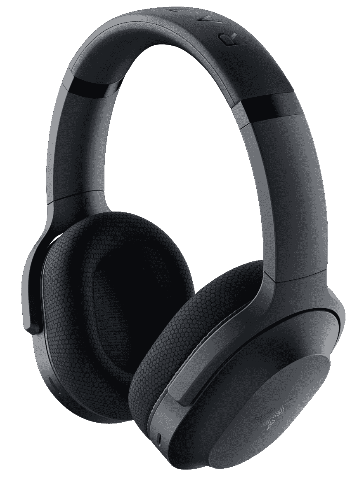

# Razer Barracuda 混合了游戏耳机和高级耳机

> 原文：<https://www.xda-developers.com/razer-barracuda-review/>

选择[最佳游戏耳机](https://www.xda-developers.com/best-gaming-headset/)可能有点像雷区。坦率地说，有太多的选择，有适合每个预算和每个需求的东西。Razer 一个人可能会找到适合你的东西，这可能只是它的最新版本。

Razer Barracuda 是一个由三个耳机组成的家族，有一个预算模型加入了两个高端产品。我们这里有一个是三个中间的，只是被称为 Razer Barracuda。梭鱼 X 是预算模型，而梭鱼专业是所有唱歌所有跳舞的头条行为。

但对大多数人来说，甜蜜点将是这个。这是一款无线耳机，包装了 Razer 最新和最棒的产品，并具有几个真正重要的生活质量功能，这些功能本身就足以让您物有所值。梭鱼感觉像是雷蛇 Opus 耳机的游戏化版本，这也是这款耳机如此出色的原因。

 <picture></picture> 

Razer Barracuda

##### 雷蛇梭鱼

Razer 最新的无线耳机比以往任何时候都更加模糊了游戏和普通耳机之间的界限。

**浏览此评论:**

## Razer Barracuda 的定价和供货情况

从 5 月 31 日起，Razer Barracuda 可以从 Razer 自己的商店以及百思买等第三方商店订购，价格为 160 美元。如果你对 Barracuda X 或 Barracuda Pro 感兴趣，也可以从 5 月 31 日起从相同的零售商那里订购。

梭子鱼 X 的价格为 100 美元，而旗舰型号梭子鱼 Pro 是所有型号中最贵的，价格为 250 美元。这三个都可以跨平台使用，尽管没有一个支持 Xbox 所需的必要无线协议。

## Razer Barracuda 规格

|  | 

雷蛇梭鱼

 |
| --- | --- |
| **频率响应** |  |
| **驱动程序** | 

*   定制的动态 50 毫米驱动器

 |
| **连接类型** | 

*   Razer 超高速无线 USB-C 加密狗
*   蓝牙 5.2
*   3.5 毫米

 |
| **耳垫** | 

*   流动针织织物
*   记忆泡沫

 |
| **麦克风频率响应** |  |
| **麦克风拾音模式** |  |
| **THX 空间音频** | 

*   在 Windows 10 64 位及更高版本上受支持

 |
| **电池寿命** |  |
| **重量** |  |
| **价格** |  |

***关于这篇评论**:这篇评论是在对 Razer 提供的 Razer Barracuda 进行了大约一周的测试后撰写的。Razer 在这篇文章中没有任何投入。*

## 设计和特点:从 Opus 剧本中吸取经验

*   微妙的设计，灵感来自 Opus 耳机。
*   没有 RGB！
*   通过 USB-C 加密狗或蓝牙 5.2 支持 2.4GHz 以上的无线传输

我用过很多 Razer 耳机。虽然它们通常是非常好的耳机，但它们看起来也完全像游戏耳机。我也有一副 [Razer Opus X](https://www.xda-developers.com/razer-opus-x-review/) 耳机，我非常喜欢，不仅仅是因为它们是亮绿色的。Razer 在音频方面做得很好，但是没有人再想头上顶着北海巨妖去户外了。

因此，与 Opus 并排，你可以看到 Razer 的设计方向。这是一款游戏耳机，看起来更像一套高级耳机，而不是花哨的“看着我”的 RGB 和巨大的耳罩。事实上，除了电源 LED 以外，Barracuda 上没有任何东西会亮起。这款游戏耳机优雅而精致，我非常喜欢。

它比雷蛇黑鲨 V2 稍微重一点，但不是你所说的重。它大部分是由坚固的无光泽塑料制成的。有点指纹，但是很结实。实际上，我会说，梭鱼的整体感觉比我每天戴的 ATH 音频技术公司的 M50X 耳机更好，价格也差不多。

除了雅致的设计，Razer 为使 Barracuda 更适合非游戏目的而做的另一件大事是移除了一个突出的麦克风。它不会脱离或缩回，或挂在你脸的一边，它不存在。梭鱼上仍然有一个麦克风，但它只是耳罩的永久组成部分。再一次，当你戴上 Opus 耳机时，只会更好。这毕竟还是一款游戏耳机。

Razer Barracuda 还因无线支持几乎所有可以想象的平台而获得额外加分。除了 Xbox。你不能在 Xbox 上无线上网，但 Razer 包括一根 3.5 毫米的电缆，所以你可以将其连接到你的控制器上。对于无线应用，你有两种选择，你可以无缝地使用它们。

第一种是老式蓝牙，非常适合连接移动设备或任天堂 Switch。第二个是 Razer 的 HyperSpeed wireless，带有一个小小的 USB-C 加密狗，支持 PC，PlayStation 5(和 PS4，如果你使用 USB-A 到 USB-C 适配器电缆)，USB-C 功能的手机和平板电脑，甚至，请敲鼓，谷歌 Stadia。

从整体来看，最后一个是一个令人高兴的巧合，Razer 肯定没有在盒子上提到它。但是 Barracuda 是极少数使用 USB-C 加密狗的耳机之一，这意味着你可以将它连接到 Stadia 控制器上，用于游戏音频和麦克风。这绝对是一种享受。得益于 Razer SmartSwitch，只需双击耳机上的专用按钮，即可在加密狗和蓝牙之间切换。

不过，梭鱼确实是一款适合各种场合的游戏耳机。当然，Xbox 的第一方无线协议意味着你必须像动物一样使用你的 X 系列电缆，但 Razer 没有排除任何人。这是目前最跨平台友好的现代游戏耳机之一。

## 游戏、电影和音乐的高品质声音

*   集成麦克风，而不是传统的吊杆式麦克风。
*   麦克风质量有点差。
*   音质非常好，有大量的定制。
*   面向 Windows PC 用户的 THX 空间音频。

声音是 Razer Barracuda 和更昂贵的 Barracuda Pro 之间最大的差异。额外的 90 美元为亲网你混合 ANC，额外的 THX 善良，和改进的司机。

不过，普通梭鱼也不算懒。Razer 使用其 TriForce Titanium 50mm 毫米驱动器为耳机供电，在 PC 上也可以获得 THX 空间音频。这对于 Barracuda 来说并不新鲜，但它是区别于普通耳机的标志性特征之一。

你可以在桌面上定制 Razer Synapse 的常用设置，但也有一个移动应用程序可以在智能手机上根据你的喜好进行调整。THX 空间音频需要 Synapse 才能工作，但它会很高兴地坐在后台。

就声音而言，我印象深刻。这是一段时间以来第一款耳机，我花了可能比游戏更多的时间来测试音乐和电影，它经得起 Opus 耳机的考验。

声音强大而清晰，如果你想要的话，自然有很多低端。说到游戏，空间音频提供了出色的方向信息，声场整体令人印象深刻。它身临其境，传递每一个爆炸和射击的砰砰声，同时也轻松处理更微妙的声音。赛车游戏中的音频看起来是如此清晰，这给我留下了特别深刻的印象。例如，在 F1 比赛中，很清楚特定的噪音来自赛车的哪一侧。

我会说这是一个从 Razer 的一些旧耳机整体改进的声音，我当然会把它放在层次结构中的北海巨妖之上。梭鱼比大多数鱼更擅长处理音乐，这一事实给了它明显的优势。

过去，麦克风质量一直是我对 Razer 耳机最挑剔的地方，所以我承认有些担心。唉，这仍然是 Razer Barracuda 最薄弱的地方。声音足够清晰，但听起来像是你在打电话。开箱即用，没有额外的设置可能是你想离开它，我发现添加甚至噪音消除会使质量进一步下降。对于内容创作者来说，这肯定不是，但对于聚会聊天，甚至电话，这是有用的。您的好友会听到您的声音，但对于任何质量，您仍然需要一个专用的麦克风。耳机的其余部分都这么好，真可惜。

在这个示例剪辑中，您可以亲自查看一下。

https://w.soundcloud.com/player/?URL = https % 3A//API . soundcloud . com/tracks/1278472726 & color = % 235 b 5959 & auto _ play = false & hide _ related = false & show _ comments = true & show _ user = true & show _ reposts = false & show _ teaser = true & visual = true

## 谁应该买雷蛇梭鱼？

*   如果你在 PC、手机、任天堂 Switch 甚至是体育场上玩，你应该买 Razer Barracuda
*   如果你是 Xbox 玩家，你不应该买 Razer Barracuda，因为它不支持正确的无线协议。
*   梭鱼为那些想要一副无线音乐耳机的人提供了双重功能。

Razer Barracuda 是一款非常有趣的游戏耳机。一方面，它很舒适，听起来很棒，电池续航时间长达 40 小时。竞技游戏玩家会喜欢 THX 空间音频，每个人都会喜欢将这款耳机作为一副普通耳机使用，而不会看起来像个傻瓜。

额外的兴趣在于 Razer 对几乎所有平台的支持，包括一个很容易被视为意外的平台。USB-C 是新标准，加密狗上的简单功能意味着您可以从几乎任何设备获得最佳的无线音频性能。抱歉，Xbox。

如果我挑的话，我希望它颜色浅一点，耳朵宽一点。确定麦克风是否静音也有点困难。静音按钮很浅，不能立即看出它处于哪种状态。每次静音/取消静音时，如果耳朵里有一些音频反馈会很方便，这样你就能确定你刚才做了什么。尤其是因为你用 SmartSwitch 得到了这样的音频反馈。当然，如果话筒质量很重要，你要么需要一个专用话筒，要么去别处找。雷蛇，拜托，做好点的耳机麦克风。

对于一款游戏耳机来说，160 美元不是一笔微不足道的投资，但我认为这款耳机物有所值。这是一个了不起的全能，除非你绝对需要 ANC，节省 90 美元的梭鱼专业和抢购这一个代替。梭鱼证明了你**可以**购买一个游戏耳机，并把它作为你的日常无线耳机使用。

 <picture></picture> 

Razer Barracuda

##### 雷蛇梭鱼

一款出色的游戏耳机，兼具高级无线耳机的功能，音质卓越，设计精致优雅。