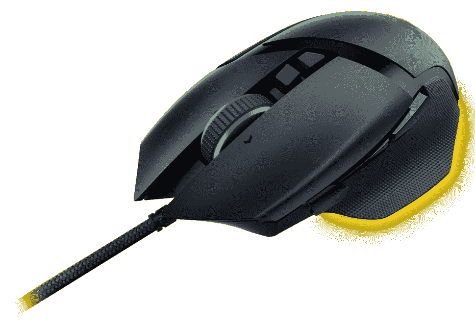

# Razer 推出 Basilisk V3 鼠标，提供更多定制选项

> 原文：<https://www.xda-developers.com/razer-basilisk-v3-mouse-with-cusotmization-options/>

Razer 今天发布了 Basilisk V3，这是其最新的右手游戏鼠标，具有广泛的定制选项。除了可编程按钮，Basilisk V3 的一大新功能是其支持倾斜的滚轮。

这意味着你现在可以通过向任一侧倾斜滚轮向四个不同的方向滚动。Razer 称之为 HyperScroll 倾斜轮，四向滚动并不是所有的新功能。对于垂直滚动，您可以选择想要织物感、平滑滚动还是适应您滚动速度的自动模式。如果你滚动得很慢，你会感觉到每一步都有咔哒声，但当你加速时，轮子会平稳地旋转，类似于罗技鼠标上的 MagSpeed 轮子。

 <picture></picture> 

Razer Basilisk V3

使用 Razer 的 Synapse 软件，您还可以启用虚拟加速，这可以在您快速旋转滚轮时提高滚动速度。如果您使用过触摸板，这应该与您快速滑动触摸板进行滚动的感觉类似。

继续说按钮，在 Basilisk V3 上总共有 11 个，你可以用 Razer Synapse 完全定制它们。按钮包括主要的左右按钮、滚轮按钮(和两侧的按键)、滚轮下方的两个按钮和右侧的三个按钮。Razer 为你提供了一些游戏甚至微软 Excel 的预置选项，但是你可以完全自定义这些按钮。但是，我们只提到了 10 个按钮，最后一个在鼠标下面。这在不同的配置文件之间切换，其中 Basilisk V3 可以存储 5 个。然而，即使这样也可以用 Razer Synapse 进行定制。

然后是光学传感器，Razer 正在使用其 26，000 DPI 的 Focus+传感器，它应该能够跟踪几乎任何表面。您可以随时调整灵敏度，甚至可以自定义鼠标的抬起和降落距离，这样当您将鼠标抬离表面超过一定距离时，它就会停止跟踪。

Basilisk V3 的其他功能包括 Razer 的光学鼠标开关，额定点击次数高达 7000 万次，11 个 Razer Chroma RGB 照明区，你可以定制，以及一根 6 英尺长的 Speedflex 电缆，它应该可以防止鼠标移动时受到阻碍。Razer Basilisk V3 是为右撇子用户设计的，重量为 101 克，因此它不是最轻的选择。

Razer Basilisk V3 从今天开始售价 69.99 美元或€79.99 美元，你可以通过下面的链接在亚马逊找到它。也在[雷蛇的在线商店](https://razer.a9yw.net/c/2233363/642901/10229?subId1=UUxdaUeUpU4593&subId2=exda&u=https%3A%2F%2Fwww.razer.com%2Fgaming-mice%2Frazer-basilisk-v3%2FRZ01-04000100-R3U1)上。如果你想要一些更独特的东西，雷蛇最近宣布了一些产品的[光环无限版](https://www.xda-developers.com/razer-halo-infinite-peripherals-in-game-content/)，包括死亡骑士 V2 鼠标。

 <picture></picture> 

Razer Basilisk V3

##### 雷蛇蛇怪 V3

Razer Basilisk V3 具有 26，000 DPI 的光学传感器、11 个可编程按钮和一个 4 向滚轮，为您的游戏和其他软件提供了大量定制选项。