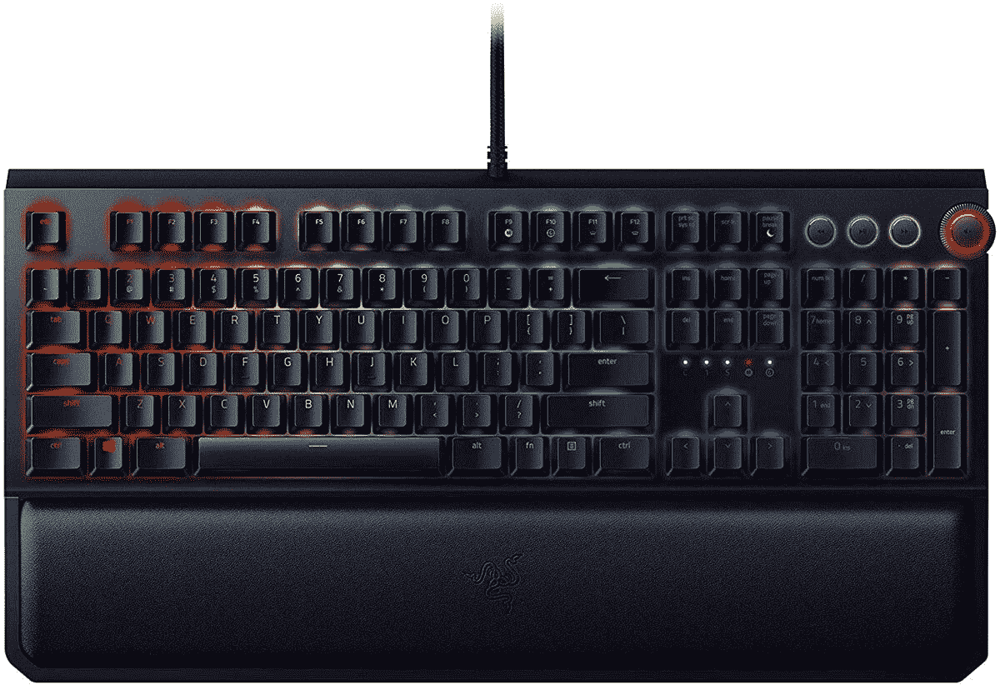

# 半价购买 Razer BlackWidow Elite，仅限本周末

> 原文：<https://www.xda-developers.com/razer-blackwidow-elite-black-friday/>

就在这个周末，Razer 为他们的一些产品提供黑色星期五的早期优惠！没有必要等到 11 月 27 日才知道你是否会在这里得到最好的交易——只需抓住你想要的，没有压力的大日子来了。这周末打折的商品之一？雷蛇黑寡妇精英版，半价。

这款高端 Razer 键盘也在 2020 年 Prime Day 期间出售，但其最大的折扣只是作为一项迅速完成的闪电交易。这一次，你有更多的时间来抓住自己的黑寡妇精英-直到周日，确切地说-目前是 85 美元！那是一个令人难以置信的价格。

凭借可重新映射的宏按键、专为游戏打造的耐用机械开关和令人印象深刻的 RGB，Razer BlackWidow Elite 绝对是键盘升级的可靠选择。它只有 85 美元，如果你因为更高的价格而一直推迟购买机械键盘，这使得开关更有吸引力。

这种半价交易也适用于黑寡妇精英的所有三种型号。每个型号都有不同的机械开关，这反过来也会影响雷蛇黑寡妇精英的感受。有绿色的开关，摸起来有触感和咔嗒声(比如，它们声音很大)；橙色的开关，也是触觉型的，无声的(基本上你打字的时候听起来不像是惊马)；最后是黄色开关，它们是线性的，无声的(对不起，我不知道线性在这个上下文中是什么意思)。你想抓哪个键盘，就看你最喜欢哪种手感了！

 <picture></picture> 

Razer BlackWidow Elite

##### 雷蛇黑寡妇精英

Razer BlackWidow Elite 有三种不同类型的机械开关，目前在亚马逊半价！

这次销售只持续到周日，所以在它回到 170 美元之前拿起你的键盘！如果你正在寻找更多的游戏配件，雷蛇也在出售其 [Naga Trinity MMO 鼠标](https://www.amazon.com/dp/B0788MCRGC?tag=xda-5orni9c-20&ascsubtag=UUxdaUeUpU30620&asc_refurl=https%3A%2F%2Fwww.xda-developers.com%2Frazer-blackwidow-elite-black-friday%2F&asc_campaign=Short-Term)。如果你是一个大 MMO 玩家，这款鼠标会让你的旋转变得更容易，而且只需 70 美元。