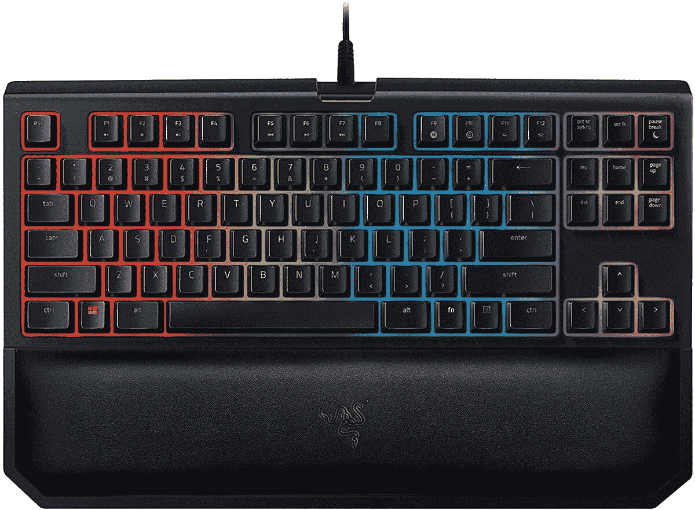

# Razer BlackWidow TE Chroma 可节省 50 美元，并获得紧凑的质量

> 原文：<https://www.xda-developers.com/razer-blackwidow-te-chroma-deal/>

最近，我了解到 tenkeyless(或 TKL 键盘，我刚刚学到的缩写)有多棒。我在一张众所周知的小桌子上工作，但出于某种原因，我认为我需要一个完整的键盘。我认为我绝对需要那个数字键盘，没有它我根本无法工作。一定是我以前的会计培训在说话。但我终于看到了自己的错误，一个机械 TKL 键盘给了我更多的空间，同时还能出色地完成工作。这就让我想到了雷蛇黑寡妇 TE Chroma v2！

Razer 的优质 TKL 键盘实际上不是我使用的键盘，因为我选择了 Aukey 的机械，蓝色开关 TKL 选项，但这真的很难击败黑寡妇 TE 色度。这种键盘提供了你对全尺寸黑寡妇在质量方面的所有期望，但没有数字键盘和媒体控制按钮，以获得更紧凑的体验。说真的，谁会使用这些媒体按钮呢？即使在我最后一个全键盘上，媒体按钮工作正常，我也很少使用这些东西。

所以，如果你对雷蛇的产品(你应该看看的[)不太了解，你对雷蛇黑寡妇 TE Chroma v2 有什么期待？你将拥有一个由 Razer 定制的绿色键盘开关构建的键盘，提供触觉和点击体验。你也将获得伟大的 RGB 背光和编程自己的一些宏的能力。让我们也不要为手腕休息-这对你的手腕健康很重要！](https://www.xda-developers.com/razer-mask-project-hazel-rgb-lighting/)

在亚马逊，Razer 已经将 MSRP 降低了 50 美元，将这款紧凑但质量上乘的键盘降至 90 美元。这是捡一个的最佳时机！

 <picture></picture> 

Razer BlackWidow TE Chroma v2

##### 雷蛇黑寡妇 TE 色度 v2

谁需要数字键盘？黑寡妇 TE Chroma 在亚马逊便宜 50 美元，在保持紧凑的同时还有很多东西可以提供！

如果你还想要一个全键盘...嗯，你很幸运！Razer BlackWidow Elite 也在出售，价格降至 130 美元。

 <picture></picture> 

Razer BlackWidow Elite

##### 雷蛇黑寡妇精英

需要全键盘？黑寡妇精英也在打折！今天从这个绿色开关键盘上获得 40 美元的优惠。

无论你想要哪种键盘，都不要拖延，因为谁知道这次销售会持续多久！