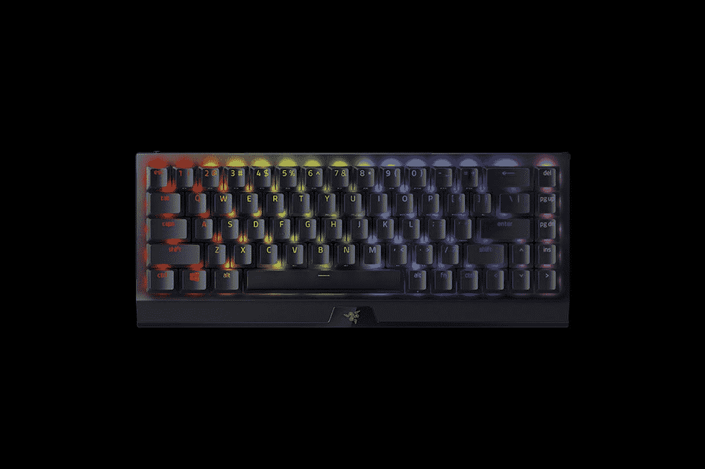

# Razer 推出黑寡妇 V3 迷你超高速 65%键盘

> 原文：<https://www.xda-developers.com/razer-blackwidow-v3-mini-hyperspeed-launch/>

# Razer black widow V3 Mini HyperSpeed 是一个 65%的键盘，具有无延迟无线连接

Razer 将带来一种新的 65%无线键盘，据说使用其基于 2.4GHz 的超高速技术可以提供无延迟体验。

Razer 今天宣布了新的黑寡妇 V3 Mini HyperSpeed，这是一款无线 65%机械游戏键盘。顾名思义，这种键盘利用了该公司的超高速无线技术，据说可以提供高达 1000Hz 轮询速率的无延迟体验。

据该公司称，这款新键盘的目标用户是喜欢桌面整洁简约的游戏玩家。它配备了 Razer 键盘的所有优点，包括优质的铝制表面，双镜头 ABS 键帽，以及对 Razer Chroma RGB 照明的支持。客户可以选择 Razer 的绿色(触觉)或黄色(线性)机械开关，按键寿命为 8000 万次。该键盘还提供多种连接选项，包括通过 USB 加密狗的超高速无线(2.4Ghz)，最多支持 3 个设备的蓝牙，以及 USB-C，它也用于为键盘充电。据说键盘上的电池一次充电可以持续 200 小时。其他重要功能包括 N 键翻转、可编程键和即时宏记录、混合板载内存和最多可存储 5 个配置文件的云存储。

Razer 不是第一个提供基于 2.4Ghz 快速无延迟连接的 65%键盘的公司。华硕有 [ROG 镰](https://rog.asus.com/keyboards/keyboards/compact/rog-falchion-model/)，它更便宜，电池寿命更长，还有一些独特的技巧。此外还有 [Corsair K65 RGB Mini](https://www.corsair.com/us/en/Categories/Products/Gaming-Keyboards/RGB-Mechanical-Gaming-Keyboards/K65-RGB-MINI-60%25-Mechanical-Gaming-Keyboard/p/CH-9194014-NA) ，这是一款 60%有线的键盘，是同尺寸中速度最快的键盘，据称轮询频率为 8000Hz。

## 定价和可用性

如果你对新的 Razer black widow V3 Mini HyperSpeed 键盘感兴趣，你可以从 [Razer 的在线商店](https://razer.a9yw.net/c/2233363/642901/10229?subId1=UUxdaUeUpU3125&subId2=exda&u=https%3A%2F%2Fwww.razer.com%2Fgaming-keyboards%2Frazer-blackwidow-v3-mini-hyperspeed%2FRZ03-03891500-R3U1)或者访问亚马逊购买。价格从 179 美元起。

 <picture></picture> 

Razer BlackWidow V3 Mini HyperSpeed

##### 雷蛇黑寡妇 V3 迷你超高速

Razer 新推出的黑寡妇 V3 Mini HyperSpeed 是一款 65%无线键盘，适合寻求无延迟无线连接体验的游戏玩家。