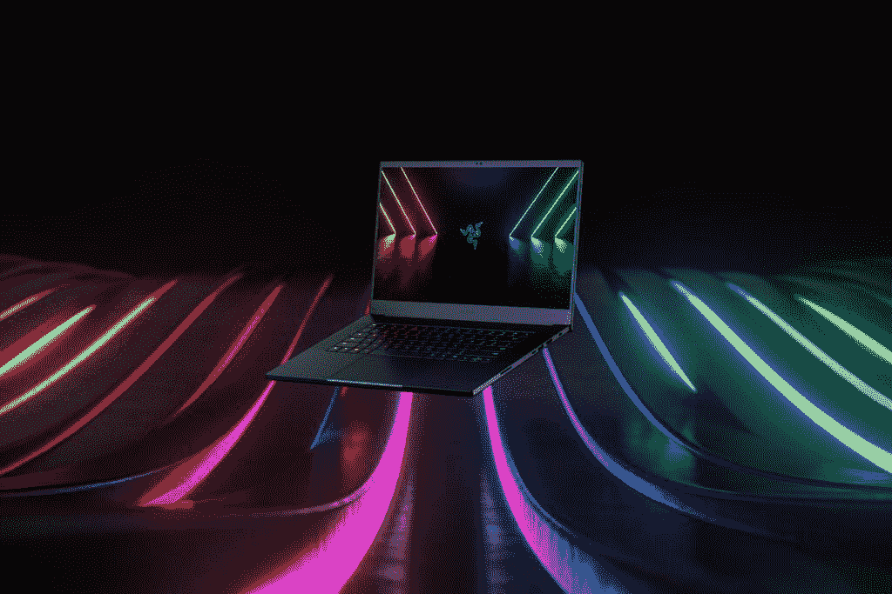
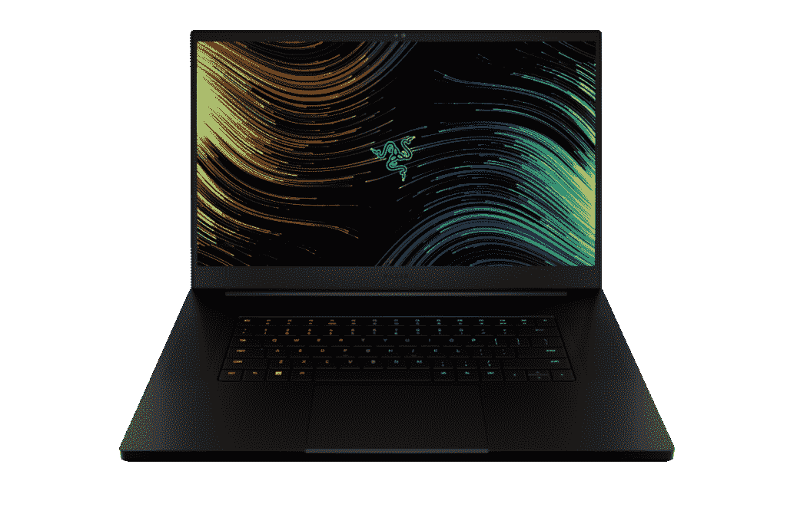
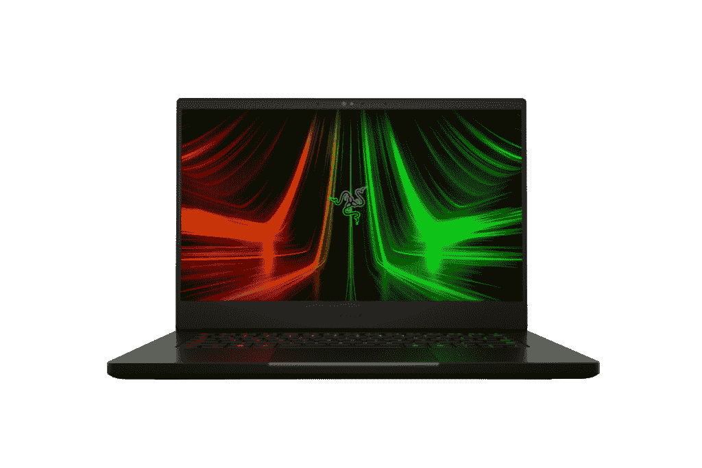
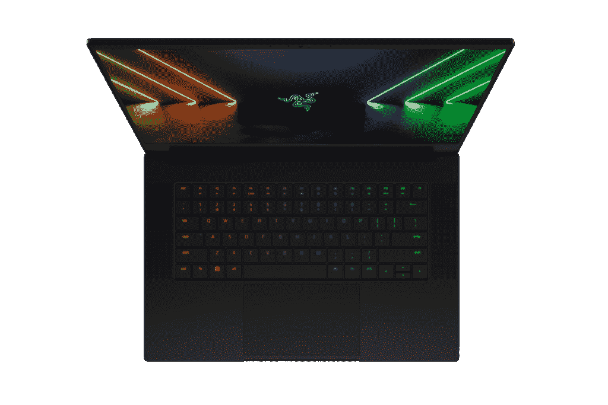
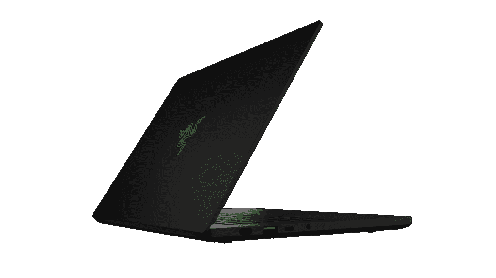
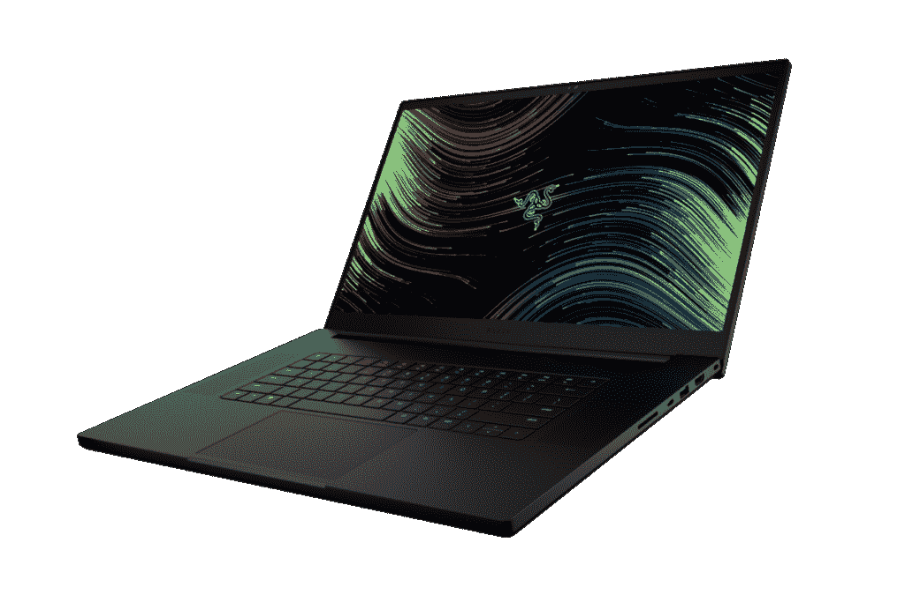
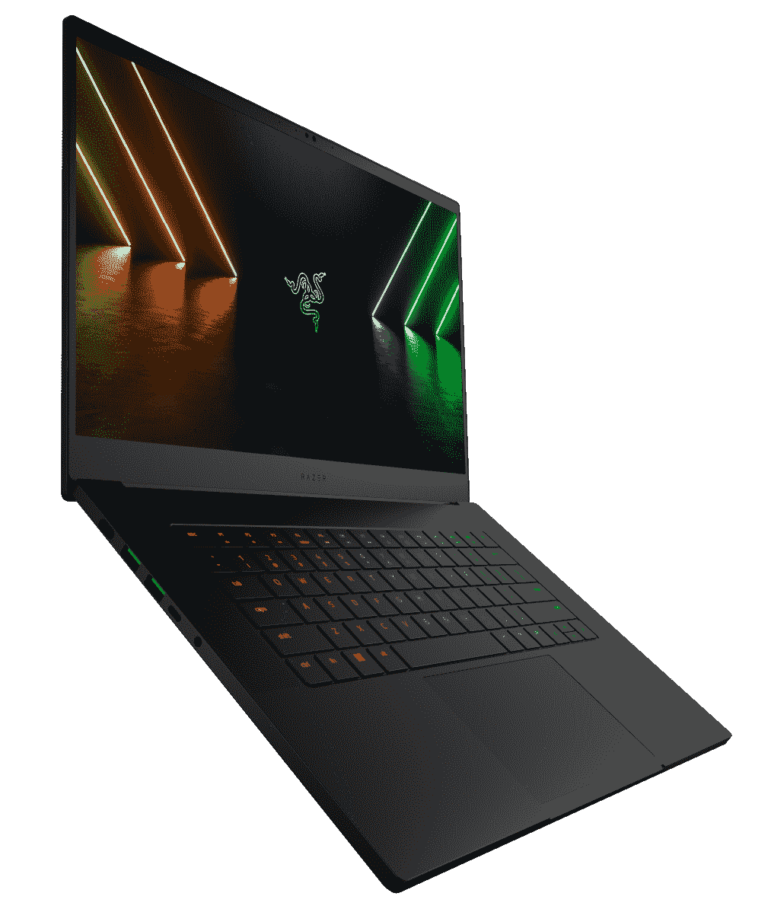
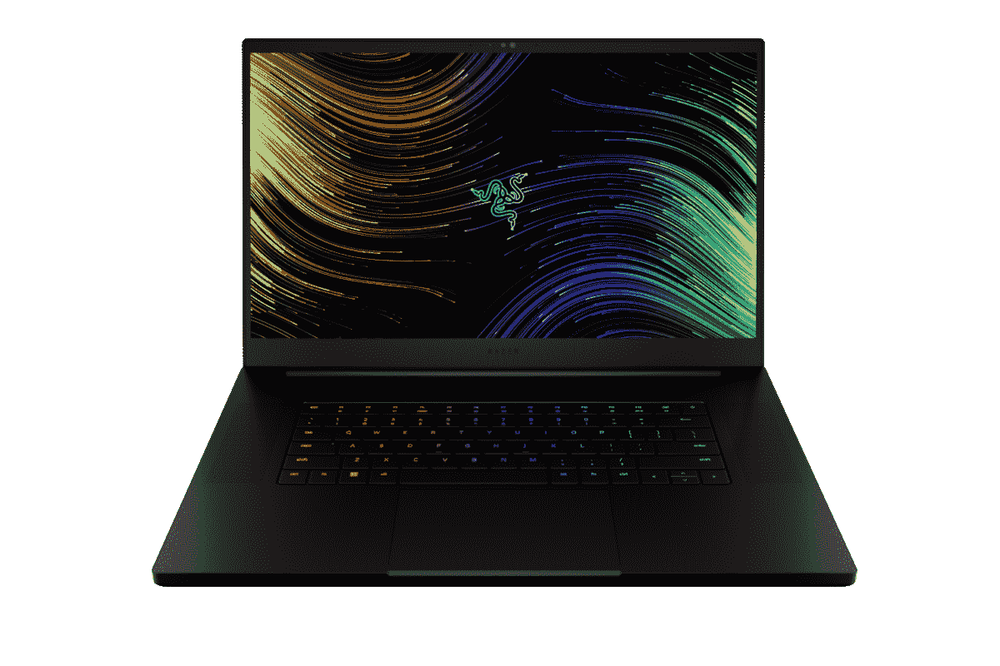

# Razer Blade 14、15 或 17:哪款适合你？

> 原文：<https://www.xda-developers.com/razer-blade-14-15-17/>

Razer 更新了其游戏笔记本电脑的刀片阵容，包括刀片 14、15 和 17。这些都是[很棒的笔记本电脑](https://www.xda-developers.com/best-laptops/)，功能强大，但除了屏幕尺寸之外还有一些差异，所以如果你打算买一台，仔细看看它们是个好主意。

我们在这里提供帮助，在本文中，我们将比较 Razer Blade 14、15 和 17，以便您可以决定哪一款适合您。Razer Blade 14 最为突出，其他两个型号之间更加相似。尽管如此，还是有一些差异你可能不会马上看出来。让我们开始吧。

## Razer Blade 14 vs 15 vs 17:规格

|  | 

雷蛇之刃 14 (2022)

 | 

雷蛇之刃 15 (2022)

 | 

雷蛇之刃 17 (2022)

 |
| --- | --- | --- | --- |
| **处理器** | 

*   AMD 锐龙 9 6900HX (8 个内核，16 个线程，20MB 高速缓存，最高 4.6 GHz)

 | 

*   第 12 代英特尔酷睿 i7-12800H (14 个内核，20 个线程，最高 4.8GHz，24MB 高速缓存)
*   第 12 代英特尔酷睿 i9-12900HK (14 个内核，20 个线程，最高 5GHz，24MB 高速缓存)

 | 

*   第 12 代英特尔酷睿 i7-12800H (14 个内核，20 个线程，最高 4.8GHz，24MB 高速缓存)
*   第 12 代英特尔酷睿 i9-12900HK (14 个内核，20 个线程，最高 5GHz，24MB 高速缓存)

 |
| **图形** | 

*   完整的
*   离散:
    *   英伟达 GeForce RTX 3060 (6GB GDDR6)
    *   NVIDIA GeForce RTX 3070 Ti(8GB gddr 6)
    *   英伟达 GeForce RTX 3080 Ti (16GB GDDR6)

 | 

*   集成:
*   离散:
    *   英伟达 GeForce RTX 3060 (6GB GDDR6)
    *   NVIDIA GeForce RTX 3070 Ti(8GB gddr 6)
    *   英伟达 GeForce RTX 3080 Ti (16GB GDDR6)

 | 

*   集成:
*   离散:
    *   英伟达 GeForce RTX 3060 (6GB GDDR6)
    *   NVIDIA GeForce RTX 3070 Ti(8GB gddr 6)
    *   英伟达 GeForce RTX 3080 Ti (16GB GDDR6)

 |
| **撞锤** | 

*   16GB 双通道 DDR5 4800MHz(焊接)

 | 

*   16GB 双通道 DDR5 4800MHz(带插槽，可升级至 64GB)

 | 

*   32GB 双通道 DDR5 4800MHz(带插槽，可升级至 64GB)

 |
| **存储** | 

*   1TB PCIe 第四代 NVMe 固态硬盘(可升级至 2TB)

 | 

*   1TB PCIe 第四代 NVMe 固态硬盘(可升级至 2TB)
*   打开 M.2 插槽进行扩展(最高 2TB)

 | 

*   1TB PCIe NVMe 固态硬盘(可升级至 4TB)
*   打开 M.2 插槽进行扩展(高达 4TB)

 |
| **显示** | 

*   14 英寸全高清(1920 x 1080) IPS，144 赫兹，AMD FreeSync Premium，高达 100% sRGB
*   14 英寸四核高清(2560 x 1440) IPS，165 赫兹，AMD FreeSync Premium，高达 100% DCI-P3

 | 

*   15.6 英寸全高清(1920 x 1080) IPS，360 赫兹，高达 100% sRGB
*   15.6 英寸四核高清(2560 x 1440) IPS，240 赫兹，NVIDIA G-SYNC，100% DCI-P3
*   15.6 英寸超高清(3840 x 2160) IPS，144 赫兹，100% DCI-P3，康宁大猩猩玻璃

 | 

*   17.3 英寸全高清(1920 x 1080) IPS，360 赫兹，100% sRGB，300 尼特
*   17.3 英寸四核高清(2560 x 1440) IPS，165 赫兹，100% sRGB，300 尼特
*   17.3 英寸四核高清(2560 x 1440) IPS，240 赫兹，100% DCI-P3，300 尼特
*   17.3 英寸超高清(3820 x 2160) IPS，144 赫兹，100% Adobe RGB，400 尼特

 |
| **音频** |  |  |  |
| **网络摄像头** |  |  |  |
| **Windows Hello** | 

*   使用红外网络摄像头进行面部识别

 | 

*   使用红外网络摄像头进行面部识别

 | 

*   使用红外网络摄像头进行面部识别

 |
| **电池** | 

*   61.6 瓦时电池
*   230W 充电器

 | 

*   80 瓦时电池
*   230W 充电器

 | 

*   82 瓦时电池
*   280W 充电器

 |
| **港口** | 

*   2 个 USB 3.2 第二代 A 类端口
*   2 个 USB 3.2 Gen 2 Type-C，带电源和显示端口 1.4
*   1 个 HDMI 2.1 接口
*   3.5 毫米耳机插孔
*   电源端口
*   肯辛顿船闸口

 | 

*   3 个 USB3.2 第二代 A 类端口
*   2 个 Thunderbolt 4 端口(USB-C)
*   1 个 HDMI 2.1 接口
*   1 个 UHS-II SD 读卡器
*   3.5 毫米耳机插孔
*   电源端口
*   肯辛顿船闸口

 | 

*   3 个 USB3.2 第二代 A 类端口
*   2 个 Thunderbolt 4 端口(USB-C)
*   1 个 HDMI 2.1 接口
*   1 个 RJ45 2.5Gb 以太网
*   1 个 UHS-II SD 读卡器
*   3.5 毫米耳机插孔
*   电源端口
*   肯辛顿船闸口

 |
| **连通性** |  | 

*   Wi-Fi 6E(英特尔 AX1690)
*   蓝牙 5.2

 | 

*   Wi-Fi 6E(英特尔 AX1690)
*   蓝牙 5.2

 |
| **颜色** | 

*   黑色，盖子上有绿色 Razer 标志

 | 

*   黑色，盖子上有绿色 Razer 标志

 | 

*   黑色，盖子上有绿色 Razer 标志

 |
| **尺寸(宽 x 深 x 高)** | 

*   319.7 x 220 x 16.8mm 毫米(12.59 x 8.66 x 0.66 英寸)

 | 

*   355 x 235 x 16.9 毫米(13.98 x 9.25 x 0.67 英寸)

 | 

*   395 x 260 x 19.9 毫米(15.55 x 10.24 x 0.78 英寸)

 |
| **重量** |  | 

*   大多数单品:2.01 千克(4.4 磅)
*   4K: 2.08 千克(4.59 磅)

 |  |
| **起始价格** | $1,999.99 / €2,199.99 | $2,499.99 / €2,799.99 | $2,699.99 / €2,999.99 |

这些笔记本电脑之间的一些差异变得很明显，但很明显也有很多相似之处。让我们仔细看看。

## 性能:一切尽在细节

看上面的规格表，很明显，所有这些笔记本电脑都运行在强大的硬件上。刀片式服务器 15 和 17 都配备了最新的第 12 代英特尔酷睿处理器，该处理器采用了具有高性能和高效率内核的新型混合架构，总共有 14 个内核和 20 个线程。这两种处理器的性能应该非常相似，尽管更大的笔记本电脑有可能容纳更有效的冷却系统。

 <picture></picture> 

Razer Blade 15

至于 Blade 14，它装载了最新的 AMD 锐龙 9 6900HX，这是前述英特尔产品的直接竞争对手。它与以前的型号具有相同的核心布局，8 个核心和 16 个线程，但它确实在引擎盖下有一些性能改进。现在很难说哪种处理器会更好，因为它们都没有可用的基准，但它们应该不会相差太远。这就是两家公司的上一代产品的情况，尽管英特尔的新架构可能会带来巨大的收益。

至于图形，Razer Blade 14、15 和 17 在纸面上有类似的规格，但魔鬼在细节中。笔记本电脑 GPU 都有不同的额定功率和速度，即使它们可以以相同的方式命名，所以 RTX 3080 Ti 不会在每台笔记本电脑上都是一样的。Razer 还没有澄清这些新型号的最大图形能力，但现在，我们可以假设它们将与上一代相似。GeForce RTX 3080 的刀片 14 最大功率为 100 瓦，而刀片 15 最大功率为 105 瓦，刀片 17 最大功率为 130 瓦。这意味着刀片 17 是三个中最强大的。随着笔记本电脑变得越来越大，它们可以安装更多耗电的 GPU 和更好的冷却，所以这是可以预期的。

 <picture></picture> 

Razer Blade 17

刀片 14 上的 RAM 是焊接的，无法升级。

其余的规格也是相似的，有一些值得注意的差异。这三款笔记本电脑都配备了主频为 4800MHz 的 LPDDR5 RAM，并且都配备了 1TB PCIe 4.0 固态硬盘。然而，Blade 14 上的 RAM 是焊接的，不能升级，而其他两个让你自己添加高达 64GB 的 RAM。而对于存储，Blade 14 只有一个 M.2 SSD 插槽，而如果你需要更多空间，其他两个型号都有一个额外的插槽。此外，Razer 声称 Blade 17 在每个插槽中支持高达 4TB 的固态硬盘，而其他两个则限制为每个插槽 2TB。

由于其强大的规格，这些笔记本电脑的电池寿命可能不会很长。较大型号的电池尺寸会增加，但这通常适用于具有较高刷新率的较大显示器，并且最佳电池寿命可能在 Blade 15 上。电池几乎与 Blade 17 一样大，但显示屏更小，GPU 也不太耗电，所以这是最有可能的情况。

## 显示:刀片 15 和 17 有最多的选项

显示选项的差异更明显一些，它们有助于将 Blade 14 进一步放在自己的类别中。这款机型配有 14 英寸显示屏，你只有两种选择:144Hz 刷新率和 100% sRGB 的全高清面板，或者 165Hz 和 100% DCI-P3 的四高清面板。这两种显示器都是固态显示器，第二种选择显然更好，并提供了分辨率和刷新率的良好平衡。

 <picture></picture> 

Razer Blade 14

所有 Razer Blade 笔记本电脑都有一个 1080p 网络摄像头和 Windows Hello。

但在这方面，刀片 15 和 17 有更多的选择，更好的选择。除了大小之外，这些几乎完全相同。有一个全高清面板，具有超快的 360Hz 刷新率和 100%的 sRGB 覆盖率，一个四高清面板，具有几乎同样快的 240Hz 刷新率和 100%的 DCI-P3，或一个全力以赴的 4K 显示器，具有 144Hz 刷新率和 100%的 Adobe RGB 覆盖率。随着分辨率的提高，这些显示器越来越适合内容消费和创作，但它们仍然非常适合游戏。并且它们都在这样或那样的方面优于刀片 14。Blade 17 也有更便宜的 165Hz 四核高清型号，类似于 Blade 14 的高端配置。

三台笔记本电脑的一个相似之处是网络摄像头。Razer 最终升级了整个刀片阵容，现在拥有全高清 1080p 网络摄像头，这在远程工作时代是一个非常受欢迎的进步。所有新的刀片型号还支持 Windows Hello 面部识别，这是非常受欢迎的，但并不像它应该的那样常见。

 <picture></picture> 

Razer Blade 15

至于声音，与 Blade 14 和 15 相比，Razer Blade 17 可能会给你最好的体验。由于尺寸更大，Blade 17 总共有八个扬声器——四个低音扬声器和四个高音扬声器——使整体声音体验非常身临其境。同时，Razer 只说 Blade 14 和 15 有立体声扬声器，这可能意味着每台笔记本电脑只有两个扬声器单元。不过，它们都是顶级扬声器，这是一个优势。

## 设计:相同的 DNA，但大小不同

正如你所料，Razer Blade 14、15 和 17 除了尺寸之外，看起来几乎完全相同。它们是全黑的笔记本电脑，盖子上有绿色的 Razer 标志，有 RGB 背光键盘。这里的差异都归结于大小和端口。

Razer Blade 14 是三款中最小最轻的，重量不到 4 磅，厚度为 16.8 毫米。如果你想要一个既能随身携带又足够强大的游戏设备，这是一个很好的选择。Blade 15 在所有尺寸上都更大，包括 16.9 毫米的厚度和 4.4 磅的起始重量。尽管如此，它仍然非常便携。最后，Blade 17 是最大的，厚度为 19.9 毫米，起始重量为 6.06 磅，这不是你想随身携带的东西。

 <picture></picture> 

Razer Blade 14

只有 15 号和 17 号有雷电。

此外还有端口问题，这三款笔记本电脑都提供了可靠的连接选项。Blade 14 是这一群中能力最差的，因为它的 AMD 处理器，这意味着它不支持 Thunderbolt 4。不过，你有两个 USB Type-C 端口，两个 USB Type-A 端口，HDMI 2.1 和耳机插孔，这是一个非常可靠的设置。Blade 15 将 Type-C 端口升级到 Thunderbolt 4 端口，因此您可以使用 Thunderbolt 坞站或外部 GPU，另外您还可以获得一个额外的 USB Type-A 端口(总共三个)和一个 SD 读卡器。最后，Blade 17 在所有这些基础上增加了 2.5Gbps 以太网，为您的在线游戏提供快速有线互联网。

显然，当您从 Razer Blade 14 迁移到 Blade 15 和 17 时，您正在牺牲便携性来换取强大的功能。Razer Blade 14 的端口最少，但更容易随身携带，而且它的设置也很不错。Blade 15 有一些额外的端口和 Thunderbolt 支持，但它有点重。Blade 17 拥有全功能的设置和最强大的规格，但很难随身携带。

## 结果

有了三台与 Blade 14、15 和 17 相似的笔记本电脑，您必须仔细考虑您想要从笔记本电脑中获得什么，然后做出选择。如果你在看这些笔记本电脑，你可能是一个游戏玩家，那么问题是你是哪种类型的游戏玩家？

如果你是一名大学生，并且你想要一台可以运行所有现代游戏，同时还能在教室环境中体面地携带和使用的笔记本电脑，Razer Blade 14 是一个非常全面的选择，而且它也是最实惠的。如果你愿意牺牲一点便携性，并且你有钱花，Blade 15 可以提供更好的游戏体验，而且它不会太重或太大。上一代是你今天能买到的最好的 15 英寸笔记本电脑之一，所以在这里应该也是如此。

 <picture></picture> 

Razer Blade 17

如果您更想寻找一台笔记本电脑来支持您的家庭游戏设置，Razer Blade 17 是最佳选择。它拥有最强大的 GPU 和更多端口，包括有线互联网，如果你想以尽可能低的延迟在线玩游戏。这是一款非常重的笔记本电脑，因此非常适合在家玩游戏，但是它可以让你自由地将设备带到朋友家。

如果您已经做出决定，您可以使用下面的链接预购笔记本电脑。Razer Blade 15 和 17 已经可以订购，并将于 2 月 22 日开始发货。Blade 14 将于 2 月 10 日接受预购，但我们还不知道它何时开始发货。

 <picture></picture> 

Razer Blade 14

##### 雷蛇之刃 14 (2022)

新的 Razer Blade 14 配备了 AMD 的锐龙 9 6900HX 处理器和最高 RTX 3080 Ti 显卡。它也有一个 QHD 165 赫兹显示器。

 <picture></picture> 

Razer Blade 15 (2022)

##### 雷蛇之刃 15 (2022)

Razer Blade 15 拥有英特尔第 12 代处理器和高达 105 瓦功率的 RTX 3080 Ti 显卡。它还为显示器提供了一些配置选项。

 <picture></picture> 

Razer Blade 17 (2022)

##### 雷蛇之刃 17 (2022)

Razer Blade 17 拥有与 Blade 15 相同的英特尔处理器，甚至更强大的 NVIDIA GPUs，功率高达 130W。它包括相同的显示选项，尽管它明显更大。