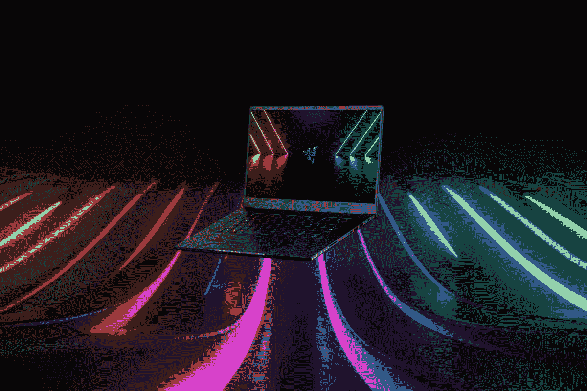
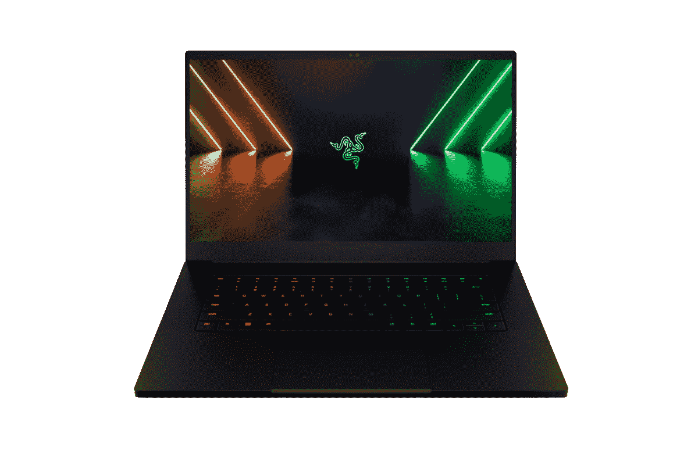

# 雷蛇 Blade 15 (2022) vs 外星人 x15 R2:买哪款游戏笔记本电脑？

> 原文：<https://www.xda-developers.com/razer-blade-15-2022-alienware-x15/>

随着英特尔新的第 12 代 Alder Lake 移动处理器的发布，市场上出现了一系列新的游戏笔记本电脑。雷蛇和戴尔都是首批推出采用新英特尔芯片的新游戏笔记本电脑的制造商之一。在这篇文章中，我们将看看 Razer Blade 15 与外星人 x15 R2 的对比，以找出 2022 年哪一款游戏笔记本电脑更值得购买。

这两款机器都配备了一些你会在所有现代[游戏笔记本电脑](https://www.xda-developers.com/best-gaming-laptops/)上找到的最好的内部部件。我们将首先详细查看规格表，然后深入了解笔记本电脑的其他方面，包括显示器、设计、端口等。所以，事不宜迟，让我们开始比较，看看哪一款能入选我们收集的[最佳 15 英寸游戏笔记本电脑](https://www.xda-developers.com/best-15-inch-laptops/)。

**浏览本文:**

## 雷蛇刀锋 15 vs 外星人 x15 R2:规格

在开始比较之前，我们先来快速了解一下每款笔记本电脑的规格:

| 

规格

 | 

**雷蛇之刃 15 (2022)**

 | 

**外星人 x15 R2**

 |
| --- | --- | --- |
| **CPU** | 

*   第 12 代英特尔酷睿 i9-12900H (14 个内核，20 个线程，最高 5GHz，24MB 高速缓存)
*   第 12 代英特尔酷睿 i7-12800H (14 个内核，20 个线程，最高 4.8GHz，24MB 高速缓存)

 | 

*   第 12 代英特尔酷睿 i9-12900H (14 个内核，20 个线程，最高 5GHz，24MB 高速缓存)
*   第 12 代英特尔酷睿 i7-12800H (14 个内核，20 个线程，最高 4.8GHz，24MB 高速缓存)

 |
| **图形** | 离散:

*   英伟达 GeForce RTX 3060 (6GB GDDR6)
*   NVIDIA GeForce RTX 3070 Ti(8GB gddr 6)
*   英伟达 GeForce RTX 3080 Ti (16GB GDDR6)

集成: | 离散:

*   英伟达 GeForce RTX 3060 (6GB GDDR6)
*   NVIDIA GeForce RTX 3070 Ti(8GB gddr 6)
*   英伟达 GeForce RTX 3080 Ti (16GB GDDR6)

集成: |
| **闸板** | 高达 32GB DDR5 4800MHz 双通道内存 | 高达 32GB DDR5 5200MHz 双通道内存 |
| **储存** | 最高 1TB 固态硬盘(M.2 NVMe PCIe 4.0 x4) | 高达 4 TB RAID 0 (2 x 2 TB)，M.2 PCIe NVMe 固态硬盘 |
| **显示** | 

*   15.6 英寸全高清(1920 x 1080) IPS，360 赫兹，高达 100% sRGB
*   15.6 英寸四核高清(2560 x 1440) IPS，240 赫兹，NVIDIA G-SYNC，100% DCI-P3
*   15.6 英寸超高清(3840 x 2160) IPS，144 赫兹，100% DCI-P3，康宁大猩猩玻璃

 | 

*   15.6 英寸全高清(1920 x 1080) IPS，165 赫兹，3 毫秒
*   15.6 英寸全高清(1920 x 1080) IPS，360 赫兹，1 毫秒
*   15.6 英寸 QHD (2560 x 1440) IPS，240 赫兹，2 毫秒

 |
| **电池** |  |  |
| **端口** | 

*   3 个 USB3.2 第二代 A 类端口
*   2 个 Thunderbolt 4 端口(USB-C)
*   1 个 HDMI 2.1 接口
*   1 个 UHS-II SD 读卡器
*   3.5 毫米耳机插孔
*   电源端口

 | 

*   1 个带 PowerShare 的 USB 3.2 第 1 代端口
*   1 个 USB 3.2 Gen 2 Type-C 端口，带显示端口和电源传输
*   1 个 Thunderbolt 4 端口，带显示端口和电源传输
*   1 个通用音频插孔
*   1 个 HDMI 2.1 端口
*   1 个电源适配器端口

 |
| **音频** | 立体声扬声器 | 立体声扬声器，立体声高音扬声器 2 W x 2 = 4 W 总计 |
| **网络摄像头** | 1080p 全高清网络摄像头+红外摄像头 | 外星人高清(1280x720 分辨率)摄像机 |
| **Windows Hello** | 使用红外摄像头进行面部识别 | 使用红外摄像头进行面部识别 |
| **连通性** |  |  |
| **颜色** | 黑色带绿色 Razer 标志 | 月光 |
| **尺寸(WxDxH)** | 355 x 235 x 16.9 毫米(13.98 x 9.25 x 0.67 英寸) | 

*   外星人 x15 165hz & 360hz:359.70 x277.33 x16.75 毫米(14.16 x10.91 x0.66 英寸)
*   外星人 x15 240Hz 赫兹:359.70 x 277.33 x 17.15 毫米(14.16 x 10.91 x 0.67 英寸)

 |
| **重量** | 

*   2.01 千克(4.4 磅)(大多数 SKU)
*   2.08 千克(4.59 磅)(4K 显示屏)

 |  |
| **价格** |  |  |

正如你所看到的，这两款笔记本电脑在规格方面几乎相同，它们都可以配置英特尔新的 Alder Lake H 系列芯片，并拥有英伟达新的 RTX 30 系列 GPU，包括 RTX 3070 Ti 和 RTX 3080 Ti。可以肯定地说，这两款笔记本电脑都能毫无问题地运行现代游戏。现在，让我们稍微深入一下这些规范，看看它们各自带来的其他区别是什么。

## 性能:终极游戏机

Razer Blade 15 和外星人 x15 R2 游戏笔记本电脑都采用了英特尔新的第 12 代 Alder Lake 移动处理器。作为高性能游戏笔记本电脑，这些机器配备了 Alder Lake H 系列处理器。这些新的第 12 代芯片采用英特尔的新混合架构，具有高性能和高效率内核。英特尔酷睿 i9-12900H 和英特尔酷睿 i7-12800H 总共有 14 个内核和 20 个线程。

两款笔记本电脑中的酷睿 i9 变体显然将更加强大，因为它们可以达到高达 5GHz 的峰值频率。我们还没有机会测试这些机器进行面对面的比较，但英特尔表示，新的酷睿 i9 移动芯片比即将推出的酷睿 i9-11980HK 处理器快大约 30%。您还可以查看我们的[英特尔酷睿 i9-12900HK 评测](https://www.xda-developers.com/intel-core-i9-12900hk-review/)，了解这款芯片的性能。

在这次比较中，两款笔记本电脑在图形方面也同样强大，因为我们正在研究 Nvidia 新的 30 系列独立显卡。事实上，您可以选择为这两款笔记本电脑配置 Nvidia GeForce RTX 3080 Ti，这是 Nvidia 在笔记本电脑领域最新、最棒的产品。甚至每台笔记本的最低配置都配有 RTX 3060，我们认为它非常有能力在 2022 年运行甚至现代的 AAA 级产品。我们建议您查看我们对搭载全新 Nvidia GeForce RTX 3070 Ti 的[华硕 ROG Strix G15 (2022)](https://www.xda-developers.com/asus-rog-strix-g15-review/) 的评测，看看这款 GPU 的表现如何。

在 CPU 和 Nvidia 最新的显卡选项之间，我们正在寻找两款能够提供最佳游戏体验的终极游戏机。雷蛇刀锋 15 和外星人 x15 R2 这两种类似规格的变体之间的性能差异将完全取决于它们各自处理热量的能力。

在内存和存储方面，两款笔记本电脑都配备了新的 DDR5 内存模块。外星人 x15 R2 的双通道 DDR5 模块的频率略高，但我们怀疑这是否会产生显著的差异。然而，在存储方面，外星人 x15 R2 是一个明显的赢家，因为它可以配置为高达 4TB，而 Razer Blade 上只有 2TB。它肯定会让你花费更多，但是你永远不会有太多的存储空间，不是吗？

## 显示器:高刷新率还是高分辨率？

这两款笔记本电脑上的显示器也非常相似。这两款笔记本电脑都有 15.6 英寸的标准面板，但你可以选择不同的分辨率。Razer Blade 15 的显示器有 FHD、QHD 和 UHD 分辨率，分别有 360Hz、240Hz 和 144Hz 刷新率选项。另一方面，戴尔只提供带有 FHD 或 QHD 面板的外星人 x15 R2。您可以选择在 360 赫兹或 165 赫兹之间选择 FHD 面板，而 QHD 面板锁定在 240 赫兹。就显示选项而言，Razer Blade 15 无疑是更好的选择。UHD 面板选项对内容创建者来说也很棒，所以你可以考虑一下。

 <picture></picture> 

Razer Blade 15

对于游戏玩家来说，我们认为这两款笔记本电脑都提供了高分辨率和快速响应时间的面板。我们建议您再次查看规格表，找出最适合您的选项。我们认为这两款笔记本电脑上的 QHD 240Hz 面板将是值得一试的，因为它提供了两个世界的最佳选择。除非你作为内容创作者专门处理 4K 镜头，否则我们认为你不会注意到 1440p 和 4K 面板之间的很多差异，尤其是在 15.6 英寸的显示器上。值得庆幸的是，这两款笔记本电脑都在显示屏顶部保留了网络摄像头，但 Razer Blade 15 拥有出色的 1080p 网络摄像头，而外星人 x15 只有 720p 摄像头。

## 设计:雷蛇 Blade 15 更加小巧轻便

谈到设计，我们认为 Razer Blade 15 看起来更专业一些。它仍然是一个强大的游戏机，但 Razer 总是设法以最少的天赋提供一些干净的设计。虽然新的外星人 x15 R2 看起来比我们过去见过的一些以前的笨重的外星人笔记本电脑更好，但它仍然保留了许多“游戏玩家”的美学，具有锐利的边缘和 RGB 照明。Razer Blade 15 也比外星人 x15 R2 更紧凑更轻，但它们在厚度方面几乎相同。

你还可以在两台机器上获得一个不错的键盘，每个按键都有 RGB 照明，但外星人 X15 的键盘也有面向顶部的扬声器，以及外星人标志旁边的一系列通风口。另一方面，Razer Blade 15 的键盘面板非常小，带有面向扬声器。虽然设计纯粹是主观的，但我们认为 Razer Blade 15 看起来更微妙，不会成为一款过于令人讨厌的游戏笔记本电脑。这是那种你可以舒服地带着去参加专业会议，而且完全没有问题的机器。也就是说，外星人 x15 R2 看起来也很棒。这些年来，这台机器发生了很大变化，我们真的很喜欢这些新的外星人笔记本电脑的外观。但如果我们要选择一个基于便携性的整体，那么我们认为 Razer Blade 15 可能是更好的选择。

## 端口和连接

当谈到端口选择时，这两款笔记本电脑都配置良好，但我们认为 Razer Blade 15 比外星人 x15 R2 有优势。Razer Blade 15 有三个 USB3.2 Gen 2 类型 A 端口，而外星人 x15 R2 只有一个类型 A 端口。我们还在考虑 Razer Blade 15 上的两个 Thunderbolt 4 Type-C 端口，而不是带有 DP 和 PD 的 USB 3.2 Gen 2 Type-C 端口，以及外星人 x15 R2 上的单个 Thunderbolt 4。Razer Blade 15 还通过其 SD 读卡器获得了加分，这对内容创作者来说是一个很好的补充。这两款笔记本电脑的好处在于，它们都配备了 HDMI 2.1 端口。

同样值得一提的是，端口是如何均匀分布在 Razer Blade 15 的两侧，而你会发现所有端口都在外星人 x15 R2 的背面。这不一定是一个交易破坏者，但我们认为一直到达后面的端口可能有点困难，所以 Razer Blade 15 使它更加方便。

至于无线连接，Razer Blade 15 和外星人 x15 R2 都支持 WiFi 6E 和蓝牙 5.2。这并不令人惊讶，因为我们预计在 2022 年将在所有现代笔记本电脑上看到这些新的连接选项。

## 雷蛇刀锋 15 vs 外星人 x15 R2:你该买哪个？

如果你通读了整个比较，那么你可能已经知道这两款笔记本电脑在规格方面是多么的强大。它们都拥有更新的第 12 代英特尔酷睿处理器、用于运行现代游戏的新 Nvidia GeForce RTX 30 系列 GPU、高分辨率面板等。笔记本电脑本身的整体性能将取决于它们处理热量的能力。据说外星人在其 X 系列游戏笔记本电脑中使用了一种新的冷却技术，所以看看这种技术在现实世界中的表现会很有趣。

但是就像端口、连接、设计等其他因素而言。，我们认为雷蛇刀锋 15 比外星人 x15 R2 略胜一筹。Razer Blade 15 不仅有更好的端口选择，而且更紧凑，整体重量略轻。不过，这也取决于你的个人偏好。如果你想买一台设计简洁、更紧凑的机器，那么我们认为 Razer Blade 15 是不二之选。但是，如果你正在寻找一款具有醒目设计和丰富 RGB 色彩的游戏笔记本电脑，那么外星人 x15 R2 绝对不会错。与 Razer Blade 15 相比，外星人笔记本电脑的基本型号价格略低，因此请记住这一点。

 <picture></picture> 

Razer Blade 15 (2022)

##### 雷蛇之刃 15 (2022)

Razer Blade 15 (2022)搭载英特尔第 12 代酷睿处理器，配备 DDR5 内存。

 <picture></picture> 

Alienware x15 R2

##### 戴尔外星人 x15 R2

外星人 x15 R2 是戴尔最新的游戏机之一，采用英特尔新的第 12 代处理器。

无论你选择哪一款，你都将获得稳定的游戏性能。它们都包含一些强大的内部功能，允许你玩一些现代游戏。您可以探索更多尺寸选项，因为 Razer Blade 和外星人 X 系列笔记本电脑也提供更小的 14 英寸外形。

如果这些笔记本电脑都没有引起你的注意，那么你可能想看看我们收集的一些文章，包括[最佳笔记本电脑](https://www.xda-developers.com/best-laptops/)或[最佳戴尔笔记本电脑](https://www.xda-developers.com/best-dell-laptops/)。或者，您也可以加入我们的 [XDA 计算论坛](https://forum.xda-developers.com/c/xda-computing.12289/)，从我们社区的专家那里获得更多建议。