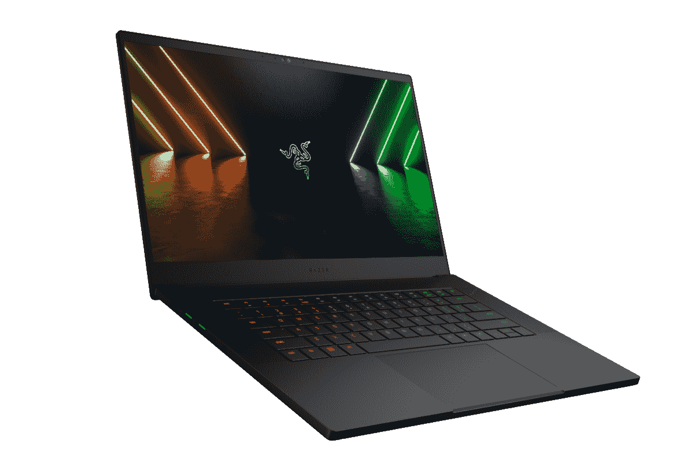

# 雷蛇 Blade 15 (2022) vs 戴尔 XPS 15 (2021):你该买哪一款笔记本电脑？

> 原文：<https://www.xda-developers.com/razer-blade-15-2022-vs-dell-xps-15/>

在今年的 CES 上，Razer 公布了其大多数 Blade [游戏笔记本电脑](https://www.xda-developers.com/best-gaming-laptops/)的 2022 版本，包括新的 Blade 15。这是[最好的 15 英寸笔记本电脑](https://www.xda-developers.com/best-15-inch-laptops/)之一，尤其是对游戏玩家来说，对内容创作者来说也是如此。但它在这一领域并不孤单，戴尔 XPS 15 (2021)是另一款非常受欢迎且相当强大的创作者用[笔记本电脑。如果你想买一台新的笔记本电脑来完成一些高要求的工作，这两款都是不错的选择。你应该买 Razer Blade 15 (2022)而不是 Dell XPS 15 (2021)吗？让我们找出答案。](https://www.xda-developers.com/best-creator-laptops/)

我们现在要说的一件事是，XPS 15 尚未与英特尔和英伟达在 CES 2022 上宣布的新硬件一起更新，所以这场比赛一开始就有利于 Razer。然而，比较两者会发现一些重要的差异，当 XPS 15 最终升级时，这些差异可能仍然适用。这样，你就可以决定是否值得等待 XPS 15 的更新，或者是否应该在 Razer Blade 15 上市时购买它。事不宜迟，让我们开始比较吧。

## 规范

|  | 

雷蛇之刃 15 (2022)

 | 

戴尔 XPS 15 (9510)

 |
| --- | --- | --- |
| **CPU** | 

*   第 12 代英特尔酷睿 i7-12800H (14 个内核，20 个线程，最高 4.8GHz，24MB 高速缓存)
*   第 12 代英特尔酷睿 i9-12900HK (14 个内核，20 个线程，最高 5GHz，24MB 高速缓存)

 | 

*   英特尔酷睿 i5-11400H(最高 4.5GHz，6 核)
*   英特尔酷睿 i7-11800H(最高 4.8GHz，8 核)
*   英特尔酷睿 i9-11900H(最高 4.9GHz，8 核)

 |
| **图形** | 

*   离散:
    *   英伟达 GeForce RTX 3060 (6GB GDDR6)
    *   NVIDIA GeForce RTX 3070 Ti(8GB gddr 6)
    *   英伟达 GeForce RTX 3080 Ti (16GB GDDR6)
*   集成:

 | 

*   离散:
    *   NVIDIA GeForce RTX 3050 4GB gddr 6(45W)
    *   NVIDIA GeForce RTX 3050 Ti 4GB gddr 6(45W)
*   集成:

 |
| **存储** | 

*   1TB PCIe 第四代 NVMe 固态硬盘(可升级)
    *   打开 M.2 插槽进行扩展(最高 2TB)

 | 

*   512GB PCIe NVMe 固态硬盘
*   1TB PCIe NVMe 固态硬盘
*   2TB PCIe NVMe 固态硬盘
*   4TB PCIe NVMe 固态硬盘
*   8TB PCIe NVMe 固态硬盘

 |
| **闸板** | 

*   16GB 双通道 DDR5 4800MHz(带插槽，可升级至 64GB)

 | 

*   8GB 双通道 DDR4 3200MHz(插槽)
*   16GB 双通道 DDR4 3200MHz(带插槽)
*   32GB 双通道 DDR4 3200MHz(带插槽)
*   64GB 双通道 DDR4 3200MHz(带插槽)

 |
| **显示** | 

*   15.6 英寸全高清(1920 x 1080) IPS，360 赫兹，高达 100% sRGB
*   15.6 英寸四核高清(2560 x 1440) IPS，240 赫兹，NVIDIA G-SYNC，100% DCI-P3
*   15.6 英寸超高清(3840 x 2160) IPS，144 赫兹，100% DCI-P3，康宁大猩猩玻璃

 | 

*   15.6 英寸，全高清+ (1920 x 1200)，InfinityEdge，防眩光，非触摸，500 尼特
*   15.6 英寸，3.5K (3456 x 2160)有机发光二极管，独立边缘，防眩光，触摸，400 尼特，100% DCI-P3
*   15.6 英寸，超高清+ (3840 x 2400)，InfinityEdge，防眩光，触摸屏，100% Adobe RGB，94% DCI-P3，500 尼特

 |
| **电池** |  | 

*   3 芯 56 瓦时电池
*   6 芯 86 瓦时电池
    *   90W/130W USB Type-C 电源适配器

 |
| **端口** | 

*   3 个 USB3.2 第二代 A 类端口
*   2 个 Thunderbolt 4 端口(USB-C)
*   1 个 HDMI 2.1 接口
*   1 个 UHS-II SD 读卡器
*   3.5 毫米耳机插孔
*   电源端口

 | 

*   2 个 Thunderbolt 4(USB C 类)端口
*   1 个 USB 3.2 第二代 C 类端口
    *   包含 USB Type-C 至 Type-A 和 HDMI 2.0 适配器
*   SD 读卡器
*   3.5 毫米耳机插孔

 |
| **音频** |  | 

*   四声道立体声扬声器(两个 2.5 瓦低音扬声器，两个 1.5 瓦高音扬声器)

 |
| **网络摄像头** | 

*   1080p 全高清网络摄像头+红外摄像头

 | 

*   2.25 毫米 720p 高清摄像头+红外摄像头

 |
| **Windows Hello** | 

*   使用红外摄像头进行面部识别

 | 

*   使用红外网络摄像头进行面部识别
*   指纹传感器

 |
| **连通性** |  | 

*   黑仔 Wi-Fi 6 AX1650 (2×2)
*   蓝牙 5.1

 |
| **颜色** | 

*   黑色带绿色 Razer 标志

 | 

*   铂金银外观+黑色碳纤维内饰
*   霜冻外观+北极白色玻璃纤维编织内饰

 |
| **尺寸(WxDxH)** | 

*   355 x 235 x 16.9 毫米(13.98 x 9.25 x 0.67 英寸)

 | 

*   344.72 x 230.14 x 18 毫米(13.57 x 9.06 x 0.71 英寸)

 |
| **起始重量** | 

*   2.01 千克(4.4 磅)(大多数 SKU)
*   2.08 千克(4.59 磅)(4K 显示屏)

 | 

*   1.81 千克(3.99 磅)(非触摸式 56 瓦时电池)
*   1.91 千克(4.22 磅)(非触摸式 86 瓦时电池)
*   1.96 千克(4.31 磅)(有机发光二极管，86 瓦时电池)
*   2.01 千克(4.42 磅)(UHD+86 瓦时电池)

 |
| **价格** | 起价 2499.99 美元 | 起价 1299 美元 |

很快，你就可以看出这两款笔记本电脑在规格和价格上有很大的差异。这些差异应该有助于明确哪种模式适合您，所以让我们更深入地了解它们对您的意义。

## 性能:Razer Blade 15 是一款动力强劲的产品

巨大的差异从性能开始。通过最新的更新，Razer Blade 15 配备了第 12 代英特尔酷睿处理器，最高可达酷睿 i9-12900HK。这些新的英特尔处理器采用混合架构，混合了高性能和高效内核，总共有 14 个内核和 20 个线程。与此同时，戴尔 XPS 15 仍在使用第 11 代处理器，最高可达酷睿 i9-11900H，8 核 16 线程。我们还没有直接比较这两种处理器的基准，但英特尔声称酷睿 i9-12900H 比酷睿 i9-11980HK 快大约 30%，如下所示。

图形性能的差异也很显著。Razer Blade 15 最高配有 NVIDIA GeForce RTX 3080 Ti，它具有 7424 个 CUDA 内核和 16GB 的 GDDR6 内存。即使是最低配置的 RTX 3060，也包含 3840 个 CUDA 内核和 6GB 内存。相比之下，戴尔 XPS 15 的最高配置是 GeForce RTX 3050 Ti，具有 2560 个 CUDA 内核和 4GB 内存。

Razer Blade 15 (2022)自然会比戴尔 XPS 15 的性能好得多，但这也会以电池寿命为代价。它有一个大电池，但它肯定会更快地耗尽。正如你所料，这些高性能 GPU 的功耗要高得多。

另一方面，Dell XPS 15 为开箱即用的内存和存储配置提供了更多选项。您可以为笔记本电脑配置高达 64GB 的开箱 RAM，以及高达 8TB 的存储和两个固态硬盘。与此同时，Razer Blade 15 更加精简——它配备了 16GB 的内存和 1TB 的存储空间。但是，您可以在事后自己升级这些规格，最高可达 64GB 内存和 4TB 存储。由于支持 DDR5 和 PCIe 第四代固态硬盘，Razer Blade 15 还具有更快的 RAM，但这些也是新版 XPS 15 可能会有的。

## 显示器:Razer Blade 15 用于游戏，XPS 15 用于工作

这两款笔记本电脑的显示屏也有很大不同，在这里，你可能会更清楚自己应该得到什么。Razer Blade 15 (2022)为您提供了三种选择:全高清 360Hz、四高清 240Hz 或 4K 144Hz。这些都是专注于游戏的显示器，具有高刷新率和高分辨率，可满足您的特定偏好。它们都采用 16:9 的宽高比，这是游戏中最流行的外形。它们也都是 IPS 面板，而去年的型号提供了更适合创作者的 4K 有机发光二极管版本。

另一方面，戴尔 XPS 15 可能在纸面上没有那么令人印象深刻，但它更专注于生产力和工作。它的长宽比为 16:10，额外的垂直空间有助于您一次看到更多的文本和 UI 元素。所有面板都有 60Hz 的刷新率，你可以在全高清+ IPS 面板、3.5K 有机发光二极管版本或超高清超高清+ IPS 面板之间进行选择。较低的刷新率很明显表明它不是一款游戏笔记本电脑，但它同样锐利。对于 3.5K OLED 面板，这也是媒体消费的更好显示(而且总体来说更漂亮)。如果您想要进行对颜色敏感的工作，超高清+型号可以覆盖 100%的 Adobe RGB，非常适合。

这可以归结为-Razer Blade 15(2022)非常适合游戏，但如果你的重点是工作，那么戴尔 XPS 15 可能会为你提供更好的服务。在音频方面，两款笔记本电脑都有立体声扬声器设置，但 Blade 15 只有两个扬声器，而戴尔 XPS 15 的设置更令人印象深刻，有四个扬声器(两个低音扬声器和两个高音扬声器)。众所周知，Dell XPS 15 拥有 Windows 笔记本电脑上最好的扬声器之一，因此如果您不打算使用外部音频，这是您的最佳选择。

然而，在显示器上方，雷蛇之刃 15 领先。它配有一个全高清 1080p 网络摄像头和一个红外摄像头，可用于 Windows Hello 面部识别。戴尔的 XPS 15 使用 720p 摄像头，最重要的是，它是一个 2.25 毫米的微型网络摄像头，这样设计是为了尽可能缩小边框。这意味着图像质量不是很好，即使是 720p 的相机。戴尔 XPS 15 仍然支持 Windows Hello 面部识别，但 Blade 15 在这方面明显更好。

## 设计:戴尔 XPS 15 更加便携和专业

谈到设计，Dell XPS 15 巩固了其作为更好的工作笔记本电脑的地位。XPS 系列以非常紧凑而闻名，与 Blade 15 相比，它的长度和宽度都更短。它的起始重量也较轻(3.99 磅对 4.4 磅)，尽管这将因您的配置而异。与 Blade 15 的 16.9 毫米相比，它的厚度也略厚，为 18 毫米。不管怎样，这是一款更便携的笔记本电脑，尽管差距不是很大。

戴尔 XPS 15 也是一款比 Razer Blade 15 (2022)更专业的笔记本电脑，不会令人厌烦，外部有两种色调——铂银(深色)和霜银——内部有黑色碳纤维编织表面或白色玻璃纤维复合材料。这种双色调的外观非常独特，但如果你在办公室工作，它不会以一种不好的方式突出。

另一方面，Blade 15 几乎完全是黑色的，但它的盖子上有一个绿色的 Razer 标志，这可能不是每个人的口味。键盘也是 RGB 背光，尽管没有什么可以阻止你像普通笔记本电脑一样将灯设置为白色。

## 端口和连接:刀片式服务器 15 更方便

最后，端口选择可能是 Dell XPS 15 的最大弱点，而刀片式服务器 15 在这方面的能力要强得多。Razer Blade 15 有两个 Thunderbolt 4 端口、三个 USB Type-A 端口、HDMI 2.1、一个 SD 读卡器和一个 3.5 毫米组合耳机插孔。这几乎涵盖了你可能有的任何需求，而且所有这些端口也很快。

戴尔 XPS 15 非常依赖 Thunderbolt 和坞站。它有两个 Thunderbolt 4 (USB Type-C)端口，一个标准 USB Type-C 端口，一个耳机插孔和一个 SD 读卡器。公平地说，戴尔在包装盒中提供了 USB Type-C 到 Type-A 和 HDMI 适配器，因此如果您需要这些端口，您并不是完全没有选择。但 Razer Blade 15 当然更方便，因为它内置了所有端口，而且数量更多。如果你想用 XPS 15 进行办公设置，你可能需要购买一个 [Thunderbolt dock](https://www.xda-developers.com/best-thunderbolt-docks/) 。

至于无线连接，Razer Blade 15 更现代一些，但这是 XPS 15 在 2022 年更新时将赶上的。Blade 15 (2022)支持 Wi-Fi 6E，而 XPS 15 仍然自带 Wi-Fi 6。

## 结果

很明显，与戴尔 XPS 15 相比，Razer Blade 15 在许多技术层面上都是更好的笔记本电脑。它有更新更快的处理器，更好的显卡，高刷新率的显示器，更好的网络摄像头和更多的端口。这些都是明显的优点，但是它们中的一些也是刀片 15 首先被刷新的结果。戴尔 XPS 15 可能很快就会采用这些新处理器，而且其他方面也可能会有所改进。

但即使在目前的状态下，XPS 15 也确实有一些优势。首先，它有更高的 16:10 显示屏，这对提高工作效率很有帮助。此外，如果您计划处理对颜色敏感的项目，它还为您提供了令人惊叹的有机发光二极管选项或 100% Adobe RGB 的超高清+面板。这也是一款更专业的笔记本电脑，可能更容易携带。至于内部规格，如果您不想以后自己升级，可以配置更多的 RAM 和存储空间。

戴尔 XPS 15 的起价也低得多，这自然是因为它的基本型号也没有那么强大。如果你需要尽可能多的功率，很明显 Razer Blade 15 是一款更好的笔记本电脑，特别难以推荐 XPS 15，因为它现在已经过时了。不过，它仍然是一款出色的笔记本电脑，如果你不需要所有这些功能，它是一个很好的选择，尽管我们建议等到 2022 年 XPS 15 更新后再购买。

不管你喜欢哪一种，你都可以买下面这两款笔记本电脑。如果你确实想要戴尔 XPS 15，你可能需要等待，看看它是否会很快更新到 2022 年。也就是说，现在的模式根本不会给你不好的体验。

 <picture></picture> 

Razer Blade 15 (2022)

##### 雷蛇之刃 15 (2022)

Razer Blade 15 (2022)由英特尔第 12 代酷睿处理器提供，具有 14 个内核和 20 个线程，加上快速 DDR5 RAM。它有一个高达 4K 144 赫兹的显示器。

 <picture></picture> 

Dell XPS 15 (9520)

##### 戴尔 XPS 15 (2021 年)

Dell XPS 15 是一款功能强大的紧凑型顶级笔记本电脑，配有 16:10 显示屏，包括有机发光二极管选项。