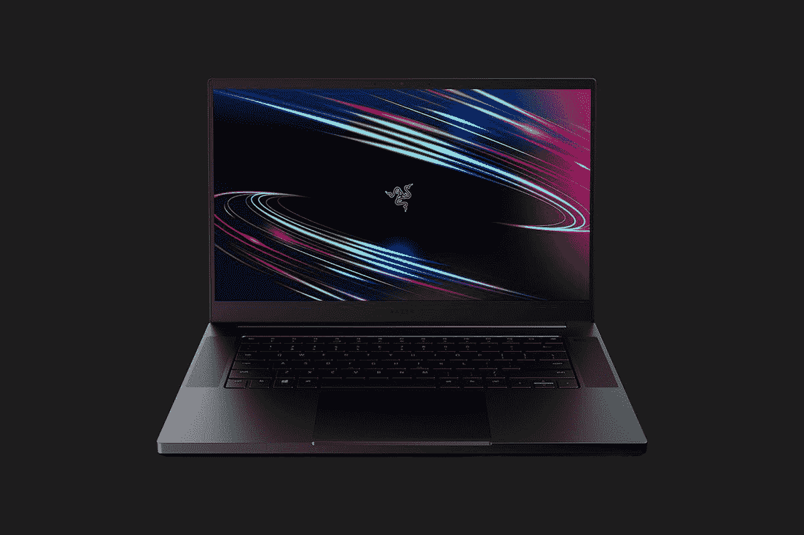

# Razer Blade 15 基础版现在在亚马逊上便宜 300 美元！

> 原文：<https://www.xda-developers.com/razer-blade-15-base-edition-black-friday-sale-amazon/>

Razer Blade 15 已经在我的愿望清单上整整三年了。但我总是回避点击购买按钮，因为它的溢价标签。我知道我不是唯一有这种感觉的人。这就是为什么我非常兴奋地为您带来 Razer Blade 15 Base Editon 的黑色星期五交易，它将轻薄的游戏笔记本电脑从其常规零售价 1600 美元降至仅 1300 美元。

 <picture></picture> 

Razer Blade 15 Base (GTX 1660 Ti)

##### 雷蛇之刃 15 基础版

凭借第 10 代英特尔酷睿 i7 CPU、NVIDIA GeForce GTX 1660 Ti 显卡和 144Hz 高刷新率显示屏，Razer Blade 15 基础版价格仅为 1300 美元，非常划算。如果你有兴趣买一个，不要拖延，因为黑色星期五交易将在不到 16 小时内到期。

Razer Blade 15 基础版采用了与该公司产品线中其他笔记本电脑相同的时尚设计，一个[英特尔](https://www.xda-developers.com/tag/intel/)酷睿 i7-10750H 六核 CPU，[英伟达](https://www.xda-developers.com/tag/nvidia/)GeForce GTX 1660 Ti GPU，以及高刷新率 1440Hz 显示器。尽管外形小巧，但这款笔记本电脑采用 15.6 英寸显示屏，4.9 毫米超薄边框，100% sRGB 覆盖。

Razer Blade 15 上的 Core i7-10750H CPU 搭配了 16GB DDR4-2933MHz 双通道内存和 256GB M.2 NVMe 固态硬盘。这款笔记本电脑配备了一个宽敞的 TKL 键盘，支持 Razer Chroma RGB，内置前置立体声扬声器和一个大型精密触控板。在 I/O 端口方面，该笔记本电脑具有 2 个 USB 3.1 Type-A Gen 1 端口、2 个 USB 3.2 Type-C Gen 2 端口、1 个雷电 3 端口和 1 个 3.5 毫米耳机/麦克风组合插孔。

在连接方面，Razer Blade 15 基础版具有英特尔无线 ax 201(802.11 a/b/g/n/AC/ax)Wi-Fi、蓝牙 5.1 和千兆以太网端口。其他功能包括支持 Razer Synapse 3 进行键盘定制，Kensington 安全插槽和 720p 内置网络摄像头。

如果你想知道 Razer Blade 15 基础版是否能够在这种硬件配置下玩你最喜欢的游戏，这里有几个笔记本电脑的性能指标:67 fps 的《古墓丽影的崛起》(1080p，非常高)，130 fps 的《生化奇兵无限》(1080p，Ultra)，52 fps 的《巫师 3》(1080 p，Ultra)，65 fps 的《刺客 2》(1080 p，High)。

就电池寿命而言，Razer Blade 15 基础版配备了令人尊敬的 65 瓦时电池，在正常使用的情况下，可以轻松持续约 5 小时。虽然笔记本电脑不支持快速充电，但你可以在 1.5 小时内将电池充满。