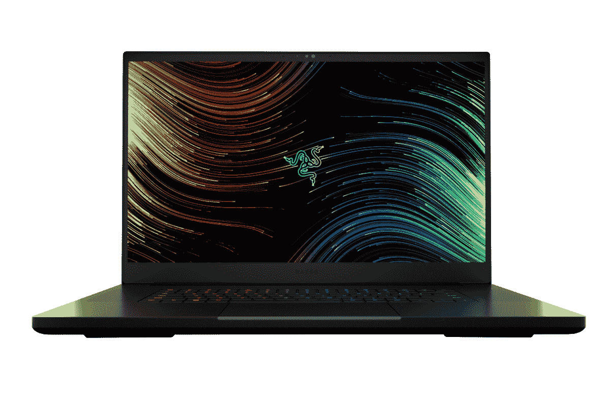

# 雷蛇 Blade 17 vs MacBook Pro 16:你该买哪个？

> 原文：<https://www.xda-developers.com/razer-blade-17-2022-macbook-pro/>

选择下一台电脑并不总是容易的，尤其是当你投资购买一台有点昂贵的设备时。有很多像样的[笔记本电脑](https://www.xda-developers.com/best-laptops/)、[MAC 电脑](https://www.xda-developers.com/best-macs/)和[游戏笔记本电脑](https://www.xda-developers.com/best-gaming-laptops/)——决定哪一款适合你可能会令人困惑。为了让你的选择过程更简单，我们分解了 Razer 和 Apple 生产的两个强大产品。这是雷蛇 Blade 17 vs MacBook Pro 16:Pro 笔记本电脑之战。

## 雷蛇 Blade 17 vs 苹果 MacBook Pro 16:规格

|  | 雷蛇之刃 17 | 苹果 MacBook Pro 16 |
| --- | --- | --- |
| **CPU** | 

*   第 12 代英特尔酷睿 i7-12800H (14 个内核，20 个线程，最高 4.8GHz，24MB 高速缓存)
*   第 12 代英特尔酷睿 i9-12900HK (14 个内核，20 个线程，最高 5GHz，24MB 高速缓存)

 | 

*   苹果 M1 专业版(10 核 CPU)
*   苹果 M1 Max (10 核 CPU)

 |
| **图形** | 

*   集成:
*   离散:
    *   英伟达 GeForce RTX 3060 (6GB GDDR6)
    *   NVIDIA GeForce RTX 3070 Ti(8GB gddr 6)
    *   英伟达 GeForce RTX 3080 Ti (16GB GDDR6)

 | 

*   苹果 M1 专业版(16 核 GPU)
*   苹果 M1 Max (24 核 GPU)
*   苹果 M1 Max (32 核 GPU)

 |
| **正文** | 

*   19.9 x 395 x 260mm 毫米
*   2.75 千克

 | 

*   16.8 x 355.7 x 248.1mm 毫米
*   M1 专业版 2.1 千克，M1 最大版 2.2 千克

 |
| **显示** | 

*   17.3 英寸全高清(1920 x 1080) IPS，360 赫兹，100% sRGB，300 尼特
*   17.3 英寸四核高清(2560 x 1440) IPS，165 赫兹，100% sRGB，300 尼特
*   17.3 英寸四核高清(2560 x 1440) IPS，240 赫兹，100% DCI-P3，300 尼特
*   17.3 英寸超高清(3820 x 2160) IPS，144 赫兹，100% Adobe RGB，400 尼特

 | 

*   16.2 英寸 Liquid Retina XDR 显示屏(3456 x 2234)，峰值亮度高达 1600 尼特，True Tone 技术，自适应刷新率高达 120Hz 的提升技术

 |
| **端口** | 

*   3 个 USB-A
*   2 个 USB-C
*   HDMI 2.1
*   RJ45 2.5Gb 以太网
*   UHS-II SD 读卡器
*   3.5 毫米耳机插孔
*   电源端口
*   肯辛顿船闸口

 | 

*   3 个 USB-C，带电源和显示端口
*   高清晰度多媒体接口
*   3.5 毫米耳机插孔
*   MagSafe 3
*   SD 卡插槽

 |
| **存储** |  |  |
| **闸板** |  |  |
| **电池** |  |  |
| **音频** |  | 

*   播放 Dolby Atmos 内容时，高保真六扬声器音响系统具有力抵消低音扬声器和空间音频支持

 |
| **摄像机** | 

*   全高清 1080p
*   用于面部识别的红外网络摄像头

 |  |
| **连通性** |  |  |
| **颜色** | 

*   黑色，盖子上有绿色 Razer 标志

 |  |
| **价格** |  |  |

## 设计

设计是一件主观的事情，但是我们仍然可以做出客观的观察和判断。由于它们拥有非凡的处理能力，这两款笔记本电脑都采用了相对较厚的铝制结构。不过值得注意的是，与 MacBook Pro 相比，Razer Blade 17 的显示屏下巴更大。后者包括一个容纳网络摄像头的顶部凹口，这使得顶部挡板也更薄。两款设备两侧的挡板都非常薄，只有顶部和底部的挡板不同。

在很大程度上，Razer Blade 17 和 16 英寸 MacBook Pro 都提供了相同的设计——除了我们之前指出的。如果你是 RGB 背光键盘的粉丝，那么 Razer 会获得更多积分。这两款笔记本电脑都带有各种端口来连接外部附件。Razer 仍然包括 USB-A 端口，而 MacBook 没有。因此，如果你依赖 USB-A 配件，你可能会考虑 Razer，因为没有加密狗，你无法将它们连接到 Mac。苹果的 Pro 电脑赚得更多——它有银色和太空灰两种颜色。另一方面，雷蛇只有黑色。无论哪种方式，你总是可以买一个皮肤或外壳来改变你的电脑的外观。

## 显示

说到显示器，这些设备各有优缺点。16 英寸的 MacBook Pro 配备了令人惊叹的 3456 x 2234 屏幕，边角干净圆润。相反，Razer Blade 17 的基本型号具有 1920 x 1080 的分辨率和传统的直角。就我个人而言，我觉得圆形的更有吸引力和现代感，但每个人都有自己的特色。

如果你是一个活跃的游戏玩家，更高的刷新率意味着更流畅的游戏体验。虽然 MacBook Pro 支持 120hz——得益于其推广显示技术——但 Razer Blade 17 在基本型号上以高达 360Hz 的频率击败了它。然而，MacBook Pro 的峰值亮度为 1600 尼特，而其竞争对手的亮度不超过 400。因此，如果你在明亮的环境中工作，你可能会考虑 Mac。如果你经常玩游戏，考虑到更平滑的刷新率，Razer 可能对你更有意义。哪种显示器更好取决于你是想要更高的分辨率和亮度还是更平滑的刷新率。

## 表演

根据您选择的配置，性能会有所不同。这两款笔记本电脑的基本型号都有强大的功能，但 MacBook Pro 在*达到最大值*时拥有 M1 Max 芯片的优势。Razer Blade 17 尚未上市，因此日常任务中的基准测试结果和准确性能比较仍然有限。

谈到存储，苹果的 Pro 笔记本电脑配有 512GB，而 Razer 的配有 1TB。不过雷蛇只能升级到 4TB，而 MacBook Pro 最多可以打包 8TB(！).因此，如果你打算在笔记本电脑上本地存储**大量**大文件，MacBook Pro 提供了更多的存储选项。苹果的笔记本电脑配备了 16GB 的内存，但它可以升级到 64GB。相反，Razer Blade 17 的基本型号配有 32GB，但也可以升级到 64GB。

MacBook Pro 运行的是 [macOS Monterey](http://xda-developers.com/macos-monterey) ，而 Razer Blade 17 搭载的是 [Windows 11](http://xda-developers.com/windows-11) 。我们不会比较这两个操作系统，因为它们都提供了桌面操作系统所能提供的主要功能。哪一个更好取决于您的工作流、用例以及您所处的生态系统(假设您是)。macOS Monterey 和 Windows 11 分别是苹果和微软的最新产品。因此，无论购买哪种设备，你都可以利用每家公司提供的最新功能和安全补丁。不过，值得一提的是，macOS 和 Mac 都是由苹果公司开发和生产的，这导致了近乎完美的优化和兼容性。

## 结果

MacBook Pro 16 比 Razer Blade 17 便宜 200 美元。前者起价 2499 美元，而后者起价 2699 美元——所以如果你的预算有限，如果你选择 Mac，你可以节省这笔钱。正如我们所强调的，它们都有自己独特的优点和缺点。哪种设备适合你取决于你愿意做出的妥协和你的优先考虑。最终，他们都是不会让人失望的发动机。

 <picture></picture> 

Razer Blade 17

##### 雷蛇之刃 17

Razer Blade 17 是一款运行 Windows 的强大游戏笔记本电脑。它有几种配置供您选择。

 <picture></picture> 

MacBook Pro 16

##### 苹果 MacBook Pro 16 英寸(2021)

16 英寸的 MacBook Pro 采用苹果 M1 Pro 或 M1 Max 芯片。它运行 macOS Monterey，并有一个顶部缺口，容纳网络摄像头。

*您会购买哪种专业笔记本电脑，为什么？请在下面的评论区告诉我们。*