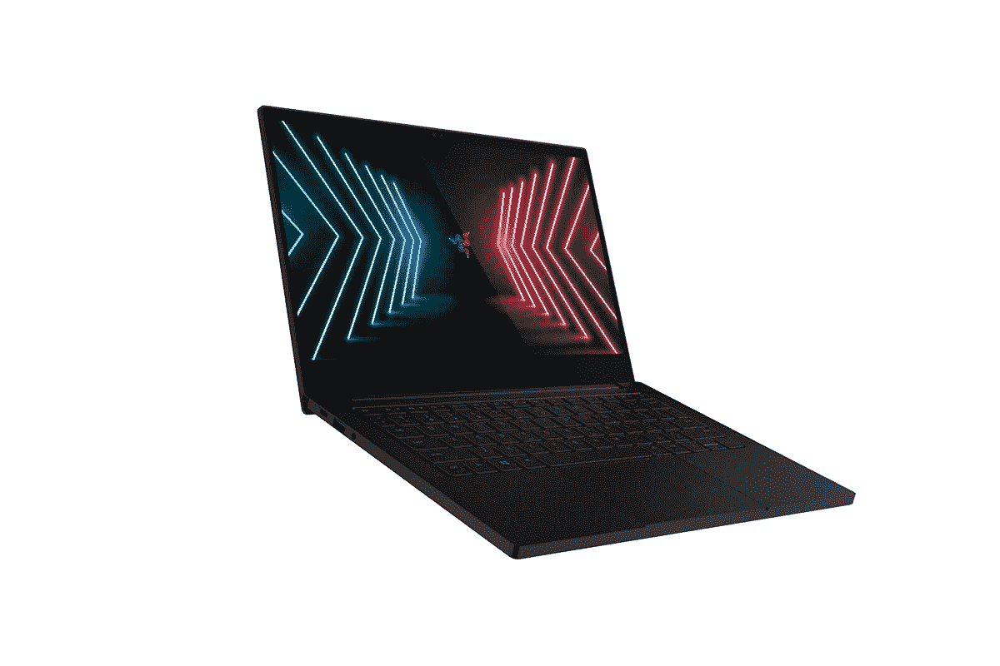

# 最新的 Razer Blade Stealth 13 在黑色星期五优惠 500 美元

> 原文：<https://www.xda-developers.com/razer-blade-stealth-500-off-black-friday/>

Razer 的轻薄游戏笔记本电脑 Blade Stealth 13 将在这个黑色星期五获得 500 美元的优惠。该协议适用于 LCD 和有机发光二极管型号，分别降至 1299 美元和 1499 美元。从我们所能找到的来看，这是这些型号有史以来的最低价格，这使他们不需要动脑筋就能购买。

有机发光二极管型号配备了全高清面板和 60 赫兹的刷新率，就像笔记本电脑上的大多数有机发光二极管面板一样。有机发光二极管意味着你得到真正的黑色、鲜艳的色彩和高对比度。该型号还包括触摸支持，因此非常适合更注重工作效率的用户。

 <picture></picture> 

Razer Blade Stealth (OLED Touch)

##### 雷蛇之刃隐形 13

Razer Blade Stealth 在轻薄的机箱中集成了强大的规格，有机发光二极管型号包括触摸支持。

LCD 型号配有 120Hz 刷新率的全高清面板，但不支持触摸。如果您认为帧速率比显示器的其他方面更重要，这是一个理想的选择，如果您更喜欢游戏，可能会出现这种情况。这个在亚马逊不打折，但是你可以在下面找到。

 <picture></picture> 

Razer Blade Stealth 13 ($500 off)

##### 雷蛇之刃隐形 13

包装强大的规格和 120 赫兹显示器，这是一个伟大的轻薄笔记本电脑的游戏玩家。

除了展示之外，这两款机型都很相似，都很棒。您将获得最新的四核八线程英特尔酷睿 i7-1165G7 处理器，以及用于显卡的 NVIDIA GeForce GTX 1650 Ti。当然，它可能不是 RTX，但对于这种轻薄小巧的笔记本电脑来说，它仍然令人印象深刻，非常强大。您还可以获得 16GB 的 RAM 和 512GB 的 SSD 存储，因此您在各方面都会做得很好。

例如，如果你需要更多的电力，Razer Blade Stealth 还包括两个 Thunderbolt 4 端口，用于充电或连接外部 GPU。您还可以获得两个用于外设的 USB 型端口。作为奖励，这是少数几个没有完全忽略网络摄像头的游戏笔记本电脑之一，你甚至可以在两个型号中获得 Windows Hello 面部识别。还有一个四扬声器的声音设置。

从设计角度来看，Blade Stealth 应该是柔和的，所以外部没有浮华的颜色，并且只有单区 RGB 背光，所以你可以轻松地让它看起来很专业。它的厚度仅为 15.3 毫米，重量为 3.11 磅，所以正如我们提到的，它也非常便携。

如果 Razer Blade Stealth 不适合你，请查看我们的[黑色星期五](https://www.xda-developers.com/black-friday/)交易中心，找到更多各种产品的交易。