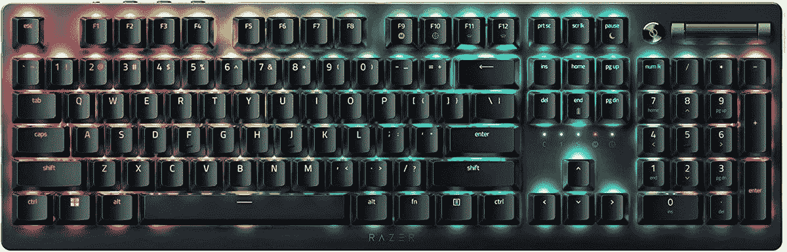

# Razer 推出了带有新光学开关的死亡跟踪者 V2 键盘

> 原文：<https://www.xda-developers.com/razer-deathstalker-v2-keyboard-optical-switches/>

Razer 已经宣布了新的死亡追踪者 V2 系列键盘，旨在高端游戏，采用该公司的新光学开关。该系列有三种型号:标准的死亡跟踪者 V2、死亡跟踪者 V2 Pro 和死亡跟踪者 V2 Pro ten keyles。

该系列的所有成员都采用了新的光学开关，这是这些产品的主要特点。这些薄型开关使用红外线光束来更准确地检测每个按键的驱动点，同时还减少了按键元件之间的物理接触，从而减少了长时间的磨损。这使得精确的动作和增强的耐用性成为可能，这些按键被评定为能够经受 7000 万次击键。

有两种开关可供选择，一种是线性开关，另一种是 clicky 开关。线性开关的驱动点为 1.2 毫米，总行程为 2.8 毫米，只需 45 克的力即可驱动。clicky 开关在 1.5 毫米处启动，并在该点提供触觉反馈，但它们也可以移动完整的 2.8 毫米，因此它们不会立即触底。这些需要更多的力，在 50 克。

专业版和非专业版的关键区别在于，专业版键盘使用 Razer 的 HyperSpeed 无线连接，这是一种自定义的 2.4GHz 连接，延迟更低，此外还支持蓝牙或有线 USB Type-C 连接。非专业型仅有线。对于 Pro 型号，充电后电池寿命可达 40 小时，而没有数字键盘的 Tenkeyless 型号可持续 50 小时。

 <picture></picture> 

Razer DeathStalker V2 Pro TKL

除了这些差异，这三个版本的键盘几乎完全相同。它们采用低调设计，顶部外壳由 5052 系列铝制成，所有型号都支持 Razer Chroma RGB 逐键照明。此外，它们还有一个多功能媒体按钮和一个滚轮，可以用来快速调节音量或其他控制。

这三种键盘今天已经上市，雷蛇死亡追踪者 V2 售价 199.99 美元，V2 Pro Tenkeyless landing 售价 219.99 美元，全尺寸 V2 Pro 售价 249.99 美元。可以在下面买。如果你想要更实惠的东西，该公司最近也推出了 Ornata V3 机甲薄膜键盘系列。

 <picture></picture> 

Razer DeathStalker V2 series

##### 雷蛇死神卫 V2

Razer DeathStalker V2 系列采用了 Razer 的新光学开关，可提供精确的驱动和高达 7000 万次按键的耐用性。