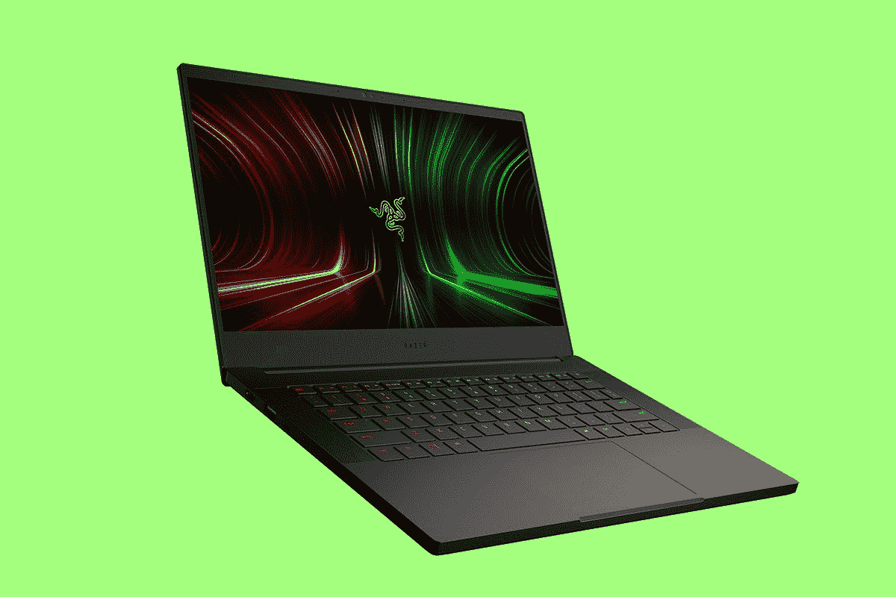

# Razer 发布首款基于 AMD 处理器的游戏笔记本电脑锐龙 5000

> 原文：<https://www.xda-developers.com/razer-first-amd-gaming-laptop-ryzen-5000/>

Razer 传统上是一家英特尔商店，至少就其个人电脑而言。事实上，直到最近，它只在其笔记本电脑中使用过 45W 的 Core i7。正如该公司曾经告诉我的那样，它知道什么对它有效，它会继续这么做。现在，它推出了首款 AMD 笔记本电脑，新的 Razer Blade 14。

| 

操作系统（Operating System）

 | Windows 10 主页 |
| 

制图法

 | -英伟达 GeForce RTX 3060 笔记本电脑 GPU (6GB VRAM) 100W TGP-英伟达 GeForce RTX 3070 笔记本电脑 GPU (8GB VRAM) 100W TGP-英伟达 GeForce RTX 3080 笔记本电脑 GPU (8GB VRAM) 100W TGP |
| 

处理器

 | AMD 锐龙 9 5900HX 处理器 8 核/ 16 线程，3.3GHz 基本频率，4.6GHz 最大提升频率 |
| 

14 英寸显示屏(16:9，单独校准)

 | FHD(1920 x 1080)16:9-144 赫兹刷新率-AMD freesync TM Premium-IPS-grade-高达 100% sRGB | QHD(2560 x 1440)-165 赫兹刷新率-AMD freesync TM Premium-IPS-等级-高达 100% DCI-P3 |
| 

储存；储备

 | 1TB 固态硬盘(M.2 NVMe PCIe 3.0 x4) |
| 

内存–板载固定

 | 16GB DDR4-3200MHz |
| 

连通性

 | Wi-Fi 6E，蓝牙 5.2 |
| 

输入和输出

 | - 2 个 USB 3.2 Gen 2 Type-C，带电源传输*和显示端口 1.4 - 2 个 USB 3.2 Gen 2 Type-A 端口- HDMI 2.1 输出*支持 20V USB-C 充电器充电，带 PD 3.0 |
| 

电池

 | 内置 61.6 瓦时可充电锂离子聚合物电池 |
| 

键盘

 | Razer Chroma N 键翻转背光键盘支持每键 RGB |
| 

触摸屏设备

 | 精密玻璃触摸板 |
| 

网络摄像头

 | 内置摄像头，Windows Hello，红外高清(1MP / 720P) |
| 

声音的

 | -内置立体声扬声器-3.5 毫米耳机/麦克风组合端口-内置阵列麦克风- THX 空间音频- 7.1 编解码器支持(通过 HDMI) |
| 

附加功能

 | Razer Synapse 3 支持可编程键盘可信平台模块(TPM) 2.0KensingtonTM 安全插槽 |
| 

结束

 | 阳极氧化黑色，带背光绿色标志和绿色 USB 端口 |
| 

近似的尺寸(高 x 深 x 宽)

 | 0.66 英寸 x 8.66 英寸 x 12.59 英寸 16.8 毫米 x 220 毫米 x 319.7 毫米 |
| 

力量

 | 紧凑型 230 瓦电源适配器 |

Razer 选择在 Blade 14 中使用的 AMD 处理器是锐龙 9 5900HX，这是一款具有 16 个线程和 4.6GHz 主频的八核处理器。该公司承诺它不仅功能强大，而且电池寿命仍将达到 12 小时。

作为一款 14 英寸的游戏笔记本电脑，Razer 在这方面做了很多。该公司指出，这种外形的大多数个人电脑只提供高达 NVIDIA GeForce RTX 3060 GPU，但新的 Blade 14 可以达到 RTX 3080。你也可以使用 QHD 165 赫兹的屏幕，这是我们在最新一代 15.6 英寸游戏笔记本电脑中看到的东西。

“当我们在 2013 年推出 Blade 14 时，Razer 向行业提出了更大、更小的挑战。Razer 系统业务部高级副总裁兼总经理 Brad Wildes 表示:“最初的 Blade 14 彻底改变了移动游戏领域，赢得了十年最佳笔记本电脑奖，并将我们带到了今天。“新的 Blade 14 旨在通过结合 Razer 在制造超紧凑和高端游戏机方面的十年经验以及 AMD 锐龙移动处理器的能力和效率，再次震撼行业。我们很高兴通过 Razer Blade 14 为游戏玩家带来终极移动游戏体验。”

Razer Blade 14 的厚度为三分之二英寸，因此它是最薄的 14 英寸 RTX 图形游戏笔记本电脑。事实上，这是令人印象深刻的是，它一直到 RTX 3080。

AMD 锐龙驱动的 Razer Blade 14 起价为 1799.99 美元/€1999.99 美元，今天就可以买到。

 <picture></picture> 

Razer Blade 14

##### 雷蛇之刃 14

新的 Razer Blade 14 在超薄机箱中配备了强大的 AMD 锐龙 5000 处理器和 NVIDIA GeForce RTX 3080 显卡

然而还有更多，因为 Razer 还宣布了 USB-C GaN 充电器。

它可以同时为多达四个设备充电，总输出功率为 130 瓦。有两个 USB Type-C 口和两个 USB Type-A 口，通过前者可以得到 100W，通过后者可以得到 18W。这里一个很大的焦点是尺寸，因为该公司将其与相同容量的 MSI 充电器进行了比较，发现它小了 56%。它比 Anker Atom PD4 小 48%。

USB-C GaN 充电器现已上市，售价为 179.99 美元/ €179.99 美元。

最后，我们有 Razer Raptor 27 显示器，这是世界上第一款获得 THX 认证的显示器。它拥有 QHD 分辨率、165Hz 刷新率和 1 毫秒的响应时间，因此很明显，它是为游戏而生的。

但是有了 THX 的认证，雷蛇实际上更注重颜色和色调。从历史上看，游戏显示器往往会全力以赴提高刷新率，为了达到这一目标，它们会牺牲一切。Razer 承诺在 Raptor 27 中提供 95% DCI-P3 宽色域和 HDR400 支持。

Razer Raptor 27 将于第三季度上市，售价为 799.99 美元/ €999.99 美元。