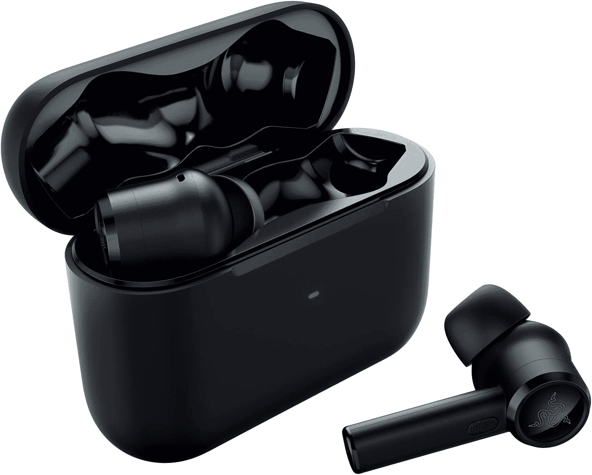

# 雷蛇锤头真无线专业评论:好，但价格昂贵

> 原文：<https://www.xda-developers.com/razer-hammerhead-true-wireless-pro-review/>

你好，还是我，耳塞先生。我今天来找你是为了复习——你猜对了——耳塞！这次是[雷蛇锤头真无线 Pro](https://www.xda-developers.com/razer-hammerhead-true-wireless-pro-launch-date-price/) ，挺有名字的。这些是 Razer 的第二代入耳式真无线耳塞，与第一代相比有很多改进。它们也很贵，售价 200 美元。它们真的值这个价吗？让我们来了解一下！

## Razer 锤头真无线专业版:规格

| 

规格

 | 

Razer 锤头真无线专业版

 |
| --- | --- |
| **主动噪声消除** | 混合物 |
| **低延迟模式** | 60 毫秒 |
| **驱动尺寸** | 10 毫米 |
| **麦克风** | 2 (1 个前馈，1 个反馈) |
| **电池寿命** | 

*   耳塞:使用 ANC 小时
*   案例:4 次完全充电(16 小时)

 |
| **耐水性** | IPX4 |
| **收件箱** | 充电盒，充电电缆 |
| **更换提示** | 

*   SmoothComfort: 1 个小号，1 个中号，1 个大号
*   安全密封:1 个小号，1 个中号，1 个大号
*   符合泡沫:1 中等

 |

* * *

## 第一印象

Razer 在这里的演示做得非常好。虽然这个盒子对里面的东西来说可能有点大材小用，但所有东西都包装整齐，容易拿取。

充电盒很好，很窄，Razer 说这是为了更容易放入紧口袋中。它也很容易打开，耳塞也很容易移除，这是很多其他制造商似乎无法做到的。

至于耳塞本身，我不是 AirPods stem 风格的粉丝，但至少 Hammerhead True Wireless Pro 不是直接的仿冒品。它们可能看起来有点笨重，但它们仍然非常轻便和舒适。

如果预装的耳塞头不适合你的耳朵，那没问题。您可以从另外 6 对 3 种不同尺寸的吸头中挑选。有两种风格的橡胶笔尖——一种更舒适，一种更隔音——和一对记忆泡沫笔尖。泡沫塑料吸头有中号，但它们是泡沫塑料，所以它们应该适合任何耳朵。

开始安装耳塞，谢天谢地，这相当简单。当我拿到我的手机时，我没有正确的应用程序(因为它还没有发布)，我可以使用谷歌的快速配对来快速配对我的手机。

* * *

## 使用

### 感觉和适合

默认情况下，Razer Hammerhead True Wireless Pro 带有相当大的橡胶头，不太适合我的耳朵。幸运的是，还有 6 对不同尺寸的齿尖可供选择。有一套 3 对用于锻炼的吸头，另一套 3 对用于一般用途，最后是一对符合品牌的泡沫吸头。我最终用一双小尺寸的橡胶鞋替换了鞋尖。它们非常舒适。尽管耳塞本身并不小，但它们相当轻，留在我的耳朵里没有太大的麻烦。

### 电池和充电

你可能注意到了，我没有提到任何关于长时间佩戴 Razer Hammerhead True Wireless Pro 的事情，这是有原因的。不幸的是，广告宣传的电池寿命每次充电只有大约 4 小时，而充电外壳的“延长”总时间为 20 小时。现在，这一估计是基于启用主动噪声消除的使用情况，因此禁用该功能可能会将时间延长至 5 或 6 小时。

虽然 4-6 小时对于真正的无线耳塞来说是相当标准的，不管有没有噪音消除，我都不禁感到有点失望。对于 Razer 要求的价格，更长的电池寿命会更好。

至于充电，没什么特别的。Razer 甚至不会承诺估计的充电时间。他们的借口是，由于盒子里没有墙上的适配器，人们将使用不同的适配器和不同的功率输出，导致不同的充电时间。然而，这并没有阻止其他制造商宣传特定电流下的充电时间，所以这是一个奇怪的逻辑。

### 连通性

作为蓝牙耳塞，Razer Hammerhead True Wireless Pro 通过蓝牙连接。但它们也有一些花哨的功能和一些花哨的问题。

一个宣传的功能是能够同时与多达三个设备配对，并在它们之间切换，而不必每次都进入配对模式。它们还带有快速配对功能，所以一旦它们进入配对模式，你所有的 Android 设备都会对你大喊大叫，让你连接到它们。这当然比进入你的蓝牙设置，然后等待设备搜索找到它们要方便得多。

Quick Pair 还可以让你在谷歌的 Find Device 应用程序中“追踪”耳塞。Razer Hammerhead True Wireless Pro 没有 GPS 或类似的东西，但谷歌可以跟踪你的手机在最后一次连接耳塞时的位置。

但是这些耳塞的连接并不都是好的。首先，连接范围非常小。它没有 amaz fit power buds 那么糟糕，但在音频开始消失之前，我真的只能离开大约 10 英尺。这并不是一个大问题，但如果你在一个大房间的环境中工作并经常走动，你将无法使用 Hammerhead True Wireless Pro 而不随身携带你的手机或电脑。

我注意到的第二个问题是，他们似乎在 Windows PCs 上遇到了麻烦。在我的任何一台笔记本电脑上看视频或听音乐时，我都会注意到偶尔出现的失真现象。我离你 2 或 10 英尺远都没关系。如果耳塞与电脑断开连接，他们真的不喜欢自动重新连接。据我所知，这些问题在 Android 上并不存在，但如果你经常在 Windows 上使用耳塞，这是需要记住的事情。

### 应用和控制

像这些天来任何好的(或坏的)真无线耳塞一样，Razer Hammerhead 真无线 Pro 附带了一个应用程序。它可以让您更新耳塞的固件，为您提供教程，允许您更改选项，如触摸控制的功能和应用的均衡，并帮助您完成耳塞的初始设置。老实说，这没什么好说的。它就在那里，而且工作正常。

控件是事情变得有趣的地方。每个耳塞在驱动器的背面都有一个触摸板。您可以按住、轻按、轻按并按住，甚至按住更长时间，以向您的设备发送不同的操作。许多真无线耳塞让我恼火的一点是缺少手势选项。幸运的是，雷蛇锤头真无线专业有很多。您甚至可以在没有外壳的情况下进入配对模式，只需按住任一耳塞 4 秒钟。

到目前为止，这些听起来都很标准。但是单击手势很特别。虽然我用过的大多数真无线耳塞会尽快执行一次点击操作，但 Hammerhead 真无线专业版需要你按住大约半秒钟。起初我对此很恼火，但后来我意识到这是有原因的。通常，当我调整耳朵里的真无线耳塞时，我会刷触摸板，这触发了单次点击动作。在识别单次点击之前有一个延迟意味着我可以调整 Hammerhead True Wireless Pro，而不用担心意外暂停我的音乐或接听电话。非常棒。

* * *

## 声音

### 音频质量

Razer 对 Hammerhead True Wireless Pro 获得 THX 认证感到非常自豪，但这真的意味着什么吗？

所有迹象都指向是。默认的音频配置文件使用 THX 自己的均衡，听起来相当不错。低音很多，但不会淹没其他频率。从音乐到电影的东西听起来都很清晰，嗯，很好。如果我不得不抱怨音频，我会说它有时听起来几乎是空洞的，好像中高频被提升得有点太高了。

我个人对 THX 均衡很满意，但对于那些不满意的人，你可以使用该应用程序在不同的均衡中进行选择，包括设置你自己的均衡。

### 噪声特征

现在该谈谈主动噪声消除了。Razer Hammerhead True Wireless Pro 不是 [Galaxy Buds Live](https://www.xda-developers.com/samsung-galaxy-buds-live-review/) ，因此噪音消除至少是有效的。也挺好的。我想说它和 OPPO Enco Q1 耳塞差不多，都在消除稳定的环境噪音方面做得很好。这显然不是完美的，因为它们不是具有额外噪音隔离工程的耳挂式耳机，但它工作得很好。

如果你不喜欢噪音消除，Razer Hammerhead True Wireless Pro 可以让你在它和其他两种模式之间循环:环境和正常。环境模式使用外部麦克风直接向您传送声音，有效地绕过噪音隔离。如果你正在过马路或骑自行车，这可能是有用的，在那里你需要听到你周围的东西。音质并不惊人，但它几乎没有明显的延迟，这是我在其他环境模式下遇到的问题。

正常模式就是正常模式。没有音频通过或取消，只有橡胶尖提供的基本被动噪音隔离。

### 低延迟

除了音频质量和噪音消除，Razer Hammerhead True Wireless Pro 还具有低延迟游戏模式。Razer 表示，这种模式将音频延迟降至仅 60 毫秒。但说实话，我还没需要过。我不是一个狂热的快速游戏玩家，所以它可能对一些人有用，但标准延迟足够低，我不会注意到它。

### 麦克风质量

如果说无线耳塞有一个缺点，那就是麦克风的质量。我用过听起来很糟糕的耳塞，或者是那些麦克风根本听不到我声音的耳塞。

雷蛇锤头真无线专业没有这些问题。事实上，它们听起来很棒。它们在拾取声音方面做得很好，而忽略了背景音频，并且它们听起来不刺耳。

## 定价和可用性

Razer Hammerhead True Wireless Pro 在美国售价 200 美元。

 <picture></picture> 

Razer Hammerhead True Wireless Pro

##### Tazer 锤头 Pro

Razer Hammerhead Pro True Wireless 是一对优质的耳塞。

## 结论

总的来说，雷蛇锤头真无线专业是相当不错的耳塞。如果电池寿命更长，我个人会更高兴，但音质很好，延迟很低，控制很可靠。

不过，对于 200 美元，我很难向大多数人推荐它们。一副耳塞 200 美元太贵了，而且还有更划算的选择。如果你是 Razer 的粉丝，或者你真的想要一副好听的耳塞，你可能不会错过 Hammerhead True Wireless Pro。