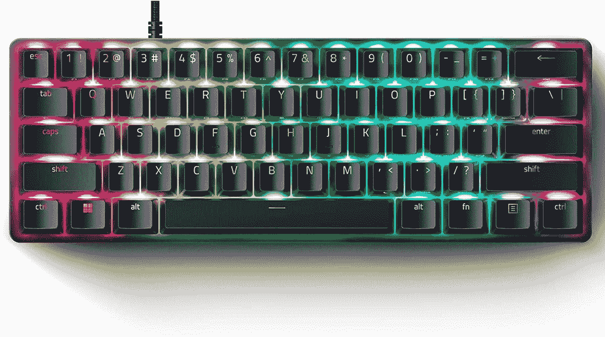

# Razer 用模拟开关升级 Huntsman 迷你键盘

> 原文：<https://www.xda-developers.com/razer-huntsman-mini-analog-keyboard-launch/>

Razer 正在将其模拟按键开关引入 Huntsman Mini——该公司的超紧凑 60%游戏键盘。Razer Huntsman Mini Analog 是该公司为键盘游戏玩家带来不同控制体验的最新努力。Razer 已经将其模拟开关带到了亨斯迈 V2，该版本实际上在配备标准机械开关的[型号之前推出。](https://www.xda-developers.com/razer-huntsman-v2-keyboard-8000hz-polling-rate/)

通常，键盘上的键以二进制方式工作——一个键要么被按下，要么没有被按下。但对于主机游戏玩家来说，模拟控制是大多数控制器上的常见功能。具体来说，控制器背面的触发器通常是模拟的，这意味着它们检测不同水平的压力，而不是简单地激活。与简单的方向键相比，模拟摇杆还能给游戏玩家更精确的控制。

模拟开关的目标是将这种体验带给键盘游戏玩家。按键可以检测不同程度的压力，因此在火箭联盟这样的游戏中，例如，你可以通过完全按下按键来急转弯，或者通过部分按下按键来更轻松地转弯。您还可以设置自定义驱动点，以便一个键可以根据您按下它的力度执行不同的操作。Razer 的 Synapse 软件可用于调整当您按下按键时激活按键所需的压力水平，从 1.5 毫米到 3.6 毫米的行程。

键盘上的模拟开关可以与任何支持游戏手柄的游戏配合使用，因此如果一款游戏已经支持带控制器的模拟控制，它也可以支持 Razer Huntsman Mini Analog。

除了模拟开关，这是同样的亨斯迈迷你之前。它有一个紧凑的 60%设计，这意味着没有箭头键或数字键盘，它通过 USB Type-C 到 Type-A 电缆连接到您的 PC。键盘底盘由铝制成，并使用 Razer 的 Doubleshot PBT 键帽，这应该可以确保按键标签不会随着时间的推移而褪色。

当然，如果没有色度支持，它就不是 Razer 的高端产品，所以它支持每键 RGB 照明。与常规 Razer Hunstman Mini 相比，唯一缺少的是汞白色配色选项。这个只有黑色的。

Razer Huntsman Mini Analog 售价 149.99 美元，比普通的 Huntsman Mini 贵 20 至 30 美元。下面可以买。

 <picture></picture> 

Razer Huntsman Mini Analog

##### 雷蛇猎人迷你

Razer Huntsman Mini Analog 是一款紧凑的 60%键盘，带有模拟开关，可实现更精确的控制。