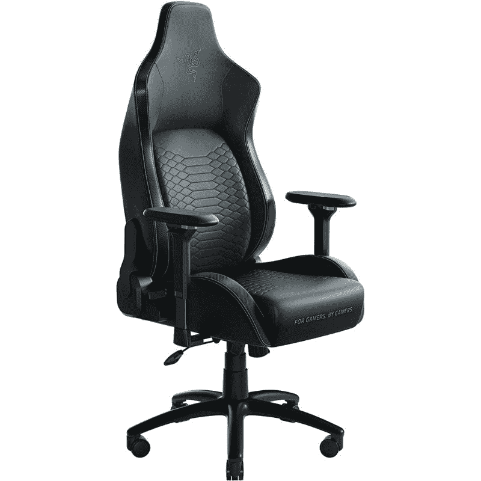
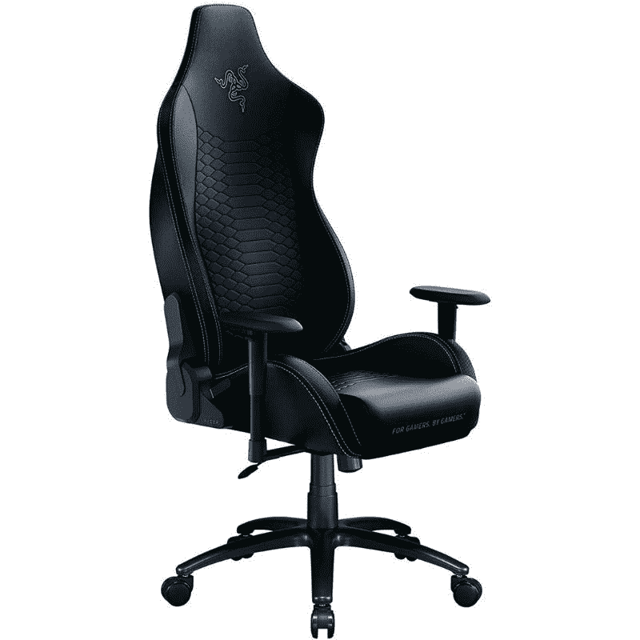

# 在这个黑色星期五，只需 350 美元就能买到 Razer Iskur 人体工程学游戏椅

> 原文：<https://www.xda-developers.com/razer-iskur-ergonomic-gaming-chair-deal-black-friday/>

# 在这个黑色星期五，只需 350 美元就能买到 Razer Iskur 人体工程学游戏椅

如果你在市场上买一个新的游戏椅，那么你可能想看看这个惊人的游戏椅黑色星期五交易。

如果你花太多时间坐在电脑前，那么你可能想买一把好的符合人体工程学的椅子。游戏椅往往比一般的办公椅更好——无论是用于游戏还是日常工作。他们支持正确的坐姿。如果你想在市场上买一把新椅子，我们的[黑色星期五特价商品](https://www.xda-developers.com/black-friday/)系列中有很多优惠。Razer Iskur 游戏椅在亚马逊上的价格降至 350 美元。

 <picture></picture> 

Razer Iskur gaming chair

##### 雷蛇伊斯库尔

Razer Iskur 游戏目前在亚马逊上降到了黑色星期五的最低价格。这是一款非常棒的符合人体工程学的游戏椅，配有可调节的腰部支撑、扶手等。

Razer Iskur 游戏椅的标准价格为 499 美元，下降了 150 美元，这是一款非常划算的高端游戏椅。这是我们见过的这种椅子的最低价了。在典型的 Razer 时尚中，这款椅子是为游戏玩家准备的。被游戏玩家。”头枕上的标语，具有黑色/绿色美学。这款符合人体工程学的椅子还配有腰部支撑和舒适的扶手，这意味着它非常适合那些长时间坐在屏幕前的人。

 <picture></picture> 

Razer Iskur X gaming chair

##### 雷蛇 Iskur X

Razer Iskur X 是标准椅子的一个稍微更实惠的版本。由于缺少可调节的腰部支撑，它节省了几美元。

除了现在降到 350 美元的标准尺寸，你还可以买加大码的。X 大码也降到了 449 美元的最低价。除了尺寸不同，两把椅子都一样，所以这实际上取决于个人喜好。这款游戏椅还有一款价格低廉的同类产品 Razer Iskur X。它的售价为 50 美元，但没有令人印象深刻的建造质量，也没有可调节的腰部支撑，但我们建议坚持使用普通版本，以获得最佳体验。

我们建议您继续关注我们的频道，了解更多黑色星期五的交易。我们还鼓励您查看我们收集的最佳[黑色星期五 PC 和游戏交易](https://www.xda-developers.com/best-black-friday-pc-gaming-deals/)，以确保您不会错过一些令人惊叹的交易，例如仅售 500 美元的 [Razer Raptor 27”游戏显示器](https://www.xda-developers.com/razer-raptor-gaming-monitor-200-off-black-friday/)。