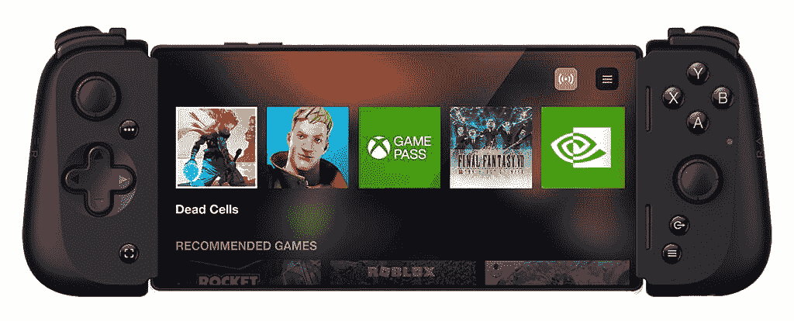

# 雷蛇岸信介 V2 带来了更新的设计，新的按钮和更好的兼容性

> 原文：<https://www.xda-developers.com/razer-kishi-v2-launch/>

在 CES 2020 上，Razer 发布了一款新的智能手机游戏控制器，以解决其 Junglecat 控制器的一个突出问题。新的 [Razer Kishi](https://www.xda-developers.com/razer-kishi-review-google-stadia-nvidia-geforce-now-steam-link-emulators/) 采用了伸缩设计，消除了对专用外壳的需求，允许游戏玩家在大多数 Android 设备上使用它。然而，它并不完美，[需要一些改装来适应更大的 Android 手机](https://www.xda-developers.com/razer-kishi-controller-modded-fit-larger-android-phones-cases/)或手机外壳。自推出两年多以来，Razer 现已推出第二代 Razer Kishi，恰如其分地命名为 Razer Kishi V2，采用了更新的设计，以进一步提高智能手机的兼容性和一些很酷的新功能。

## 雷蛇岸信介 V2:规格

| 

规格

 | 

雷蛇岸信介 V2

 |
| --- | --- |
| **尺寸&重量** |  |
| **输入** | 

*   两个带可点击按钮的模拟拇指棒(L3/R3)
*   一个机械键盘
*   ABXY 面按钮
*   两个触发器(L2/R2)
*   两个保险杠(L1/R1)
*   两个可编程多功能按钮(M1/M2)
*   菜单和选项按钮(在某些游戏中标记为开始和选择)
*   分享按钮(需要 Razer Nexus)

 |
| **端口** | 

*   用于电话连接的 USB-C 插头
*   仅用于直通充电的 USB-C 端口
*   充电指示灯

 |
| **兼容性** | 

*   完整功能需要 Android 9 Pie 或更高版本
*   三星 Galaxy S9/S9+/S10/S10+/S20 系列/ S21 系列/S22 系列/Note 8/Note 9/Note 10/Note 10+
*   谷歌 Pixel 2/2 XL/3/3XL/4/4XL/ 5 系列/ 6 系列
*   雷蛇手机 1 和雷蛇手机 2

 |

* * *

像它的前辈一样，Razer Kishi V2 具有一个伸缩桥，可以扩展以适应市场上大多数 Android 智能手机，这次它很稳定，所以应该更容易使用。此外，它的占地面积略大，这使它更适合像 [Galaxy S22 Ultra](https://www.xda-developers.com/samsung-galaxy-s22-ultra-review/) 这样的手机。此外，Razer 表示，如果用户希望使用带外壳的大手机，他们可以移除附带的橡胶插件，这使得 Kishi V2 成为 Razer 迄今为止最好的 Android 游戏控制器，至少在智能手机兼容性方面。

Razer 在其他方面也做了一些重大改进。例如，Razer Kishi V2 使用与 Razer 屡获殊荣的 Wolverine V2 控制台控制器相同的微动开关按钮和 d-pad 技术，这应该为游戏玩家提供驱动响应性、舒适性和触觉反馈方面的几个优势。

Razer Kishi V2 还在触发器旁边配备了两个可编程的多功能按钮，您可以使用它们来复制控制器上的其他按钮，让您获得一点竞争优势。

Razer 还增强了岸本 V2 的整体形状和手感，采用符合人体工程学和纹理的手柄，更新的按钮位置和新材料，为游戏玩家提供更好的体验。在软件方面，雷蛇将岸信介 V2 与雷蛇 Nexus 应用程序集成在一起，以提供“更具凝聚力和更强大的体验”Razer Nexus 应用程序提供了一个*深度目录，帮助玩家发现支持控制器的 Android 游戏。它还包括 Kishi V2 控制器的高级定制功能，包括重新映射多功能按钮和更新固件。”*

 <picture></picture> 

Razer Nexus app

此外，Razer Nexus 应用程序支持脸书和 YouTube 的集成直播，甚至允许玩家捕捉视频和游戏截图。该应用程序将可通过谷歌 Play 商店下载。

## 定价和可用性

新的雷蛇岸信介 V2 从今天开始以 99.99 美元出售。它将通过雷蛇的网站和其他主要的电子商务渠道出售。值得注意的是，Razer Kishi V2 与 iPhones 不兼容，但 Razer 计划很快发布一个带有 Lightning 连接器的版本。然而，该公司还没有分享一个明确的时间表。