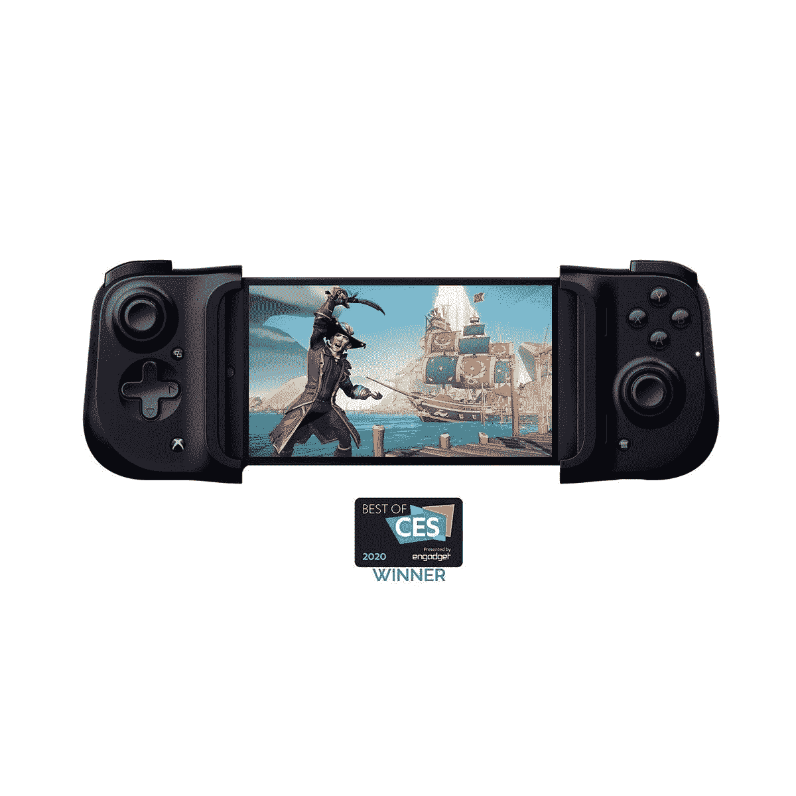

# Razer Kishi 控制器正在以 70 美元的价格出售，所以请在售罄之前购买一个

> 原文：<https://www.xda-developers.com/razer-kishi-xbox-android-controller/>

# Razer Kishi 控制器正在以 70 美元的价格出售，所以请在售罄之前购买一个

Xbox 版雷蛇 Kishi 手柄在百思买和亚马逊有售，售价 70 美元。这些很快就卖光了，现在就去买吧！

我发誓，在过去的一个月里，我一直试图写一篇关于 Razer Kishi 控制器的文章。它已经在假日购物季多次打折，但我似乎总是错过 Android 游戏控制器脱销前的交易。但是，我这次没有太晚！Xbox 版的 Kishi 控制器在亚马逊和百思买都有销售，鉴于这款控制器在过去的销售情况，你会想尽快买到一款。

所以这就是[雷蛇 Kishi (Xbox)安卓手柄](https://www.xda-developers.com/razer-kishi-mobile-gaming-controller-designed-for-xbox/)，和正常的 Kishi 手柄有几个视觉上的区别。这个版本的大型控制器有一个 Xbox Home 按钮，其他按钮被重新设计为更接近微软的控制器。它是专门为 XCloud 服务制作的，但在功能上与普通的 Razer Kishi 相同。

但我喜欢这个控制器是因为它允许你像拿任天堂 Switch 一样拿着你的手机。大多数安卓控制器都允许你把手机挂在上面(或者你自己去买)。但 Razer Kishi 提供了便携式游戏玩家更熟悉的外形，并且看起来是一种更坚固的游戏时握持手机的方式。

Razer Kishi 通常售价为 100 美元，但目前售价为 70 美元。一点都不差！在购买之前，只要确保你的手机将适合控制器，或者准备好[修改你的 Kishi](https://www.xda-developers.com/razer-kishi-controller-modded-fit-larger-android-phones-cases/) 以适合你的手机。幸运的是，修改控制器一点也不困难，所以做一点工作就可以使它与大多数设备兼容。

 <picture></picture> 

Razer Kishi (Xbox) at Best Buy

##### 雷蛇 Kishi

以 30 美元的价格为自己购买一个最好的 Android 控制器！Kishi Xbox 控制器已经为 XCloud 和任何其他支持控制器的移动游戏做好了准备，这款游戏的现货销售很快！

 <picture></picture> 

Razer Kishi (Xbox) at Best Buy

##### 雷蛇 Kishi

以 30 美元的价格为自己购买一个最好的 Android 控制器！Kishi Xbox 控制器已经为 XCloud 和任何其他支持控制器的移动游戏做好了准备，这款游戏的现货销售很快！

如果你在 iOS 上，你可以为你的 iPhone 买一台 [Razer Kishi，但要事先警告你，你将支付全部 100 美元。](https://www.amazon.com/gp/product/B08FFPKRYW?tag=xda-24pi6m9-20&ascsubtag=UUxdaUeUpU31051&asc_refurl=https%3A%2F%2Fwww.xda-developers.com%2Frazer-kishi-xbox-android-controller%2F&asc_campaign=Short-Term)