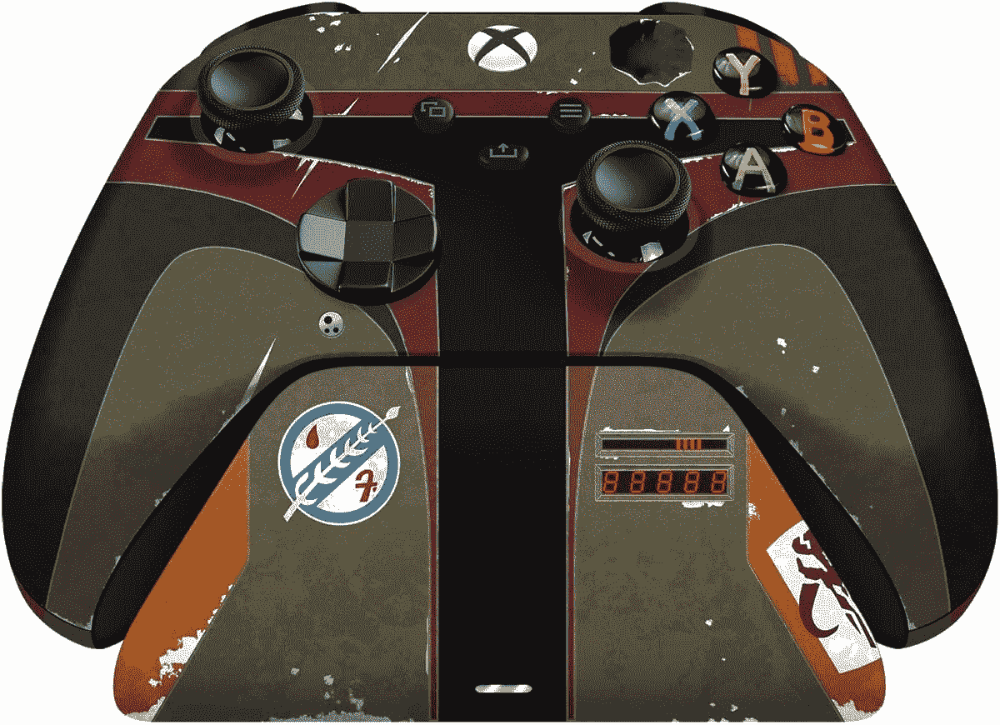

# 雷蛇推出限量版波巴·费特主题 Xbox 手柄

> 原文：<https://www.xda-developers.com/razer-launches-boba-fett-xbox-controller/>

多亏了 Razer,《星球大战》和 Xbox 粉丝可以得到一个新的 Xbox 无线控制器，其灵感来自波巴·费特这个角色。此次发布与即将到来的迪士尼+节目《波巴·费特之书》的首映式相配合。该控制器由微软官方授权，而且显然是限量版，所以你可能想在你可以的时候抓住它。Razer 经常与微软合作，最近为 PC 游戏玩家推出了一些 [Halo Infinite 主题外设](https://www.xda-developers.com/razer-halo-infinite-peripherals-in-game-content/)。

虽然微软似乎没有设计控制器本身，但它是为 Xbox 系列 X|S 复制官方 Xbox 无线控制器的感觉。这包括八路 D-pad，所有相同的面板按钮和操纵杆，以及控制器背面的纹理手柄。然而，还有一些额外的功能，如振动和压力敏感的“脉冲模拟触发器”。

另一个很大的区别是，这款控制器自带充电电池，而官方型号仍然使用可更换电池。这是因为这个控制器还包括 Razer 的充电支架，你可能已经很熟悉了，因为 [Razer 为官方 Xbox 无线控制器单独出售](https://www.amazon.com/Razer-Universal-Quick-Charging-Stand/dp/B09DHFP82V?tag=xda-7j4b42v-20&ascsubtag=UUxdaUeUpU6346&asc_refurl=https%3A%2F%2Fwww.xda-developers.com%2Frazer-launches-boba-fett-xbox-controller%2F&asc_campaign=Short-Term)。这将保持你的控制器充电，除了显示其设计给每个人看。

设计可能是你想买 Razer 限量版波巴·费特 Xbox 无线控制器的最大原因，所以炫耀它是有意义的。控制器和支架都被涂上了油漆，看起来像标志性的《星球大战》角色的头盔，这两部分一起绘制了完整的画面。

该套装售价 179.99 美元，这有点贵，但对于限量版产品来说是有意义的。此外，您将获得官方 Xbox 控制器的所有功能，包括蓝牙和 Xbox 无线支持，因此您可以在您的主机、PC 和智能手机上使用它。如果你是《星球大战》的粉丝，这个设计可能会赢得你的芳心。

尽管刚刚推出，该控制器在亚马逊已经出现缺货，但你仍然可以在 Razer 的网站上购买(在撰写本文时)。您可以在下面查看您首选的零售商。

 <picture></picture> 

Razer Limited Edition Boba Fett Wireless Controller & Quick Charging Stand

##### Razer 限量版波巴·费特无线控制器和快速充电支架

《星球大战》粉丝现在可以拿着波巴·费特的头盔，用这个控制器玩他们最喜欢的游戏。随附的支架可为控制器充电，使其时刻准备就绪。