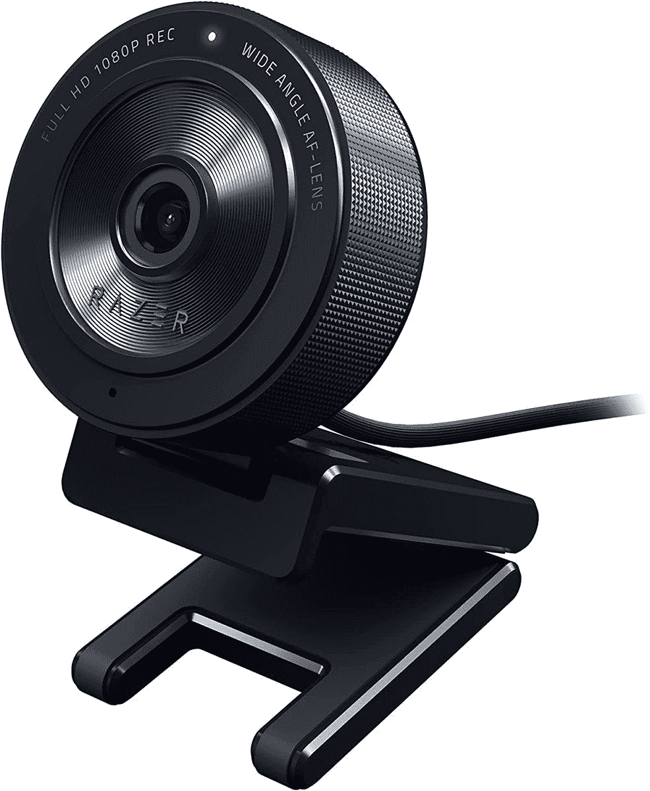
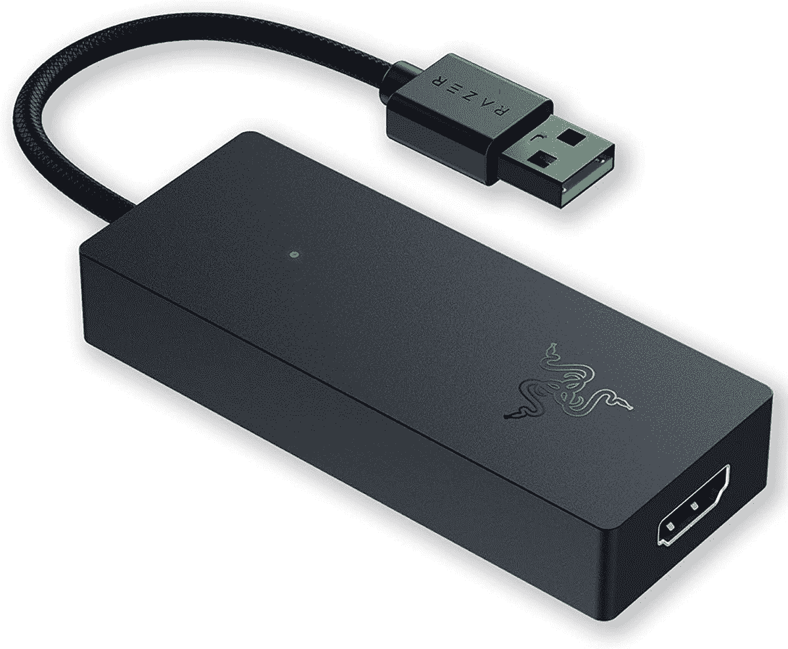

# Razer 推出 Kiyo X 和 Ripsaw X，使流媒体更加实惠

> 原文：<https://www.xda-developers.com/razer-launches-kiyo-x-ripsaw-x-streaming-gear/>

Razer 今天宣布了两款针对后起之秀流媒体的新产品，Kiyo X 和 Ripsaw X。这些新产品旨在让新来者更容易进入流媒体世界，提供实惠而简单的入门解决方案。和 Razer 一样，X 名称表示这些是现有产品的平价版本，特别是 Kiyo 网络摄像头和 Ripsaw HD 采集卡。

从 Razer Kiyo X 开始，它采用了 Kiyo 网络摄像头的基本功能，包括高达 1080p/30FPS 的流媒体，或 720p/60FPS。它还带有自动对焦支持和使用 Razer Synapse 的可定制设置。然而，Kiyo X 没有内置环形灯，而是安装了 Razer 虚拟环形灯软件，该软件使用电脑显示器作为光源照亮场景。这是一个奇怪的变通办法，但它比原来的 Kiyo 便宜了 20 美元，所以它可能是一个不错的选择，特别是如果你已经有了坚固的照明设备。

至于 Ripsaw X，它也是 Razer Ripsaw HD 捕获卡的一个更有限的版本，但它仍然可以以高达 4K 和每秒 30 帧的速度捕获视频，所以你可以从大多数现代主机上流式传输高质量的游戏。然而，最初的 Razer Ripsaw 提供的是视频直通，所以你可以在一个屏幕上管理你的流，同时在另一个屏幕上播放。Razer Ripsaw X 仅输出到您连接的 PC。

另一方面，最初的 Ripsaw HD 只能以高达 1080p 和 60FPS 的速度传输视频，因为它使用了大量带宽来将 4K 传递到游戏屏幕。因为这里只有一个输出，所以它也支持 4K 捕获。它确实需要 HDMI 2.0 和 USB 3.0 兼容设备，但应该不难找到。您也可以将它用于通过 HDMI 输出的相机和其他设备。

Razer Kiyo X 和 Ripsaw X 都已上市。Razer Kiyo X 网络摄像头售价 79.99 美元，Ripsaw X 采集卡售价 139.99 美元。这些设备加入了 Razer 价格合理的流媒体设备阵容中的 Seiren X 麦克风。你可以通过下面的链接购买。

 <picture></picture> 

Razer Kiyo X

##### 雷蛇 Kiyo X

Razer Kiyo X 是一款相当基本的流媒体网络摄像头，支持高达 1080p 和 30FPS 的视频，以及自动对焦。它还包括雷蛇虚拟环光软件。

 <picture></picture> 

Razer Ripsaw X

##### Razer Ripsaw X

Razer Ripsaw X 是一款用于游戏流的廉价采集卡。它可以捕捉高达 30 帧/秒的 4K 视频，并且可以与大多数流媒体软件兼容。