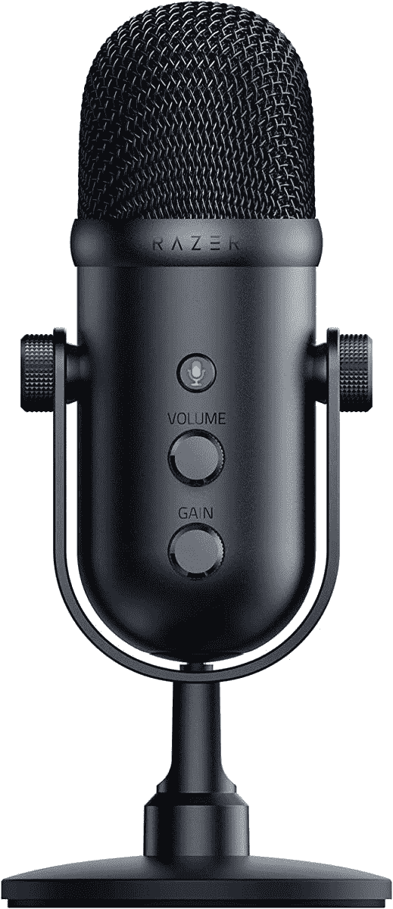

# Razer 推出新的 Seiren V2 话筒用于飘带

> 原文：<https://www.xda-developers.com/razer-launches-seriren-v2-x-pro/>

Razer 一直在为游戏玩家和流媒体玩家发布新产品，并试图在价格范围方面覆盖越来越多的领域。最近的一个例子是推出了 Ripsaw X 和 Kiyo X T1，分别是其视频采集卡和网络摄像头的平价版本。今天，雷蛇宣布推出新的麦克风，赛伦 V2 专业版和 V2 X

这些都是最初的 Razer Seiren Pro 和 Seiren X 的继任者，其中一个旨在以更高的预算获得更专业的流媒体，而另一个则是为那些刚刚起步但不想花那么多钱的人准备的。

当然，Razer Seiren V2 Pro 是两者中更令人印象深刻的，它具有动态麦克风炭精盒，提供更好的音质和清晰度。此外，它还具有模拟增益限制器等功能，以防止在更激烈的时刻(如尖叫或叫喊)发生失真，以及高通滤波器，以防止某些低频被记录下来。

与此同时，Seiren V2 X 仍在使用聚光胶囊，特别是 25 毫米的。它仍然具有模拟增益限制器等功能，两种型号的频率响应也是相同的(20Hz 至 20，000Hz)。它还使用了一种超心形图案，旨在只拾取用户的声音。然而，它确实错过了高通滤波器。

除此之外，这两个麦克风非常相似。它们有 24 位比特率，减震器(Pro 也有内置的麦克风风袋)，通过 3.5 毫米耳机插孔进行麦克风监控，并通过 USB Type-C 连接到 Type-A 电缆。

Razer Seiren V2 专业版和 Seiren V2 X 今天可以购买。赛伦 V2 X 售价 99.99 美元，而 V2 Pro 售价 149.99 美元。可以在下面买。

 <picture></picture> 

Razer Seiren V2 Pro

##### Razer Seiren V2 专业版

Razer Seiren V2 专业版是一款先进的流式麦克风，具有动态振膜，用于更丰富的语音拾取，以及高通滤波器等功能。

 <picture></picture> 

Razer Seiren V2 X

##### 雷蛇 Seiren V2 X

Razer Seiren V2 X 是一款流式麦克风，配有 25 毫米电容振膜和模拟增益限制器。