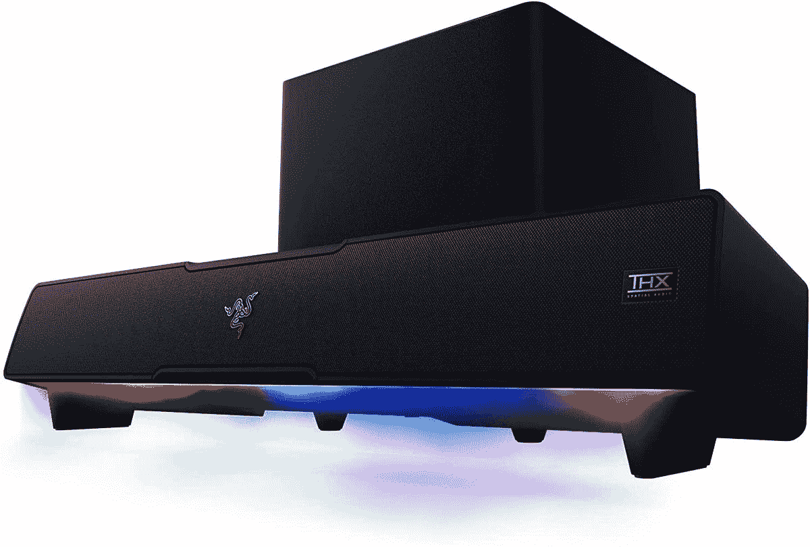

# 雷蛇的利维坦 V2 是一个游戏条形音箱，配有 THX 空间音频

> 原文：<https://www.xda-developers.com/razer-leviathan-v2-gaming-soundbar-thx-spatial-audio/>

Razer 已经宣布了其最新的游戏外设，利维坦 V2 条形音箱。该公司声称这是世界上第一个支持 THX 空间音频的游戏条形音箱，这是 Razer 经常在其[更昂贵的音频产品](https://www.xda-developers.com/razer-hammerhead-true-wireless-pro-launch-date-price/)中包含的功能。

Razer Leviathan V2 内部的扬声器设置包括两个全频驱动器，两个无源辐射器，两个高音扬声器和一个向下发射的低音炮，因此它应该提供一个宽阔的声场。低音炮是一个独立的设备，它使用专用电缆连接到条形音箱。Razer 承诺为游戏、电影、音乐等提供全范围和高保真音频。THX 空间音频也应该通过提供环绕声体验来增强体验。

Razer Leviathan V2 设计用于 PC，它通过 USB 连接，但它也支持蓝牙。这意味着，如果你愿意，你可以通过无线方式将它与你的电脑、手机或任何其他支持蓝牙的设备配合使用。

在设计方面，soundbar 带有可拆卸的支脚，允许用户根据自己的喜好调整高度和角度。条形音箱足够紧凑，可以放在显示器下面，低音炮更适合放在旁边。它更大，重量几乎是条形音箱本身的两倍，所以它是一个相当大的单元。

条形音箱的顶部还有快速音量控制和麦克风静音按钮。当然，这是 Razer，所以它也支持 18 个照明区的色度 RGB 照明，所以你可以为你的桌面设置添加更多的天赋，以及与你可能拥有的其他 Razer 设备同步。这一切都可以通过 Razer Synapse 或 Razer Audio 智能手机应用程序进行定制。这些应用程序还包括一个音频均衡器，默认情况下包含 10 个预设。

雷蛇利维坦 V2 从今天开始以 249.99 美元/€249.99 美元的价格出售。下面可以买。

 <picture></picture> 

Razer Leviathan V2

##### 雷蛇利维坦 V2

雷蛇利维坦 V2 是一个紧凑的 tgaming sounbar 与 THX 空间音频支持。