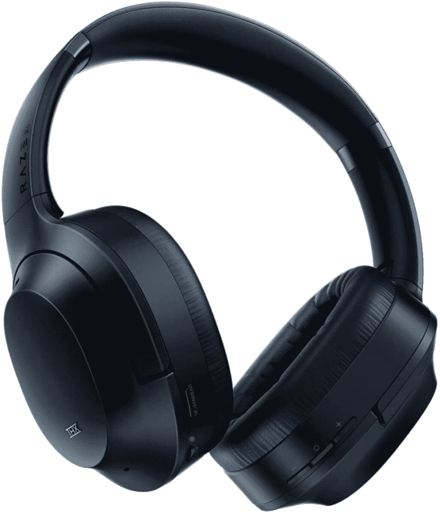

# 150 美元买一副 Razer Opus 主动降噪耳机

> 原文：<https://www.xda-developers.com/razer-opus-amazon/>

# 只需 150 美元，就能买到完美的中音降噪耳机 Razer Opus

想找一副好看的中档耳机？现在在亚马逊，Razer Opus ANC 耳机售价 150 美元！

作为一个非音响发烧友，我很难找到合适的耳机来购买。大多数人通常会推荐最好中的最好，比如高端的索尼或 Bose 耳机，或者反其道而行之，推荐一个 30 美元的品牌，我从未听说过这个品牌会在几个月内坏掉。找中端耳机推荐好像不可能！但 Razer Opus 耳机似乎是完美的中档选择，目前它们便宜 50 美元！

米莎尔·拉赫曼在他的《雷蛇作品回顾》中写道:“如果我今天购买新的产品，我会选择雷蛇作品而不是索尼 XM3。”大胆的话，但鉴于索尼的耳机通常超过 300 美元，而 Opus 的建议零售价仅为 200 美元，这是非常可以理解的。这些主动降噪耳机提供了类似的体验，而对您的钱包造成的冲击却小得多。对于大多数人来说，可能很难证明 150 美元的升级费用是合理的。

售价仅为 150 美元的 Razer Opus 设法在价格和质量之间走钢丝。主动噪音消除工程伟大，也没有 ANC 和缺乏环境噪音来通过 unnerve Mishaal，而审查他们。Opus 的电池寿命也很长，在需要充电之前可以运行一整天。还有自动暂停和自动播放功能，当你把耳机戴在脖子上并戴到头上时，它就会激活，尽管它的激活似乎并不总是有效。

这款耳机售价 150 美元，有午夜蓝和经典黑两种颜色，你绝对不会错过。

 <picture></picture> 

Razer Opus Noise Canceling Headphones

##### Razer Opus

在亚马逊购买这些中档耳机可以节省 50 美元！有经典的黑色和午夜蓝两种颜色可供选择，您可以在耳机中享受 ANC，而不会对您的钱包造成沉重打击。

当然，Razer 还有很多其他商品在出售，你可以在[他们的亚马逊商店](https://www.amazon.com/stores/Razer/page/CDB96030-A7CF-4B56-B70C-67086A740274?tag=xda-7jscego-20&ascsubtag=UUxdaUeUpU31135&asc_refurl=https%3A%2F%2Fwww.xda-developers.com%2Frazer-opus-amazon%2F&asc_campaign=Short-Term)查看所有商品。从电脑配件到[安卓控制器](https://www.xda-developers.com/razer-kishi-xbox-android-controller/)，你不太可能失望而归。