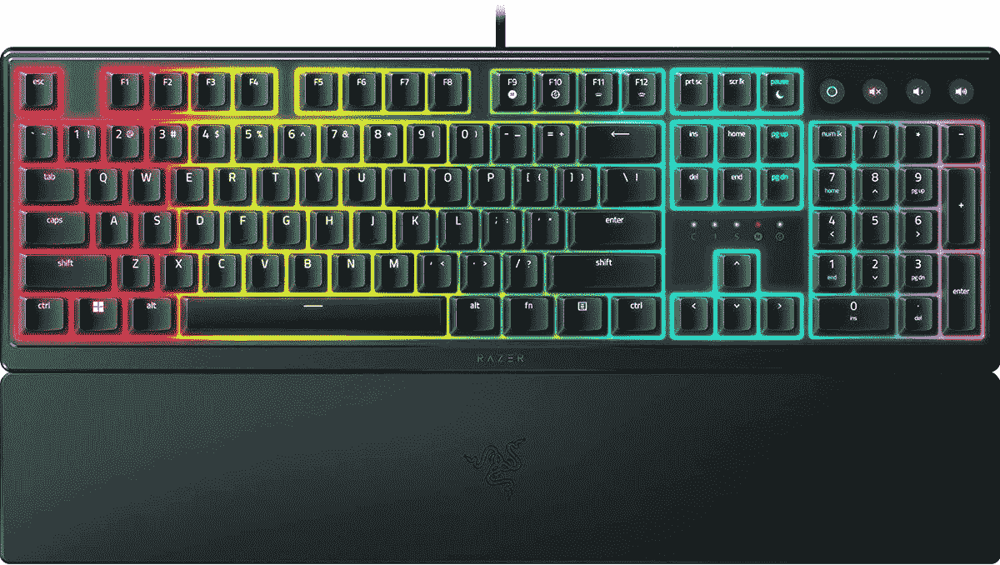

# Razer Ornata V3 键盘更薄、更轻、更便宜

> 原文：<https://www.xda-developers.com/razer-ornata-v3-cheaper-lighter-thinner/>

Razer 推出了其 Ornata 系列键盘的两个新成员，Ornata V3 和 V3 x。Razer 的 Ornata 键盘是“机械薄膜”板，混合了机械开关和下面的薄膜板。这提供了机械开关的点击感，同时也像薄膜一样柔软。新键盘从今天开始上市，而且实际上比它们的前辈奥纳塔·V2 更便宜。

这是因为，在某些方面，它实际上似乎是某种降级。不过，它确实有优势，首先是它更薄更轻。Razer 宣称键盘底盘的厚度为 27.05 毫米，按键本身的高度为 4.4 毫米。键盘也重 800 克，比 V2 轻 100 多克。

这些按键也有较短的开关，这应该使它们更容易启动。另一个改进是，新的键帽涂有紫外线涂层，可以防止多年来的划痕和定期磨损。

然而，这似乎是进步的程度。Razer Ornata V3 有四个可编程的媒体键，您可以根据自己的配置来控制音量、亮度或播放/暂停。然而，它失去了 V2 模型中更直观的数字轮，这使得这些调整更加容易。此外，新的键盘不再支持每键 RGB 照明，而是只有 10 个照明区，所以你在这方面也更受限制。除此之外，Razer 还用一个柔软的橡胶涂层手腕带取代了带软垫的手腕带，这款手腕带的外形更加纤薄。

这是标准的 Ornata V3，但如果你想更便宜，还有新的 Ornata V3 X。这种型号只有一个 RGB 照明区，它失去了媒体控制键，但在其他方面与 Ornata V3 相似。

Razer Ornata V3 从今天起以 69.99 美元的价格上市，这大大低于 V2 99.99 美元的上市价格。然而，这些天你可以在 V2 找到一些大折扣。Razer Ornata V3 X 似乎还没有上市，但它的价格将为 39.99 美元。

 <picture></picture> 

Razer Ornata V3

##### 雷泽·奥尔纳塔·V2

Razer Ornata V3 是一款机甲薄膜键盘，与前代产品相比，它的外形更加纤薄。在某些方面更受限制，但也更便宜。