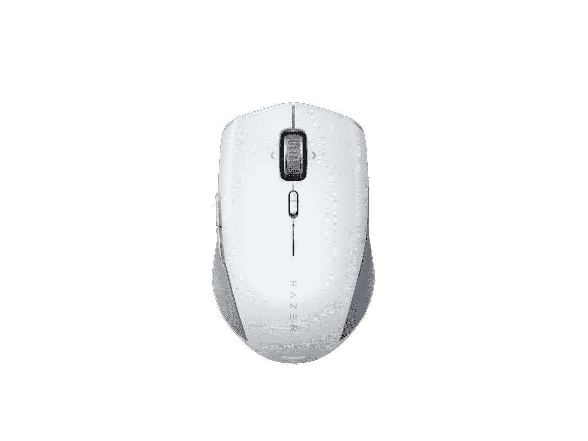
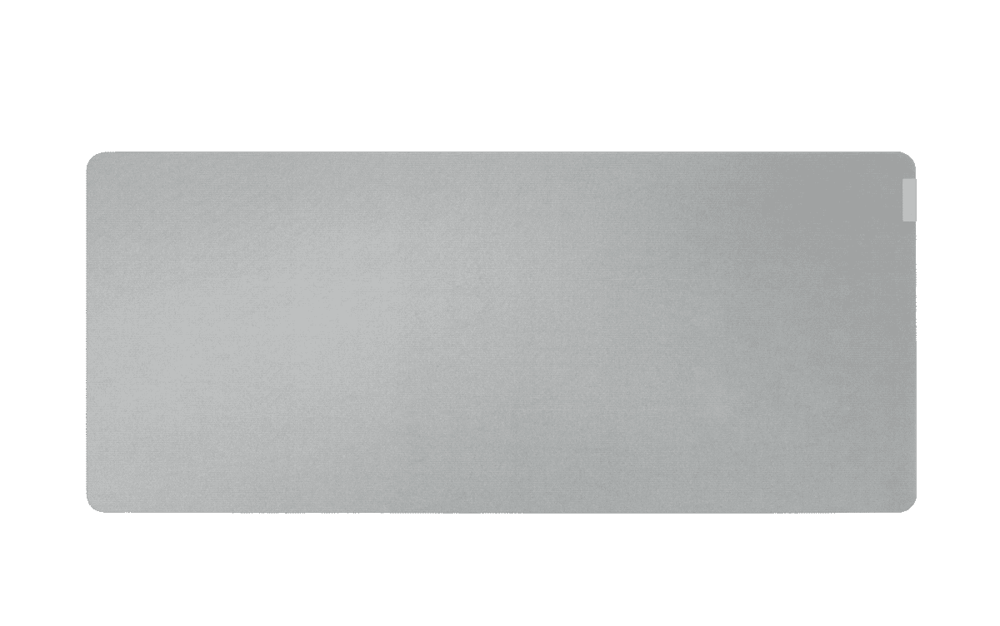

# Razer 推出新的专业鼠标和键盘以提高工作效率

> 原文：<https://www.xda-developers.com/razer-pro-type-ultra-keyboard-click-mini-mouse/>

Razer 在其 Pro 系列中推出了两款新产品，Pro Type Ultra 键盘和 Pro Click 迷你鼠标。与 Razer 最受欢迎的配件不同，这些配件不是为了游戏，它们更适合于生产力，并且它们建立在现有的 Pro Type 和 Pro Click 上。

Razer 宣传的这两款新设备的一大新功能是它们带有 Razer Productivity Dongle。这款加密狗将该公司的 HyperSpeed 技术用于无线配件，它允许您将 Razer Pro Type Ultra 和 Pro Click Mini 连接到同一个加密狗，因此您只需使用 PC 上的一个 USB 端口。

Razer Pro Type Ultra 是原始 Pro Type 的更高级版本，它包括 Razer 的黄色开关，该公司将其描述为“线性和静音”。最初的 Pro 型使用的是橙色开关，这种开关是“有触觉的，无声的”。Pro Type Ultra 的另一个变化是它包括一个腕托，让你的手在长时间的工作中更加舒适，并防止手部紧张。

Razer Pro Type Ultra 还宣称其电池寿命比其前代产品长得多。Razer 表示，通过蓝牙连接时，它可以持续 214 小时，通过 Razer 的 HyperSpeed 无线技术连接时，可以持续 207 小时。这比最初 Razer Pro Type 承诺的最长 84 小时有了很大的提高。就像以前一样，你也可以在充电时使用有线 USB Type-C 连接。

否则，从最初的 Razer Pro 类型没有太大的变化。这是一个全尺寸的键盘，包括一个数字键盘，它使用简单的白色背光，使按键更容易看到，同时保持专业的外观。ABS 键帽具有柔软的触感，更加舒适，开关的额定压力为 8000 万次。

Razer Pro Type Ultra 的售价为 159.99 美元，可以直接从 Razer 和其他零售商处购买。下面可以买。

 <picture></picture> 

Razer Pro Type Ultra

##### Razer Pro Type Ultra

带有静音开关和柔软腕托的优质高效键盘。

与此同时，Razer Pro Click Mini 是 Razer Pro Click 的一个更紧凑的版本，它做了一些改变。当然，对于初学者来说，它几乎在每个维度上都更小，所以更容易随身携带。然而，这并不都是积极的。鼠标不再使用充电电池，而是需要一两节 AA 电池才能工作。如果你想要一个更轻的鼠标(88 克)，你可以只使用一块 AA 电池，或者添加第二块电池以延长电池寿命(长达 725 小时)，同时使它更重(111 克)。

Razer Pro Click Mini 还配备了 12，000 DPI 的最大灵敏度(而原来的灵敏度为 16，000 DPI)，这也意味着更低的速度和加速度。鼠标上的开关额定点击量为 1500 万次(而普通 Pro 的点击量为 5000 万次)，但从好的方面来看，Razer 说这些开关是无声的，所以如果你在公共场合使用它，你不必吸引所有人的注意。Razer Pro Click Mini 通过 Razer Synapse 共有 7 个可编程按钮，比 Pro Click 少一个按钮，但你可以获得 5 个板载内存配置文件，而原来的 Pro Click 只有一个。

它配有一个可倾斜的滚轮，还允许你在触觉点击滚动和自由旋转模式之间切换，尽管它不会自动改变。底部有一个开关，可以让你根据需要切换模式。

根据 Razer 的营销，Razer Pro Click Mini 是唯一支持 Razer Productivity Dongle 连接键盘和鼠标的产品，因此这是较小型号的优势。Razer Pro Click 迷你鼠标今天以 79.99 美元的价格上市，比标准尺寸便宜 20 美元。

 <picture></picture> 

Razer Pro Click Mini

##### Razer Pro 点击迷你

Razer Pro Click Mini 是一款紧凑型生产力鼠标，具有静音开关和时尚的设计。

最后，雷蛇今天还宣布了 Pro Glide XXL 鼠标垫。这是一个鼠标垫，可以覆盖你的整个桌子，给你所有你需要的空间来舒适地移动你的鼠标，并且有可靠的跟踪功能。它使用与其他两个外设相同的颜色(较少)方案，因此它与它们互补得相当好。Razer Pro Glide XXL 售价 29.99 美元，你可以在下面购买。

 <picture></picture> 

Razer Pro Glide XXL

##### Razer Pro Glide XXL

Razer Pro Glide XXL 是一个非常大的鼠标垫，适合专业设置，并与 Razer 的生产力套件完美匹配。