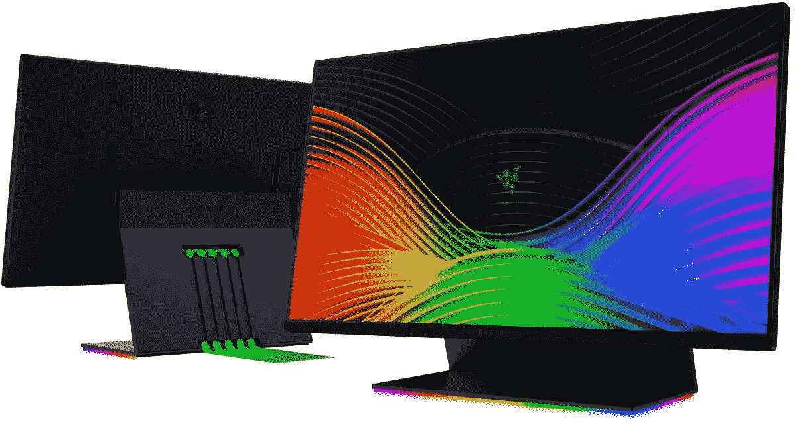

# Razer Raptor 27 英寸游戏显示器只需 500 美元就能成为您的囊中之物

> 原文：<https://www.xda-developers.com/razer-raptor-gaming-monitor-200-off-black-friday/>

Razer 的高端 Raptor 27 英寸游戏显示器在今年的黑色星期五之前降到了历史最低价格。现在，你可以花 500 美元买到这款 144 赫兹刷新率、支持 HDR 400 的四核高清显示器，比原价便宜 200 美元。这款显示器不仅有一些重要的规格，而且还有一些额外的功能，使它成为一款出色的显示器，包括 RGB 照明和高级设计。

 <picture></picture> 

Razer Raptor 27 Gaming Monitor ($200 off)

##### Razer Raptor 27 英寸显示器

Razer Raptor 27 英寸游戏显示器具有面向游戏玩家的高端规格，包括自适应刷新率和四核高清分辨率，此外它还具有 RGB 和电缆管理的高级设计。

我们来分析一下。Razer Raptor 配备了 27 英寸的显示屏，具有清晰的 Quad HD (2560 x 1440)分辨率，因此无论您是工作还是游戏，这都是一个很棒的屏幕。最重要的是，您可以获得 144Hz 的刷新率，支持自适应同步(兼容 NVIDIA G-Sync 和 AMD FreeSync)，加上 1 毫秒的响应时间和超低运动模糊。屏幕覆盖了 95%的 DCI-P3，HDR 400 支持完善了对 HDR 技术的基本支持，即使它不是地球上最好的 HDR 体验。

尽管如此，雷蛇猛禽的规格之外还有更多。该显示器的侧面和顶部有一个超薄的 2.3 毫米边框，可以更容易地创建间隙尽可能小的多显示器设置。它还旨在简化线缆管理，带有一个支架，可让线缆穿过，使其从背面干净利落地脱离。此外，由于 90 度的倾斜使后面的端口更靠近您，因此访问端口很容易。显示器还包括您需要的所有电缆，包括 HDMI、DisplayPort、USB Type-C(用于 DisplayPort Alt 模式)和 USB Type-A 延长线。

当然，如果没有色度 RGB 照明，它就不是一款优质的 Razer 产品。显示器底座支持 1680 万种颜色可供选择，您可以使用 Razer Synapse 对其进行定制，以匹配您的其余设置。

如果你想用其他外设或组件来补充 Razer Raptor，请查看我们的[黑色星期五 PC 交易](https://www.xda-developers.com/best-black-friday-pc-gaming-deals/)中心。对于所有移动技术方面的交易，我们有更多[黑色星期五交易](https://www.xda-developers.com/black-friday/)值得一探。