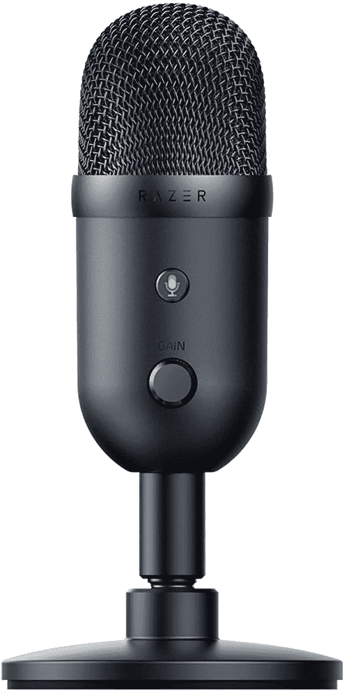

# Razer Seiren V2 X 桌面麦克风价格最低

> 原文：<https://www.xda-developers.com/razer-seiren-v2-x-deal-march-2022/>

Razer 最出名的可能是它的游戏笔记本电脑、键盘和鼠标，但该公司也生产许多其他设备。Razer Seiren 系列是电容麦克风的一个受欢迎的选择，它可以用于从高质量视频通话到播客录制的所有事情，现在你可以以 79.99 美元的价格获得 V2 X 型号。这比通常的建议零售价低 20 美元，也是 20%的折扣，是迄今为止的最低价。

Razer Seiren V2 X 是一个 25 毫米电容麦克风，类似于流行的蓝色 Yeti 桌面麦克风。这意味着它不是嘈杂环境中的最佳话筒，但只要你将背景噪音降至最低，它听起来就会非常棒。就像蓝色 Yeti 和其他桌面麦克风一样，有一个物理静音开关，一个音频增益旋钮，和一个内置的耳机插孔，用于监控你自己的声音水平。

 <picture></picture> 

Razer Seiren V2 X

##### 雷蛇 Seiren V2 X

这款电容话筒是提升通话和录音音质的绝佳方式。它在亚马逊的售价为 79.99 美元，比通常的建议零售价低 20%。

正如你对 Razer 产品的预期，麦克风可以连接到 Razer Synapse 桌面应用程序。该软件允许您配置音量和设置个人档案，以及任何其他 Razer 配件的设置。

如果你还没有电容麦克风，并且你正在寻找比耳机麦克风更好的东西，Razer Seiren V2 X 是一个不错的选择。 [*Windows Central* 在其评论](https://www.windowscentral.com/razer-seiren-v2-x-review)中表示，“新的更小的设计有一些小缺点，但易用性，USB-C 的移动，以及你可以连接一副耳机而无需体操的事实是一件好事。”

我没有尝试过 Razer 的电容麦克风，但我在大多数语音通话和视频聊天中使用的是配有麦克风臂的蓝色 Yeti，这比我以前使用的耳机麦克风有了很大的改进。Razer Siren V2 X 还可以安装在麦克风臂上，所以如果你厌倦了麦克风占用你桌子上的空间，这是一个你可以随时研究的选项。