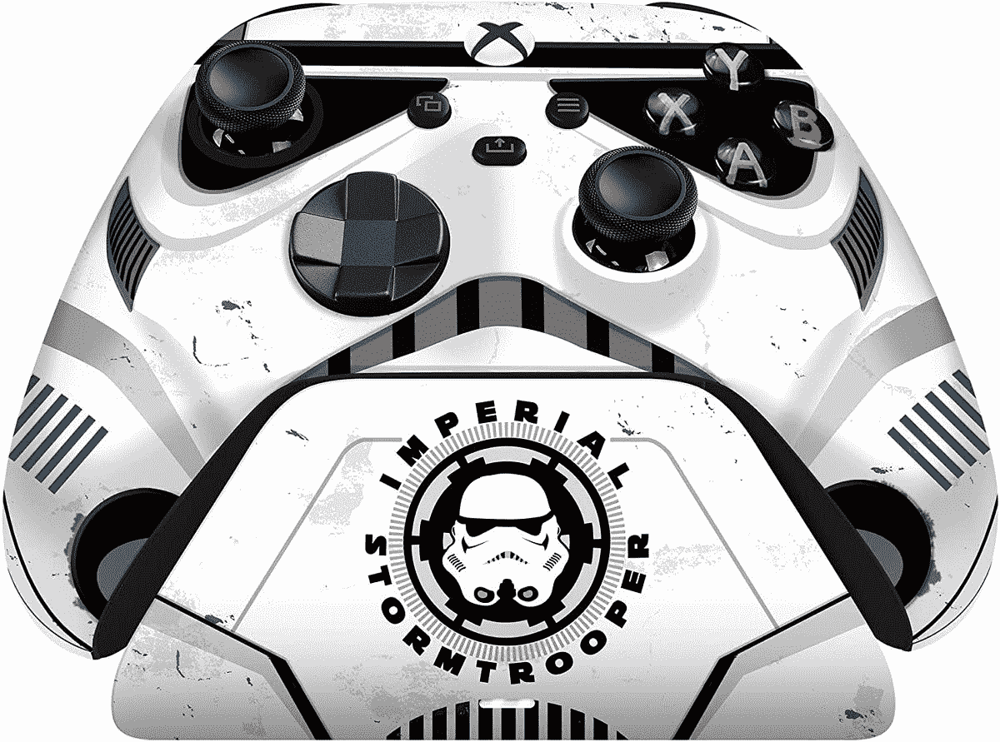

# 雷蛇用冲锋队 Xbox 手柄庆祝星球大战日

> 原文：<https://www.xda-developers.com/razer-star-wars-day-stormtrooper-xbox-controller/>

Razer 以制造各种游戏配件而闻名，为了庆祝 5 月 4 日——也被称为星球大战日——该公司将推出其 Xbox 无线控制器的新版本。新的 Razer Stormtrooper 无线控制器配有一个充电支架，使外观更加完整，它与 Razer 过去推出的其他星球大战主题控制器非常一致。事实上，就在去年 12 月，雷蛇也推出了这款控制器的波巴·费特版本。

这一款的设计自然受到了《星球大战》传奇中帝国冲锋队的启发，以角色的白色和黑色头盔为特色，并带有一些蓝色的口音。充电支架也以 to match 为主题，它允许你展示设计，如果你首先购买这款控制器，你可能会想这么做。

就功能和设计而言，Razer 的无线控制器与微软的官方控制器完全相同。唯一的区别是它的外观和它配有可充电电池的事实，而微软坚持出售可更换 AA 电池的控制器。否则，它会使用自定义 Xbox 无线连接连接到您的 Xbox 主机，但它也支持蓝牙，因此您可以在没有适配器的情况下使用手机或 PC。

Stormtrooper 控制器和充电支架捆绑包的价格为 199.99 美元，比 Razer 以前做过的大多数类似捆绑包高出 20 美元。Xbox 无线控制器通常售价 64.99 美元，Razer 的充电支架售价 39.99 美元，所以你为《星球大战》的设计支付了相当多的费用。不过，这是一种有效的方式来表达你对球队的爱。一些旧的《星球大战》设计仍然可用，而且它们的价格更低，所以也值得一试。

 <picture></picture> 

Razer Stroomper Wireless Controller + Charging Stand

##### 雷蛇冲锋队无线控制器

这款 Xbox 控制器和充电支架套装是展示你对《星球大战》系列喜爱的一个很好(也很贵)的方式。

如果你对更标准的 Xbox 控制器感兴趣。微软也在本周早些时候推出了最新 Xbox 无线控制器的[深粉色版本，而](https://www.amazon.com/Xbox-Core-Controller-Robot-White-one/dp/B09VV5LJS1?tag=xda-78vd2am-20&ascsubtag=UUxdaUeUpU41298&asc_refurl=https%3A%2F%2Fwww.xda-developers.com%2Frazer-star-wars-day-stormtrooper-xbox-controller%2F&asc_campaign=Short-Term) [Razer 有一个充电支架](https://www.amazon.com/dp/B09YBJ2YXT/?tag=xda-78vd2am-20&ascsubtag=UUxdaUeUpU41298&asc_refurl=https%3A%2F%2Fwww.xda-developers.com%2Frazer-star-wars-day-stormtrooper-xbox-controller%2F&asc_campaign=Short-Term)与之匹配。