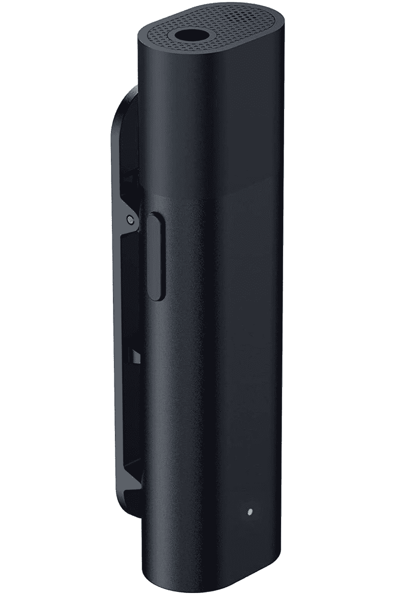
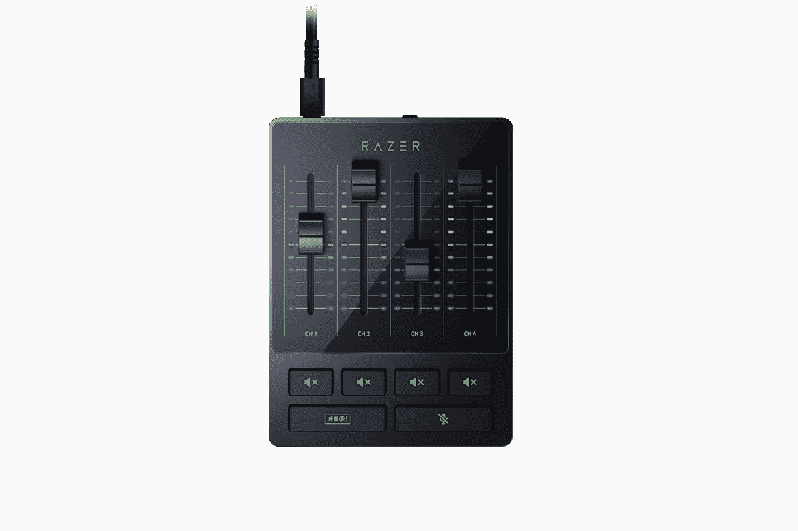
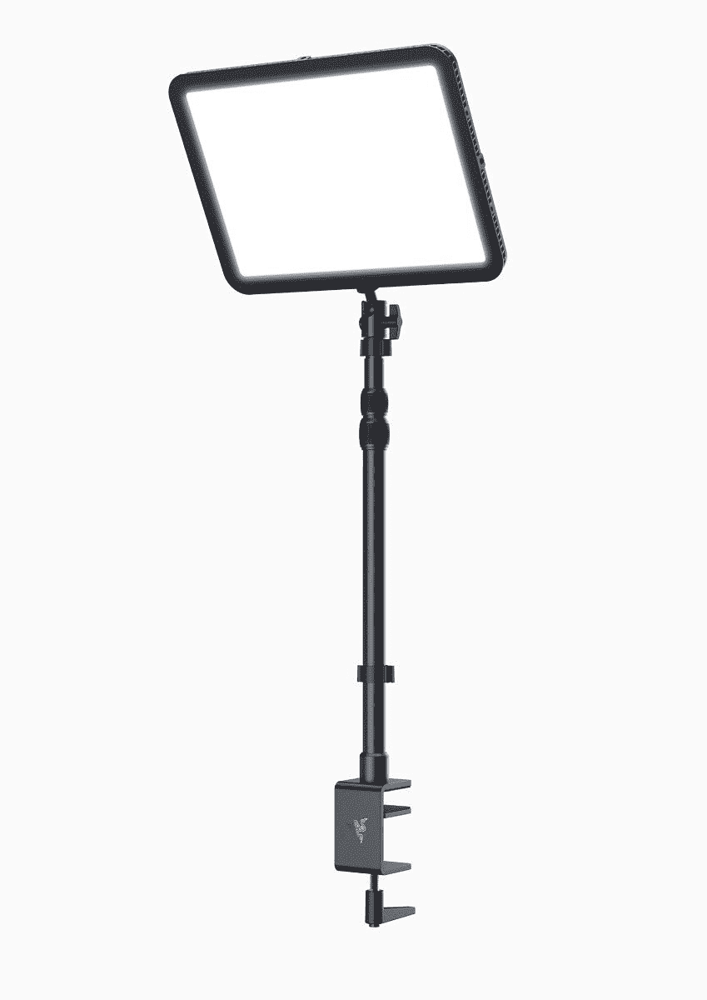

# Razer 推出新的流媒体设备，包括音频混合器和按键灯

> 原文：<https://www.xda-developers.com/razer-streaming-gear-mic-audio-mixer-key-light/>

Razer 已经宣布了几款面向专业流媒体和内容创作者的新产品。这三款新产品包括 Razer Seiren 蓝牙麦克风、Razer Key Light Chroma 和 Razer 音频混合器。

## Razer Seiren 蓝牙流媒体麦克风

Razer Seiren 蓝牙麦克风是 Razer Seiren 产品线的最新成员，但这一款更专注于移动流媒体。它通过蓝牙连接到您的智能手机，因此无论您在家还是在移动时都可以捕捉高质量的音频。它有一个夹式设计，所以你可以把它挂在你的衣服上，还有一个全方位的拾音模式。麦克风还包括两个风向袋来掩盖噪音，一个是为户外使用而设计的毛皮风向袋，另一个是为室内使用而设计的泡沫风向袋。您也可以使用 3.5 毫米耳机插孔连接一对耳机。

配合 Razer 流媒体应用程序，Seiren 蓝牙麦克风还具有基于人工智能的噪音抑制功能，帮助您清晰地听到您的声音。此外，您可以通过这种方式自定义麦克风的各种音频设置，包括增益、侧音和低延迟模式。根据 Razer 的说法，Razer Seriren 蓝牙不能与手机上的默认相机应用程序一起被起诉，但它与“最受欢迎的移动流媒体应用程序”兼容。

Razer Seiren 蓝牙麦克风售价为 99.99 美元或€109.99 美元。

 <picture></picture> 

Razer Seiren Bluetooth

##### Razer Seiren 蓝牙

专为移动彩带设计的蓝牙麦克风。它有一个全方位的拾音模式和人工智能噪音抑制。

## Razer 音频混音器

转向工作室的流媒体设备，Razer 的新流媒体设备包括 Razer 音频混合器，正如其名称所暗示的那样。该板可让您连接多个音频输入，包括混合 XLR、TRS 线路输入和输出、光学 TOS 等，并以简化的方式进行管理。对于 XLR 麦克风，它包括一个低噪声增益的前置放大器，以捕捉更详细的声音。

启动和运行所需的所有功能都可以直接在主板上获得，因此您不需要额外的软件。如果你需要安静一会儿，有一个静音按钮，还有一个哔哔声按钮，可以在你播放视频时自动审查不合适的语言。如果你使用 Razer Synapse 3，你可以设置额外的调整，如噪音门，以过滤掉低音噪音，调整麦克风增益，或将语音效果应用到音频中。此外，您可以自定混音器的音频指示器、按钮等上的色度 RGB 灯光。

雷蛇混音器售价 249.99 美元，€售价 259.99 美元。

 <picture></picture> 

Razer Audio Mixer

##### Razer 音频混音器

Razer 音频混音器支持多达四个输入，包括 XLR 麦克风和光学音频，它可以让您轻松地调整音量。

## Razer 键光色度

Razer Key Light Chroma 是今天发布的最后一款流媒体设备，它是一款相当简单的产品。这是一盏关键的灯，用来照亮演播室里的流光装置，让流光在流动时看起来最好。为了获得最佳的可见度，可以使用白光，温度从 3000K 到 7000K，亮度高达 2800 流明。不过，如果你想玩玩，Razer Key Light Chroma 支持 1680 万种颜色，就像大多数 Chroma RGB 产品一样，所以你可以创建很酷的灯光效果，并将其与你的设置同步。

Razer Key Light Chroma 配有一个夹式支架和 poel，因此可以根据您的需要将其固定在桌子上、升高或倾斜。它还支持 Wi-Fi 和蓝牙连接，因此可以从您的 PC 或使用 Razer 移动流媒体应用程序来调整设置。

Razer Key Light Chroma 售价 299.99 美元，€售价 299.99 美元。

 <picture></picture> 

Razer Key Light Chroma

##### Razer 键光色度

Razer Key Light Chroma 可以发出高达 2800 流明的光，并支持 1680 万种颜色。