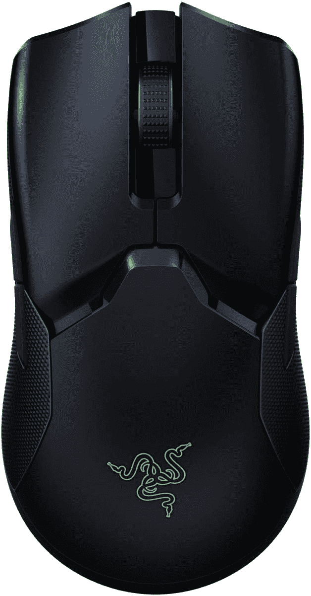

# 快速行动，以仅 54.99 美元的价格获得配备超高速无线和充电底座的 Razer Viper Ultimate

> 原文：<https://www.xda-developers.com/razer-viper-ultimate-on-sale-95-off/>

 <picture></picture> 

Razer Viper Ultimate

##### 雷蛇毒蛇终极版

Razer Viper Ultimate 提供了一个轻量级的双手灵巧设计，带有 20K DPI 光学传感器，8 个可编程按钮，电池寿命为 70 小时。它还具有 Razer 的光学开关，可以实现更精确的点击。

Razer 以其用于计算机的高端游戏设备而闻名，当涉及到鼠标时，它提供了各种各样的选择。Viper Ultimate 是其较好的产品之一，具有极其精确的 20，000 DPI 光学传感器，一次充电可使用 70 小时，重量为 74 克。最重要的是，它具有双手灵巧的设计，这意味着无论你是左撇子还是右撇子，你都可以最佳地使用它。

虽然这款鼠标的零售价通常为 150 美元，但你现在可以找到一个极端的折扣，亚马逊和百思买等零售商在有限的时间内降价 95 美元。如果你一直在寻找一个无线游戏鼠标的绝佳交易，这可能是一段时间内最好的交易之一。

Razer Viper Ultimate 采用了相对温和的全黑设计，手掌放置的地方有一个发光的 Razer 徽标。该鼠标采用 Razer Focus Plus，通过其 20，000 DPI 的传感器为您提供令人难以置信的精确度，并且附带的 Razer HyperSpeed 无线加密狗为您提供高传输速率和低延迟，以获得最佳体验之一。

虽然鼠标一次充电可提供长达 70 小时的使用时间，但附带的坞站可以在 10 分钟内为鼠标充电，在需要时可以额外使用 5 小时。对于那些需要即时和即时控制鼠标的人来说，你会很高兴知道 Viper Ultimate 有八个可编程按钮。作为顶部的最后一颗樱桃，鼠标的重量为 74 克，在游戏鼠标中处于中间位置。

这款鼠标现在在百思买有黑色和水星两种颜色，而亚马逊只有黑色。两家零售商都将它定价为 54.99 美元，这是一笔令人难以置信的交易。如果你还在为其他选择而争论，你可能想现在就去看看一些最好的游戏鼠标。