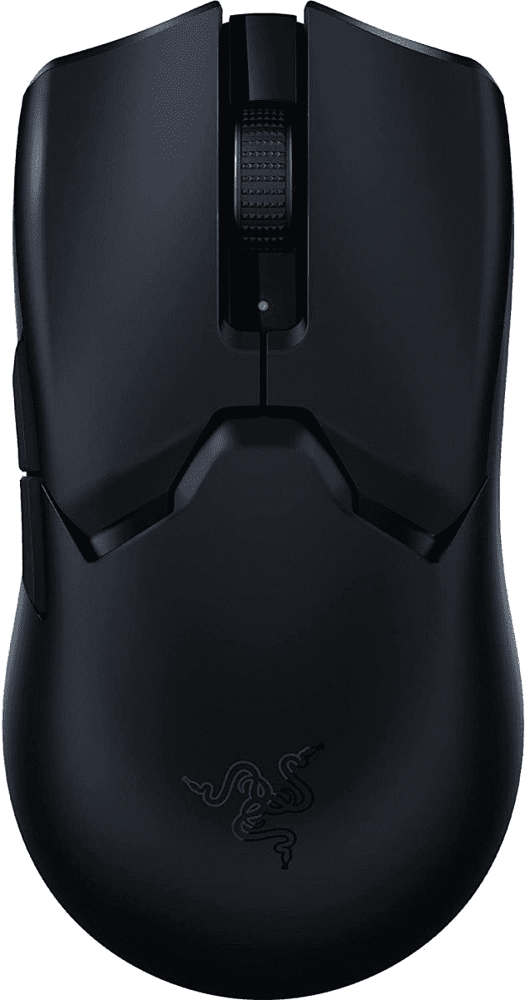

# 雷蛇蝰蛇 V2 Pro 评测:不错，但不是我们期待的升级

> 原文：<https://www.xda-developers.com/razer-viper-v2-pro-review/>

Razer Viper 系列游戏鼠标在设计时总是考虑一件事:性能。从一开始，鼠标就与顶级职业游戏玩家一起开发，以提供他们想要使用的产品。从形状到重量，以及电缆(或缺乏)，蝰蛇上的一切都被设计成最好的。随着 Viper Ultimate 的出现，第一次失去了电缆，很难想象 Razer 如何能够做得更好。

但是 Razer 的研究人员从来没有想过这个问题。因此，我们在这里与 Razer 毒蛇 V2 专业。在盒子上，你会想起这东西存在的原因。这是一款“超轻量无线电竞鼠标”作为后续，它不像最初的蝰蛇那样是一场革命。但这并不意味着它本身没有给人留下深刻印象。

Viper Ultimate 已经成为我自己选择的游戏鼠标有一段时间了，尽管我承认，我不是专业的游戏玩家。但是新版本的想法确实令人兴奋，尽管我仍然在等待一款能让我成为更好的游戏玩家的鼠标。

 <picture></picture> 

Razer Viper V2 Pro

##### 雷蛇蝰蛇 V2 专业版

Razer 最新的竞技游戏鼠标，重量更轻，速度更快，并配有最新的光学开关。

**浏览此评论:**

## 雷蛇毒蛇 V2 专业版:盒子里是什么？

Razer Viper V2 Pro 的包装盒中包括:

*   雷蛇毒蛇 V2 专业版。
*   1 根 USB-A 转 USB-C 电缆，用于充电和有线连接。
*   1 个 2.4GHz 超高速无线转换器。
*   USB 转换器适配器。
*   Razer 鼠标握带。

*本次评测使用的是 Razer Viper V2 Pro，由 Razer 提供进行评测。在任何时候，Razer 都没有对这一审查的内容提出任何意见。*

## 定价和可用性

Razer Viper V2 Pro 现在在 Razer 自己的商店和授权经销商如亚马逊和百思买销售。它有两种颜色，黑色和白色，两个版本的价格都是 150 美元。

如果你想节省一点，亚马逊更新计划有翻新的蝰蛇 V2 专业版，价格低 25 美元。

## 雷蛇毒蛇 V2 专业规格

| 

种类

 | 

雷蛇蝰蛇 V2 专业版

 |
| --- | --- |
| 连通性 | 

*   Razer 超高速无线技术(2.4GHz)
*   Razer SpeedFlex 电缆

 |
| 电池寿命 | 

*   长达 80 小时(1，000 赫兹)
*   长达 24 小时(4000 赫兹)

 |
| 传感器 | 

*   Focus Pro 30K 光学传感器
*   30，000 最大 DPI

 |
| 可编程按钮 |  |
| 开关类型 | 

*   第三代光电鼠标开关
*   点击率高达 9000 万次

 |
| RGB 照明 |  |
| 尺寸和重量 | 

*   长度:126.7 毫米/ 4.99 英寸
*   握持宽度:57.6 毫米/ 2.27 英寸
*   高:37.8 毫米/ 1.49 英寸
*   59 克

 |

## 设计和特点:不再是真正的双手灵巧

*   难以置信的轻巧。
*   保留传统的毒蛇形状，但不再适合左手使用。
*   只能存储一个车载个人资料。

Razer Viper 的一个定义性特征一直是其令人难以置信的轻质机身，无需在其上钻孔。最初的重量已经很轻，只有 69 克，但现在我们在蝰蛇 V2 专业版上，雷蛇已经设法再减去 10 克。从纸面上看，这听起来很小，但在一台已经很轻的设备上，这是一个巨大的数字。同时握住两者，你可以清楚地告诉 V2 专业是一个体面的数量轻。别忘了，这个鼠标里有一块电池。即使感觉必须以新鲜空气为动力。

Viper V2 Pro 对左撇子玩家不像它的前辈那样友好。

一个不太令人印象深刻的变化是从双手灵巧到仅仅是对称。鼠标的整体形状保持不变，但唯一附加的可编程按钮现在位于左侧。这意味着它是可用的，但不是真正为左撇子玩家设计的。Razer 通常是左撇子鼠标的更好支持者之一，所以看到这一点有点失望。然而，蝰蛇 V2 专业版使用起来非常舒适，就像它的前辈一样。外形看起来没有针对人体工程学，但整体包装是一流的。弯曲的机身和重量轻的事实相结合，使它成为全天使用的更好的鼠标之一，不管是不是游戏。

总共有五个可编程按钮，但这包括常规按钮和滚轮。拇指上还有另外两个按钮。和以前的蝮蛇一样，它们被完美地放置在激活位置，而不需要将你的拇指放在鼠标旁边。它们是如此之轻，以至于你只需动动你的拇指就能激活。

不幸的是，您的鼠标上只有存储单个配置文件的空间。如果你主要玩一个游戏，你不会有问题，但如果你喜欢不同的游戏有不同的配置文件，你将不得不使用 Razer Synapse 根据需要进行切换。Synapse 将通过云跨设备同步您的个人资料，但要充分利用这款鼠标，您需要始终将它放在手边。Synapse 仍然只能在 Windows 上使用，这自然是大多数游戏玩家玩的地方。但如果你想在 Mac 上使用它，你需要一台 Windows PC 来进行任何设置更改。

也许令人惊讶的是，这只老鼠身上没有 RGB。

也许令人惊讶的是，你不会为任何色度 RGB 照明设置配置文件，Razer 已经选择从 Viper V2 Pro 中忽略这一点。这几乎不是一个交易破坏者，但那些喜欢一点 RGB 发光的人将不得不没有它。Razer 确实包括了一套它的抓握胶带，不过，说实话，你会想要使用它的。鼠标的侧面是光滑的塑料，增加的触感让一切变得不同。

还值得强调的是，Razer 继续在鼠标底部保持一个专用的 DPI 开关，不会受到伤害。我们都经历过，在战斗最激烈的时候，不小心在错误的时刻增加了 DPI。在鼠标的底部，电源按钮也可以用来改变你的 DPI。底部似乎缺少存放无线加密狗的地方。所以如果你带着蝰蛇 V2 Pro 旅行，要好好保管它。

## 性能和电池寿命

*   难以置信的快速和准确。
*   即使你在高投票率下使用，电池寿命也是不错的。
*   使用 USB-C 电缆轻松充电。

Razer Viper V2 Pro 专为对鼠标要求最高的性能和游戏玩家而打造。你不必是一个专业人士来使用它。Viper V2 Pro 配备了 Razer 最新最棒的产品，包括第三代光学开关和 30，000 DPI 光学传感器。从第一代开始，我就是 Razer 光学鼠标开关的粉丝。它们轻得令人难以置信，与机械相比，光学意味着几乎瞬间启动。咔哒声也很令人满意。

但是速度是蝰蛇 V2 专业版的主题。无法区分有线和无线性能。像我这样的普通玩家总是很难真正感受到这种速度的好处，但它确实存在。但这只老鼠带来的不仅仅是原始的、荒谬的数字。Razer 最好的一点是它可以在整个范围内提供的功能集，每个人都可以享受**的功能。不对称截止将根据您当前使用的表面动态调整起飞和着陆距离。校准工具非常出色，无论您的能力或设置如何，您都可以根据自己的要求量身定制 Viper V2 Pro。**

这是一款快速、轻巧、舒适的游戏鼠标，带有根据您的需求进行完美定制的工具。

当然，它的速度和准确性也令人难以置信。里面的技术是其中的一部分，但是当被包裹在一个如此轻的身体里时，鼠标真正成为你的手的延伸。感觉就像你在桌子上飘来飘去，同时排列着一些脆脆的头像。我现在不是一个很好的 PvP 玩家，但是使用蝰蛇鼠标是我唯一能忍受命运 2 中的严酷考验的方法。

电池续航好不算出众。自然地，提高轮询速率将有助于它更快地耗尽，但这款鼠标上没有 RGB 的事实确实有所帮助。Razer 的说法感觉不错，我每隔几周就给它充一次电，用它来混合工作和游戏。虽然应该说 1000Hz 的轮询速率对我来说已经很好了。

同样值得强调的是，Razer 已经取消了旧的第一方 USB 电缆。同样，Viper Ultimate 的无线充电底座也是如此。这是一根简单的标准 USB-C 电缆。万岁。

## 谁应该购买雷蛇蝰蛇 V2 专业版？

*   蝰蛇 V2 专业版仍然是竞技游戏玩家的绝佳选择。
*   那些主要玩一个游戏的人会发现它最容易使用。
*   对于很多玩家来说，老款蝰蛇仍然是一个不错的选择。

我不会说谎，我有点抵触雷蛇蝰蛇 V2 专业版。很明显，雷蛇在某些方面有所改进。它拥有最新最棒的一切，不知何故，它甚至更轻。但我期待旧的终极毒蛇续集，我只是不认为这是它。如果你已经使用了 Viper Ultimate 甚至是原来的 wired Viper，我不确定这是不是要升级到的那个。

一个很好的游戏鼠标，但也有妥协。

价格堪比蝰蛇旗舰版，但也有妥协。可悲的是，我对 Razer 的期望更高。许多最近的产品都吹捧板载配置文件存储，以便减少对其 Synapse 应用程序的依赖。但是这个解决了这个问题。但它的名字里却有“专业”二字。我想对于单机游戏专业人士来说，它还是不错的，它有一个单一的配置文件板载存储。但我在笔记本电脑和台式机上玩不同的游戏，甚至我也发现这种变化真的令人沮丧。

这并不是说 Razer Viper V2 Pro 不是一款好鼠标。因为确实如此。beast 的外形和轻质特性继续使其成为最舒适的竞技游戏鼠标之一。性能继续保持领先。蝰蛇 V2 亲是一个优秀的鼠标。

但我无法摆脱对其前辈的妥协，更不用说其他制造商的竞争产品了。如果你能找到一款便宜的 Viper Ultimate，我个人还是会选择它，尤其是如果你是一个左撇子玩家。这只鼠标有太多让人喜欢的地方，但总的来说，它确实让人觉得是一次难得的错过。

 <picture></picture> 

Razer Viper V2 Pro

##### 雷蛇蝰蛇 V2 专业版

Razer 为竞技玩家推出的最新游戏鼠标比以往任何时候都更轻、更快，同时保留了经典的 Viper 手感。