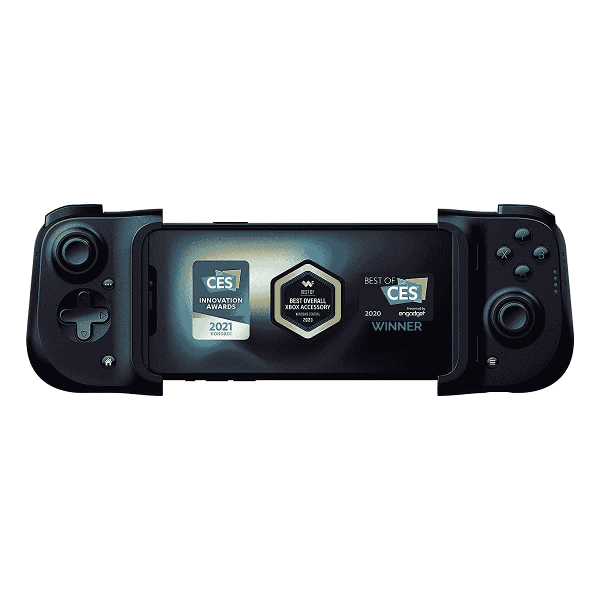

# Razer 的 Android 版 Kishi 游戏控制器售价 55 美元

> 原文：<https://www.xda-developers.com/razers-kishi-game-controller-for-android-is-on-sale-for-55/>

# Razer 的 Android 版 Kishi 游戏控制器售价 55 美元

Razer 的 iPhones 控制器上周上市，现在 Android 版本已经降价。

Razer Kishi 是目前你能为智能手机买到的最好的游戏控制器之一。它附着在手机的背面和侧面，将它变成一个类似任天堂 Switch 的设计，带有双模拟操纵杆和所有常见的游戏手柄按钮。iPhones 的型号(带有 Lightning 连接器)[几天前降到了 81.71 美元](https://www.xda-developers.com/razers-top-iphone-controller-is-18-off-right-now/)，现在 Razer 也将 Android 版本的价格降到了仅仅 55 美元。

得益于可调节的外壳，Razer Kishi 可以与大多数 Android 手机兼容。它有两个操纵杆，一个 D-Pad，顶部的触发器，以及常见的 A/B/X/Y 按钮。岸信介可以与任何支持物理控制器输入的 Android 游戏兼容，包括*《我的世界》*、*堡垒之夜*、*末日*、*星谷*、*使命召唤:移动*、*星球大战:旧共和国骑士 II* 和 *Terraria* 。它也是 Xbox Game Pass、Google Stadia 和其他游戏流媒体服务的绝佳选择。查看您最喜欢的游戏的 Play Store 描述(或评论),了解控制器支持是否可用。

 <picture></picture> 

Razer Kishi

##### 雷蛇 Kishi

Razer 的 Android 版 Kishi 控制器几个月来一直是 68 美元(低 12 美元)，但现在只需 55 美元。它有一个 USB Type-C 端口，用于连接手机。

当你不使用 Razer Kishi 时，它可以折叠起来，便于存放。控制器还有一个直通 USB Type-C 端口，因此您可以在长时间的游戏过程中为手机充电。但是充电接口不支持数据，不能同时插耳机或者其他配件。查看 [XDA 对雷蛇岸信介的评论](https://www.xda-developers.com/razer-kishi-review-google-stadia-nvidia-geforce-now-steam-link-emulators/)以获得我们的完整印象。