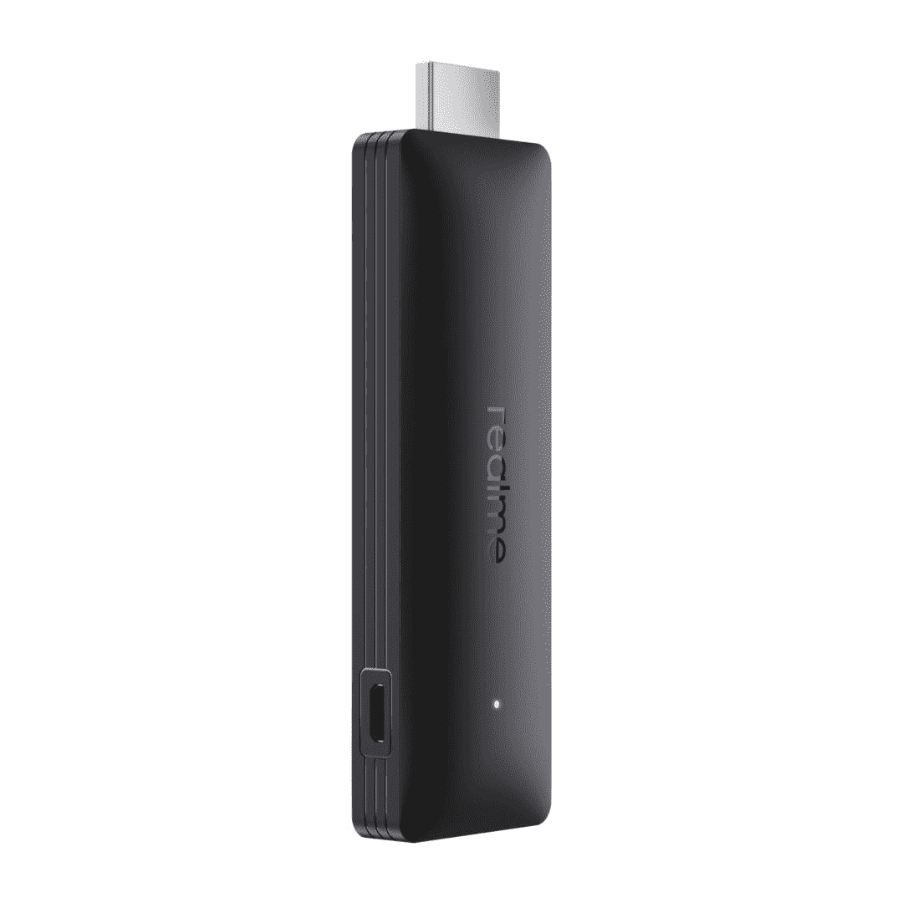
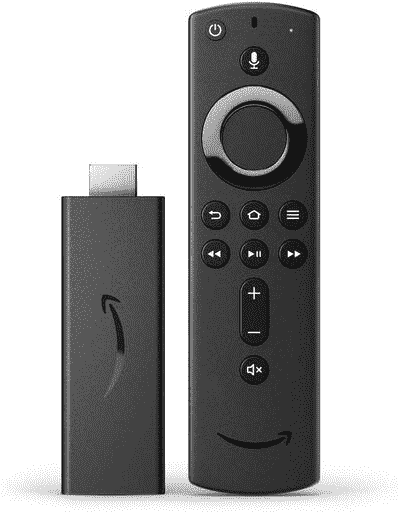

# Realme 4K 智能谷歌电视棒评论:足以扑灭亚马逊的火？

> 原文：<https://www.xda-developers.com/realme-4k-smart-google-tv-stick-review/>

过去几年，印度的智能电视类别突然起飞。感谢像小米、Vu、TCL 这样的品牌，以及最近的- [Realme](https://www.xda-developers.com/realme-4k-android-tv-launch/) ，消费者已经能够以实惠的价格购买智能电视。几年前，当索尼和三星等主流品牌主导市场时，情况并非如此。如果你没有智能电视，或者如果你有一个准系统界面的智能电视，一个[流媒体棒](https://www.xda-developers.com/best-android-tv-box/)或一个盒子通常是在你的电视上享受 OTT 内容或应用的方式。虽然市场上已经有几种流媒体设备，但 Realme 希望通过他们的最新产品——Realme 4K 智能谷歌电视棒，给你提供另一种选择。

Realme 的这款流媒体工具是印度第一款搭载谷歌电视的设备。对于那些不知道的人来说，谷歌电视是在安卓电视基础上改进的界面，专注于内容推荐。其核心仍然是 Android TV，但有了新的用户界面，看起来更现代，更整洁。这是 Realme 电视棒的主要卖点之一。它是否值得推荐超过现有设备，如亚马逊 Fire 电视棒 4K？它的功能是不是比名字里的音节还多？让我们找出答案。

## 初始设置

就像每一个流媒体棒或盒子一样，Realme 电视棒通过 HDMI 端口连接到您的电视。由于记忆棒有点粗，你可能会发现根据 HDMI 端口的位置插入某些类型的电视很不方便。为了解决这个问题，Realme 在盒子里捆绑了一个小型 HDMI 男性到女性扩展器。HDMI 端口不为记忆棒供电，因此您需要将附带的 micro-USB 电缆连接到记忆棒，另一端连接到电视本身的 USB-A 端口或外部墙壁适配器。一旦你做好了这些连接，你就准备好安装操纵杆了。

设置过程非常简单明了

电视打开后的第一步是将随附的蓝牙遥控器与流媒体工具配对。然后，您可以按照屏幕上的说明，下载 Google Home 应用程序来完成设置过程。这很简单明了。请注意，您将被要求选择一个 Google 帐户进行注册，您所有的内容推荐和观看历史将被同步到该帐户。Play Store 以及谷歌的应用和服务也将使用相同的 ID。

## 连通性

Realme 4K 智能谷歌电视棒支持 HDMI 2.1 和 CEC，这意味着你可以使用遥控器来控制棒和电视。还支持 5GHz Wi-Fi 网络，这很好，因为大多数实惠的设备都不支持这一点。您还可以借助蓝牙 5.0 将耳机或鼠标和键盘等外设连接到 Realme 电视棒。

## 用户界面

谷歌电视用户界面无疑是一股新鲜空气

一旦你启动新的谷歌电视，你会注意到的第一件事是用户界面是多么的不同。如果你用过安卓电视，你就会知道用户界面看起来有多混乱。谷歌电视用户界面无疑是一股新鲜空气。它看起来更现代，类似于 Fire 电视棒上的 UI。主屏由来自各种服务的内容推荐填充。可用的服务有 Apple TV+、Hotstar 和 Prime Video。虽然网飞应用程序可用，但您无法在谷歌电视主屏幕上看到来自该服务的推荐。

### 应用程序

除了内容推荐，主屏幕还会显示应用推荐。这些通常是流媒体应用程序以及一些针对 Android TV 优化的轻量级游戏。移动到主屏幕的左侧会出现搜索选项，您可以使用该选项来查看已安装的服务，以查找您想要的特定电影或节目。主屏幕的右边是*应用*标签。此部分显示所有已安装的应用程序以及建议。我的其他设备部分还有一个方便的*应用程序，可以帮助你安装你已经熟悉和使用的应用程序。*

### 图书馆

最后，还有一个*图书馆*标签，列出了你所有的租借和购买以及一个观察列表。您可以将想要稍后观看的电影或节目添加到观看列表中。如果你使用同一个谷歌账户登录，通过手机向观察列表添加内容也会同步到电视上。你可以在谷歌上查找节目或电影，点击*观看列表*按钮，将内容添加到观看列表中。出于某种原因，我在 iPhone 上找不到这个选项，尽管它在 Android 设备上运行良好。

### 系统用户界面

我很高兴谷歌决定改进用户界面，因为旧的界面已经开始看起来陈旧了。

除了主屏幕，快速切换用户界面和设置应用程序也接受了视觉上的彻底检查。它类似于智能手机上的 Android，比它在 Android TV 上看起来好得多。如果你以前用过 Fire 电视棒，谷歌电视 UI 会感觉很熟悉，很容易使用。我很高兴谷歌决定改进用户界面，因为旧的界面已经开始看起来陈旧了。

## 表演

与智能手机不同，你不会直接在电视棒上执行多任务或运行图形密集型游戏。内容流媒体应用不需要很大的马力来运行，这就是为什么大多数流媒体设备都有相当基本的内部功能。Realme 4K 智能谷歌电视棒使用 Amlogic 的四核芯片，搭配 2GB 内存。新的谷歌电视界面似乎经过了很好的优化，可以在这种硬件上运行，因为我在浏览 UI 时没有注意到很多延迟。我注意到偶尔会有口吃和丢帧的情况，但这在大多数流媒体设备和 Android TV 平台上都普遍存在。

如果你打算玩一些轻量级的游戏，如[沙滩车比赛](https://play.google.com/store/apps/details?id=com.vectorunit.purple.googleplay)或[爬山比赛](https://play.google.com/store/apps/details?id=com.fingersoft.hillclimb)，你会注意到这里或那里有些口吃。另一方面，Fire TV Stick 4K 似乎在玩游戏时表现稍好。总的来说，我觉得 Fire 电视棒 4K 提供了更流畅的体验。

## 图像质量

Realme 电视棒可以将内容传输到 4K。这涉及到你所有的应用和服务，比如 YouTube、网飞、Prime Video 等。还有对 HDR 10+流媒体的支持，以增加视觉吸引力。然而，杜比视觉在 Realme 4K 智能谷歌电视棒上并不存在，而在 Fire 电视棒 4K 上却有支持。也没有杜比全景声，这也是你用电视棒 4K 得到的东西。

Fire 电视棒 4K 比 Realme 电视棒产生更好的视觉效果

总的来说，Realme 4K 智能谷歌电视棒的图像质量似乎相当不错。虽然电视上使用的面板质量也起着重要作用，但棒处理颜色的能力很好。然而，在这方面，我也要说，Fire TV Stick 4K 比 Realme TV Stick 产生了更好的视觉效果，这显然是因为杜比视觉的存在。

## 远程控制

这是 Realme 电视棒得分较高的一个领域，并且比 Fire 电视棒做得更好。Realme 电视棒的遥控器有一组传统的按钮，包括电源开/关、静音、导航键、后退、主页、设置和音量控制。你还可以使用专用按钮来激活谷歌助手，启动 YouTube、YouTube 音乐、网飞和 Prime Video。

另一方面，Fire 电视棒 4K 没有专门的按钮来启动任何流媒体应用程序，甚至亚马逊自己的 Prime Video 也没有。同样值得注意的是，谷歌助手是一个比 Fire TV Stick 上的 Alexa 好得多的语音助手。

## 结论:你应该购买 Realme 4K 智能谷歌电视棒吗？

Realme 4K 智能谷歌电视棒让你以₹2,999.的价格体验谷歌电视这是一个很好的流媒体设备，性能流畅，是一个网关流 4K HDR 的内容。然而，在撰写本文时，同样的价格，亚马逊 Fire 电视棒 4K 通过支持杜比视觉提供了更好的价值。它还拥有流畅的用户界面，可以做 Realme 电视棒所做的一切。你不会得到新的谷歌电视用户界面，但你不会因此错过太多。如果让我在 Realme 4K 智能谷歌电视棒和 Fire 电视棒 4K 之间选择，我会选择 Fire 电视棒，你也应该选择。除非你真的想要那台新的谷歌电视。

 <picture></picture> 

Realme 4K Smart Google TV Stick

##### Realme 4K 智能谷歌电视棒

Realme 4K 智能谷歌电视棒是一款流媒体设备，配有最新的谷歌电视用户界面，支持 4K HDR 流媒体。

 <picture></picture> 

Amazon Fire TV Stick 4K

##### 亚马逊 Fire 电视棒 4K

亚马逊 Fire 电视棒 4K 有一个很好的用户界面，可以通过杜比视觉在 4K 播放内容。