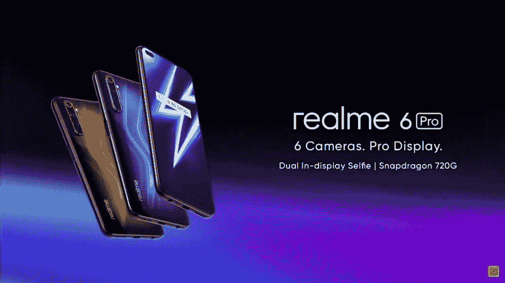
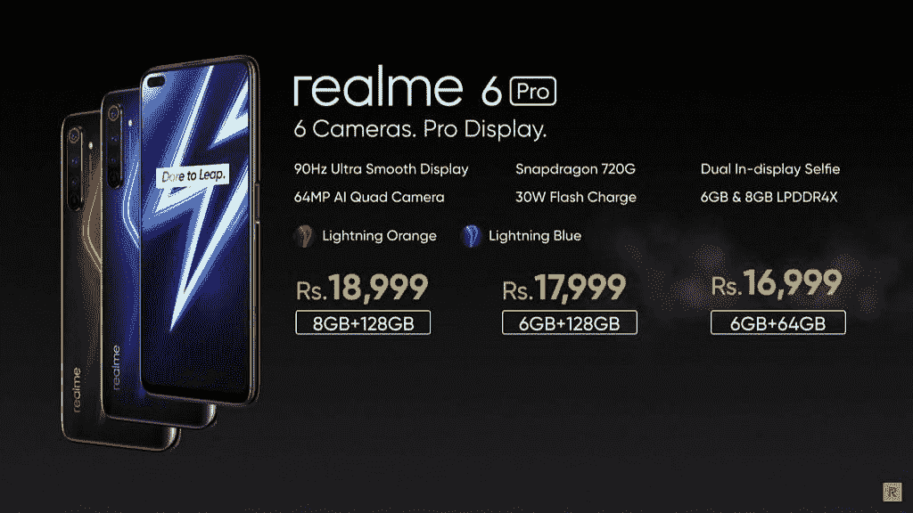

# Realme 6，6 Pro 在印度上市，起价为₹12,999

> 原文：<https://www.xda-developers.com/realme-6-6-pro-launched/>

Realme 今年有了一个良好的开端，推出了经济实惠的 Realme C3 及其在 T2 的首款 5G 旗舰产品 Realme X50 Pro T3。在我对 Realme C3 的评测中，我发现联发科 Helio G70 驱动的设备对于预算有限的手机游戏玩家来说是一个很好的选择，而我们团队的 Adam 将 Realme X50 Pro 描述为一个“精心设计的包，具有良好的功能和出色的性能”。因此，当[公司宣布](https://www.xda-developers.com/realme-6-series-64mp-camera-90hz-display-30w-charging/)将于上月下旬在印度推出 Realme 6 系列时，我对即将推出的设备寄予厚望。当时，该公司透露，Realme 6 系列将配备 64MP 主摄像头，90Hz 显示屏，并支持 30W 快速充电。Realme 现在终于在印度推出了 Realme 6 系列，该系列的两款设备看起来都是令人信服的选择，尤其是在各自的价位上。

## 现实 6

首先，让我们来看看 Realme 6，它是去年 Realme 5 的直接继任者。单就规格而言，Realme 已经从 Realme 5 向 Realme 6 迈出了一大步，新设备可以提供更多功能。Realme 6 采用 6.5 英寸 FHD+ LCD 显示屏，刷新率为 90Hz，并为自拍相机提供了一个圆形打孔切口。这款显示器的触摸采样率为 120Hz，最大亮度为 480 尼特，比 Realme 5 的 720p 显示器高出一个档次。

在内部，Realme 6 由联发科的 Helio G90T (MT6785) SoC 驱动，加上高达 8GB 的 LPDDR4X RAM 和高达 128GB 的 UFS 2.1 存储。相比之下，去年的 Realme 5 采用了骁龙 665 芯片，外加高达 4GB 的内存和高达 128GB 的 eMMC 存储。Realme 6 再次是一次重大升级。即使在相机部门，Realme 6 提供的也要多得多。该设备有一个 6400 万像素的主摄像头，一个 800 万像素的超宽摄像头，一个 200 万像素的专用微距摄像头和一个 200 万像素的单声道传感器，据推测，用于深度感知。在正面，该设备有一个 16MP 的自拍相机。为 Realme 6 供电的是一个相当不错的 4,300 mAh 电池，支持 30W 快速充电。

这两款设备的设计相似，铝合金框架，聚碳酸酯背面带垂直摄像头模块，电容指纹扫描仪嵌入右边缘的电源按钮和左边缘的音量按钮。这两款设备还包括一个 3.5 毫米耳机插孔和一个用于充电和数据同步的 USB Type-C 端口。潜在买家也会很高兴地知道，Realme 6 和 6 Pro 都采用了三槽 SIM 卡托盘，这将允许你同时使用两张 nano-SIM 卡和一张 microSD 卡进行扩展。既然我们已经解决了这两款设备的所有共同功能，让我们来看看是什么让更高级的 Realme 6 Pro 脱颖而出。

| **规格** | **现实 6** |
| --- | --- |
| **尺寸&重量** |  |
| **显示** |  |
| **SoC** |  |
| **闸板** | 4GB/6GB/8GB |
| **存储** | 64GB/128 GB UFS 2.1 专用 microSD 插槽 |
| **电池** | 通过 USB Type-C 进行 4，300 毫安时、30 瓦充电 |
| **指纹传感器** | 电容性的 |
| **后置摄像头** |  |
| **前置摄像头** |  |
| **安卓版本** | 基于 Android 10 的 Realme UI |
| **颜色** | 蓝色彗星，白色彗星 |

## Realme 6 Pro

与 Realme 6 一样，Realme 6 Pro 比去年的 Realme 5 Pro 有了重大的规格提升，尤其是在几个关键领域。该设备采用 6.6 英寸 FHD+ LCD 显示屏，刷新率为 90 赫兹，触摸采样率为 120 赫兹，峰值亮度为 480 尼特。相比之下，Realme 5 Pro 采用了 6.3 英寸的 FHD+显示屏，刷新率为 60Hz，峰值亮度为 450 尼特。

在内部，6 Pro 由骁龙 720G (SM7125)芯片提供支持，拥有高达 8GB 的 LPDDR4X RAM 和高达 128GB 的 UFS 2.1 存储。高通在今年 1 月早些时候宣布了新的骁龙 720G 芯片，Realme 6 Pro 是第一款使用这种芯片的智能手机。将它与当今市场上的其他中端芯片进行比较将是一件有趣的事情，所以请确保您留下来观看我们对 Realme 6 Pro 的全面评测。

在相机部门，6 Pro 还提供了四摄像头设置，包括 64MP 主摄像头、8MP 超宽摄像头、12MP 长焦摄像头和 2MP 微距摄像头。在正面，该设备具有两个自拍摄像头，一个 1600 万像素的摄像头具有 79.3 FoV，一个 800 万像素的超宽摄像头具有 105 FoV。两台摄像机都装在左上角的一个药丸形状的打孔切口内。与 Realme 6 一样，Realme 6 Pro 也装有 4300 毫安时电池，支持 30W 快速充电。就软件而言，Realme 6 和 6 Pro 都运行基于 Android 10 的 Realme UI v1.0，这是

[slowly rolling out](https://www.xda-developers.com/realme-5-pro-realme-x-android-10-realme-ui/)

到更真实的设备。

| **规格** | **Realme 6 Pro** |
| --- | --- |
| **尺寸&重量** |  |
| **显示** |  |
| **SoC** |  |
| **闸板** | 6GB/8GB |
| **存储** | 64GB/128 GB UFS 2.1 专用 microSD 插槽 |
| **电池** | 通过 USB Type-C 进行 4，300 毫安时、30 瓦充电 |
| **指纹传感器** | 电容性的 |
| **后置摄像头** |  |
| **前置摄像头** |  |
| **安卓版本** | 基于 Android 10 的 Realme UI |
| **颜色** | 闪电蓝，闪电橙 |

## 定价和可用性

Realme 6 和 6 Pro 将分别于 3 月 11 日和 3 月 13 日开始在 Flipkart 上购买。Realme 为这两款设备提供了两种颜色，Realme 6 有彗星蓝和彗星白两种表面，Realme 6 Pro 有闪电蓝和闪电橙两种表面。Realme 6 的 4/64GB 版本的起价为₹12,999，而 6/128GB 和 8/128GB 版本的起价分别为₹14,999 和₹15,999。更高级的 6 Pro 将在₹16,999 提供 6/64GB 版本，在₹17,999 和₹18,999 分别提供 6/128GB 和 8/128GB 版本。