# Realme 6 Pro 评测:一款功能全面、价格实惠的中端智能手机

> 原文：<https://www.xda-developers.com/realme-6-pro-review/>

Realme 的数字系列始于 2018 年 Realme 1 的推出，众所周知，它提供了一些很棒的预算设备。但随着 Realme C 系列现在瞄准相同的价格段，Realme 已经升级了 number 系列，以实惠的价格提供中档规格。继今年早些时候在印度推出 Realme C3 ( [评测](https://www.xda-developers.com/realme-c3-performance-gaming-review-mediatek-helio-g70/))之后，Realme [在印度市场推出了 Realme 6 和 Realme 6 Pro](https://www.xda-developers.com/realme-6-6-pro-launched/) 。number 系列中的最新设备集成了一些令人印象深刻的硬件，如高刷新率 FHD+显示器和 6400 万像素主摄像头，这些在以前只限于高端设备。

更新的规格，加上实惠的价格，使新的 Realme 6 系列在中端智能手机市场上成为引人注目的购买对象。这些设备直接与小米最近推出的 Redmi Note 9 Pro 系列和 POCO X2 竞争，后者[在社交媒体上令人不快地瞄准了](https://twitter.com/cmanmohan/status/1239533929108893696)Realme 6 Pro。因此，如果你在市场上寻找一款新的中端 Android 智能手机，并发现自己被小米和 Realme 在各种平台上做出的各种不同声明所淹没，那么你来对地方了。在这篇评论中，我们将仔细看看 Realme 6 Pro，看看它是否真的值得购买，以及它在竞争中的表现如何。

| 规格 | Realme 6 Pro |
| --- | --- |
| **尺寸和重量** |  |
| **显示** |  |
| **SoC** |  |
| **RAM 和存储器** |  |
| **电池&充电** |  |
| **后置摄像头** | 照片:视频:视频:视频:

*   **初级:** 64MP 三星 ISOCELL Bright GW1，f/1.8
*   **次要:** 8MP 119 广角相机，f/2.3
*   **第三:** 12MP 长焦相机，f/2.5
*   **四元:** 2MP 微距相机，f/2.4

Video: |
| **前置摄像头** |  |
| **其他特征** |  |
| **安卓版本** | [基于 Android 10 的 Realme UI](https://www.xda-developers.com/tag/realmeui/) |

* * *

## Realme 6 Pro 设计

最近一段时间，Realme 在智能手机设计方面做出了一些大胆的选择。今年早些时候推出的 Realme C3 背面有一个日出设计，有一个防指纹的防滑表面，这给了它一个非常独特的外观。凭借 Realme 6 系列，该公司将事情推向了一个新的高度，这些设备采用了受闪电启发的设计，表面光滑，根据您观看设备的角度而变化。我一直在使用的 Realme 6 Pro 单元有着闪电蓝的涂装，看起来相当抢眼。闪电橙色的变体，我没有亲自见过，在图片上看起来也相当惊艳。然而，背面的闪电涂层可能不是每个人都喜欢的，仅仅因为这个原因，一些人可能更喜欢 POCO X2 或 Redmi Note 9 Pro 更干净、更简约的外观。

接下来，后面板由一层 Gorilla Glass 5 保护，虽然它可能感觉像塑料，但你可以放心，它不会像其他塑料背的手机那样容易划伤。与 POCO X2 和 Redmi Note 9 Pro 不同，Realme 6 Pro 在背面采用了更传统的垂直排列的四摄像头模块，旁边有双音 LED 闪光灯，以及 AI 四摄像头品牌。Realme 的标志与相机模块垂直对齐，位于它的正下方，比该公司旗舰产品 Realme X2 Pro(

[review](https://www.xda-developers.com/realme-x2-pro-xda-review/)

).

在前面，我们有一个 6.6 英寸 90Hz 的显示屏，带有一个用于自拍相机的双打孔切口。耳机位于最小的顶部挡板内，由穿孔金属格栅保护。说到边框，Realme 在保持 Realme 6 Pro 的边框纤薄方面做得很不错，至少在顶部和侧面。然而，底部边框仍然很厚，但这是我们愿意为这个价格范围内的智能手机做出的妥协。

在端口方面，Realme 6 Pro 的底部边缘有一个用于充电和数据同步的 USB Type-C 端口，一侧是 3.5 毫米耳机插孔，另一侧是一个向下发射的扬声器。主麦克风位于耳机插孔和 Type-C 端口之间。

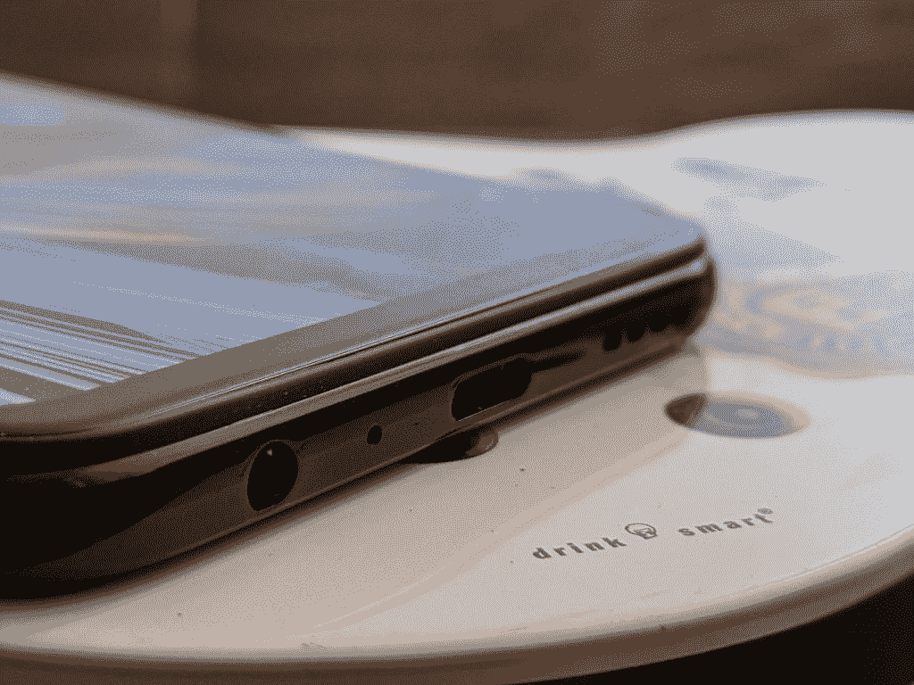

该设备的电源按钮内置电容指纹扫描仪，位于右边缘的凹槽中。凹槽使电源按钮在你不看的时候很容易找到，虽然我是侧装指纹扫描仪的粉丝，但我并不特别喜欢这款设备上的指纹扫描仪，因为当我拿着它时，它会导致连续的意外触摸。

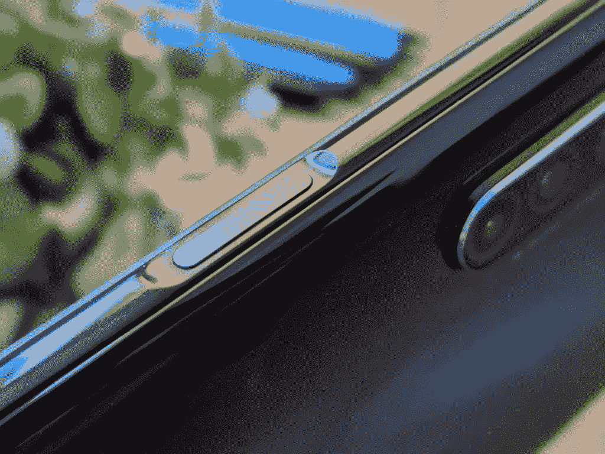

这是一个主要的烦恼，因为由于几次不正确的输入，设备经常无法使用指纹扫描仪解锁，我不得不使用 pin 解锁设备。音量摇杆可以在对面的边缘找到，以及它正上方的三槽 SIM 卡托盘。

## Realme 6 专业显示器

Realme 6 Pro 上的 6.6 英寸打孔显示屏分辨率为 1080x2400 像素，屏幕与机身的比例为 90.6%，纵横比为 20:9。虽然 Redmi Note 9 Pro 也采用了类似的显示屏，尽管中心有一个打孔的切口，但 Realme 6 Pro 与众不同的是更高的 90Hz 高刷新率支持。在这方面，POCO X2 更上一层楼，提供了 120Hz 的高刷新率显示屏，这是一些人选择它而不是 6 Pro 的一个主要原因。

显示屏亮度是 Realme 6 Pro 的显示屏胜过 Redmi Note 9 Pro 的另一个方面。虽然 Redmi Note 9 Pro 号称峰值亮度为 450 尼特，但 Realme 6 Pro 为用户提供的峰值亮度为 480 尼特。虽然显示器亮度仍然比 POCO 公司宣传的 500 尼特低一点，但用户在阳光直射下不会面临任何可见度问题。虽然高刷新率支持对于希望购买游戏设备的用户来说非常好，但那些对内容消费更感兴趣的用户可能会有点失望。这款显示器没有任何 HDR 认证，就像 POCO X2 上的显示器一样，虽然 Realme 声称该设备支持 Widevine L1 认证，但它目前不支持亚马逊 Prime Video 和网飞等 OTT 应用程序上的全高清播放。在我的测试中，我还发现 DRM Info 应用程序显示了 Widevine L3 支持，而不是声称的 Widevine L1，这令人失望。尽管 Realme 已经推出了一个带有修复程序的更新，但即使安装了更新，问题仍然存在。

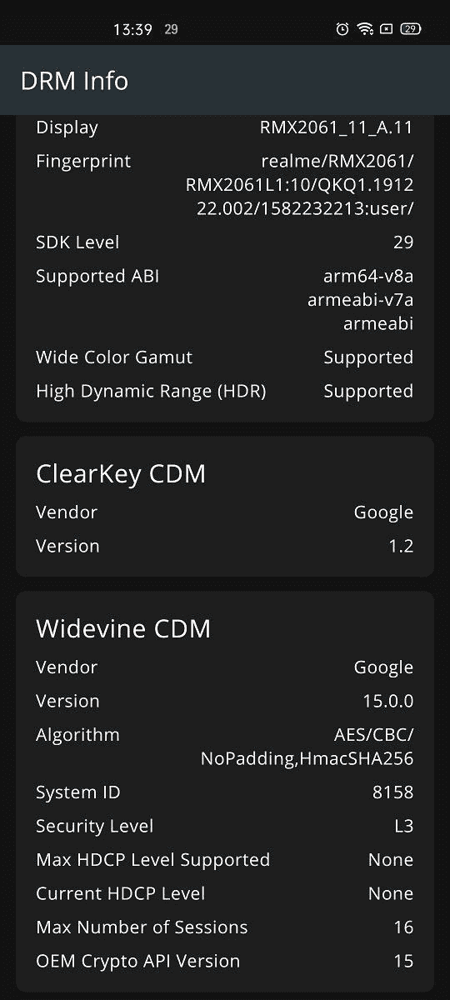 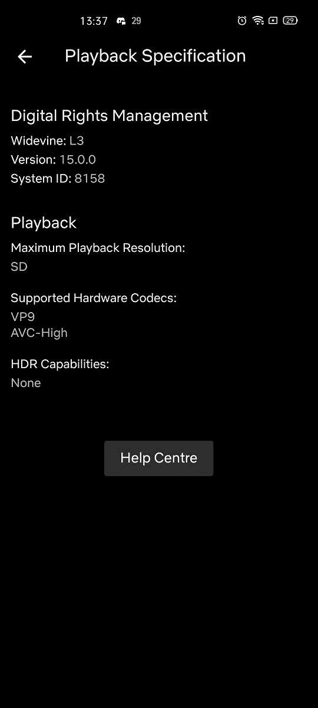

总之，Realme 6 Pro 的显示屏对于这个价格范围的设备来说是非常令人满意的，而且它很容易胜过 Redmi Note 9 Pro，特别是因为它支持高刷新率。然而，缺乏 Widevine L1 支持意味着它在网飞和亚马逊 Prime Video 等应用上观看视频时不会提供最佳体验。[EMBED _ APP]https://play . Google . com/store/apps/details？id = com . androidfung . DRM info[/EMBED _ APP]

## Realme 6 专业版性能

为 Realme 6 Pro 提供动力的是高通骁龙 720G SoC，你也可以在最近发布的 Redmi Note 9 Pro 系列中找到它。骁龙 720G 移动平台仅在几个月前推出，Realme 6 Pro 是第一款使用新芯片组的设备。骁龙 720G 与去年的骁龙 730/730G 相比有一些小的改进，包括更高的性能内核时钟速度。该芯片组支持双频 GNSS，包括印度的 NavIC 和具有 aptX Adaptive 的蓝牙 5.1。就性能而言，骁龙 720G 与骁龙 730/730G 不相上下，只是在某些情况下略有优势。我使用一套常用的合成基准测试应用程序测试了 Realme 6 Pro，以便对该设备的性能有一个初步的了解。我还将结果与红米 Note 9 Pro 和 POCO X2 进行了比较，以下是我的观察结果。

### 极客工作台 5

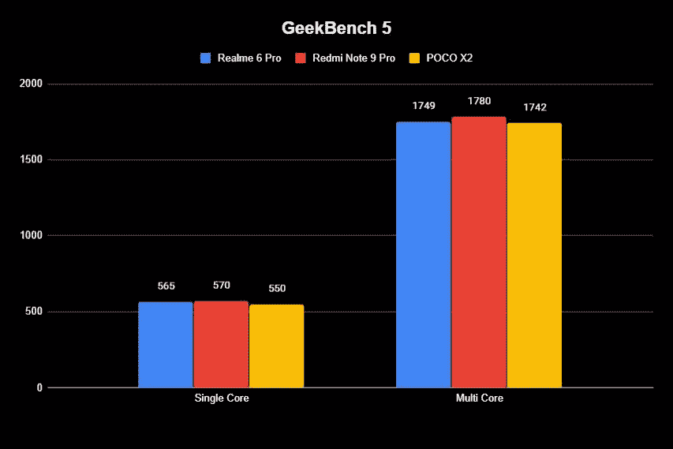

由于 AnTuTu 现在已经从谷歌 Play 商店移除，我们将从 Geekbench 5 开始。在跨平台 CPU 基准测试中，Realme 6 Pro 在单核测试中的得分为 565，在多核测试中的得分为 1749。相比之下，Redmi Note 9 Pro 的单核测试成绩为 570，多核测试成绩为 1780，表现略好。尽管 POCO 在社交媒体上多次声称，但 POCO X2 以 550 的单核分数和 1742 的多核分数略微落后。[EMBED _ APP]https://play . Google . com/store/apps/details？id = com . primate labs . geek bench 5[/EMBED _ APP]

### PCMark

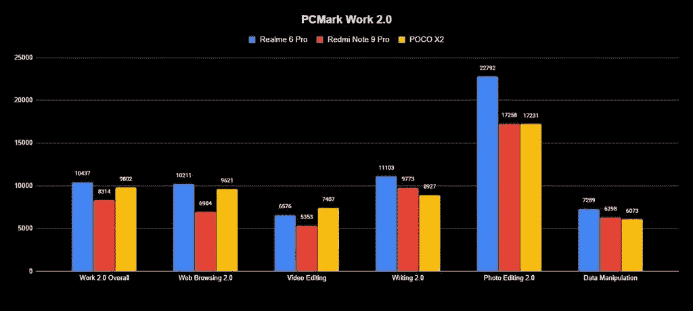

在 PCMark Work 2.0 基准测试中，它模拟日常任务，如编辑文档、照片、视频等。，Realme 6 Pro 在大多数情况下都明显领先。该设备的总得分为 10437 分，红米 Note 9 Pro 以 8314 分远远落后，波科 X2 以 9802 分落在两者之间。在网页浏览 2.0 测试中，Realme 6 Pro 再次以 10211 的分数领先，其次是 9621 的 POCO X2 和 6984 的 Redmi Note 9 Pro。这一趋势在写作 2.0 和照片编辑 2.0 测试中继续保持，Realme 6 Pro 分别以 11103 和 22792 领先。然而，该设备在视频编辑和数据处理测试中落后于 POCO X2，分别获得 6576 和 7289 分。在所有情况下，红米 Note 9 Pro 都远远落后，然而，值得注意的是，展示的结果是使用红米 Note 9 Pro 的 6GB RAM 变体和 Realme 6 Pro 和 POCO X2 的 8GB RAM 变体获得的，这可能是 Note 9 Pro 相对较差的性能背后的主要原因。[EMBED _ APP]https://play . Google . com/store/apps/details？id = com . futuremark . pcmark . Android . benchmark[/EMBED _ APP]

### 3DMark

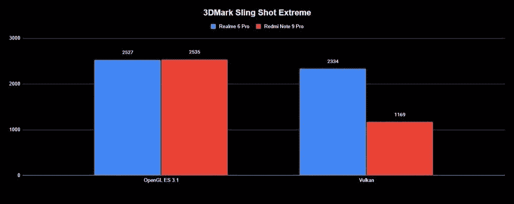

转到一个更以 GPU 为中心的基准测试，Realme 6 Pro 在 3DMark 的 Sling Shot Extreme OpenGL ES 3.1 测试中获得了 2527 分，在 Vulkan 测试中获得了 2334 分。由于它使用了与红米 Note 9 Pro 相同的 Adreno 618 GPU，所以两款设备交付的分数几乎相同。虽然 POCO X2 也使用了相同的 GPU，但我们无法在该设备上运行基准测试，因此没有进行比较。[EMBED _ APP]https://play . Google . com/store/apps/details？id = com . futuremark . dman droid . application[/EMBED _ APP]

### CPU 节流测试

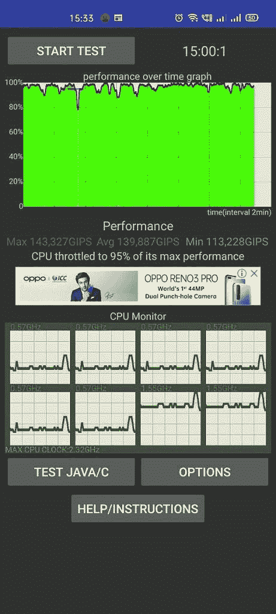

为了检查 Realme 6 Pro 的散热性能，我使用了 CPU 节流测试 app。该应用程序在一段时间内(在本例中为 15 分钟)重复运行用 C 语言编写的多个线程(在我们的测试中为 20 个),以检查 CPU 性能是否受到抑制以防止过热。虽然该设备在高负载下摸起来并不温暖，但我们注意到在 50%电池下运行测试时有轻微的节流(5%)。相比之下，当电池电量低或设备正在充电时，节流更明显。[EMBED _ APP]https://play . Google . com/store/apps/details？id = skynet . cputhrotlingtest[/EMBED _ APP]

### 安卓长凳

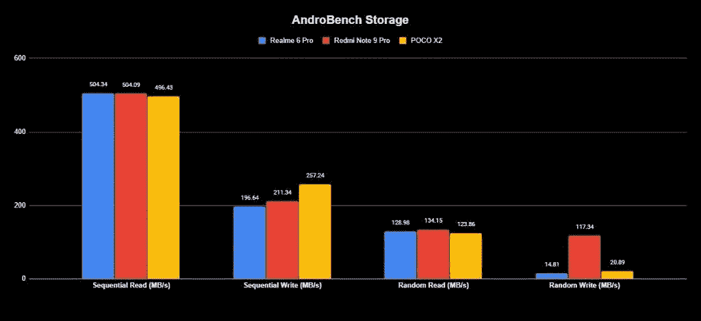

最后，为了测试存储性能，我在所有三台设备上运行了 Androbench 存储基准测试。由于对比中的三款手机都采用了 UFS 2.1 NAND 存储，因此它们的性能只有微小的差异。从上图中可以看出，Realme 6 Pro 的顺序读取速度为 504.32 MB/s，顺序写入速度为 196.64 MB/s，随机读取速度为 128.98 MB/s，与竞争对手相当。然而，由于某种原因，这款设备在随机写入测试中远远落后，发布速度仅为 14.81 MB/s，而红米 Note 9 Pro 的速度为 117.34 MB/s，POCO X2 的速度为 130.82 MB/s。id = com . Andromeda . andro bench 2[/EMBED _ APP]

### 赌博

基于上述结果，可以肯定地说，Realme 6 Pro 是该价格段中性能最好的设备之一。我没有注意到日常使用中的任何抖动或滞后，游戏性能也令人满意。在 PUBG 这样的游戏中，Realme 6 Pro 支持“超”帧率(40fps)，但不包括对 HDR 设置的支持。COD Mobile 在高图形设置下以“最大”帧速率(60fps)运行，在“非常高”图形下以“非常高”帧速率运行。在这两款游戏中，我都没有发现任何丢帧现象，即使是在长时间的游戏过程中。在奥拓的《奥德赛》(Odyssey)和《极速前进》(Breakneck)等要求较低的游戏中，6 Pro 几乎不费吹灰之力，如果你是类似街机风格游戏的粉丝，你就不会面临任何设备问题。

## Realme 6 Pro 电池续航时间

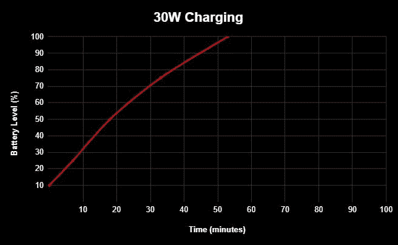

Realme 6 Pro 采用了 4300 毫安时电池，支持 30W VOOC 闪充 4.0。虽然电池肯定比红米 Note 9 Pro 和 POCO X2 的电池小，但这款设备一次充电可以轻松支持我使用一整天。在我的日常使用中，打开 90Hz 显示选项时，我的屏幕持续时间超过 5.5 小时，关闭该选项时，我的屏幕持续时间超过 6 小时。在一天结束时，我总是留有接近 40%的电池，这又持续了我半天，因为晚上的电池消耗很少。有时，当我通过狂看视频或玩几个 PUBG 游戏来推动设备时，设备在一天结束时会剩下大约 20%的电池。说到充电，附带的 30W 充电器工作得非常好，只需要大约一个小时就可以从 10%充电到 100%。然而，该设备在充电时触摸起来确实会有点热。

## Realme 6 Pro 相机

Realme 6 Pro 采用四摄像头设置，配备 64MP 三星 ISOCELL Bright GW1 主传感器，再加上 12MP 长焦摄像头、8MP 超宽摄像头(119°视野)和 2MP 微距摄像头。在正面，该设备有一个 1600 万像素的索尼 IMX 471 传感器，加上一个 800 万像素的超宽摄像头，视野为 105°。

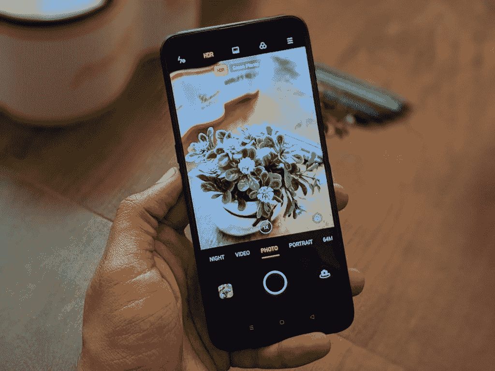

由于新冠肺炎疫情的预防措施，我无法测试 Realme 6 Pro 的相机的全部潜力，这就是为什么我将跳过详细的相机审查。然而，我能够在封锁前捕捉到一些图像，我不得不说，夜间模式的表现非常壮观。下面是我用 Realme 6 Pro 上的各种相机点击的几张图片。

### 主 6400 万像素摄像头

### 长焦照相机

### 广角的

### 夜间模式

### 自拍

### 夜间模式自拍

## 结论

基于以上分享的所有信息，对于任何寻求高刷新率显示屏和良好性能的经济型 Android 设备的人来说，Realme 6 Pro 都是一个令人信服的购买选择。受闪电启发的设计可能会非常两极分化，但它一定会吸引旁观者的注意。在规格方面，Realme 提供了一个全面的包，可以满足您的所有需求。由于高刷新率显示屏、骁龙 720G 和 30W 快速充电支持，Realme 6 Pro 无疑是去年 Realme 5 Pro 的一次大规模升级。最重要的是，Realme 操作系统最近的改进使它比类似的 MIUI 驱动的设备更值得购买，但这归结于个人偏好。如果你在市场上购买一款价格实惠的 Android 智能手机，并希望物有所值，那么与 Redmi Note 9 Pro 相比，Realme 6 Pro 提供了更好的整体包装(

[review](https://www.xda-developers.com/xiaomi-redmi-note-9-pro-review-snapdragon-720g-48mp/)

).然而，如果你更喜欢更好的显示器和更棒的相机，你不能错过 POCO X2(

[review](https://www.xda-developers.com/poco-x2-review-better-than-poco-f1/)

)内置令人印象深刻的 120Hz 显示屏和索尼旗舰 64MP IMX686 主传感器。

[**在 Flipkart 上购买 realme 6 pro(₹16,999 首发)**](https://www.flipkart.com/realme-6-pro-lightning-blue-64-gb/p/itm19b1945c12aee?pid=MOBFPCX76F3BYQDH&lid=LSTMOBFPCX76F3BYQDHGAICT2&marketplace=FLIPKART&sattr%5B%5D=color&sattr%5B%5D=storage&sattr%5B%5D=ram&st=storage)