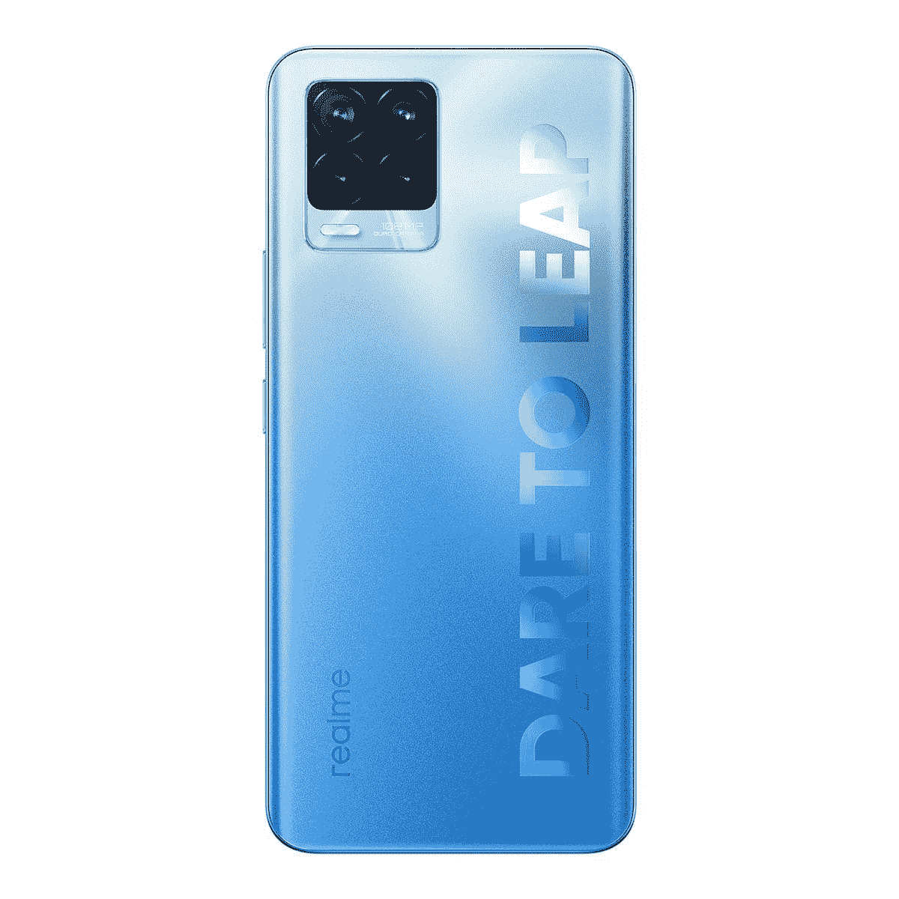

# Realme 8 Pro 评论:伟大的相机不会挽救平庸的性能

> 原文：<https://www.xda-developers.com/realme-8-pro-review/>

在过去的三年里，Realme 凭借众多的产品系列和不断推出的产品，已经跻身全球十大智能手机品牌。在 Realme 7 系列推出近六个月后，该公司在全球推出了 [Realme 8 和 Realme 8 Pro](https://www.xda-developers.com/realme-8-pro-smart-scale-smart-bulb-launch/) 中端智能手机。108MP 摄像头是 Realme 8 Pro 的一个主要亮点，这是该公司从众多设备上的 64MP 摄像头向前迈出的第一步，从 [Realme XT](https://www.xda-developers.com/realme-xt-64mp-camera-comparison-48mp-5-pro/) 开始。除了更新的主摄像头和新的设计，Realme 8 Pro 与 [Realme 7 Pro](https://www.xda-developers.com/realme-7-realme-7-pro-launched-india/) 几乎相同。

[Realme 最初是 OPPO 的子品牌](https://www.xda-developers.com/oppo-realme-1-official-india-mediatek-helio-p60/)，其目标是重现小米及其子品牌 Redmi 的成功。Realme 通过其最初的设备在这一尝试中取得了成功，其早期手机，如 [Realme 3 Pro](https://www.xda-developers.com/realme-3-pro-first-impressions-hands-on-review/) ，向我们展示了 Realme 可能是一个有前途的智能手机品牌。自那以来，该公司已经扩展到不同的产品系列和类别，似乎一直在做出一些妥协，同时又害怕像以前一样敢于向前飞跃。Realme 8 Pro 是同样的恐惧与一些偶然的努力混合在一起的高潮，以在一场似乎落后的比赛中保持自己。

正如我上面提到的，Realme 已经将 Realme 7 Pro 的大部分硬件重新用于其继任者。这可能不会让消费者满意，尤其是当 Redmi 的 Note 10 Pro(Note 10 Pro Max 在印度)以类似的价格提供了如此多的产品时。一个全新的设计，一个 108 兆像素的摄像头，和 Android 11 会挽救这个重新包装的规格表吗？我们的目标是在我们的 Realme 8 Pro 评测中解决这个问题。

在开始之前，我们先来看一下 Realme 8 Pro 的规格。

## Realme 8 Pro 规格

### Realme 8 Pro 规格；单击或点击以展开

| 

规格

 | 

Realme 8 Pro

 |
| --- | --- |
| **构建** | 聚碳酸酯背板和框架 |
| **尺寸&重量** | 

*   160.6 x 73.9 x 8.1 毫米
*   176 克

 |
| **显示** | 

*   6.4 英寸 Super AMOLED
*   2400 x 1080p 分辨率
*   60Hz 刷新率
*   180Hz 触摸采样速率
*   1000 尼特峰值亮度

 |
| **SoC** | 

*   高通骁龙 720G
    *   2 个 Kryo 465 性能内核@2.3GHz + 6 个 Kryo 460 效率内核@1.8GHz
*   Adreno 618 GPU

 |
| **风筒&储存** | 

*   6GB、8GB LPDDR4x 内存
*   128GB UFS 2.1 存储

 |
| **电池&充电** | 

*   4500mAh 电池
*   50W SuperDart 充电
*   包装盒内包含 65W 快速充电器

 |
| **安全** | 显示指纹扫描仪 |
| **后置摄像头** | 

*   **主:** 108MP 三星 GM2 传感器，f/1.88，PDAF，6P 镜头
*   **二级:**800 万像素 f/2.25，超宽，109 FOV，5P 镜头
*   **第三:** 2MP f/2.4，微距，4cm 拍摄距离
*   **四元:** 2MP f/2.4，B & W 传感器

视频:

*   高达 4K@30fps 或 1080p@60fps
*   Realme 的 UIS Max 视频稳定

 |
| **前置摄像头** | 16MP 索尼 IMX471 打孔自拍相机，f/2.45 |
| **端口** | 

*   USB 类型-C
*   3.5 毫米耳机插孔
*   2 个 SIM 卡+ 1 个专用 microSD 卡插槽

 |
| **音频** | 高分辨率音频 |
| **连通性** | 

*   802.11 无线网络
*   蓝牙 5.0

 |
| **软件** | 基于 Android 11 的 Realme UI 2.0 |
| **颜色** | 无限的蓝色、无限的黑色和明亮的黄色 |

***关于这个评测:** Realme 给我发了一个 8GB + 128GB 的 Realme 8 Pro 的变种。这是使用 10 天后的评论。Realme 在这次审查中没有任何投入。*

* * *

## 设计和建造

在早期，Realme 智能手机引人注目的设计帮助该品牌获得了用户的关注。这就是为什么设计仍然是 Realme 智能手机的核心元素。Realme 8 Pro 延续了这一趋势，其背面采用了防眩光水晶涂层。背面沙子般的粒状表面伴随着一个光滑的 Realme 徽标及其“敢于飞跃”座右铭。触摸时，表面感觉像磨砂玻璃和砂岩之间的中间物。值得注意的是，看看摄像头凸起的方形设计，很容易看出 Realme 8 Pro 和 OPPO F17 Pro 的设计有相似之处。

有三种颜色选择*:无限黑*、*无限蓝*和*发光黄*——我们还有蓝色的变种。霓虹黄无疑是最令人兴奋的颜色变体。包裹摄像头凸起和“敢跳”通信的材料会吸收光线，并在黑暗中发光。

背板和侧面的框架由聚碳酸酯制成，这有助于保持较低的重量。尽管有 4500 毫安时的电池，Realme 8 Pro 的重量只有 176 克。与该价位的许多其他智能手机不同，Realme 8 Pro 具有超薄的外形，易于使用，这要归功于背面的弧形边缘。面板摸起来很结实，施加压力时不容易向内弯曲。这款手机没有任何 IP 等级，该公司也没有声称对灰尘、水或微划痕有任何保护。

[sc name="pull-quote" quote= "闪亮的表面引人注目，但感觉不像玻璃那样高档。"]

侧框比背面光滑很多。它的右侧有电源按钮和音量摇杆，左侧有一个 2+1 SIM 卡托盘。底部有一个 3.5 毫米耳机插孔、主麦克风、USB Type-C 端口和单声道扬声器，顶部有用于消除噪音的辅助麦克风。

在正面，有一个 6.4 英寸的全高清+ Super AMOLED 显示屏，左上方有一个打孔的开孔。显示屏由朝日龙尾玻璃保护，而不是更受欢迎的康宁大猩猩玻璃，并在手机上预装了一层屏幕保护膜。我打开手机后就取下了屏幕保护套，并一直这样使用它，没有注意到显示屏上有任何划痕。

总体而言，Realme 8 Pro 感觉价格合理，尽管小米等品牌已经在使用玻璃而不是塑料来获得更优质的感觉。闪亮的设计一定会吸引其他人的注意，而方便的占用空间让您可以轻松使用手机。

* * *

## 我喜欢 Realme 8 Pro 的什么

### 108 百万像素摄像头

Realme 8 Pro 的主要亮点是其 108MP 四摄像头设置。虽然 Realme 是最早推出配有 6400 万像素摄像头的智能手机的品牌之一，但它无法用 108 万像素摄像头做到这一点。这是因为小米与三星在第一个 [108MP ISOCELL HMX 传感器](https://www.xda-developers.com/samsung-isocell-bright-hmx-108mp-camera-sensor-xiaomi/)上的独家合作关系允许小米垄断 108MP 摄像头，并阻止其他品牌使用它。三星相继推出的 ISOCELL HM1 传感器是为 [Galaxy Note 20 Ultra](https://www.xda-developers.com/samsung-galaxy-note-20-ultra-camera-review/) 等旗舰产品制造的，对于 Realme 这样的品牌来说没有意义，因为 Realme 的大部分销售目标都是中端市场。

三星推出了新的 [ISOCELL HM2](https://www.xda-developers.com/samsung-isocell-lineup-promises-smaller-camera-bumps-future-smartphones/) ，这是一款专为中档智能手机设计的 108MP 传感器。在 Realme 8 Pro 上也看到了同样的情况。这是一个 1/1.52 英寸的传感器，具有 1.08 亿像素，尺寸为 0.7μm，比 ISOCELL HMX 和 HM1 传感器上的 0.8μm 像素小 15%。尽管尺寸较小，但该传感器据称在捕捉光线时比 HMX 和 HM1 传感器更有效，这要归功于三星的智能 ISO 和 ISOCELL Plus 技术。

除了这些技术，该传感器还具有 9 合 1 像素宁滨，可产生 12MP 图像，像素大小为 2.1μm，曝光更多。值得注意的是，同样的传感器可以在[小米的米 10i](https://www.xda-developers.com/xiaomi-mi-10i-5g-review/) (又名[红米 Note 9 Pro 5G 中国](https://www.xda-developers.com/xiaomi-redmi-note-9-pro-5g-4g-redmi-watch-china-launch/))和[红米 Note 10 Pro](https://www.xda-developers.com/xiaomi-redmi-note-10-pro-review/) (印度[Note 10 Pro Max](https://www.xda-developers.com/xiaomi-redmi-note-10-series-super-amoled/))上看到。我们将比较 Realme 8 Pro 和 Mi 10i 拍摄的图像，以了解哪个品牌更好地利用了传感器的功能。

注意:这些图像是在 2021 年 3 月 31 日开始推出的 Realme 8 Pro 的 [RMX3081_11_A.27 更新](https://www.xda-developers.com/realme-8-pro-ui-2-update-april-2021-security-patches/)之前拍摄的。

#### 初级 12MP

首先，这里有一些用 Realme 8 Pro 上的主摄像头拍摄的图像。正如我上面提到的，108MP 使用纳米宁滨将 3x3 像素的网格合并成一个更大的像素。因此，使用主相机拍摄的图像具有 12MP 的尺寸。下面的图像是在没有人工智能场景增强功能的默认设置下拍摄的。

正如你从图片中看到的，相机捕捉到了完美的细节。即使在光线较暗的情况下，图像也相当清晰。然而，有一点需要注意的是，即使关闭了人工智能增强功能，颜色也会被人为放大。

#### 108 兆像素对 12 兆像素

Realme 8 Pro 带有一个特定的模式，可以在 108MP 下捕捉图像。当并排比较 12MP 和 108MP 时，前者的明亮阴影和柔和色调显而易见。两幅图像都有大量的细节。

#### Realme 8 Pro 上的 108MP 摄像头与小米 Mi 10i

我们比较了使用 Realme 8 Pro 和小米 Mi 1oi 拍摄的 12MP 和 108MP 图像，这两款相机都使用了相同的 108MP 传感器。Realme 8 Pro 的图像看起来更详细，对比度更高，但相同的人工过饱和现象在 12MP 和 108MP 图像上都有所渗透。用 Mi 10i 拍摄的图像有更多的中性色，整个画布的曝光均匀，但 108MP 的图像不如 12MP 的图像或 Realme 8 Pro 拍摄的图像清晰。

当我们裁剪出用这两款设备拍摄的 12MP 和 108MP 图像的一小部分并并排比较它们时，我们看到用小米 Mi 10i 拍摄的图像具有更亮的高光、更多的曝光和更高的清晰度。对此的一个潜在解释是，Mi 10i 的 108MP 摄像头配有一个比 Realme 8 Pro 的主摄像头镜头(f/1.88)更大光圈(f/1.75)的镜头。

#### 超广角

除了标准的 108MP 摄像头，Realme 8 Pro 还配备了一个 8MP 超广角定焦摄像头，具有 123°宽视野。从下面的图片中可以明显看出，与主相机相比，超广角捕捉到的颜色和细节要柔和得多。

由于它的超广角光圈较短，所以图像具有更大的曝光度。此外，在曝光不足的区域周围有大量的视觉噪声。

#### 夜间模式

使用 Realme 8 Pro 的内置夜景模式，您可以捕捉到对比度更好、清晰度更高的图像。虽然夜景不会显著增加照明，但它确实在很大程度上修补了糟糕的阴影。Realme 没有使用长曝光模式，而是以不同的 ISO 级别捕捉多个图像，然后将它们叠加起来，形成对比度更高的图像。

*没有夜景模式的图像在左边，有夜景模式的图像在右边。*

夜景模式还极大地改善了超广角相机拍摄的图像。它不仅改善了照明，还使图像看起来更清晰。

#### 肖像和自拍

用 Realme 8 Pro 拍摄的人像照片相当详细。肖像中的边缘检测非常准确，但颜色的过饱和又一次不会被误解。

Realme 8 Pro 配备了一个 16MP 自拍相机，位于前面的打孔切口内。与使用主相机拍摄的肖像相比，自拍中的颜色相对褪色。除了飘忽不定的颜色，面部也被人工平滑，即使在美颜模式关闭时也是如此。

#### 其他相机功能

除了上面提到的这些相机功能，Realme 8 Pro 还支持其他值得注意的功能，如专业模式、专业视频模式、EIS 和星空模式，这是 Realme 对谷歌天文摄影模式的继承。

这款智能手机支持高达 30fps 的 4K 录制或 60fps 的全高清录制，使用后置摄像头拍摄视频。

* * *

### 50W 充电和超长电池寿命

Realme 8 Pro 支持该公司额定功率为 50W 的 SuperDart 快速充电。这和 OPPO 的 SuperVOOC 用的是一样的技术。虽然 Realme 8 Pro 的快充速率上限为 50W，但你实际上在盒子里得到了一个 65W 的充电器，它可以用来为任何其他支持 65W 快充的 Realme，OPPO 或一加设备充电。

[sc name="pull-quote" quote= "您可以在大约 30 分钟内完成一天的充电，这真是太棒了！"]

根据该公司的说法，50W 快速充电技术需要 47 分钟才能将 4500mAh 电池从 0 充电到 100%。在我们的测试中，手机从 10%到 50%的电池容量需要大约 15 分钟，再用 20 分钟达到 90%，从 10%到 100%的电池电量总共需要 50 分钟。

Realme 8 Pro 拥有出色的电池备份，在一天多的中度使用后，电池电量从 100%降至 30%，主要是在自动亮度下浏览网页和观看 YouTube 上的视频。在此期间，屏幕打开了近 7 个小时。如果你有更艰巨的任务要完成，Realme 8 Pro 仍然可以轻松地持续一天的电池。

* * *

## 是什么让我对 Realme 8 Pro 百感交集？

### Realme UI

Realme 8 Pro 运行在该公司定制的 Android 皮肤 Realme UI 2.0 上，基于 Android 11。Realme UI 2.o 基于 OPPO 的 [ColorOS 11](https://www.xda-developers.com/coloros-11-android-11-oppo-review/) ，它为 Realme 设备增加了许多定制选项。Realme 8 和 8 Pro 是首批支持 Realme UI 2.0 稳定版本的设备。

[sc name = " pull-quote " quote = " Realme UI 2.0 比以前的版本更加可定制。"]

除了 Android 11 带来的变化，Realme UI 增加的新功能还包括:

*   新的强调颜色包括 10 个单色选项和 5 个双色选项
*   应用程序和快速设置选项的可定制图标
*   三种不同的黑暗模式，具有不同的黑暗阴影强度
*   新的始终显示选项(Realme 8 Pro 上尚未提供)。其中包括数字或模拟时钟之间的选项、始终显示的文本以及自定义模式。
*   单手图标启动手势，将图标网格压缩成一个更小、更易访问的网格，便于应用程序启动
*   睡眠胶囊(Sleep Capsule)等实验性功能，通过在您设定就寝时间后阻止使用，使用户能够在夜间轻松放松。

凭借 Realme UI 2.0，该公司还声称系统稳定性提高了 32%，帧率稳定性提高了 17%。尽管有这些说法，人们可以很容易地看到用户界面的滞后。即使当手机闲置，几乎没有任何应用程序运行时，可用的 8GB 内存中也只有 4GB 内存可用。你可以想象当你打开 10-15 个不同的应用程序并让它们在后台运行时会发生什么。

此外，该界面加载了大量不需要的应用程序，导致存储空间膨胀。

* * *

## 我不喜欢 Realme 8 Pro 的地方

### 显示刷新率和慢速指纹扫描仪

Realme 8 Pro 采用了我们在它的前辈 Realme 7 Pro 上看到的相同的 6.4 英寸全高清+ AMOLED 显示屏。除了尺寸和分辨率，显示器的刷新率保持在 60Hz 不变。60Hz AMOLED 显示屏在这个价格范围内感觉不相关且过时。售价仅略高于 Realme 8 Pro 的 Redmi Note 10 Pro 采用了 120Hz 刷新率的 AMOLED。

即使谈到质量，Realme 8 Pro 的显示屏也缺乏我们在更昂贵的 AMOLEDs 上看到的那种强烈感或色彩饱和度。

最后，Realme 8 Pro 上的内置指纹扫描仪至少有四分之一无法让你通过。此外，它放置得太靠近显示器的底部边缘，可能需要您伸出拇指才能够到。指纹扫描仪的底部放置是 OPPO 和一加目前的手机中反复出现的主题。

### 骁龙 720G -老样子

在处理能力方面，Realme 8 Pro 比 Realme 7 Pro 没有任何进步。它采用了之前在 Realme 7 Pro 甚至是更老的 Realme 6 Pro 上看到的相同的[高通骁龙 720G](https://www.xda-developers.com/qualcomm-snapdragon-720g-662-460-navic/) 芯片组。Realme 8 Pro 买家还可以在 6GB 或 8GB lpddr 4x RAM 之间进行过时的选择，而 128GB UFS 2.1 存储在这两种变体中都是标准配置。

[sc name = " pull-quote " quote = " Realme 已经连续三代重复使用相同的芯片组。"]

骁龙 720G 无疑是高通性能最好的中档芯片组之一，但它将智能手机限制在 4G。与此同时，相对较新的骁龙 732G 拥有类似的 CPU 性能，但配备了略好的 GPU 和高通的精英游戏功能。骁龙 720G 的使用表明，Realme 不打算在性能的基础上参与市场竞争，显然专注于吹嘘 108MP 摄像头。

Realme 8 Pro 的性能可以与[三星 Galaxy A52(评测)](https://www.xda-developers.com/samsung-galaxy-a52-review/)相媲美，后者也采用了骁龙 720G 芯片组。对于那些想要更好的性能和 5G 的人，Realme 推荐今年早些时候推出的 Realme X7 或 X7 Pro。

* * *

## 初级竞争

Realme 8 Pro 的主要竞争对手是 Redmi Note 10 Pro。后者也配备了 108MP 摄像头、可比的性能、相似的 RAM 和 MIUI，MIUI 与 Realme UI 有相同的缺陷——如果不是更糟的话。不过，Realme 8 Pro 的充电速度更快。

然而，Redmi 手机凭借其 120Hz 的显示屏，更大的 5020mAh 电池和更好的 haptics 引擎占据领先地位。不仅如此，小米，尤其是 Redmi Note 系列还获得了开发者社区的更多支持，如果用户不喜欢智能手机自带的固件，他们可以迁移到自定义 rom。

如果你想要更好的相机性能，米 10i(又名米 10T Lite 或红米 Note 9 Pro 5G China)受益于主相机附带的更大光圈镜头。如果你想要硬核性能，并且可以在相机上妥协， [POCO X3 Pro](https://www.xda-developers.com/poco-x3-pro-review/) 是另一个可行的选择。

* * *

## 结论——买还是不买？

非常坦率地说，Realme 8 Pro 是一款令人困惑的手机。虽然它确实具有一些令人兴奋的功能，如 108MP 摄像头或超快充电，但它缺乏 Realme 智能手机通常的竞争平衡和活力。这款智能手机旨在以引人注目的设计吸引用户，但错过了在这个价格范围内变得更加主流的功能，例如更高的刷新率显示屏。

Realme 8 Pro 确实给了 Realme 吹嘘“最实惠的 108MP 拍照手机”的权利。但尽管如此，它并没有给你一种物有所值的印象。只有当你想要一个好的相机设置，并有足够的耐心来处理过饱和的颜色，并且被快速充电宠坏，无法选择更慢的东西时，你才应该购买 Realme 8 Pro。

 <picture></picture> 

Realme 8 Pro

##### Realme 8 Pro

Realme 8 Pro 是 Realme 最新的中游侠。它以非常实惠的价格提供了 108MP 摄像头和 50W 快速充电功能，性能也相当不错。

你还可以在亚马逊西班牙站[和亚马逊德国站](https://www.amazon.es/dp/B08WXMBV6B)和[亚马逊德国站](https://www.amazon.de/realme-Smartphone-Infinity-Kamera-AMOLED-Vollbildschirm-4500-mAh-Akku/dp/B08WXLGKZV/)找到起价为 279 英镑的 Realme 8 Pro，或者在₹17,999 站 [Flipkart 网站](https://www.flipkart.com/realme-8-pro-infinite-blue-128-gb/p/itmaa9c73f5a987c)找到。