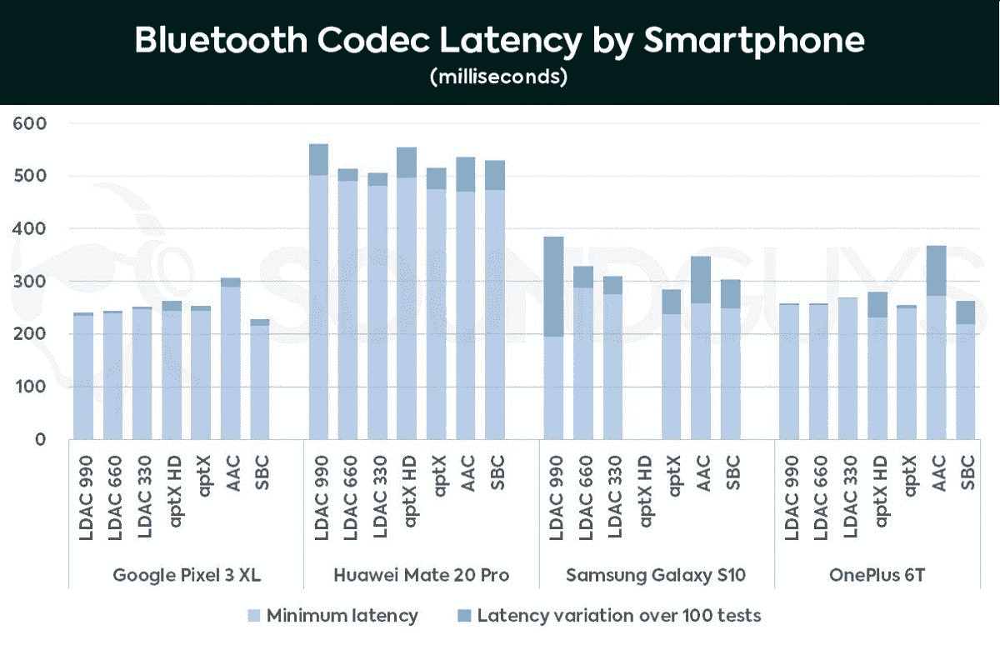

# Realme Buds Air 点评:功能丰富、价格实惠的真正无线耳塞

> 原文：<https://www.xda-developers.com/realme-buds-air-review/>

Realme 作为一个独立的智能手机品牌刚刚度过了两年。虽然我们不能忽视在制造、分销和营销资金方面得到母公司 OPPO 支持的好处，但 Realme 一直是增长最快的智能手机品牌之一，因为它的产品超级实惠。就在我们认为智能手机不会比小米卖得更便宜的时候，Realme 以极其优惠的价格推出了极其强大的规格，证明我们错了。在作为一家智能手机公司取得相当大的成功后，Realme 希望为自己打造一个生活方式品牌形象。凭借这一决定，Realme 投入了一个新的科技产品类别——[真正无线立体声耳机](https://www.xda-developers.com/ticpods-2-pro-review-tic-ing-the-right-boxes/)。Realme Buds Air 无疑受到了苹果 AirPods 的启发，但它们的价格只有₹3,999(约 60 美元)，因此迎合了完全不同的受众。

**购买:[realme buds air on flipkart(₹3,999)](https://www.flipkart.com/realme-buds-air-true-wireless-bluetooth-headset-mic/p/itmd74dd47b6c0b3)| |[realme 在线商店](https://buy.realme.com/in/goods/163)**

Realme 的 TWS 耳塞配有无线充电、动态低音增强声音配置文件和低延迟游戏模式。所有这些功能以及它们的经济性使 Realme Buds Air 成为大量年轻用户的有利可图的选择，这些用户希望获得外观精美、功能丰富的技术产品。

### **规格**

| 

规格

 | 

Realme Buds Air

 |
| --- | --- |
| 司机 | 12 毫米 |
| 电池 | 400 毫安时(充电箱) |
| 充电 | 

*   USB 类型-C
*   高达 10W 的无线充电

 |
| 连通性 | 

*   蓝牙 5.0
*   Google 快速配对支持
*   范围:高达 10 米

 |
| IP 等级 | 钠 |
| 规模 | 充电盒:

*   51.3 x 45.3 x 25.3 毫米
*   42.3 克

耳塞: |
| 控制 | 

*   表壳上的配对按钮
*   耳塞上的触摸控制
    *   双击:播放/暂停和接听电话
    *   连按三次:前进轨道
    *   长按单耳塞:结束通话并触发语音助手
    *   同时长按两个耳塞:进入/退出游戏模式

 |

我使用 Realme Buds Air 大约一个月，耳塞和 Realme 10W 无线充电器都是 Realme India 借给我们的。以上是我使用 Realme Buds Air 一个月后的观察。

## 外貌/容貌

我将从对 Realme Buds Air 的第一个明显观察开始，即它们与苹果 AirPods 明显相似。不可否认，Realme Buds Air 似乎从 AirPods 中汲取了一些灵感，但考虑到苹果是最快加入 TWS 圈的公司之一，这并不奇怪。尽管苹果不是第一个推出真正无线立体声耳机的品牌，但它在这一领域的进入无疑转移了世界对这一类别的注意力，并激发了其他品牌的兴趣。

手机套看起来也很相似，但细微之处如配对按钮的位置，LED 指示灯，底部的 USB-C 端口而不是 Lightning 端口，最后，背面的“Designed by realme”品牌增加了它的身份。盖子有一个磁性闩锁机制，它也像耳塞的开关一样工作。盖子的内侧刻有关于电池容量的详细信息以及一些监管信息。前面的 LED 灯是 Realme Buds Air 便携包上的唯一指示灯，它以三种颜色发光，以指示电池寿命和连接状态。

仔细观察 Realme Buds Air，你可以注意到更多的细微差别，这有助于区分 Realme Buds Air 与苹果 AirPods 或后者的克隆产品。每个耳塞上的耳塞柄两边更平，另两边更圆，这使得它看起来比 AirPods 的耳塞柄更光滑。每个耳塞都带有一个接近传感器，当您将任一耳机从耳朵中拔出时，它可以帮助自动暂停播放媒体，当您再次戴上耳机时，它可以继续播放媒体。在便携包内弹簧针的帮助下，耳塞柄底部的电极用于为耳塞充电。在磁铁的帮助下，耳塞会立即卡入其插孔，即使在盖子打开的情况下倒置时，磁铁也能保持耳塞不动。

与这些电极一起形成一个虚拟三角形是主麦克风的一个小开口。用于消除环境噪音的辅助麦克风位于耳塞柄和耳塞接合处正下方的外侧。内面还有一个开口，但它的用途还不清楚。

人们不能否认 AirPods 的直接灵感，但诸如扁平的茎干和麦克风及接近传感器的不同位置等微妙之处使它免于被称为直接和绝对的剽窃。然而，AirPods 的灵感将保证你有吹嘘真正无线设计的权利，尤其是如果你被人看到戴着有线或蓝牙颈带。我会推荐购买 Realme Buds Air 的黑色版本，而不是白色或黄色版本，因为我已经见证了随着时间的推移，粘糊糊的东西会沿着耳塞塑料外壳的接头堆积。这种沉积使耳塞看起来很脏，即使塑料看起来坚硬耐用，也需要定期清洁。

## 舒适度和人体工程学

Realme Buds Air 与大多数其他带有刚性外壳的耳塞一样，都存在同样的不适问题。需要明确的是，这是一个主观的观点，适合度可能会随着你耳朵的大小以及你以前使用刚性外壳耳机的经验而变化。对我来说，Realme Buds Air 并不像我希望的那样舒适，而且似乎容易脱落，即使在耳垂上轻轻一拍。你可以通过选择硅胶或类似软垫材料制成的耳钩或耳塞在一定程度上解决这个问题。你可以在网上找到各种各样的。

由于不太合适，当你不得不四处走动时，Realme Buds 的空气也可能会激起一些不情愿。我发现自己害怕在公共场所散步、慢跑或乘坐公共交通工具时，一个或两个耳塞可能会被碰掉。出于同样的原因，Realme Buds Air 的可用性在很大程度上仅限于室内空间——当然，除非你愿意花钱更换。如果有所帮助的话，如果你丢失了两个耳塞中的一个，或者出于某种原因想要两个不同颜色的耳塞，Realme 将单独出售单个耳塞。

由于这种形状，Realme Buds 空气不能完全密封耳道，您可以听到周围的噪音。以高音量播放的音乐几乎完全隔绝了外界的噪音，但音乐也会以高音量播放。

值得注意的是，Realme 没有谈到官方的 IP 等级或防溅或防汗保护，这意味着不能保证它能在雨中或在你的训练中存活。

好的一面是每个耳塞仅重 4 克，而且在大多数情况下，重量似乎并不重要。虽然重量不会带来任何麻烦，但耳塞的厚度确实让我在使用耳塞超过几个小时时感到很不舒服。如果你在睡觉时倾向于使用耳机——我会这样做，因为听音乐或双耳节拍有助于我在晚上更容易放松——那么 Realme Buds Air 感觉不太温和，可能会使耳道周围的耳朵感到疼痛。

尽管 Realme 鼓励我优化耳塞柄和耳塞之间的角度以确保舒适，但我几乎每隔一小时就不得不摘下耳机。尽管如此，我还必须重申，我并不喜欢形状像酒杯的耳塞，Realme Buds Air 也无助于改变这种看法。相反，我更喜欢硅胶头和类似于森海塞尔 Momentum TWS 耳塞或新的 AirPods Pro 的设计，即使要付出沉重的代价。

## 特征

Realme Buds Air 可能不会检查您对舒适性的所有要求，但它们会检查所有功能。对我来说，最有趣的功能是每个耳塞上的触摸控制。辅助降噪麦克风顶部的区域记录可用于播放或暂停媒体、切换到下一首曲目、调用设备上的语音助手以及切换到低延迟游戏模式等操作的触摸。请记住，无意的触摸或点击可能会无意中停止媒体播放，Realme 的产品团队已经为播放/播放或接听电话指定了双击。此外，连按三次可以将曲目转到下一首，但无法控制您切换到上一首曲目。通过一次长按任一耳塞，你可以激活设备上的语音助手，该功能可以与 Android 设备上的谷歌助手和 Alexa 以及苹果设备上的 Siri 配合使用。同样的操作也可以用于断开呼叫。所有这些触摸控制都可以在任何一个耳塞上点击。

Realme Buds Air 还带有低延迟游戏模式，可以通过同时长按两个耳塞上的触摸区域来触发。它旨在通过减少音频延迟来提高游戏时的通信效率。延迟的减少是以比特率为代价的，比特率与音频质量直接相关。我将在专门讨论音频质量的部分讨论这种降低的程度。

Realme Buds Air 的另一个古怪功能是支持无线充电。该公司在发布会上展示了其 10W 无线充电器，但没有推出。不过，你可以使用任何符合 Qi 标准的充电器为 Realme Buds Air 无线充电。

前面也提到过，当盖子打开时，Realme Buds Air 会自动连接到上次配对的设备。同样，当盖子合上时，耳塞会断开连接。Realme 的 TWS 耳塞支持安卓的快速配对协议。然而，对我来说，快速配对只适用于某些 Realme 设备。配对新设备时，您需要在盖子打开的情况下将耳塞放入外壳中，因为外壳和耳塞无法进行通信，然后按住前面的按钮，直到 LED 开始以绿色呼吸。

## 品质优良

在谈到这篇评论中可能最重要的部分 Realme Buds Air 的音质之前，我想澄清一下，人类对音频的理解在很大程度上是主观的。此外，对音质的判断还取决于你喜欢的音乐类型。

除了标准的 SBC 协议之外，Realme Buds Air 还支持通过 AAC 传输音频数据。相对来说，AAC 比 SBC 更新更好，质量更好，但传输速度比 SBC 慢。这款耳塞不支持高通的 aptX 或 aptX HD，这两款产品的音频质量略好于 AAC，延迟也更低。音频以 44.1kHz / 16 位音频的形式输出，可与标准 CD 音质的声音相媲美。你可以阅读这篇关于蓝牙代码的[详细讲解来了解更多。](https://habr.com/en/post/456182/)

Realme Buds Air 采用 12 毫米驱动器，该公司为其动态低音增强配置文件提供担保。整体来说，耳塞具有温暖的音调，主要强调低音和中低音。通常，虽然较低的频率可以听得更响，但相比之下，高频会感觉减弱。Realme Buds Air 的印度版本针对宝莱坞音乐进行了优化，宝莱坞音乐主要由低音和凹槽组成，所以如果你喜欢类似的音乐，你应该享受声音输出。

说到细微差别，如果你习惯于在网上播放大部分音乐，或者有一堆有损压缩音频文件，例如 128kbps 的 MP3，还有辨别乐器的诀窍，那么你将很难使用 Realme Buds Air。正如所料，如果您选择质量更好的文件，比如 320kbps，音频质量往往会更好。然而，由于耳塞的输出限制，除非使用 FLAC 或 ALAC 等无损格式，否则较高的比特率不会产生明显的差异。正如你所料，在蓝牙设置中打开和关闭 AAC 也会改变音频播放的质量。

从我的音乐量开始，我觉得没有令人满意的方法来给音乐加上特定的流派。虽然这看起来像是政治正确的尝试，但我宁愿从我选择测试耳机的常规播放列表中选择一些曲目。以下是我用来观察的轨迹:

### **音质分析**

(MP3，44.1kHz，320kbps)

干净的琶音不断在引子和诗句中响起，以及有力的低音吉他，很容易通过 Mikael Akerfeldt 干净的人声流淌出来。宁静驱动的鼓，尤其是小军鼓，有助于描绘这首歌前半部分的悔恨画面；即使是轻柔的钢琴和古典吉他也能很容易地被听到。然而，随着越来越多的乐器混合在旋律中，音频往往会感觉拥挤，淹没了声音较柔和的乐器。崩溃前的吉他独奏恢复了常态，因为某些乐器逐渐消失，钢琴开始弹奏。虽然所有乐器在桥上的重新出现在一定程度上损害了清晰度，但 outro 的宁静恢复了质量。更高的比特率被认为是音质改善的主要原因。

**声音质量等级- 8.5/10**

* * *

(FLAC，44.1 千赫，920 千位/秒)

《黑色安息日》1970 年的一首憎恨“*战争机器*”的颂歌听起来非常美妙——与歌词强迫你想象的场景相反。奥兹·奥斯朋铿锵有力的声音就像一个神圣的信息，而托尼·奥米的吉他音色将你传送到士兵们走向冲突的途中。持续的高帽导致合唱前难以整理的鼓点模式爆发，合唱可以通过其他更响亮的乐器听到。经典的重金属音调从每一个音符中渗出，听起来令人耳目一新。这首歌的第一首吉他独奏使用了两把不同的吉他，其中一把是左右摇动的，而另一把是静止的。不仅两把吉他都听得很清楚，而且吉他可感知的平移也增加了音乐的空间感。

**音质评分- 9.5/10**

* * *

(FLAC，44.1 千赫，961 千比特/秒)

这首民谣的最大亮点是布伦特·史密斯的垃圾般的声音，它超越了琴键上的介绍，尽管歌曲的大部分使用了高增益失真，但仍保持在顶部。声音不会掩盖或淹没其他乐器，可以清晰地听到。尽管歌曲的强度很大，但鼓，尤其是小军鼓，听起来非常完美，而低音吉他不断保持音频的密集和饱满。

**音质等级- 9/10**

* * *

(Spotify，质量非常高)

《哥斯拉》(Godzilla)中稳定的低音循环是 Spotify 全球前五播放列表中的热门曲目，它很时髦，但听起来并不像一些 RnB 人希望的那样高昂。阿姆的说唱是大部分声音的焦点，但歌词更容易理解，背景节拍更少。

**音质等级- 6/10**

* * *

(Spotify，质量非常高)

卡米拉·卡贝洛的声音与低音、古典吉他、合成器循环和节拍和谐一致，清晰可闻。然而，当肖恩·蒙德兹的声音进入轨道时，较柔和的乐器的清晰度降低了——即使你仍然可以听到门德斯休息时吉他弦上的弹奏声。低音在整首歌中都有共鸣，但只有在没有人声的情况下，准确的音符才能听得更清楚。

**音质等级- 7/10**

* * *

(Spotify，质量非常高)

翻译成“低音皇后”，顾名思义，印度电子音乐制作人的曲目充满了低音。这是唯一一首从 Realme Buds Air 播放出来的低音让我耳朵发颤的歌曲，即使音量没有调到最大。音轨上的人声被一种类似镶边的效果所掩盖，但音轨被巧妙地编程以防止元素挤占你的音频感知，这正是它在耳塞上感觉如此良好的原因。

**音质等级- 9/10**

### 总体良好，但不太好

总的来说，Realme Buds Air 的声音非常适合使用较少乐器(或声源)的音乐。当轨道中有三个或四个以上的乐器同时演奏时，音频通道会发出洪亮的声音，往往会失去单个乐器的清晰度。如前所述，Realme Buds Air 的频率响应已经过优化，可以提高大约在 100 - 2000kHz 频率范围内的人声和其他声音的响度。与响应或多或少平坦的较高频率相比，包含该范围内的声音的音频可以听得更响。不过，你可以使用均衡器(每个音乐应用程序)或类似 Poweramp 等应用程序内置的 DVC 控制器在很大程度上解决这个问题。

同样，当你在看一部电视剧或电影时，比如说网飞，如果背景音乐太强，可能会盖过对白。幸运的是，对于 Realme X2 专业版用户来说，杜比 Atmos 声音优化功能不仅可以通过有线耳机，还可以通过 Realme Buds Air 等蓝牙耳机来均衡系统范围的声音输出。

### 低延迟游戏模式

蓝牙音频的延迟可以定义为信号从设备发出到到达耳朵的时间差。Realme 表示，Realme Buds Air 在标准模式下的通常延迟约为 245 毫秒，这对 Android 设备来说并不算多，但它减少了 51%，不到 120 毫秒。

理想情况下，对于有损格式(MP3、M4A 等。)，从 Android 设备播放的延迟时间可以从 200 毫秒到 400 毫秒不等，这包括 DSP 处理音频信号、OpenSL ES 或 AAudio APIs 渲染处理后的信号，然后通过硬件(即专用芯片)从设备传输到耳塞所需的时间。

另一个重要的方面是通常所说的信号“缓冲器”，其基于先进先出(FIFO)工作，使得已经进入链的音频数据将首先退出，而不管任何间隙或回放问题。缓冲器用于调节音频信号，确保播放时没有抖动。缓冲区的增加增加了音频回放的延迟，但也确保了更平滑的输出。如果设备处理和渲染音频信号的速率低于蓝牙传输速率，则输出音频可能会抖动。

 <picture></picture> 

Bluetooth codec latency chart; Source: SoundGuys

Realme 的游戏模式，根据定义，减少了播放的延迟，进入这种模式的特点是汽车引擎启动和加速的声音。为了能够利用该功能，应该有足够的音频信号缓冲区，以便有足够的积压量供耳塞赶上。如果你听的是使用无损格式的音频，如 FLAC 或 ALAC，游戏模式不会导致故障，但当音频是实时的，如在游戏中，较低的延迟实际上可能会导致音频的断断续续。下面是 SoundGuys 对 Android 蓝牙延迟的一个很好的解释。

### **测试蓝牙延迟**

为了验证 Realme Buds Air 声称的低延迟播放，我播放了某些音乐文件，并通过手动改变 Poweramp music player 中 DSP + OpenSL ES API(即缓冲区)的延迟持续时间来寻找任何故障趋势。如果缓冲时间短于蓝牙传输所需的时间，可以听到音频播放中断。以下是我的观察结果:

*   在距离耳塞大约一米远的一加 7T 上以 128kbps 的比特率启动 MP3 文件，
    *   当缓冲区大小设置为大约 130 毫秒时，我仍然可以体验到音频中频繁的小故障(每五秒一次)。
    *   使用相同的 128kbps 文件大约 150 毫秒时，故障不太频繁(几乎每 20 秒一次)。
    *   当缓冲时间设置为 180 毫秒时，故障似乎消失了。
    *   这意味着在比特率为 128kbps 的 Realme Buds Air 上使用游戏模式进行蓝牙连接的延迟大约为 180 毫秒。

*   接下来，转到 320kbps 的文件，110ms 和 130ms 缓冲设置的故障比比特率较低的文件少，但播放质量略有变化。这可以解释为 DSP 用更长的时间来处理更高质量的文件。
*   请注意，这些任意值不应被视为 Realme Buds Air 的绝对延迟值。

总之，Realme 的游戏模式可能会减少延迟，但也增加了波动的趋势。所以，用处不大。Realme 本可以增加对 aptX 编解码器的支持，这本来可以减少音频延迟。

## 连通性

Realme Buds Air 使用蓝牙 5.0 连接输入设备。每个耳塞都单独连接到设备，而不是主从配置。此外，在连接建立之后，手提箱不再起作用。Realme Buds Air 的连接范围约为 10 米，如果中间有墙或其他物理障碍物，则该范围可能会缩小。在低延迟游戏模式下，范围保持不变。

Realme Buds Air 支持所有主要的操作系统平台，我已经在 Android、iOS、macOS 和 Windows 10 上对它们进行了测试。目前，耳塞一次只能连接一个设备。

## 电池

Realme 没有过多谈论 Realme Buds Air 的电池容量，但手提箱盖子内的精美文字显示有 400 毫安时电池，这很可能只适用于手提箱。每个耳塞内部都有更小的电池，但确切的等级不得而知。当你以最大音量收听时，Realme Buds Air 的电池寿命仅为每个耳塞 2.5 小时左右。Realme 声称的电池寿命为 3 小时，但这是在 50%体积下测试的。这还不够好，尤其是如果你不得不旅行或长时间呆在户外。请注意，电池电量可能会因不同条件而异，如您正在播放的内容类型、您与耳塞的距离、您对游戏的沉迷程度以及两个麦克风的使用情况。

要给耳塞充电，你必须把它们放在手提袋里，如果耳塞完全没电，每次充电大约需要 30 分钟。如果你不使用耳塞，最好把它们放回盒子里，因为这样可以确保你每次开始使用时都有 100%的电量，只要盒子还在充电。

在我的使用中，便携包可以将 Realme Buds Air 充入大约 10%到 100%的电量五到六次。因此，耳塞和手提袋的总电池寿命大约为 16 小时。表壳中的电荷量由闪烁的 LED 指示，红色表示电量低，绿色表示电量正常(未知，但正常),琥珀色位于两者之间。

使用底部的 USB-C 端口，便携包充满电大约需要 2 小时 40 分钟。当便携包充满电时，LED 指示灯会持续发出绿光(不闪烁)。此外，使用 Realme 的 10W 无线充电器，我可以更快地为 Realme Buds Air 充电，只需大约 2 小时 10 分钟。由于 Qi 标准限制为 5W，使用 Qi 额定无线充电器可能需要更长时间。

在电池方面，Realme Buds Air 没有给人留下深刻印象，但无线充电的优势是值得珍惜的，特别是如果你已经购买了无线充电器。

## Realme Buds Air:将经济实惠的真正无线体验与激动人心的功能相结合

Realme Buds Air 肯定是利用了公司的知名度。音频质量可能不是最好的，但对于价格来说已经足够好了。您可以通过使用无损音频格式和根据您的偏好均衡声音来获取最大价值。此外，触摸控制让 Realme Buds Air 对我来说很有趣，并且排除单次点击控制的选择感觉很周到和有用。

然而，谈到舒适性，Realme Buds Air 可能不会让所有人都满意。当然，你可以在网上找到便宜的硅胶耳塞或耳钩，但我个人更喜欢耳塞设计，因为前者感觉更安全。正如我前面所说，Realme Buds Air 非常适合室内使用，但不太适合室外应用。

最后，像无线充电这样的功能是我非常喜欢的，但我希望手机套有一个更好的电池指示器。总的来说，Realme 首次尝试真正的无线立体声耳塞感觉雄心勃勃，诱人的价格肯定会迫使许多用户购买它们-大多数人不应该后悔这个决定。

**购买:[realme buds air on flipkart(₹3,999)](https://www.flipkart.com/realme-buds-air-true-wireless-bluetooth-headset-mic/p/itmd74dd47b6c0b3)| |[realme 在线商店](https://buy.realme.com/in/goods/163)**