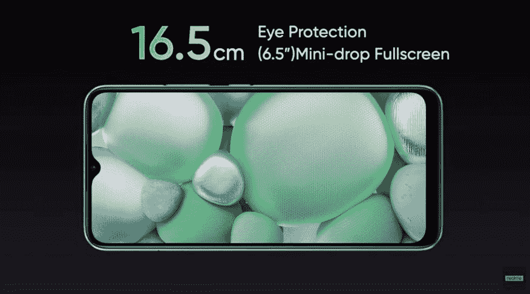
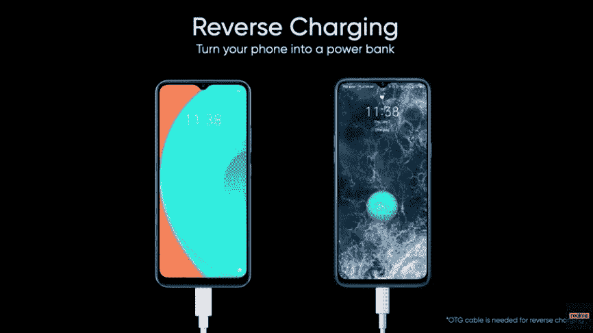
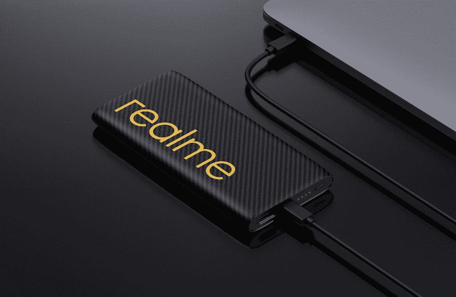

# Realme C11 和 Realme 30W Dart Charge 10000 mah power bank 在印度上市

> 原文：<https://www.xda-developers.com/realme-c11-realme-30w-dart-charge-10000mah-power-bank-launched-india/>

上个月晚些时候，在推出新的[联发科 Helio G25 和 Helio G35](https://www.xda-developers.com/mediatek-helio-g35-g25-chipsets-unveiled-gaming-budget/) 芯片组后不久，中国 OEM 厂商小米和 Realme 推出了两款采用新 SOC 的设备。小米推出了新的 [Redmi 9A 和 Redmi 9C](https://www.xda-developers.com/redmi-9a-redmi-9c-launch-big-batteries-notched-displays-mediatek-processors/) ，配备了 5,000mAh 大电池和带有水滴式凹槽的高清+显示屏，而 [Realme 推出了类似规格的](https://www.xda-developers.com/realme-c11-budget-smartphone-mediatek-helio-g35/)Realme C11。这三款设备最初都是在马来西亚市场推出的，但 Realme 现在已经在印度推出了其最新的经济型设备。

## Realme C11:规格

| **规格** | **Realme C11** |
| --- | --- |
| **尺寸&重量** |  |
| **显示** |  |
| **SoC** | 联发科 Helio G35 |
| **闸板&存放** | 2GB LPDDR4x + 32GB |
| **电池** |  |
| **后置摄像头** |  |
| **前置摄像头** | 24 年 5 百万英镑 |
| **安卓版本** | 基于 Android 10 的 Realme UI |

* * *

如前所述，Realme C11 由联发科新的 Helio G35 SoC 驱动，其设计类似于最近推出的 Redmi 9C。它采用 6.5 英寸高清+显示屏，分辨率为 1600x720 像素，并带有水滴式凹槽，用于放置自拍相机。在背面，该设备有一个方形的摄像头模块，内置一个 13MP f/2.2 主传感器，一个 2MP 深度传感器和一个 LED 闪光灯。对于自拍，该设备正面有一个 5MP f/2.4 摄像头。

该设备上的 Helio G35 芯片组与 2GB 的 LPDDR4x RAM 和 32GB 的板载存储相结合，可以使用专用的 micro SD 卡插槽进一步扩展。该设备内置一个 5000 毫安时的大电池，支持 10W 快速有线充电和反向有线充电。

在端口方面，该设备具有一个用于充电和数据同步的微型 USB 端口，以及一个 3.5 毫米耳机插孔。其他连接选项包括蓝牙 5.0 和 802.11 b/g/n WiFi。在软件方面，该设备运行基于 Android 10 的 Realme UI。Realme 还声称该设备具有防溅功能，但没有任何官方的 IP 等级。该设备没有指纹扫描仪，但它支持面部解锁生物认证。

除了 Realme C11，该公司还在印度市场推出了一个新的电源库，它包含一个 10，000mAh 的电池，并支持 Realme 的 30W Dart 充电技术。该电源组具有一个 USB Type-A 端口和一个 USB Type-C 端口，用于为您的设备充电，以及一个显示当前电池电量的 LED 指示灯和一个电源按钮。虽然两个 USB 端口都支持 30W 输出，但 USB Type-C 端口还支持 30W 输入，以帮助您快速为电源组充电。

由于支持 30W Dart 充电，新的电源组能够在短短 30 分钟内将 Realme 6 从 0-65%充电。该电源库还具有低电流模式，可用于为无线耳机和智能手表等 AIoT 设备充电。除了 Realme 的 Dart Charge 技术，该电源库还兼容其他流行的快速充电标准，如 VOOC、SuperVOOC 2.0、Warp 和高通的快速充电，这将允许用户为 OPPO 和一加等制造商支持的设备快速充电。

## 定价和可用性

新的 Realme C11 的 2GB/32GB 版本在₹7,499 的定价约为 99 美元，将于 7 月 22 日开始在 Realme 上购买

[website](https://www.realme.com/in/)

还有 Flipkart。买家可以从两种不同的颜色中选择——浓绿色和浓灰色。另一方面，Realme Dart Charge power bank 的定价为₹1,999(约 26 美元)，将于 7 月 21 日在 Realme 的网站和 Flipkart 上开始销售。该充电器还将有两种颜色可供选择——黑色和黄色。