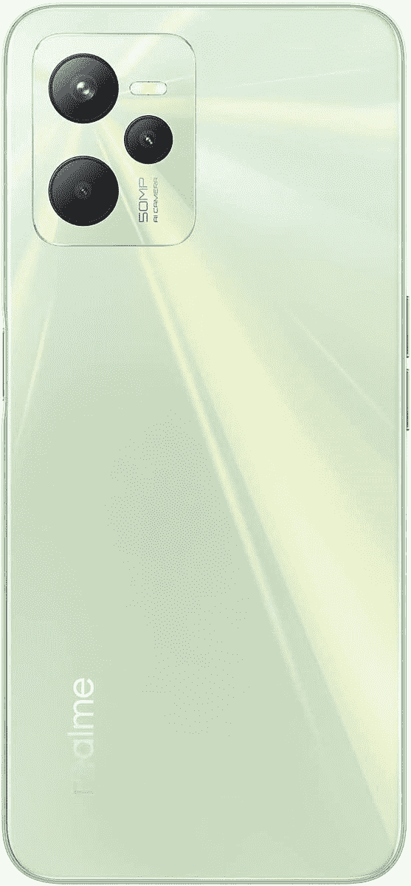

# Realme C35 和 Realme C31 在英国正式上市

> 原文：<https://www.xda-developers.com/realme-c35-realme-c31-uk-launch-pricing/>

继上个月在印度首次亮相后，Realme C35 和 Realme C31 已经进入英国市场。Realme 最新的入门级智能手机提供了好看的设计和价格合理的有竞争力的硬件，包括 50MP 主摄像头和 5,000mAh 大电池。

## Realme C35 和 Realme C31:规格

| 

规格

 | 

Realme C35

 | 

Realme C31

 |
| --- | --- | --- |
| **尺寸&重量** | 

*   164.4 x 75.6 x 8.1mm 毫米
*   189 克

 | 

*   164.7 x 76.1 x 8.4mm 毫米
*   197g

 |
| **显示** | 

*   6.6 英寸 IPS 液晶屏
*   FHD+(2408 x 1080 像素)
*   180Hz 触摸采样速率
*   600 尼特峰值亮度

 | 

*   6.5 英寸 AMOLED
*   高清+ (1600 x 720)
*   400 尼特峰值亮度

 |
| **SoC** | 

*   Unisoc T616 SoC
    *   八核(最高 2.0GHz)
    *   12 纳米
    *   Mali-G57 GPU

 | 

*   Unisoc T612 SoC
    *   八核(最高 1.8GHz)
    *   12 纳米
    *   Mali-G57 GPU

 |
| **RAM &存储** | 

*   4GB/6GB 内存
*   64GB/128GB UFS 2.2 存储
*   MicroSD 卡扩展

 | 

*   3GB/4GB 内存
*   32GB/64GB UFS 2.2 存储
*   MicroSD 卡扩展

 |
| **电池&充电** | 

*   5000 毫安时电池
*   18W 快速充电支持

 | 

*   5000 毫安时电池
*   10W 充电

 |
| **安全** | 侧装式指纹扫描仪 | 侧装式指纹扫描仪 |
| **后置摄像头** | 

*   **初级** : 50MP f/1.8
*   **二级** : 2MP 微距镜头
*   **第三级** : B & W 镜头

 | 

*   **初级** : 13MP f/2.2
*   **二级** : 2MP 微距镜头
*   **第三级** : B & W 镜头

 |
| **前置摄像头** |  |  |
| **端口** | 

*   USB 类型-C
*   3.5 毫米音频插孔

 | 

*   微型 USB
*   3.5 毫米音频插孔

 |
| **其他特性** | 

*   4G LTE
*   蓝牙 5.0
*   GPS，AGPS，北斗，伽利略

 | 

*   4G LTE
*   蓝牙 5.0
*   GPS，AGPS，北斗，伽利略

 |
| **软件** | 

*   搭载 Android 11 的 Realme UI R 版

 | 

*   搭载 Android 11 的 Realme UI R 版

 |

从 Realme C35 开始，它采用 6.6 英寸 IPS 液晶屏，具有全高清+分辨率。在引擎盖下，这款手机由 Unisoc T616 SoC 供电，而在摄像头前面，我们看到的是一个 50MP 的主摄像头，由微距和 B&W 摄像头支持。Realme C35 的其他值得注意的亮点包括侧装指纹识别器，5000 毫安时电池，支持 18W 快速充电，蓝牙 5.0，USB C 端口和 3.5 毫米音频插孔。

 <picture></picture> 

Realme C35

##### Realme C35

Realme C35 是一款外观精美的入门级智能手机，硬件相当不错。

另一方面，Realme C31 配备了 6.5 英寸 HD+ LCD，并装有 Unisoc T612 SoC，配有 3GB/4GB RAM 和 32GB/64GB 存储。在相机方面，你有一个 1300 万像素的主拍摄者，一个宏观传感器和一个 B&W 传感器。它也有一个 5000 毫安时的电池，但你只能用 10W 的充电速度和一个微型 USB 端口。

### 定价和可用性

基础型号的 Realme C35 起价为 149 英镑(限时 139 英镑)，4GB/128GB 型号的 Realme C35 起价为€169 英镑(限时 149 英镑)。同时，Realme C31 将零售 129 英镑(119 限时)。这两款手机将于 4 月 18 日开始在亚马逊英国和 Realme 网站上销售。